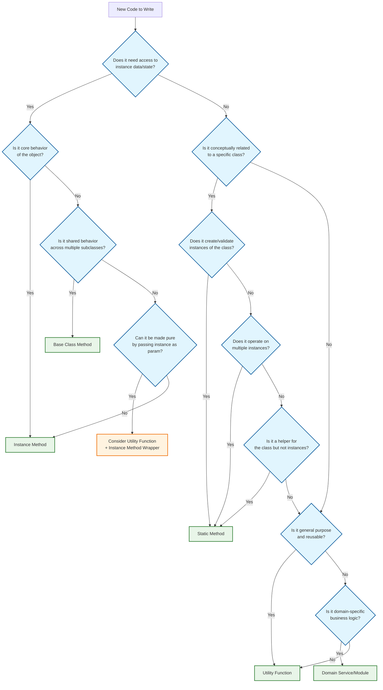

# Where to write code?
Maybe the seasoned programmers might instinctively know where a piece of logic belongs, but for many of us it it could be surprisingly tricky

Consider a realistic situation like below

A class `UserDataModel` which extends a base class `DataModel`. The UserDataModel already has a lot of code, and now there is a requirement to add a feature to it.

Before you start writing code, you need to decide where to write it? Below are the possible options you might choose from
 
* As a member method to the given class `UserDataModel`
* As a base method to the base class `DataModel`
* As a static function to the class `UserDataModel`
* As a static function to the base class `DataModel`
* As a utility function outside of the class somewhere
* As a private function in the class

This is a very basic questino that will affect the code maintainability, testability and architecture.

## Member method/Instance Methods
When the code
* operates on instance state
* implements core object behaviour, what this object does

You may ask then we can easily pass the instance state to a function as parameter and externalize that logic which means that it will be operating on instance state. And by the way, every function will always be operating on instance state, if not directly. You can externalize the logic when

* Logic is pure and stateless(means doesn't use this)
* Function works across multiple object types like `function calculateCreditScore(user, transactions)`
* you are writing a utiltiy library

## Static methods
Use when
* doesn't need instance state
* logically belongs to the class(thats difficult to debate though)
* creates or validates instances(factory methods/builder/validators)

e.g 
```js
class BankAccount {
    static fromJSON(data) {
        return new BankAccount(data.balance, data.accountType);
	}
    static isValidAccountNumber(number) {
        return /^\d{10}$/.test(number);
	}
}
```

## Utility methods
Use when
* has no class relationship - could work anywhere
* is pure(same inputs always produce same output)
* general purpose functionality(string manipulation, formatting, calculations)

## Base class method
Use when
* the needed behaviour is same across classes

# Decision questionnaire
Ask these questions in order:

Does it need instance data? → **Member method**
Is it related to the class concept but not instances? → **Static method**
Could it be used anywhere in the codebase? → **Utility function**
Is it shared behavior across subclasses? → **Base class method**

# Flowchart

Here is a flowchart to make it easy for you



Flowchart in mermaid code in case the above doesn't render.


# Conclusion
The key is being intentional about the choice rather than defaulting to one pattern

Methods should live where they have the **least coupling** and **highest cohesion** with their surroundings

> End


