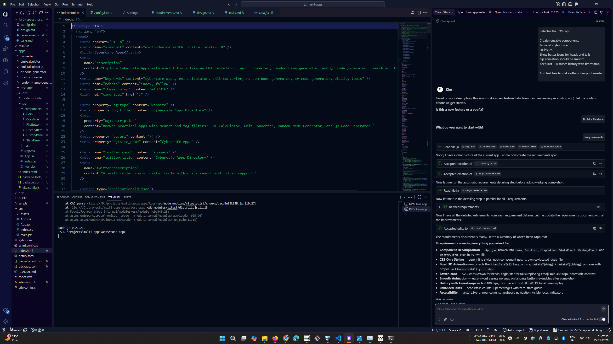
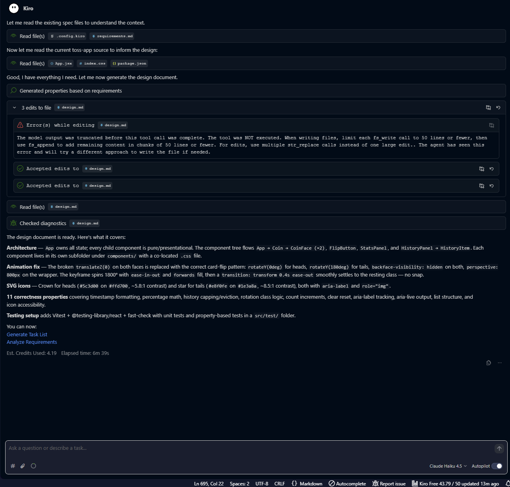
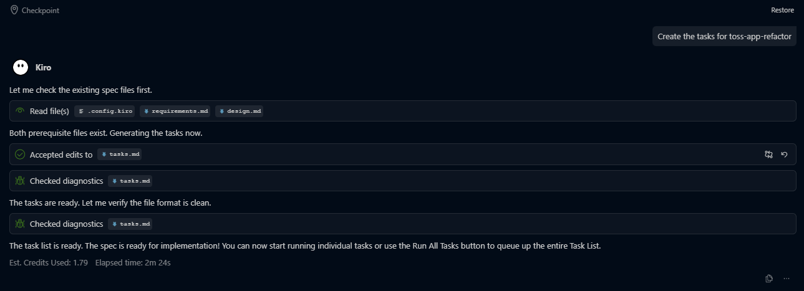
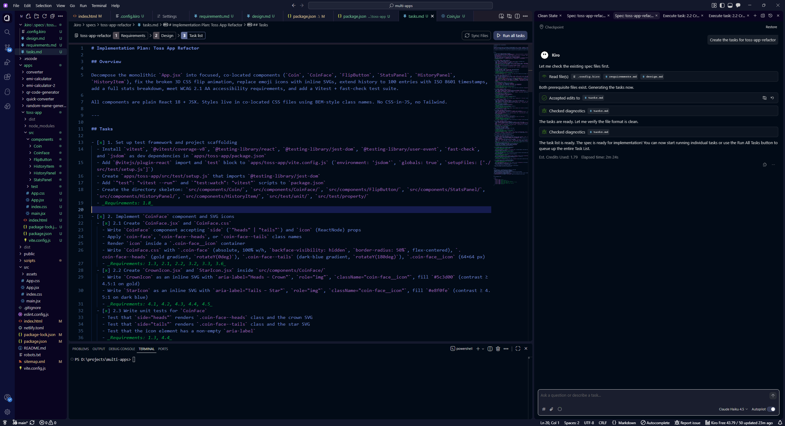
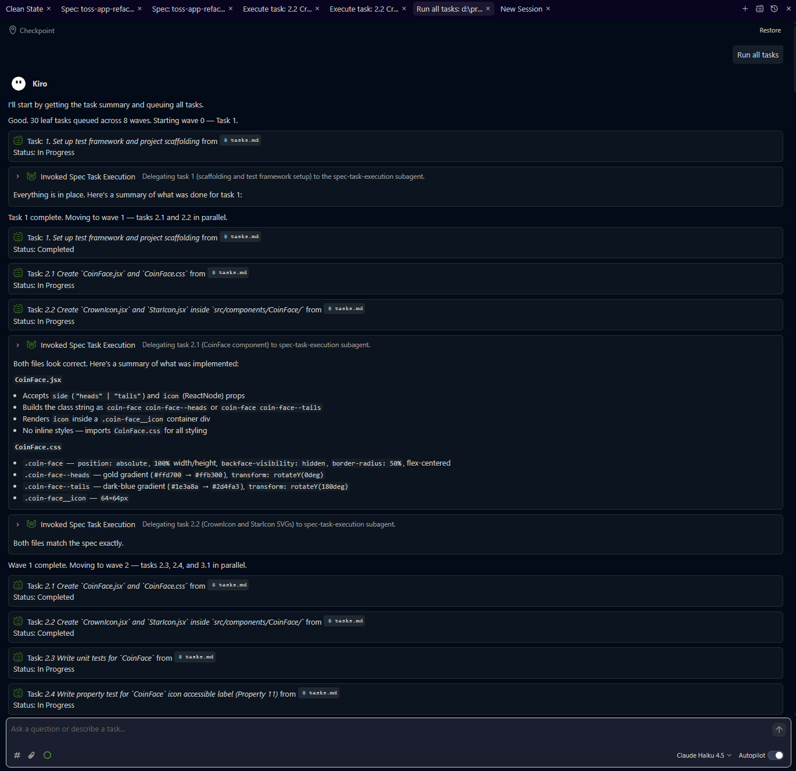
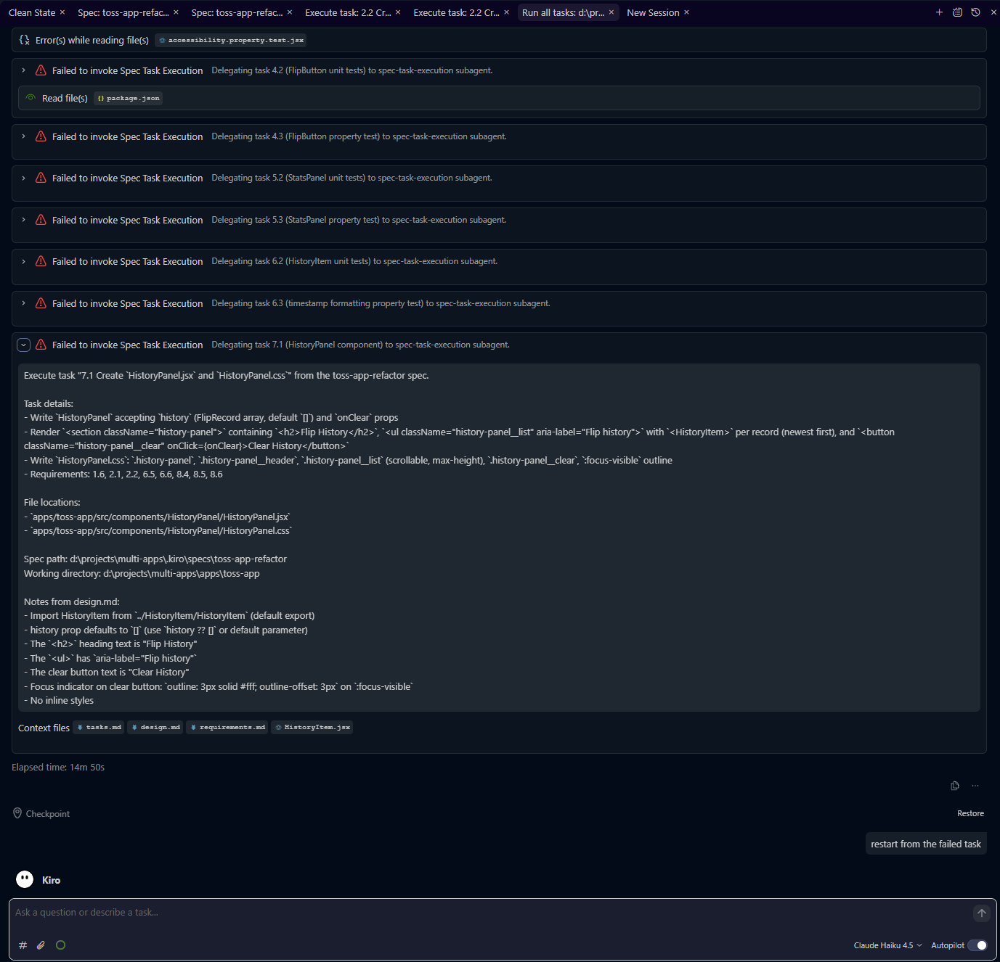
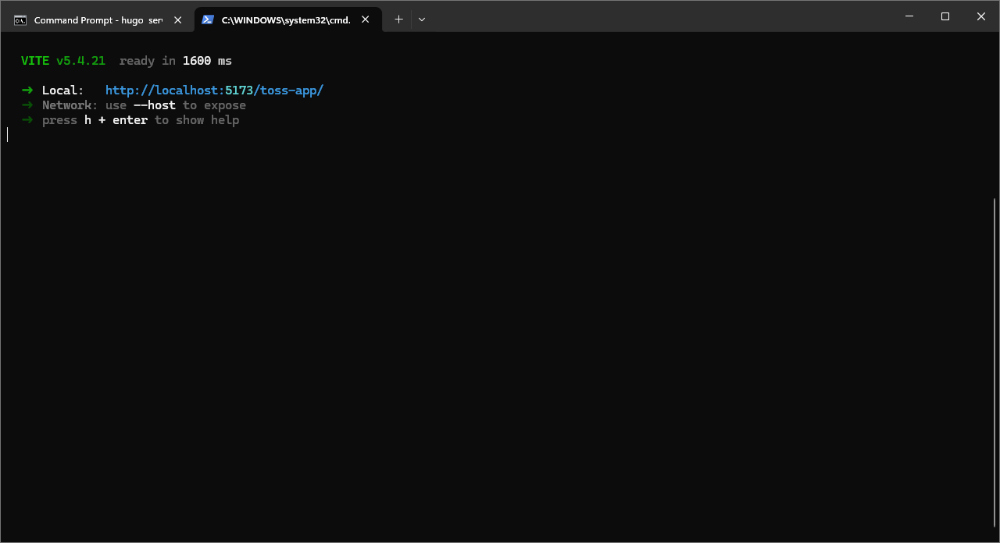
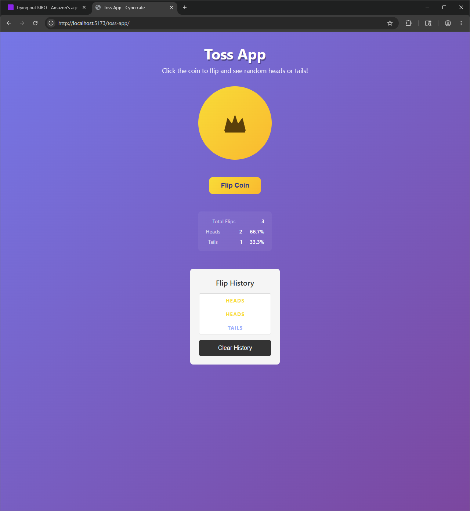

# Why KIRO?
I was looking for the best IDE for AI development and stumbled upon Amzon's Q developer but soon realized they have moved on to KIRO.

Up until now I was using Windsurf and VS Code. I had some experience with the free versions and enterprise version for windsurf but I didnt get my hands on agentic workflow as it needs a lot of monetory investment.

On the first glance KIRO looks promising as its from Amazon and is built on top of Q developer.

# Install
Obviously downloading it was super easy [from the website](https://kiro.dev/).

Once you download, then you have to login to the IDE. There are multiple options, like using github, google etc. to signup. I tried with Amazon builder ID, but somehow wasn't able to create an account for it.

Used github account and it worked.

# New project
Now, to test out the whole agentic workflow, I thought of doing somethign which I know how much effort and time it would take for me.

I already had one small project - `Toss App` which is a simple app in React on which you can perform a toss. It randomly picks heads or tails.

The base app was already made and was working with some issues.

## Initial prompt
To start with I gave it a basic prompt. I had no idea, how much of credit it would consume. And at what rate. Since this is my first experiment, I thought of using the default values and decide later, how to tune it to save credits. By default they give 50 credits.

```
Refactor the TOSS app


Create reusable components

Move all styles to css

FIx issues

Show better icons for heads and tails

flip animation should be smooth

Keep last 100 tosses history with timestamp


And feel free to make other changes if needed
```

It responsed by asking a few questions




It started by creating requirement specs out of my base prompt.

```
The requirements document is ready. Here's a summary of what's been captured:

8 requirements covering everything you asked for:

Component Decomposition — App.jsx broken into Coin, CoinFace, FlipButton, StatsPanel, HistoryPanel, and HistoryItem, each in its own file
CSS-Only Styling — zero inline styles, each component gets its own co-located .css file
Fixed 3D Animation — corrects the translateZ(0) bug by using rotateY(0deg) / rotateY(180deg) on faces with proper backface-visibility: hidden
Better Icons — SVG icons (crown for heads, eagle/star for tails) replacing emoji, min 48×48px, accessible contrast
Smooth Animation — ease-in-out easing, no snap on landing, button re-enables after completion
History with Timestamps — last 100 flips, most-recent-first, HH:MM:SS local time display
Enhanced Stats — heads/tails counts + percentages with zero-state guard
Accessibility — aria-live announcements, keyboard navigation, visible focus indicators
```

And gave me three options to 

```
Generate Tech Design
Generate Task LIst
Analyze requirements
```

## Design

Just for the sake of completeness, I am pasting the whole design it created.

```md
# Requirements Document

## Introduction

This document covers the refactoring and enhancement of the Toss App — a coin flip simulator built with React and Vite. The current implementation has all logic in a single `App.jsx`, uses inline styles mixed with a CSS file, has a broken 3D flip animation (both coin faces use `translateZ(0)` so backface-visibility never hides the rear face), shows only the last 5 history items with no timestamps, and uses emoji icons for heads and tails. The goal is to decompose the app into reusable components, move all styles to dedicated CSS files, fix the animation, improve the visual design of the coin faces, and expand the history panel to retain the last 100 tosses with timestamps.

## Glossary

- **App**: The root React component that composes all child components and owns global state.
- **Coin**: The animated 3D coin component responsible for rendering both faces and executing the flip animation.
- **CoinFace**: A single face of the coin (heads or tails), rendered as a child of Coin.
- **FlipButton**: The button component that triggers a coin flip.
- **StatsPanel**: The component that displays aggregate flip statistics (total flips, heads count, tails count, percentages).
- **HistoryPanel**: The component that displays the scrollable list of past flip results.
- **HistoryItem**: A single entry in the history list, containing flip number, result, and timestamp.
- **FlipResult**: The enumerated outcome of a flip — either `"Heads"` or `"Tails"`.
- **Flip Record**: An object containing `{ id, flipNumber, result, timestamp }` representing one completed flip.
- **Animation Duration**: The fixed duration of the coin flip animation, set to 2000 ms.
- **History Limit**: The maximum number of Flip Records retained in state, set to 100.

---

## Requirements

### Requirement 1: Component Decomposition

**User Story:** As a developer, I want the app split into focused, reusable components, so that each file has a single responsibility and the codebase is easier to maintain and extend.

#### Acceptance Criteria

1. THE App SHALL compose the UI exclusively from the `Coin`, `FlipButton`, `StatsPanel`, and `HistoryPanel` components without embedding their markup directly in `App.jsx`.
2. THE Coin SHALL accept `isFlipping`, `result`, and `animationDuration` (in milliseconds) as props and render both CoinFace children internally.
3. THE CoinFace SHALL accept `side` (`"heads"` or `"tails"`) and `icon` (a renderable React node) as props and render the face content.
4. THE FlipButton SHALL accept `onClick` and `disabled` as props and render the flip trigger.
5. THE StatsPanel SHALL accept `flipCount`, `headsCount`, and `tailsCount` as props and compute and render percentage statistics internally without requiring percentage props.
6. THE HistoryPanel SHALL accept `history` and `onClear` as props and render the scrollable flip history list.
7. THE HistoryItem SHALL accept a Flip Record as props and render the flip number, result label, and timestamp formatted as `HH:mm:ss` in the user's local timezone.
8. EACH component SHALL be defined in its own dedicated file (e.g., `Coin.jsx`, `FlipButton.jsx`) so that no single file contains more than one component definition.

---

### Requirement 2: CSS-Only Styling

**User Story:** As a developer, I want all styles defined in CSS files rather than inline style attributes, so that styles are co-located with their components and easy to override or theme.

#### Acceptance Criteria

1. THE App SHALL contain zero inline `style` attributes across all component files (`App.jsx`, `Coin.jsx`, `CoinFace.jsx`, `FlipButton.jsx`, `StatsPanel.jsx`, `HistoryPanel.jsx`, `HistoryItem.jsx`).
2. EACH component file SHALL import a co-located `.css` file with the same base name (e.g., `Coin.jsx` imports `Coin.css` from the same directory) that contains all styles for that component.
3. THE `index.css` file SHALL contain only global reset rules and `body`-level styles; it SHALL NOT contain any CSS selectors that target component-specific class names or element structures.

---

### Requirement 3: Fixed 3D Coin Flip Animation

**User Story:** As a user, I want the coin to visually flip and reveal the correct face, so that the animation matches the actual result.

#### Acceptance Criteria

1. WHILE the flip animation is running, THE Coin SHALL rotate on the Y axis by at least 720° (two full rotations) over the full Animation Duration so the spinning motion is clearly visible.
2. THE CoinFace for heads SHALL have `transform: rotateY(0deg)` so it faces forward at rest.
3. THE CoinFace for tails SHALL have `transform: rotateY(180deg)` so it faces backward at rest and becomes visible when the coin is rotated 180°.
4. IF the flip animation ends AND the FlipResult is `"Heads"`, THEN THE Coin SHALL settle at a Y rotation that is a multiple of 360° (e.g., 0°, 360°) so the heads face is visible.
5. IF the flip animation ends AND the FlipResult is `"Tails"`, THEN THE Coin SHALL settle at a Y rotation that is an odd multiple of 180° (e.g., 180°, 540°) so the tails face is visible.
6. THE Coin SHALL apply `backface-visibility: hidden` to both CoinFace elements so only the forward-facing side is rendered at any rotation angle.
7. THE Coin SHALL apply `transform-style: preserve-3d` to the coin container and a `perspective` of at least 600px to the coin wrapper so the 3D effect is visible.

---

### Requirement 4: SVG/CSS Coin Face Icons

**User Story:** As a user, I want the coin faces to display clear, styled icons instead of emoji, so that the heads and tails sides are visually distinct and render consistently across all platforms.

#### Acceptance Criteria

1. THE CoinFace for heads SHALL display an SVG or CSS-drawn icon representing a crown or profile, replacing the 👑 emoji.
2. THE CoinFace for tails SHALL display an SVG or CSS-drawn icon representing an eagle or star, replacing the 🦅 emoji.
3. THE CoinFace SHALL render the icon with a CSS `width` and `height` of at least 48px so the rendered size is at least 48×48 px regardless of SVG intrinsic dimensions.
4. THE CoinFace icon SHALL have an accessible label: if the icon is an inline SVG it SHALL carry an `aria-label` attribute (e.g., `aria-label="Heads – Crown"`); if the icon is CSS-drawn it SHALL be wrapped in an element with a matching `aria-label`.
5. THE icon foreground color on the heads face (gold background) and the icon foreground color on the tails face (dark blue background) SHALL each achieve a contrast ratio of at least 4.5:1 against their respective background colors.

---

### Requirement 5: Smooth Flip Animation

**User Story:** As a user, I want the coin flip to feel smooth and natural, so that the transition from spinning to the final result is visually satisfying.

#### Acceptance Criteria

1. THE Coin flip animation SHALL use an easing function where the animation speed is 0 at the start keyframe and 0 at the end keyframe (ease-in-out behavior), so the coin appears to accelerate and then decelerate.
2. THE Coin SHALL complete the flip animation in exactly the Animation Duration (2000 ms).
3. IF the flip animation ends, THEN THE Coin SHALL settle at a final resting rotation that differs from the last animated frame by no more than 5 degrees, so there is no visible jump or snap.
4. WHILE the flip animation is running, THE FlipButton SHALL be disabled; WHEN the flip animation completes, THE FlipButton SHALL return to the enabled state.

---

### Requirement 6: Extended History with Timestamps

**User Story:** As a user, I want to see the last 100 flips with timestamps, so that I can review my recent session in detail.

#### Acceptance Criteria

1. THE HistoryPanel SHALL retain and display up to the last History Limit (100) Flip Records.
2. WHEN the number of Flip Records exceeds the History Limit, THE App SHALL discard the oldest record so the list never exceeds 100 entries.
3. WHEN a flip completes, THE App SHALL record a timestamp in ISO 8601 format (e.g., `2024-01-15T14:32:05.123Z`) in the Flip Record.
4. THE HistoryItem SHALL display the timestamp formatted as `HH:MM:SS` in the user's local timezone (e.g., `14:32:05`).
5. THE HistoryPanel list SHALL be scrollable and display the most recent flip at the top.
6. WHEN the user clicks the clear button, THE App SHALL remove all Flip Records from state so the history list is empty.

---

### Requirement 7: Enhanced Statistics Panel

**User Story:** As a user, I want to see a breakdown of heads vs. tails counts and percentages, so that I can observe the distribution of results over my session.

#### Acceptance Criteria

1. THE StatsPanel SHALL display the total flip count, the heads count, and the tails count as separate labeled values.
2. WHEN the total flip count is greater than zero, THE StatsPanel SHALL display the heads percentage calculated as `(headsCount ÷ totalFlipCount) × 100` and the tails percentage calculated as `(tailsCount ÷ totalFlipCount) × 100`, each rounded to one decimal place.
3. WHEN the total flip count is zero, THE StatsPanel SHALL display `—` in place of percentage values to avoid division-by-zero output.
4. WHEN a flip completes with FlipResult `"Heads"`, THE App SHALL increment the heads count by exactly 1.
5. WHEN a flip completes with FlipResult `"Tails"`, THE App SHALL increment the tails count by exactly 1.
6. WHEN the user clears history, THE App SHALL reset headsCount, tailsCount, and total flip count each to zero.

---

### Requirement 8: Accessibility

**User Story:** As a user relying on assistive technology, I want the app to be navigable and understandable without a mouse, so that the coin flip experience is inclusive.

#### Acceptance Criteria

1. WHILE the flip animation is running, THE FlipButton SHALL have `aria-label="Flipping coin"`; WHILE the flip animation is not running, THE FlipButton SHALL have `aria-label="Flip coin"`.
2. WHEN a flip completes, THE App SHALL update an `aria-live="polite"` region's text content to `"Result: Heads"` or `"Result: Tails"` so screen readers announce the outcome.
3. THE Coin element SHALL have `aria-hidden="true"` so screen readers do not attempt to interpret the animated 3D element.
4. THE HistoryPanel list SHALL use a `<ul>` element with `<li>` items so the list structure is conveyed to assistive technologies.
5. ALL interactive elements (FlipButton, clear button) SHALL be reachable via the Tab key and activatable via Enter or Space, and SHALL display a visible focus indicator (outline or equivalent) when focused.
6. THE App SHALL render a visually hidden but screen-reader-accessible label for the HistoryPanel (e.g., `<h2>` or `aria-label` on the list) so assistive technology users understand the purpose of the list.
```

As you can see, the requirements are drilled down to a very granular level. At this point, I was thinking, isn't it the same as coding. Earlier I used to write requirements like this and then start coding. 

Nevertheless, I wente ahead and asked it to create the design document for the same.

Here are a few lines from the design document it created. If you look closely, its essentially **pseudo code**. Instead of writing in natural language, you are writing it in markdown.

```md
# Design Document: Toss App Refactor

## Overview

The Toss App refactor decomposes a monolithic single-file React coin-flip simulator into a set of focused, reusable components. Each component owns its markup, logic, and styles. The refactor also fixes the broken 3D flip animation, replaces emoji icons with inline SVGs, extends history to 100 entries with ISO 8601 timestamps, adds a full stats breakdown, and brings the app up to WCAG 2.1 AA accessibility standards.

**Tech stack:** React 18, Vite 5, plain CSS (no CSS-in-JS, no Tailwind), Vitest + @testing-library/react for tests.

**Key design decisions:**
- All state lives in `App` — child components are pure/presentational.
- Animation is CSS-only; React only toggles class names.
- The coin's final resting transform is set via a `data-result` attribute so the CSS transition from the animation end-frame to the resting frame is seamless (no snap).
- SVG icons are inline in `CoinFace` so they can be styled with CSS and carry `aria-label` directly.

---

## Architecture

### Component Tree


App
├── <header>
│   └── (title + subtitle — plain HTML, no sub-component needed)
├── <main>
│   ├── Coin  (isFlipping, result, animationDuration)
│   │   ├── CoinFace  (side="heads", icon=<CrownIcon />)
│   │   └── CoinFace  (side="tails", icon=<StarIcon />)
│   ├── FlipButton  (onClick, disabled, isFlipping)
│   ├── <div aria-live="polite">  (announcement — owned by App)
│   ├── StatsPanel  (flipCount, headsCount, tailsCount)
│   └── HistoryPanel  (history, onClear)
│       └── HistoryItem × N  (flip record)

```

You can see that it is even going into configuring test framework with dependencies

```
Since no test framework is currently installed, add the following to `package.json`:
```

```json
"devDependencies": {
  "vitest": "^1.6.0",
  "@vitest/coverage-v8": "^1.6.0",
  "@testing-library/react": "^16.0.0",
  "@testing-library/jest-dom": "^6.4.0",
  "@testing-library/user-event": "^14.5.0",
  "fast-check": "^3.19.0",
  "jsdom": "^24.0.0"
}
```

`vite.config.js` test block:
```js
test: {
  environment: 'jsdom',
  globals: true,
  setupFiles: ['./src/test/setup.js'],
}
```

There were few errors, but it was able to complete the design in 6 minutes



# Tasks

After this it gave me two options

* GEnerate Task List
* Analyze requirements

On clicking "Generate Task List" it started creating tasks. It took about 2 and a half minutes to create the task list which was quick



The task list is also too comprehensive and is more detailed. 



## Execute tasks

Once tasks are defined, you can execute them one by one or use "Run all tasks". 

I went ahead with `Run all tasks`.



Here is where it takes time and runs a lot of credits. Of course, this is the place where actual coding starts.

It starts executing tasks. As you can see it details out everything if you need it. It lists what context files it used and what commands it ran.

```
Execute task "1. Set up test framework and project scaffolding" from the toss-app-refactor spec.

Task details:
- Install `vitest`, `@vitest/coverage-v8`, `@testing-library/react`, `@testing-library/jest-dom`, `@testing-library/user-event`, `fast-check`, and `jsdom` as dev dependencies in `apps/toss-app/package.json`
- Add `@vitejs/plugin-react` import and `test` block to `apps/toss-app/vite.config.js` (`environment: 'jsdom'`, `globals: true`, `setupFiles: ['./src/test/setup.js']`)
- Create `apps/toss-app/src/test/setup.js` that imports `@testing-library/jest-dom`
- Add `"test": "vitest --run"` and `"test:watch": "vitest"` scripts to `package.json`
- Create the directory skeleton: `src/components/Coin/`, `src/components/CoinFace/`, `src/components/FlipButton/`, `src/components/StatsPanel/`, `src/components/HistoryPanel/`, `src/components/HistoryItem/`, `src/test/unit/`, `src/test/property/`
- Requirements: 1.8

Spec path: d:\projects\multi-apps\.kiro\specs\toss-app-refactor
Working directory: d:\projects\multi-apps\apps\toss-app

Notes:
- Use exact/pinned versions for all new dependencies
- `@vitejs/plugin-react` must be added to vite.config.js imports for JSX transform to work in tests
- The test block in vite.config.js should use: environment: 'jsdom', globals: true, setupFiles: ['./src/test/setup.js']
- setup.js should contain: import '@testing-library/jest-dom'
```

It asked for permission several times as many commands were needed to run. After a few commands, I gave it permission to run all `npm *` commands which made it faster.

But soon I started getting errors. Rate limiting by KIRO maybe. `Too many requests`.



Even after restarting from failed tasks, it errored out again.

So next I asked it to run tasks one by one. But somehow that also went into error.

I tried changing the model to Claude Haiku 4.5 and then restarted tasks.

This time tasks got completed successfully.

But it took a total of 6 hours elapsed time, in which I assume it ran for 15 minutes as I had to go out.

It took about 43 credits to do all this.

# Running the app

So, its time to check if it really worked.

I started the terminal and ran `npm run dev`.




And it worked!



> End