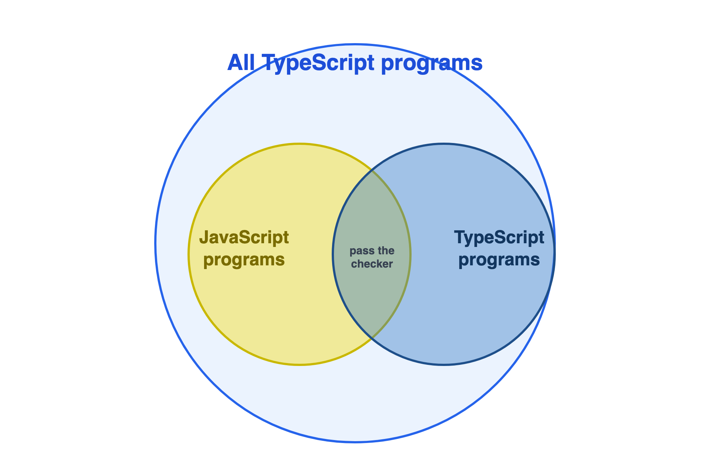

# Why this book?
Ran a quick search in Claude asking about books meant for advanced developers who already know Typescript. It suggested 

Effective Typescript by Dan Vanderkam
Programming Typescript by Boris Cherny
Type-Level Typescript - Course by Gabriel Bergnaud
Typescript Hnadbook - The official Docs

https://effectivetypescript.com - Got the ebook on first search though :-D 

# Primer

- TypeScript is typed superset of Javascript to solve headaches for which JS is famous.

The author Dan Vanderkam was Principal Software Engineer at Sidewalk and Senior Staff Software engineer at Google.


# Item 1 : Understanding the relationship between TypeScript and Javascript


Typescript is neither runs in an interpreter like Python and Ruby nor it compiles like Java and C. It compiles to another high level language - JS.

All JS is TS which means obviously that TS is a superset of JS. But where this shines is - In existing codebase, you can just rename all your files from `JS` to `TS` and you are good to migrate to `TS` which means easier migration. Can't do with other kind of migrations like going from JS to Rust etc.

This doesn't mean that JS is read as JS and no type safety. Once you rename your file from `.js` to `.ts`, the TS compiler now starts checking the JS file as well for tyope safety. You can say that there are no types defined then how is TS checking? TS is doing this by type inference. It reads your JS and analyzes the types for variables where it can and presents you with errors if it feels so.

```js
let city = "kanpur";
console.log(city.toUppercase());
```

`TypeError: city.toUppercase is not a function` - Because TS inferred the type as `string` automatically.



`TS` models the runtime behaviour of `JS` which means, both below statements compile fine in TS

```js
const x = 2 + '3';
const y = '2' + 3;
```

But `TS` also tries to stop you from doing something which may be unintentional

```js
const a = null + 7; // Evaluates to 7 in JS
// But in TS gives error- The value 'null' vannot be used here
const b = [] + 12;
// Evaluates to 12 in JS
// But in TS gives error - Operator '+' cannot be applied types
```

Guiding principle of Typescript system is 

- It should model Javasript's runtime behaviour but odd usage is error and not developer's intent.

So by adopting TS, you are actually trusting the judgement of the TS team. What they think is correct and what is wrong.

So if you really want to add `null` + `7`, maybe you don't think like the TS team :-P

# Item 2: Typescript options

TS` comes with many options that can be passed as args on command line or via a configuration file like `tsconfig.json`.

Generally you should have a tsconfig file so that all the developers work on same config. But do note that depending on the options set in the file, the typec checking behaves differently. Generally language developers don't give these many options to the developers, but in TS, its been provided to you for more flexibility.

There are hundreds of settings as of 2023, but most important of all those are

`noImplicitAny` and `strictNullChecks`

## noImplicitAny
Basically it controls what TS does when it can't determine the type of the variable. For eg

```js
function add(a, b) {
    return a+b;
}
```

Here, TS can implicitly determine the type as `any` and contiue to run the program. Of course you can manually also define the type as `any` but that is different from implicit analysis done by TS.

You would ask then why this is even an option? Why not remove this implicit any conversion from the language?

The reason is that for new projects it would all work, but for projects which needs migration, you need to continue using your existing code as well. If TS starts complaining about this, then you will first have to defined types correctly for all the existing code as well before migrating to TS.

So basically both of these code can co exist together in same codebase

```ts
function add(a, b) {
    return a+b;
}

function add(a: number, b: number){
    return a+b;
}
```

## strictNullChecks

It controls whether `null` and `undefined` are permissible values in every type.

When `strictNullChecks` is off
```ts
const x: number = null; // OK, null can be assigned
```
When `strictNullChecks` is on
```ts
const x: number = null; // error type 'null' is not assignable to type 'number'
```

In case you really need null, you can be explicit about it

```ts
const x: number | null = null;
```

Again, if you are in new project, set this to true, and if you are migrating, then only use this temporarily and try to get this to trues asap as keeping it off more longer time would mean a codebase with missing null checks.

Ideally this should be true for any new project.

There are other options like `noUncheckedIndexedAccess` which presents error when accessing arrays non existing indexes.

By default when you start a new TS project, it sets up with `strict`. YOu can become more strict by adding options

# Item 3: Generated code do not contain type definition

Type checking happens at compile time, but at runtime there is no information of types. So you can't do a conditional check on a type at runtime. The `instanceOf` operator checks at JS prototype chain but cannot determine the TS type. https://developer.mozilla.org/en-US/docs/Web/JavaScript/Reference/Operators/instanceof. 

```ts
interface Square {
    width: number;
}

interface Reactangle extends Square {
    height: number;
}

type Shape = Square | Rectangle;

function calculateArea(shape: Shape) {
    if (shape instanceOf Rectangle) {
        // Rectangle only refers to a type but is being used as a value here
    }
}

```

Then you would ask how to determine types at runtime?

One option is to use something which is available at runtime like `height` property.

```js
function calculateArea(shape: Shape) {
    if ('height' in shape) { // Check by property
        return shape.width * shape.height;
    } else {
        // do something when height is not there, which means its not a rectangle
    }
}
```

Another option is to add a `tag` to explicitly store the type

```ts
interface Square {
    kind: 'square';
    width: numner;
}
```

Though this works, but personally I would not like this as it introduces more breaking points. Peole will forget adding tags and it will endup in messy code.

## Code with type errors

TSC compiler compiles and also translates to javascript. Its worth noting that even if the compilation fails, js code can be generated which can run without any problems.

In case you want no js code to be generated when TS compilation fails, use option `noEmitOnError` which would effectively stop your build and your application.

## Type operations cannot affect runtime values

Here you are just asserting that the return value should bw a number. But its not actually converting the value. Obviously because TS construct is not there at runtime. This is sometimes inaccurately called as `casting`.

```ts
function asNumber(val: number | string): number {
    return val as number;
}
```

Instead, you would need to use JS construct to convert the value to a number.

```ts
function asNumber(val: number | string): number {
    return Number(val);
}
```

## Runtime types can change from what it was declared

Even if you have declared the value to be a boolean. At runtime it can have a string. For e.g if its coming from an api call and the api sends a string instead of a boolean. More on this later

```ts
function setLightSwitch(value: boolean) {
    case true:
        turnOn();
    case false:
        turnOff();
    default:
        console.log("Na ho payega");
}
```

## Function overloading based on types

In languages like `C++` you can overload a function with varying types. But in `TS` you can't do that because runtime behaviour is different. In javascript there is no parameter based function overloading. Though you can evaluate the args and based on that you can perform logic.

in `TS` you can provide multiple type signatures, but only a single implementation

```ts
function add(a: number, b: number): number;
function add(a: string, b: string): string;
function add(a: any, b: any) {
    return a + b;
    }
const three = add(1, 2);
    // ^? const three: number
const twelve = add('1', '2');
    // ^? const twelve: string
```

## TS types on runtime performance

TS types don't exist in generated code, so no performance penalty if you use types.

But the code generation itself becomes a step and may take time based on your target. For e.g converting generator functions to a very old JS version can endup creating helper functions. But this would still happen if you write new ES code and use babel to transpile so technically not a TS related problem.

# Item 4: Get comfortable with Structural Typing
