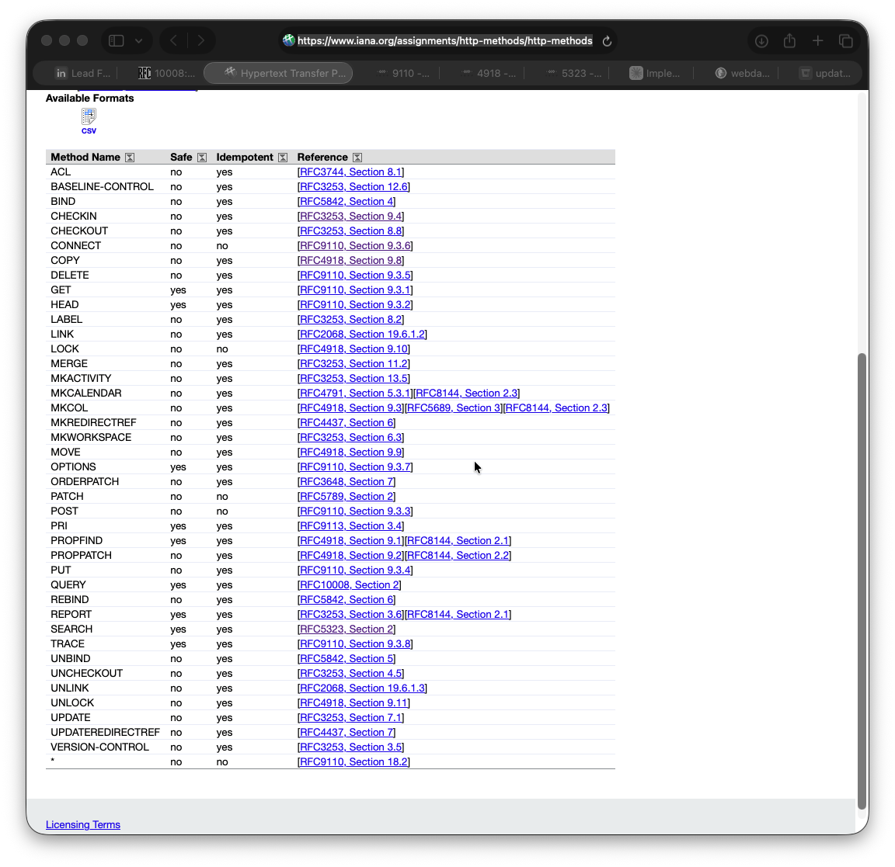

# 40 HTTP methods?

Since the new http methods [`QUERY`](https://www.rfc-editor.org/rfc/rfc10008.html) was published a few days back, I just tried to read about it and somehow ended up in a [rabbit hole](https://www.merriam-webster.com/dictionary/rabbit%20hole). I thought I knew http, but it turns out, I barely touched it :-P.

You may not believe, but there are a total of 40 http methods as per the RFC.

https://www.iana.org/assignments/http-methods/http-methods.xhtml

Since generally developers are application developers primarily working on rest apis, you would may be familiar with GET, PUT, POST, PATCH etc. But lets have a quick rundown and see why so many are there and is anyone using them?

# 1991-1996

[RFC 9110](https://www.rfc-editor.org/rfc/rfc9110.html#name-method-definitions)

`GET`, `HEAD` and `POST`

When the web started, I suppose it was only two things needed. Read the data from server and then submit something to the server.

Initally with http 0.9 only `GET` was there. With http/1.0 they added `POST` and `HEAD`

While `GET` and `POST` are obvious, `HEAD` was added to get only the metadata of resources. I asume for optimization?

# 1997-1999
`PUT` and `DELETE` were added to give clients a way to create/replace and remove resources directly making http complete tool for managein gcontent rahten than just reading.

`OPTIONS` was added so that client can discover what a server supports.

`TRACE` was added for diagnostic loopback

`CONNECT` was added for proxy to open a tunnel

Link and Unlink were present in draft but dropped from later revisions. They remain registered but are effectively obsolete.

`LINK` - Establish relationship between existing resources
`UNLINK` - To remove the links

Both were removed from RFC 2616 onward

# 1999
They wanted to achieve content authoring using http methods thus they (WebDAV - Web Distributed Authoring and Versioning) came up with below methods

`PROPFIND` - Read resource
`PROPPATCH` - Write resource property
`MKCOL` - Make a directory or collection
`COPY` - Create a copy of resource
`MOVE` - Move a resource from one place to another
`LOCK` - Lock a resource 
`UNLOCK` - Obviously :-D, Unlock a resource

Basically all file operations to make the content management easier. While this looks good on the surface but somehow it didn't get the traction. 

I wasn't even aware till today that these methods existed. And I am sure 90% of the web deverlopers won't know this

# 2002
`REPORT` was added for server side reporting queries in versioned WebDAV systems

`SEARCH` was added as a safe idempotent way to run serv-side quries carrying XML query document in the body. Both were safe and idempotent but tied to XML and thus never gained much traction. As I believe people moved to `JSON` and abandorned xml thereby leaving these methods behind. 

I also read that initially `QUERY` method was supposed to be named this, but it would have resulted in incompatibility as the existing standard supports only xml and extending something else will destroy the backward compatibility.

Apart from this, there were several added by **WebDAV** to support versioning. Basically a CVS kind of thing.

[RFC 3253](https://datatracker.ietf.org/doc/html/rfc3253)

`VERSION-CONTROL` - Adds a resource to version control. Maybe similar to `git add -u` to add the untracked file?

`CHECKOUT` - Create a working copy that you can modify

`CHECKIN` - Same as `git commit`

`UNCHECKOUT` - Cancel a checkout. Looks to be similar to `git checkout`

`UPDATE` - Looks like a `git pull`. Pulls a different revision into view

`LABEL` - I feel its same as `git tag`. Puts a human readable name

`MERGE` - Obvious

`BASELINE-CONTROL` - Puts whole colleciton under baseline control - snapshot the state of many resources together. Not sure exactly but need to check whats the git equivalent for this

`MKWORKSPACE` - Create a workspace where you can checkout files. `mkdir` I suppose in git?

`MKACTIVITY` - Creates an activity. Something similar to changeset. Maybe I guess something like `git add`?

# 2003

`ORDERPATCH` - To change the order of members in a collection. 

# 2004

[RFC 3744](https://datatracker.ietf.org/doc/html/rfc3744)

`ACL` - Modifies the access control list of a resource. I guess `chmod` of internet

# 2006

RFC 4437

`MKREDIRECTREF` - creates a redirect reference resource pointing at another URI. I suppose the location header that we get when we call a `GET` method

`UPDATEREDIRECTREF` - Updates the redirect reference. 

# 2007

RFC 5842

Creating new URIs to the same existing resource

`BIND` - Creates an additional binding(a new URI) to an existing resource
`REBIND` - Moves a binding from one colleciton to another
`UNBIND` - Removes a binding

# 2007

RFC 4791

`MKCALENDAR` - create a new calendar colection used by CalDAV calendar servers ( protocol behind many shared calendar systems)

# 2010

[RFC 5789](https://www.rfc-editor.org/info/rfc5789/)

`PATCH` was added to fill the gap. `PUT` replaced the whole object which is a waste of resources when you really just want to change one small detail. 

# 2022

[RFC-9113](https://www.rfc-editor.org/info/rfc9113/#name-iana-considerations)

`PRI` - Not a real appplication method. Its part of the HTTP/2 connection preface magic string used to detect and reject accidental http/2 traffic on http/1.1 servers. It exists in the registry to reserve the token, but as a developer you never call it.

[RFC 9110](https://www.rfc-editor.org/rfc/rfc9110.html#name-method-registration)
`*` - The star!. Its just reserved to complete the list when we use headers like `access-allow-methods:*` 

# 2026

[RFC-10008](https://www.rfc-editor.org/info/rfc10008)

`QUERY` is now added to close the gap between `GET` and `POST`. We already know `GET` becomes heavey when we start writing query parameters for our data. While there is a sufficient limit to characters in URI, but it makes every URI call a different resource plus the overhead of logging and parsing in proxies. So the newly added methods really gives a good capability which was missing. And `POST` (used by GraphQL) isn't safe and cacheable makes it a pain for simple data fetching.

> End

