# The inspiration

Anytime I wanted to checkout the lyrics of any song, I ended up in opening a website which is far from usable. I understand that people need to monetize their work but finding lyrics on such kind of websites was becoming impossible.

With the availability of AI recently, I thought I should give it a try and build my own website for personal use. At least for the songs that I need lyrics, I can have an online place to always fetch them

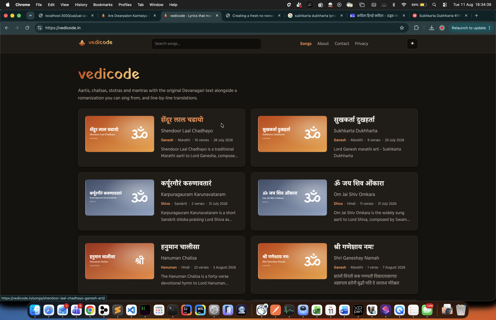

You can check it out at [https://vedicode.in](https://vedicode.in)

# The setup
Hosting lyrics is an easy task, but I wanted them to be available in Hindi and English for easier consumption.

This would require lyrics to be converted from one language to another. Again, it could be done using any AI tool. Having Claude subscription, I thought it could be achieved.

I didn't want any server side logic as it would be a plain static site, so I went for the most common framework available

## Infra
Hosting - Netlify Static Site
Build - Eleventy Static Site generator using markdown content
Domain - Ofcourse it needs to be a good domain, hence I purchased [https://vedicode.in](vedicode.in).

## Folder structure
Since I needed both transliteration and translation, I came up with below structure

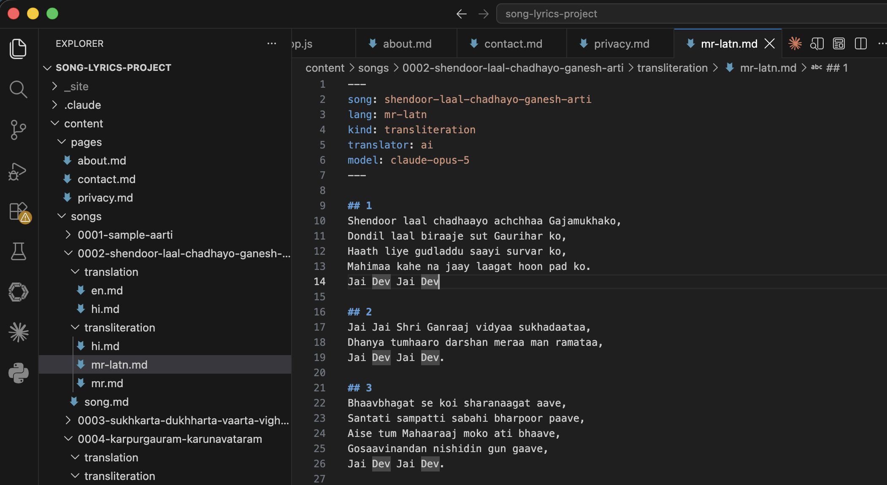

The translation is obvious. It will have meaning of the lyrics in that language. The transliteration part is where it was interesting. You need to mention which language the lyrics was in original and in which language are you writing it.

Marathi written in devnagiri
```
शेंदूर लाल चढायो अच्छा गजमुखको,
दोंदिल लाल बिराजे सुत गौरिहर को,
```

Marathi written in Roman
```
Shendoor laal chadhaayo achchhaa Gajamukhako,
Dondil laal biraaje sut Gaurihar ko,
Haath liye gudladdu saayi survar ko,
Mahimaa kahe na jaay laagat hoon pad ko.
Jai Dev Jai Dev
```

## Automation
Ofcourse all this would need some automation. With help from claude, I created mutliple scripts 

* npm run song:new - Creates a new song with basic file setup and blank verses
* npm run song:regenerate - Regenerates metadata with slug, description etc.
* npm run song:translate - Either translate or transliterate. User to select all options
* npm run song:generate-feature - To generate a svg image for each song

# Features

## Theme
As with any other website in 2026, a dark and light theme with toggle and persistence in storage

| Dark theme | Light theme |
| --- | --- |
| 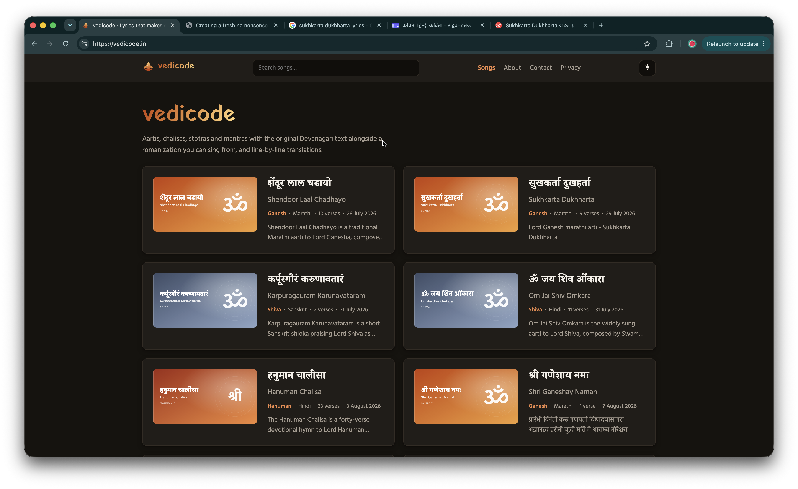 | 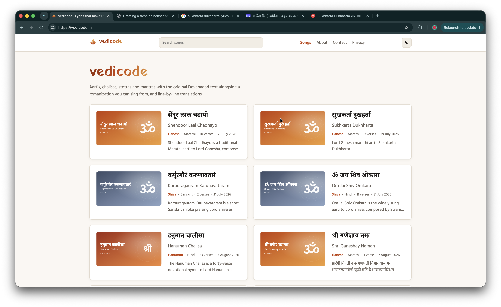 |

## Side by Side view
For desktops, side by side view for lyrics, their transliterad versions and then thranslations

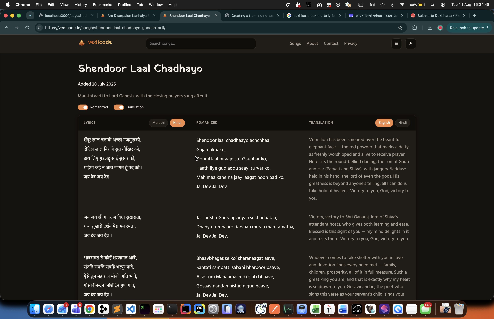

For mobile view, default to native lyrics

# Auto scroll full screen view
A special reader view in which lyrics auto scroll. You can change the speed of the scrolling, play pause and also change the size of text as per your convinince without affecting any layout shifts.

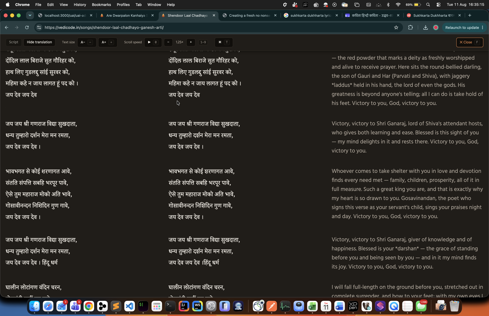

And all actions have their hotkeys

* Reader mode toggel - `F`
* Scroll speed - `0` to `9`
* Play/Pause scrolling - `0`
* Text size change - `-` / `+`

With just the keyboard, you can easily control all the actions

## Search
A global search box to easily search pages. It uses static search so its not google or amazon. Just pretty basic compile time generated index.

# Cost
The only cost for this project was 

* Domain - Rs 900 per year
* Time - My time invested with cluade.ai subscription(20$ per month). It took around total of 2 weeks with mostly 1-2 hours every alternate day or so.

# Feedback options
Since I intend to open this for public, I should have a mechanism to receive feedback from others. I already have google workspace for my primary site cybercafe.dev. I added a new domain in that account with email alias so that I can receive emails on my primary mail.

`hi@vedicode.in` -> `***@cybercafe.dev`


# *(update 12 aug 2026)* - Domain suspended

Today my domain got suspended. Initially I thought that the suspension is by Hostinger. But it was them, but the [NIXI](https://nixi.in/) - National Internet Exchange of India.

Very unsual for me as I have been working with domains since long, but it seems that NIXI - The registrar is very serious about `.in` domains.

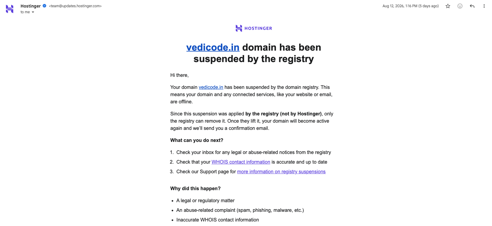

Though the name and phone number provided at the time of registration were correct, but I guess, they want the address to be also accurate.

On further checking, which I thought would have been a straight forward thing, apparently there is no way to contact them other than the mail [support@nixi.in](support@nixi.in).

As I understand, there could be around thousands of registration daily. Checkout [https://registry.in/domain-creates](https://registry.in/domain-creates)

On 3rd aug you can see [https://registry.in/system/files/domain-creates_2026-08-03.pdf](https://registry.in/system/files/domain-creates_2026-08-03.pdf) domains registered.

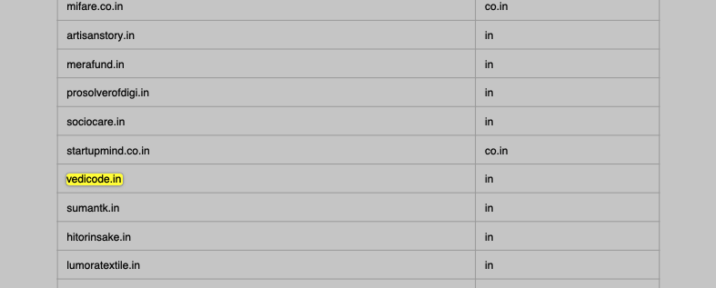

There was no clarity as why NIXI suspended the domain. Ideally they should clearly mark where we can go and check the reason of suspension. Otherwise we are just blind.

Though there is a list of common reasons, but no way to know exactly.

And on top of that, there is no way to raise issues. At least I wasn't able to find any.

Finally submitted a contact form - https://registry.in/contact-us which I believe created a ticket in the background as I received an email with a ticket number.

Tried contacting support with the same, but no response.

On the complaint page(https://registry.in/complain), they have a new email id which doesn't work

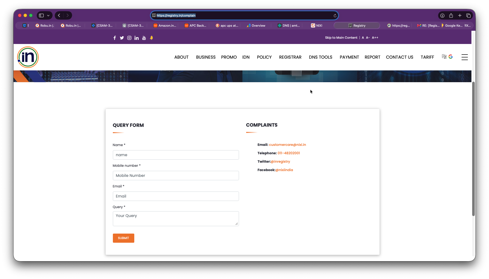

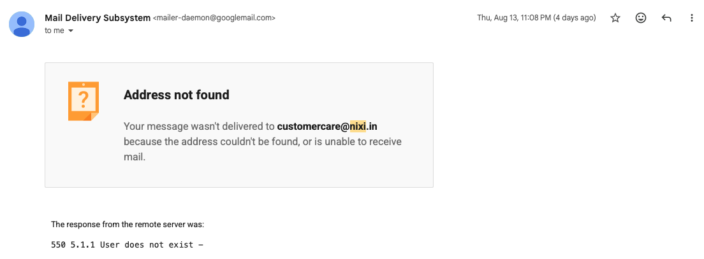

I also called on one of the phone numbers. Was able to reach someone who said that NIXI has a long queque as many domains are registered, so please wait for a few days.

Didn't try but found one page with some more information - https://nixi.in/nc-contact/

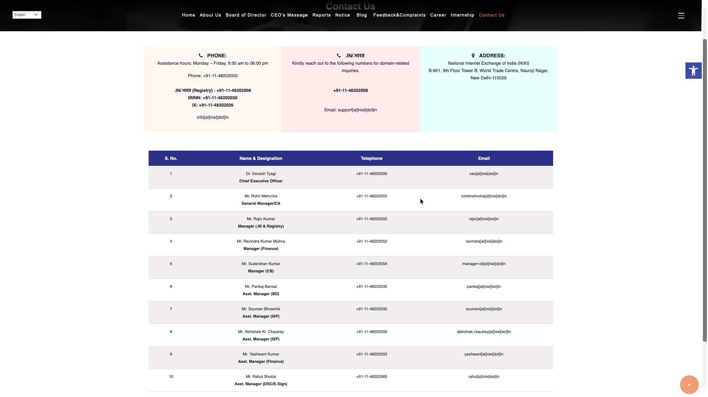


# *(update 17 aug 2026)* - Domain reactivated
Finally after 4-5 mails and submitting the KYC via mail, received response that domain has been reactivated today.

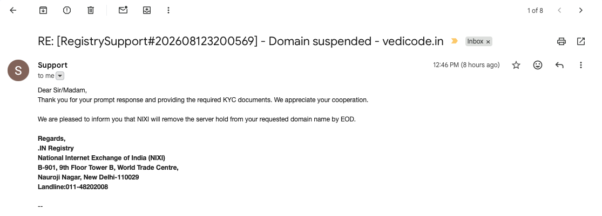

> End