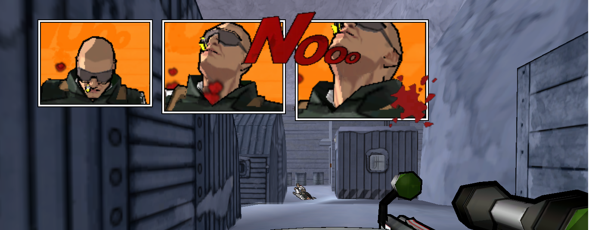

# A post in 2020 for a 2003 game, why?

XIII(Say 13) had a place of its own in the gaming world. It was popular because of its comic styled artwork. Last year in November Microids released a [remake](https://www.microids.com/game-xiii/) of the original game.

I didn't play the remake but I did saw a lot of videos talking about it. Apparently it was [not received positively](https://mspoweruser.com/xiii-game-remake-crowned-worst-xbox-game-of-2020/) by the gaming community. After looking at responses and watching the gameplay, even I can understand the reasons for that.

They just removed the most compelling feature of the game - the **comic style** gameplay. Moreover it had lot may graphics and audio issues. You can see yourself [here](https://www.youtube.com/watch?v=mI-OEhJXPng).

But because of this worthless remake, the old version became more popular and even surpassed the number of copies sold if we go by this [tweet](https://twitter.com/Chris_Dring/status/1329732198468112390)

# 2005 - When I played it
I was pretty new to computers then. I used to loan complementary CDs that came with magazines such as `Digit`, `EFY` etc from libraries. Those CDs had everything which you need including the tools, utilities, game demos etc. The only internet that we had was in the cybercafes with [pitch dropping speeds](https://www.youtube.com/watch?v=BZvsrOciU_Q). I used to install each and everything that came with the CD. As I can remember, `XIII` came as a demo with only two levels - The beach and Carrington's cell. Because of its less demanding graphics, the game ran smoothly on my intel P4.

After a few years, I did play the full game and indeed that was a lot of fun.

Here are a few snapshots showcasing the artwork of the game.

I was a kid in 2005, I didn't give much importance to the storyline but now that I read about it, I think I would give it a re-visit.

# Playing XIII in 2021 - Nostalgia

Just for the sake of nostalgia, I purchased the game on [steam](https://store.steampowered.com/app/1170760/XIII__Classic/) at ₹87(around 1$) a few days back and I guess it was worth spending that money. Though it didn't run out of the box, I had to install a [patch](https://xiii.opaquit.com/downloads-2020/Classic_XIII___Patch_by_Arthur_v1.4.2.1_2019-09-04.exe) from [here](https://xiii.opaquit.com/2020.php) to make the game run. It solved the resolution issue and most importantly mouse worked perfectly fine.

# What makes XIII so special
Apart from the already mentioned comic-styled gameplay, there are other few things that caught my eyes

* **Ambient audio** - Maybe its a basic thing now a days, but in those days, playing a game with such level of audio design was really an experience. All the envioronment sounds were in great detail. You feel it where you are. You will hear the breeze if you are in out on snow. You will hear the echo if you are in closed cells. The sound of boot taps with the Tap Tap Tap! when enemies come near or go away.
* **Background Score** - Every game has some kind of background music. But this one had something different. Whenever you indulge in a fight, the music just sets the mood for it. I kind of feel, its something similar to what Alejandro did with [Birdman](https://www.imdb.com/title/tt2562232/). I am no musician, but I just liked this concept.
* **Physics** - At first you might say that there was not much to expect in terms of physics as everything was a cel shaded sketch. But while playing I realised that even though the characters, objects and environment in itself were 2D, but the mechanics were indeed well implemented. 

One of the prime examples is recoil - Yes, the recoil was there and it felt real. Every weapon had its importance. Reloading the revolver every few shots! Breaking things like glasses, bottles, chairs etc. You could even take hostages and throw knives at the same time. Using a winch to go up and down and climb out. I don't know from which game it originated, but I guess hiding bodies was somthing unique. Its still a required tactic in Assasin's Creed.
* **Inventory Management** - Somehow this game made the inventory management a lot of fun keeping it quite restrictive at the same place. You can only carry certain amount of ammo for each weapon. It really added a lot of excitement and the desire to search each and every corner of the location.
* **Simple Menu** - Can't say if this is a feature or limitation, but certainly it was unique. Games with this level of complexity generally had lot of confguration options. But for XIII there was nothing. In fact there is no such settings as "Low"/ "Medium"/ "High". You can just confgure basic things like resolution etc.
# Remake the remake?
I think the developers just took a wrong design decision for the remake. Instead of having the dull 3d graphics, they should have just re-created the whole game to support 4k, better AI and maybe more checkpoints. The whole idea of the game revolves around the art style. It really looked like some comic came alive. If that is possible with an update, I guess we can give it another chance.

> End

