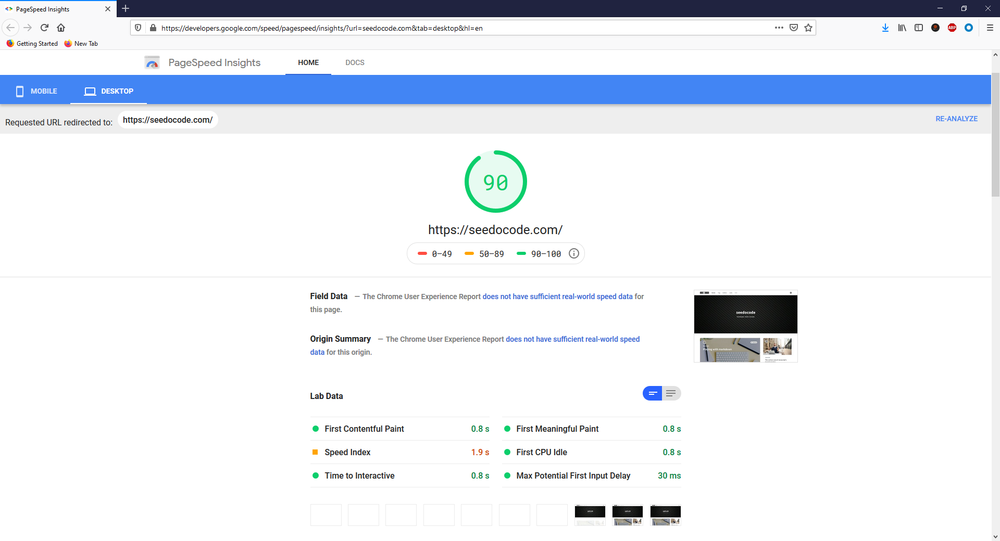

You have created a new website. Maybe a blog or a small ecommerce site or your portfolio with the projects you have worked on. You want to see how your site would behave in real world i.e. on the various browsers on different platforms like desktop/mobile/tablets etc.

You have 2 options to do that

1. Browser dev tools
2. Google search console 

## Browser dev tools
Being a ==front end developer== I am quite familiar with how dev tools work. What does it exactly mean to open a new panel full of source code, css box model, console full of warnings and errors.

In the dev tools you will find various tabs under which there is a profiler which you can use to analyze your page. It will give you a detailed summary with snapshot that you can save.

But this method is still tedious and is intended specifically when you want to troubleshoot your web application.

For all other times you have a very optimised and quick way of getting your page analysed that too from a third party view and would not take into account your local resources.

## Google developer console
Google has a fully fledged application which caters to anayzing and reporting of your sites. This is a very handy tool and can often be used pretty easily.

All you need to do is to add your domain to the list of sites you own to your developers account. You can add multiple domains and you would need to verify using a TXT record or some other way. Will do a separate post for the step by step process.

Once you are done adding your sites to goolge developers console account you are ready to start the initial fetch.

Goto the [Speed tool](https://search.google.com/search-console/speed)

You will see 2 tabs : Mobile and Desktop
Click one of them which will lead you to another page where you can ask google to analyze your site.

Once google is done analyzing your page, you will be presented with results for your consideration.

As you can see the score for [my blog](https://cybercafe.dev/) is 90 which come under high score category and alas! makes me satisfied with the performance.

You can also see opportunities where you can improve the page performance. Those are listed below under diagnostics section.

Do remember that this is an experimental feature from google and with time the process and links would change.

Hope you use this awsome feature and derive something out of it.

> End

