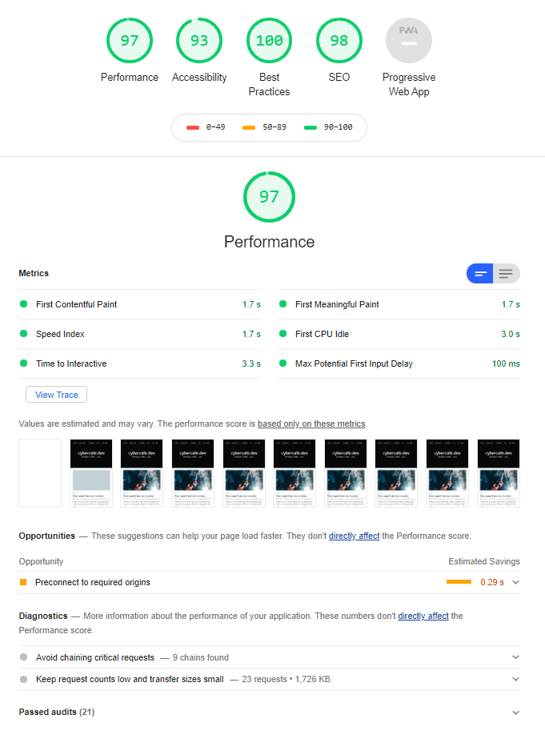
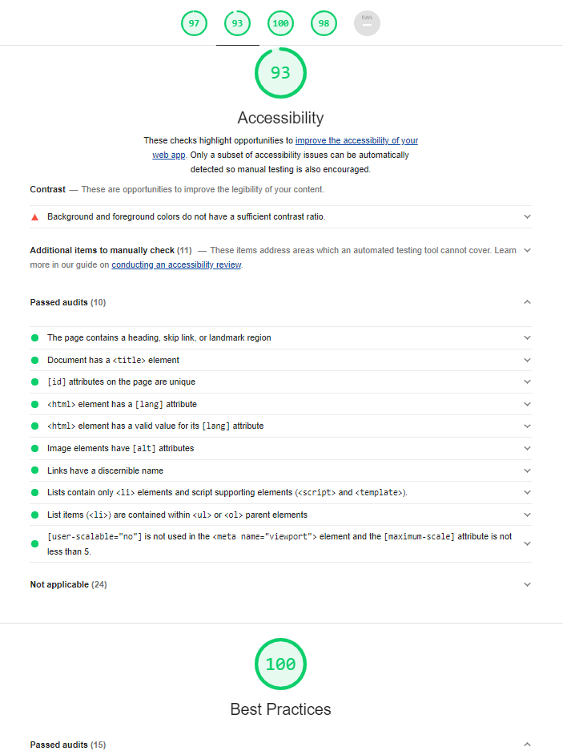
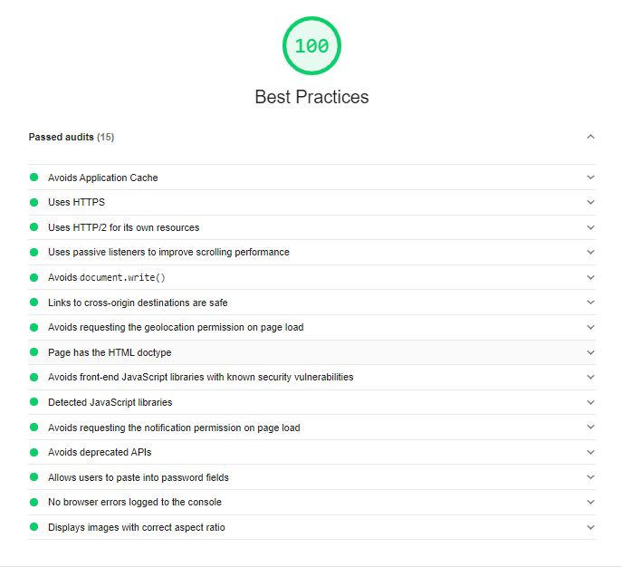
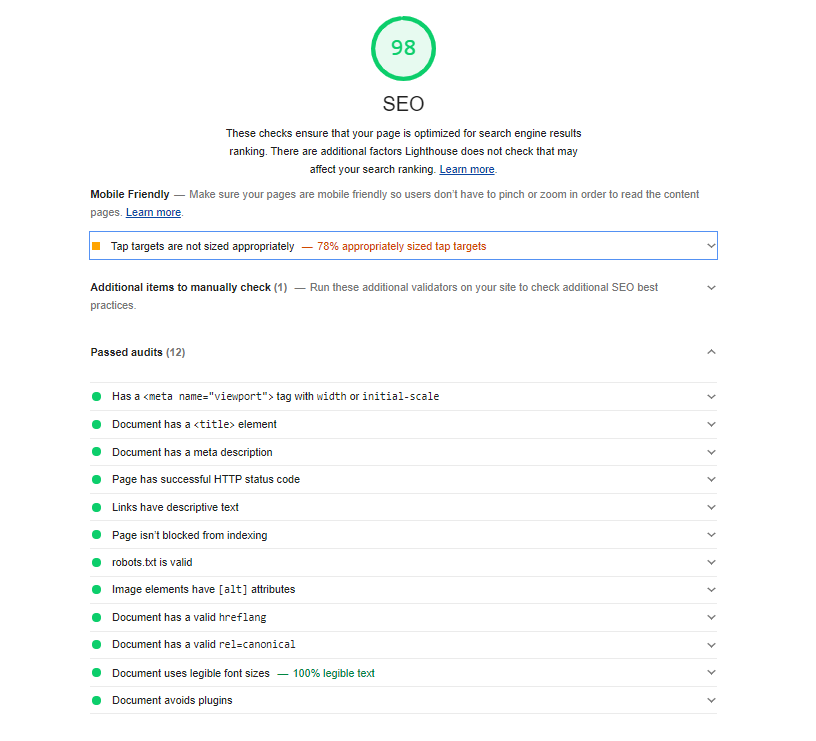
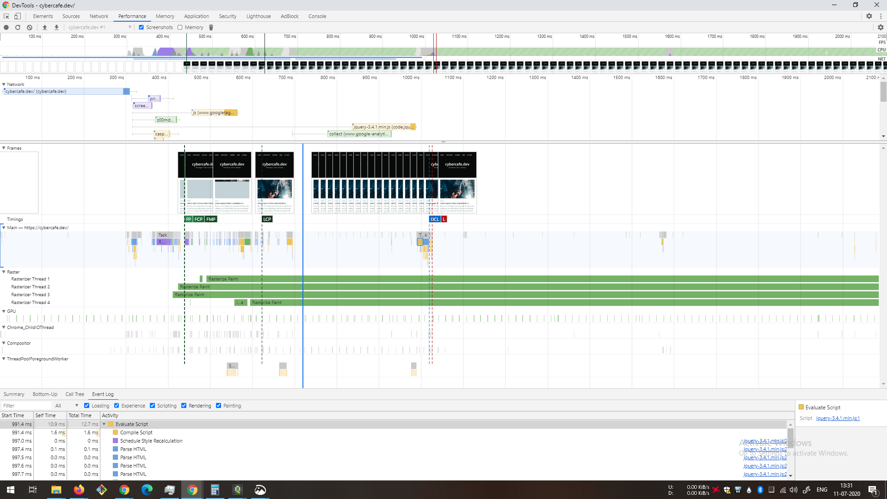

The best place to start with is Chrome's `Lighthouse`. For older versions of chrome this is called `Audit` tab.

Lighthouse is an open-source, automated tool for improving the quality of web pages. You can run it against any web page, public or requiring authentication. It has audits for performance, accessibility, progressive web apps, SEO and more.

https://developers.google.com/web/tools/lighthouse/

## Running lighthouse on this site
Without wasting time lets dive into the usage quickly.

Running lighthouse on cybercafe.dev

Lighthouse results snapshot on cybercafe.dev

### Lighthouse results

At the top you will see an overview with a score for every aspect of the site. The names explains itself. Point to note is that the score should be > 90 for every category if your website is a public facing site.
* Performance
* Accessibility
* Best Practices
* SEO
* Progressive Web App

As you can see, the score for PWA is not available for my site. The reason is Ghost does not provide PWA in-built as of now. Though you can convert your site to a PWA a handful of steps by updating the theme and installing a service worker. Thats on a TODO list for now. More details about PWA later.

## Lets understand the results more

### Performance and Accessibility

| Performance                         | Accessibility                       |
|-------------------------------------|-------------------------------------|
|  |  |

As you can see there are several pointers on which timings are calculated. Depending on your use case some might not be applicable. For eg if your website has a heavy 3D homepage, first meaningful paint might take time.
Though accessibility is still something that nobody considers at first. But once your site is ready for production you need to work on that too. As I am using ghost platform, most of the work is already done with themes designed keeping in mind the accessibility features.

### Best practices and SEO

| Best practices                      | SEO                                 |
|-------------------------------------|-------------------------------------|
|  |  |

Best practices are there for a reason. These are just some of the things that you need to make sure your site adheres too. Implementing all these from scratch is technically a very time consuming job. That's why we should always use a platform that checks all of these for us. 

Similarly for `SEO`, there are a ton of things that you would need to do. Perhaps its always a good idea to get it done from somebody else and you focus on your content. With `wordpress` you had to install plugins to improve SEO. As far as I remember, those were paid even if you were using your own hosting. With `Ghost` at least this comes built-in.

### Progressive web app

As mentioned earlier, I am yet to add PWA support to my site, but just to summarize how PWA would help

* PWA makes your site accessible without internet with caching mechanism and custom offline page.
* It also enables the user to use your site as a native app without installing your app. 
* The user can add your site on his android phone as an app. The app would open in its own window giving a feeling like a native app. 
* There are options which you can set which will allow the user to see the URL address bar, or make the app fullscreen etc.

Checkout more details on https://web.dev/progressive-web-apps/

### Further actions

There are certain options before starting the lighthouse tool. You can also select the device for emulation between Mobile and Desktop. The results can differ slightly but mostly it should remain same performance wise.

Once your are done with lighthouse, its time to move to `Performance` tab which presumably needs a separate series of articles. You can drill down to bits and pieces of your site. Will work on that in some time too. For a teaser please find the snapshot below

### One more Tip
Since lighthouse is just a dev tool, it does not need any ownership test. So basically you can run it on any site and checkout the results. That can be a fun activity when you start learning. No screenshots for this intentionally:-D

> End

