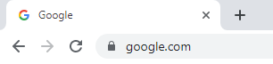

These days internet has become a part of our life. For every task, for every question we tend to resolve it via internet. For those who come from programming background or have experience in web application development can understand how the web works.

But for other people internet is still a mystery. Often we hear that someone was duped over internet either via fake site or attacked with other malicious intent. There can be a million things that can go wrong while you are online. If you do not take precaution you might end up getting attacked and recovering from it will be mostly impossible.

Most of the time the attacker is in other country and to recover your $1000 you would not want to invest $5000 in travel, litigation, investigation etc. Instead you would start afresh and forget what happened.

Today I will try to list down certain points which will help you identify if you are safe or not. Do note that this is not an exhaustive list and not in order. This is something to be treated as an understanding of various aspects overall

The above screenshot is of google chrome. You can see there is a small lock icon just before the website name. A similar approach is followed by a lot of other browsers. The color of the icon would be different or the position but all generally represent one thing and that is secure https connection. Basically https:// means secured connection to the server. All your connections will be encrypted and if somebody is trying to perform a man in the middle attack and tries to read your information he would not be able to decipher.

The important point to note here is that this is a paid service and big organizations generally would have this installed. So if you find a website claiming to be a bank site and does not have this icon, can mean that probably somebody created a fake website and is trying to get your username and password and maybe other details. To check the authenticity of the site, you can probably do a google search and open the first two links and compare if the domain names do not match.

> End