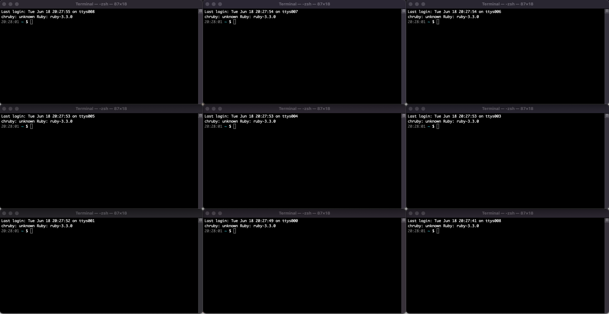
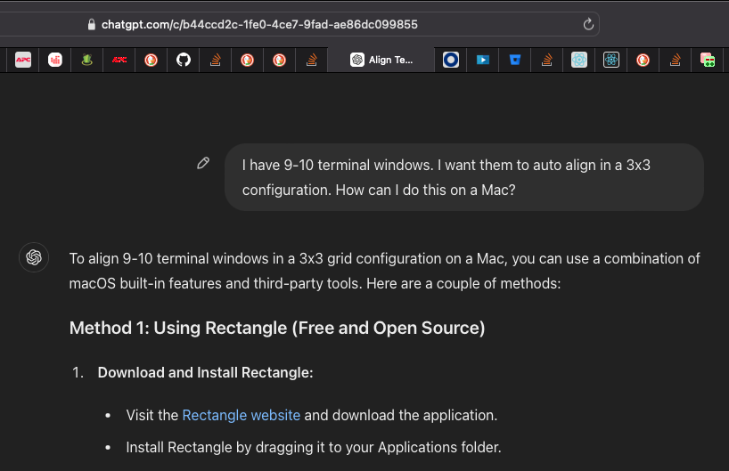
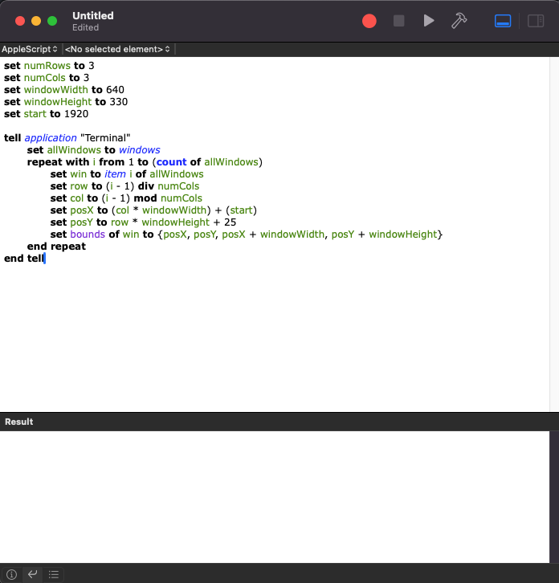
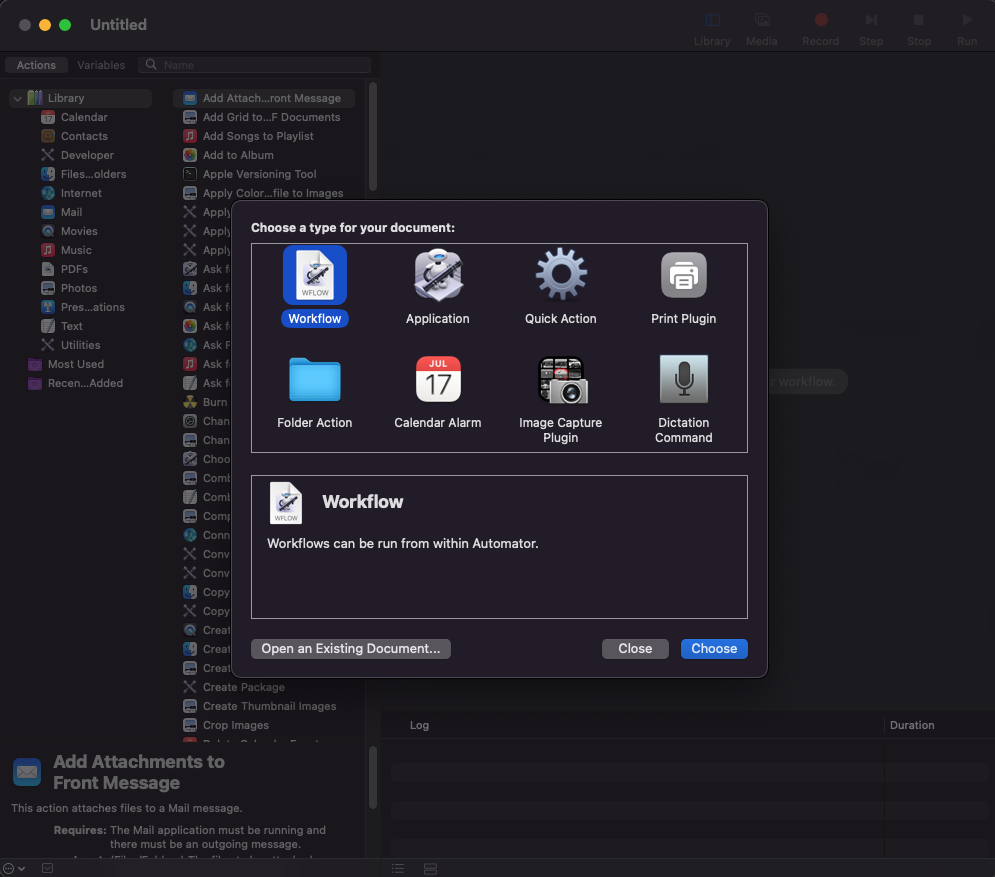
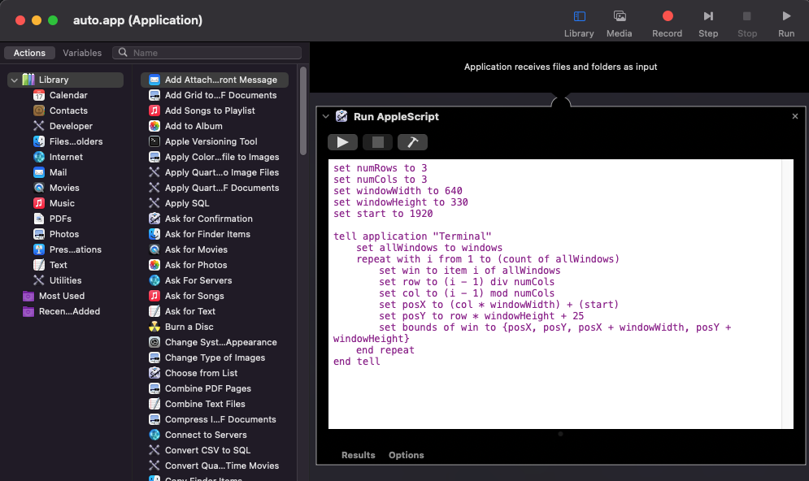

# Window management crisis
Recently I had switched to **macOS** and was trying hard to find a way to rearrange multiple `terminal` windows quickly.

I run a lot of terminals simultaneously and want to keep all of them stacked side by side to view the logs for each of the services. Not sure if there is a better way to do this, but I find myself constantly fiddling around with window options so that it ends up in something like below.



And of course when needed, the window should be able to maximize. In macOS the fullscreen is a different concept so can't use that, but I found that double-clicking on the title bar makes the window maximize. Apparently the definition of maximize is different in macOS. Its called `zoom`. The window will try to extend as much as needed depending on the content - that's what it macOS Window Management Philosophy says

> macOS aims to provide an optimal window size that best fits the content displayed, rather than simply expanding to the full screen. This "zoom" feature resizes the window to fit its content without necessarily covering the entire screen.

If there could have been a config option somewhere in setting which says **zoom** or **maximize**, the whole problem would have been solved. Nevertheless, there is a workaround for that. Use `Option` + `Double Click` on the border to maximize that particular direction. And cherry on the top is that this behaviour differs across apps.

The other problem is, whenever I change the dock, or connect the system to a different monitor, Mac remembers the monitor but couldn't place the windows perfectly on to the new monitor. Hence, again I have to resize every window manually to get the right fit. And same problem when I move the windows to different monitor within the same setup. It loses all the alignments I did manually.

What I want is, kind of having a big window where I can decide how many sub-windows should be there and what should be the arrangement. And the possibility of maximizing it to entire screen and restoring to its original size.

# Native solution
I know there are paid apps in the store for these kind of things, but I am yet to try any of those. Will update if I find something in the future. Meanwhile, I'll present a workaround for that.

## Window groups
Open `terminal` and create multiple new Windows by going to Shell -> New window. You can also use `⌘ + N` to open them.

Once you get enough windows, position them as per your liking by manually adjusting the size.

Now you can save this layout using menu `Window` -> `Save Windows as Group`. Name it something which helps you remember the layout. eg. `3x3 Office` `3x3 home` etc.
Once saved, when you open the terminal next time and goto `Window` -> `Open window group` and select the previously saved layout, you will see the group open up instantly with the exact same size and order of windows. You can save as many groups as you want.

Another advantage of this method is it also remembers the directories, so you don't have to `cd` in each of them.

# Rearrange using applescript
Of course manual arrangement works, but as soon as you move the windows to a different monitor, you lose the arrangement. I asked chatgpt for the same.



It suggested three ways
1. Buy a third party tool like Rectangle
2. Using macOS Mission Control and Split View (Manual Approach)
3. Using applescript

I went for the third one, and it seemed to work for me.

## The script
Open Apple script editor and paste the below script in the editor. Play the script to see the action.

```applescript
set numRows to 3
set numCols to 3
set windowWidth to 640
set windowHeight to 330
set start to 1920

tell application "Terminal"
	set allWindows to windows
	repeat with i from 1 to (count of allWindows)
		set win to item i of allWindows
		set row to (i - 1) div numCols
		set col to (i - 1) mod numCols
		set posX to (col * windowWidth) + (start)
		set posY to row * windowHeight + 25
		set bounds of win to {posX, posY, posX + windowWidth, posY + windowHeight}
	end repeat
end tell
```

After you run the script, the editor should look like this



Enter the applescript code in the editor. What we are trying here is essentially looping over the `Terminal` windows and setting each window's `x`, `y`, `width` and `height`.

## Multiple monitors
If you have multiple monitors, then set the `start` value as per the relative position of the primary display. My primary display was the center one with 1920x1080 resolution and I wanted to position the windows on the rightmost monitor. So for me, the start value is `1920`.


# Automator
Once I had the script, I looked out for an option to create a shortcut to run the script. One way I found was to use `Automator`.

Create a new workflow and name it something which is easier to type for examples `auto.app`. So that we can run the automation instantly from the spotlight search






Now press `⌘` + `Space` and type auto.app and select the automation. It should work instantly. 

> End