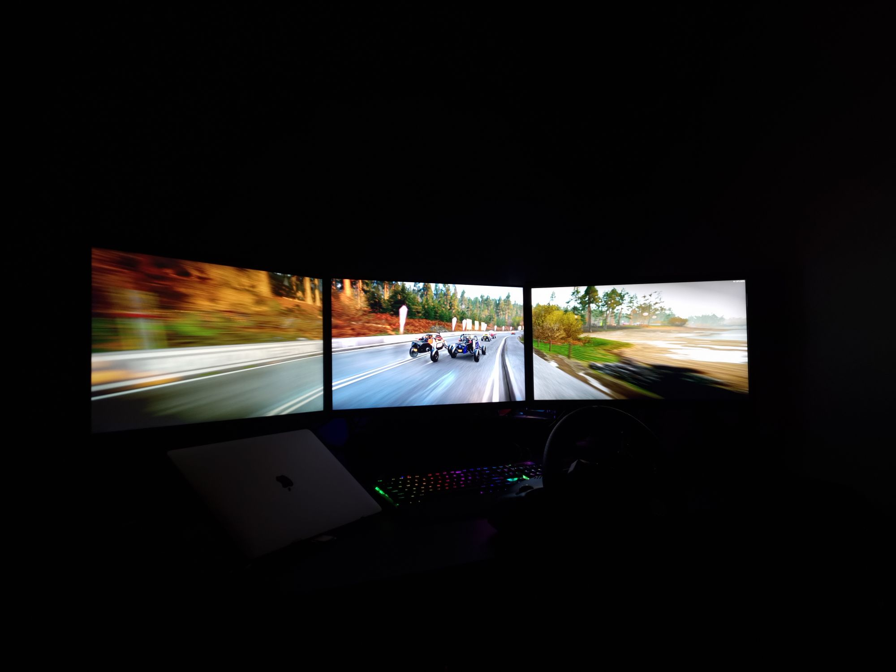

# Really complete?
Well, not literally a *complete* guide, but some useful information that may help people who are trying to configure **AMD eyefinity** desktop with multiple monitors.

Officially there is very less information, and searching on internet gives you bits and pieces which is not sufficient enough to understand how exactly eyefinity works. This is also acceptable since not everyone has all kinds of monitors to test around.

Before starting, just for reference here is the Official eyefinity guides
* [Setting Up and Configuring Multiple Displays to Run in AMD Eyefinity Mode ](https://www.amd.com/en/support/kb/faq/dh2-014) - Radeon 2020 and above
* [Set Up and Configure AMD Eyefinity](https://www.amd.com/en/support/kb/faq/dh-014) - Radeon 2019 and below

# Is eyefinity really worth?

Well, it totally depends on the use case and available hardware, but yes configuring eyefinity is a challenge and requires a lot of setup before you can *really* make use of it. If you ask me, it seems that eyefinity is best suited for sim games like `Dirt Rally`, `WRC` where you need a wide angle cockpit view to really feel the immersion.

Yes, you can enable eyefinity and play any game that supports wide resolution like `GTA5`, but it will take a toll on your Graphics card and to support the eyefinity resolutions, you might have to compromise graphics and physics quality which I believe is the point of playing games like GTA.

For work eyefinity does not make any sense. In fact its better to have multiple independent monitors. Its easier to move, maximise and restore windows.

# Everyone uses multi monitors nowadays, why is it so difficult then?
People have been using multi monitors for more than two decades and almost all offices have multi monitors for their employees to work. The setup is quite easy - You just need to plugin with the supported port and the system recognizes it automatically. You go to the display settings section and just rearrange based on the physical layout and you are done. 

In this kind of setup, every monitor runs at **different** [**resolution**](https://www.viewsonic.com/library/tech/monitor-resolution-aspect-ratio/) and probably at **different** [**scaling**](https://www.windowscentral.com/how-set-custom-display-scaling-setting-windows-10) which allows you to utilize the monitors to their fullest, like 27 inch 4k with 150% and 24 inch 1080 with 100%. You get almost similar fonts with the 4k being more crispier. 

But when it comes to eyefinity, you don't have the option to configure monitors individually and of course any scaling or custom resolution will be applied on the full virtual monitor that the graphics card simulates. Because of this, *you can only use `eyefinity` with native resolutions*. And thats the reason why you can't use the below setup which seems feasible at first look but is **NOT**.

* 24 inch 1080p
* 24 inch 4k
* 24 inch 1080p

The above setup will create a virtual monitor with empty space on the 4k assuming you selected `fit` in the settings(more on that later). If you select `expand` then the image will cutoff from the other side monitors. We'll see in later sections what I mean here exactly.

# Basic setup
The ideal condition would be to have 3 identical monitors. You will not get any stretching, cutoff issues and all will work seamlessly. You might need to rearrange them based on their physical location on the desk.

But there is still one small issue with this ideal setup - `Bezels`. Whatever the manufacturer advertises, bezels are not going anywhere. For a straight line you may not notice, but with 3d graphics and tilted lines, you will observe that the lines are not aligned properly. And when bezels are big(in case you are using cheap monitors :-P), this distortion feels apparent and is quite a big distraction when you are gaming.

To overcome this, AMD has provided a utility for `bezel correction`. But somehow they are not proud of this and have hidden it from the main menu. You have to navigate to the AMD installation directory and open `eyefinitypro.exe`. There are some options available like the layout method, offsets and re arrangement. 

* `Layout` - Quickly switch to a different layout like 1x3 to 3x1 etc.
* `Orientation/Rotation` - You can select displays indepedently in portrait or landscape mode. This is useful when you want to create eyefinity desktop with side monitors as portrait coz their horizontal resolution matches your center's vertical resolution. But beware, it may not work for you(More on that later too).
* `Layout mode` - How should the display scale when the resolutions do not match for different monitors
  * **Fit** - It will try to use the minimum common area. This could result in empty/black space on the remaining area of larger resolution displays 
  * **Fill** - It will try to stretch for all displays so that there is no black/empty area but it also stretches out the image which eventually means distortion.
  * **Expand** - It will try to create a bigger virtual monitor which results in some area to be cut off from the smaller resolution displays. Remember that even then you may not get the perfect alignment. We shall see later why so.
* `Offset` - This is where you set the bezel correction parameters

Again, this small utility is not perfect and has its own issues

* **No preview** - There is no preview of how your arrangement would look like. You have to choose and apply and after 5-10 seconds you see the result. 
* **No persistence** - You also lose what settings you chose. It resets all the settings after applying your selected options. So you need to write down somewhere what values you entered for offset and which mode you selected.
* **No quick toggle** - There is no way to toggle eyefininty off and back on when you need it. If you disable eyefinity from this tool, you have to re configure everything and start from scratch. Though there is a workaround to this- After creating eyefinity config from this tool, enable and disable using the AMD radeon quick setup button. That way somehow it remembers the bezel correction settings.

We shall learn more about these settings later with examples which will help in understanding which one could be a fit for you.

# What if my monitors are different?
Here is where it all becomes interesting. As I said earlier, managing multiple displays independently is quite easy, but with eyefinity its a big challenge. Lets understand this with an example

Consider I have three monitors. Even though their diagonal size is different but their height are all same physically.

1. 1280x1024 19 inch
2. 1920x1080 24 inch
3. 1280x1024 19 inch

When you enable eyefinity with this setup, it creates a virtual monitor with total resolution depending on the layout and offsets you have chosen.

* How AMD shows you the `layout` preview

* How the `system` sees the virtual monitor

* How `you` see the actual displays

In this case it will be (1280+1920+1280)x(1024) i.e `4480` x `1024`. The vertical size is 1024 which is good for your side monitors but the middle has 1080 physical pixels. There is a difference of 56 pixels. If you chose `fit` in the layout mode, you will see black area at the bottom in the center monitor coz it will only utilize 1024 pixels vertically. And with this you will realize that even though all three monitors are around same size physically but because of different native resolution, the actual display area will not match. Thus you will have distorted lines as you go from top to bottom.

Apparently there is no way to actually preview how it will look in reality because it also depends on your physical size of the monitor. The layout preview that you see in the `eyefininty` tool just works on the resolution parameter. It does not have any information on the actual physical size of the monitors which some what makes this totally unintuitive.

To make it more realistic, we would need a tool that can also read your monitors physical size, if not automatically, but with a way to input them so that we can see the final output.

# Does this mean that I cannot use eyefinity with different monitors at all?
To get the best output without distorted lines and with the options available in the tool, I have come up with my own theory 
* Resolutions doesn't matter
* Aspect ratio doesn't matter
* Physical size doesn't matter
* What matters is the `ppi`

Yes, it may sound weird, but with my experience that is the parameter you should look for. [`PPI`](https://www.omnicalculator.com/other/pixels-per-inch#ppi-definition-what-is-ppi) or Pixel Per Inch means the number of physical pixels per inch on the display.

If the PPI is same for all the monitors, irrespective of their sizes or native resolution, you can get a working eyefinity desktop. Yes, there would be empty areas or some cut off depending on how you arrange the monitors, but you will get un-distorted lines which means functional enlarged view.

PPI depends on the physical screen size and the resolution of both axes. You can always calculate it by yourself or use a [simple calculator](https://www.calculatorsoup.com/calculators/technology/ppi-calculator.php) to evaluate it. 

Just for illustration a 24 inch Full HD monitor has a ppi of `91` while Macbook M1 retina display has ppi of `227`.

So, to summarize, you will not get a useful eyefinity desktop if your monitors are of different sizes but with same resolution.

# What about Nvidia surround

It feels [*Nvidia is way more strict than AMD*](https://www.reddit.com/r/pcgaming/comments/1b6t9d/nvidia_surround_with_different_sizeresolution/) when it comes to handling extended desktops. Maybe it's for good as this prevents users from creating non-functional layouts and then getting frustrated. But I hope this information should be available somewhere in the official documentation.

A few days ago, I got my hands on an Nvidia RTX4070ti from one of my friends. Though I didn't get much time, there were a few notable features related to multimonitor that I would like to highlight

* `Setup` - AMD hid their Eyefinity configuration tool while NVidia proudly shows it up front in the main config window. The reason is clear - NVidia does a better job. NVidia calls it Surround. The options are somewhat similar, like display arrangement and total resolution. However, I observed that NVidia surround takes very little time to configure.
* `Bezel correction` - In one of the points above I tried to explain how AMD has hidden their bezel correction tool deep inside and there is no way to do that in the main AMD Adrenalin UI. And even when you use AMD's bezel correction feature, it's a very cumbersome UI. Every time you need to change the offset, apply it, and wait for around 5-10 seconds to realize that you have put a large number. Again do the same process. While in Nvidia, there is a small picture that pops up and lets you see in real-time, how will the image look after bezel correction. It's a very small thing, but just saves you a lot of trouble. 
The road image you see in this photo gives you a live view when you change the offsets in the bezel correction boxes. You can create a perfect bezel-corrected setup in a few seconds. Moreover, Nvidia provides this bezel-corrected setup with a different option in the dropdown, so if needed you can switch between a regular surround and a bezel-corrected one quickly.

* `Windows maximize` - Another very interesting feature that I liked in Nvidia. In AMD's eyefinity bezel-corrected setup, if you maximize a window(maybe by double-clicking on the title bar), the window will span across all the monitors which doesn't make much sense. Eventually, you will always have to manually resize it so that it nicely fits in one of the monitors and is usable. While in Nvidia, when you are running a bezel-corrected setup, on maximizing the window, it spans across the respective monitor only. A huge advantage when you are working. This just makes it a breeze. You don't need to switch between surround and regular setup every time. 

# External helpful content
* [A good article on layout modes](https://www.eteknix.com/testing-mixed-resolution-amd-eyefinity-6400x1080/)
* [Some discussion over custom resolution with eyefinity](https://linustechtips.com/topic/1145506-eyefinity-multi-resolution-display-setup-help/)
* [PPI Definition](https://www.omnicalculator.com/other/pixels-per-inch#ppi-definition-what-is-ppi)
* [PPI Calculator](https://www.calculatorsoup.com/calculators/technology/ppi-calculator.php)

Here is a snapshot of how a perfect setup looks like.

*** ***Update 06 May 2024*** ***

Added my experience with Nvidia surround

> End