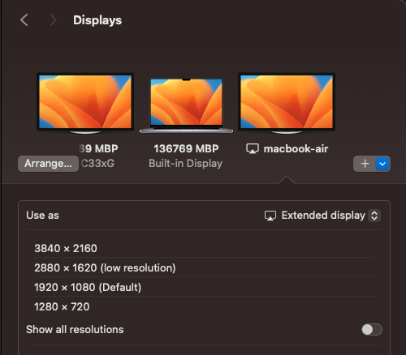

# Why do we need this?
Connecting a spare MacBook as an external display wirelessly can extend your workspace without the need for extra monitors. Of course you can connect a monitor as well as a wireless display. As per apple you can connect upto 2 monitors to a Macbook pro, while one to a Macbook air. The config depends on the model too. You need to checkout the specs for your model. 

Apple’s AirPlay technology is a straightforward way to use a second Mac as an external display, though options like Luna Display and Sidecar (for iPad) also exist. 

I accidentally stumbled upon this featuer and never realized that it could be possible. 

# Why a complete article on such a straight forward feature?
Because I wanted more information about this feature. What are the possibilities and what are the limitations. Was looking for a way to get the battery status of the connected device but sadly I wasn't able to find even one article about this. Thus creating a post to get some traction so that people can know more and maybe discuss more on the forums.

Apple itself somehow doesn't market this feature. Not sure why thoug. But here are a few helpful pages for related information.

* https://support.apple.com/en-in/guide/mac-help/mchl7c7ebe08/mac - Generic guide to connect multiple displays
* https://support.apple.com/en-in/guide/mac-help/use-your-ipad-as-a-second-display-mchlf3c6f7ae/15.0/mac/15.0 - Using ipad as external display
* https://www.airdroid.com/screen-mirror/macbook-as-second-monitor-for-pc/ - Use macbook as display for PC
* https://support.apple.com/en-in/guide/macbook-air/apd8cdd74f57/mac - Connecting external displays to macbook with cables
* https://www.reddit.com/r/macbookair/comments/109dlvy/adding_a_2nd_external_monitor_to_m1_mb_air_via/?rdt=56524 - At least someone mentioned airplay
* https://www.reddit.com/r/macbookair/comments/13o41ta/can_a_m2_air_output_to_a_monitor_and_an_ipad/ - Some more info about connecting 3 displays to macbook air
* https://www.reddit.com/r/macbookair/comments/1b2yopg/can_i_use_more_than_one_external_monitor_with_the/ - Someone asking a related question. Maybe I'll add my observations to this once I post this article

# Requirements

* Two compatible Mac devices running macOS Monterey or later.
* Wi-Fi network (both Macs should be on the same network).
* AirPlay (for native macOS screen sharing) or third-party software like Luna Display or Deskreen if using an older macOS version.

# Connection process

## Check for AirPlay Compatibility:
   * AirPlay Display on macOS Monterey or later allows one Mac to mirror or extend to another Mac screen.
   * Ensure both Macs are updated to Monterey or later.

## Connect the Two Macs:
   * Make sure both Macs are connected to the same Wi-Fi network and signed in with the same Apple ID.

## Initiate AirPlay Display:
   * On the primary Mac, click on the Control Center icon (top-right corner of the screen). 
   * Select Screen Mirroring. 
   * You should see the secondary Mac listed as an option. Click on it to start mirroring.
   * Alternatively you can goto display settings and there you should see a plus button. On clicking it your other mac should come as an option
   
   
## Connected
   Once its connected, you should see the external display as below

   
   
## Adjust Display Settings:
   * You can choose to either mirror your display or extend it. 
   * Of course mirroring is not what we are looking for, but thats also possible. The real value is in using the extended option.

## Set Resolution
   * Though the mac has retina display but somehow the supported resolution list is different than the native one. You need to try out which one suits you depending on the position of the mac and your requirement.
   * There are a few low resolution modes too, which may give better performance but doesn't look good. So you are better off trying a native one.
   * As per the [Macbook air specs](https://support.apple.com/en-us/111883), it has a 2560x1600 screen, but surprisingly you can select a 4k(3840x2160) resolution in the list and it works too. Though everything is way too small to be used, but it **works**. 
   
## Position and Arrange Displays:
   * In the Display settings, drag the virtual display icons to match your physical arrangement of the two Macs for smooth cursor movement between screens.
   * Try to match your physical layout. 
   * Try to minimize the gap between displays. If there is a gap then your mouse will not be able to pass through. And thats why you will see below that I have shifted the bottm display towards right so that it touches the other two.

   | Arrangement                               | Actual layout                                               |
   |-------------------------------------------|-------------------------------------------------------------|
   |  |  |

# Any issues?

## Lag
Since the connection is wireless, the display will feel a little laggy. Your mouse movement won't be fast enough. So if you are looking for a perfect responsive display, this may not be a good choice. But for my usecase its perfect. I got an extra screen to view the live logs.

Ensure both Macs are on a strong, stable Wi-Fi network. A dedicated, high-speed network (5GHz) can help minimize lag. Some users find third-party solutions like Luna Display more stable than AirPlay for this reason.

## Battery
On the secondary display since you will now be viewing your primary screen, so you won't be able to see the battery status of your seconday one. I tried but couldn't find a way to view the secondary's battery without disconnecting. So make sure that it charged enough or plugged in.

While I did this from a Macbook pro M1, but Im sure that similar extension is possible with Macbook air and other Macs. 

> End