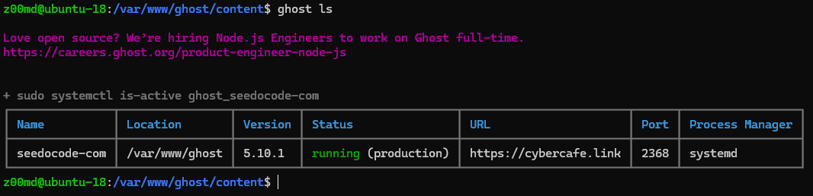
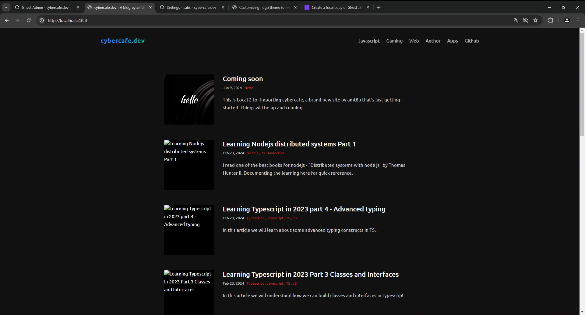
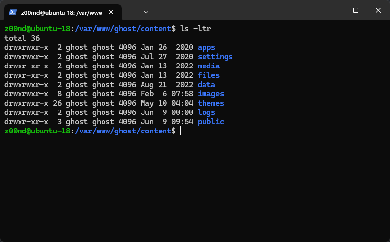
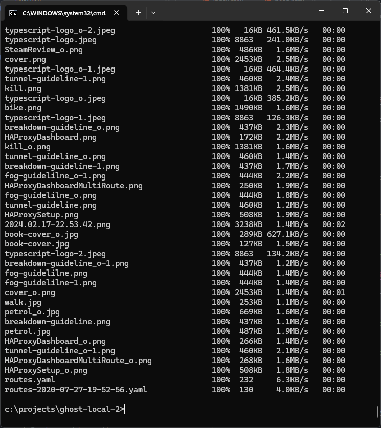
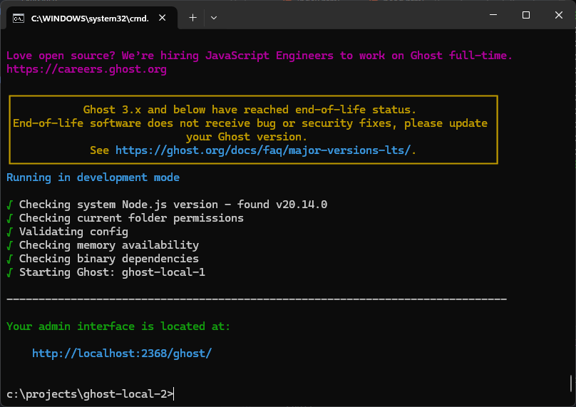
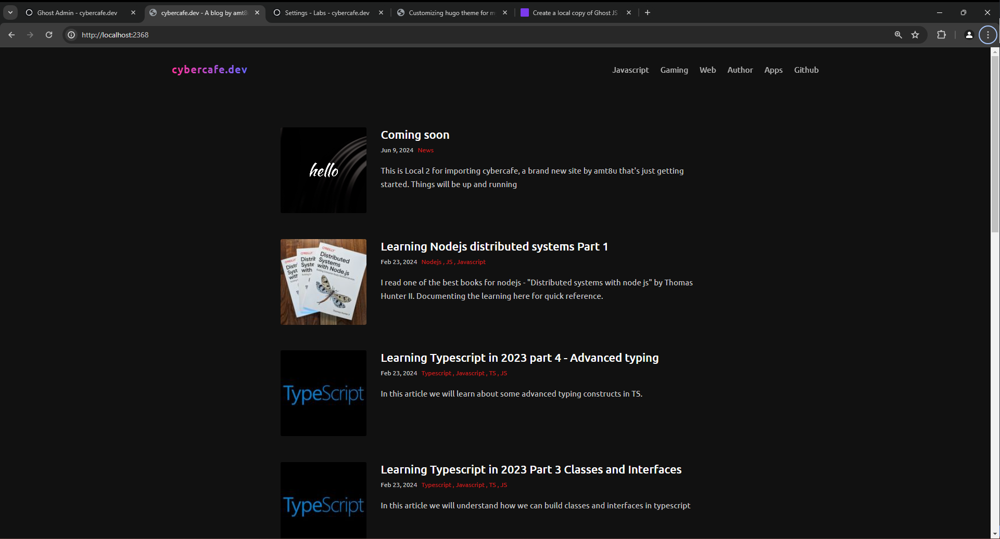
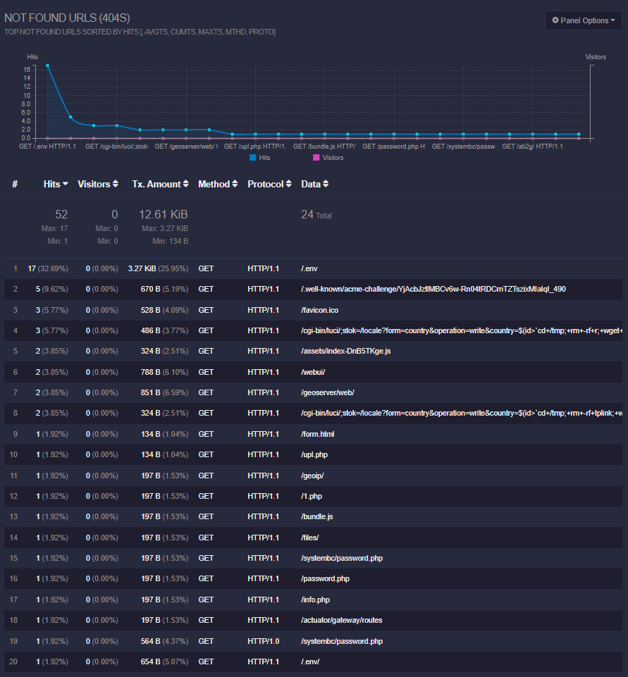

# Why to replicate?
Now that I have completely migrated my blog to Netlify, I no longer need the digital ocean droplet. Read more about [creating static site using hugo](/creating-a-static-site-with-hugo/).

However, in the future, if I need to refer to something from the original Ghost instance, I want to create a fully functional backup. This backup should be a complete copy of the existing site, including the **theme** and **images**.

While there is no direct way to achieve this yet, but following below steps may help you in creating a replica of your ghost instance.


# Install ghost locally
If you already have an existing version installed on local system, upgrade the ghost instance to the one which your production is using. Use `ghost ls` to checkout the instance version. 



And note that ghost version and ghost-cli versions are different. Do note that you will have to keep the versions same, otherwise strange things can happen. If not exactly, at least keep the major version same. 

Refer https://ghost.org/docs/install/local/ on how to install a fresh local instance of Ghostjs.

I already had 3.1 installed on my local so thought of trying the upgrade path. Apparently upgrading directly from `v3.1` to `v5` is not supported, and upgrading to `v3@latest` didn't work as supported node version was v12 or less and I had v20 of nodejs.

## Installing fresh instance
1. First upgrade your nodejs installation if not done yet. Then update ghost-cli using below command. Refer https://ghost.org/docs/ghost-cli/#ghost-update for more details.

    ```shell
    npm install -g ghost-cli@latest
    ```

2. Install a local version of ghostjs. Local install uses `sqllite` and thus you don't need to setup mysql.
    ```shell
    ghost install local
    ```

3. Start the server

    ```shell
    ghost start
    ```

Access the site on `localhost:2368`

# Copy production data

## Posts and tags

### Export
Goto your production admin page https://cybercafe.dev/ghost -> Import/Export. If its an older version, you will find it under Labs section.

Do an export which would Download all of your posts and settings in a single, glorious JSON file

### Import
Now goto your local site's admin page
`http://localhost:2368/ghost`

You will have to enter site title, and credentials to be used for admin page. Since its your local system, you can use any password.

Once you are in the admin panel, goto Import section. Select the downloaded file and restart ghost. Now you should see all your posts and pages.



You will find that images are missing, but that's how it is. Currently there is no easy way to export images https://forum.ghost.org/t/exporting-content-with-images/6169. Though there is a manual old fashioned way to do that.

## Images and themes
Ghost stores all the static content in the `/content` directory. 



## Using SCP
To copy all data from server to local system run below command. Replace `username` and `domain` with your values. 

```shell
scp -r username@domain:/var/www/ghost/content/ c:\projects\ghost-local-2\content\
```

It copied everything inside `/content` to `ghost-local-2\content\content`. Had to cut paste again, Perhaps you can use below to copy all from remote to current directory

```shell
scp -r username@hostname:/path/from/remote .
```




Once all the content is copied, restart ghost and see the magic.





# Backup a few things
Before completely destroying the droplet I wanted to keep some files for future references as I have done many experiments and learned many things on the same VPS. A few things that had to get were

* **Nginx config** - I experimented with nginx a lot on this server. Created an elastic server(though short lived), subdomain with basic authentication, local files served directly without any kind of server. It would be a good idea to keep a copy of all that.
* **Cron Config** - I added a simple tool to do basic analytics on the ghost logs. Read more about it on https://cybercafe.dev/setup-simple-analytics-for-ghost-blog-using-goaccess/. Had to learn cron for this. Wanted to keep a copy of it for reference as it was my first ever cron. It helped me understand how important is your security on any open server. Looking at the logs I could say that daily there were hundreds of attempts from attackers targetting the site for vulnerabilities.

    ```powershell
    sudo crontab -l
    16 0 * * * "/etc/letsencrypt"/acme.sh --cron --home "/etc/letsencrypt" > /dev/null
    */5 * * * * goaccess /var/log/nginx/access.log -o /var/www/static/report/index.html --log-format=COMBINED
    ```

Look at all the 404 URLs that I was recieving daily on the server. Looks like `php` is attacker's favorite framework :-P.



# Drop the droplet

Once your local copy is up and running, its time to pull the plug on the droplet. Turning off the droplet doesn't make sense as it still continues billing on the same rate which makes sense as resources are still reserved for you. It is time to say good bye to my first VPS.

# References

https://forum.ghost.org/t/proper-process-to-create-a-duplicate-local-site/33933

> End
