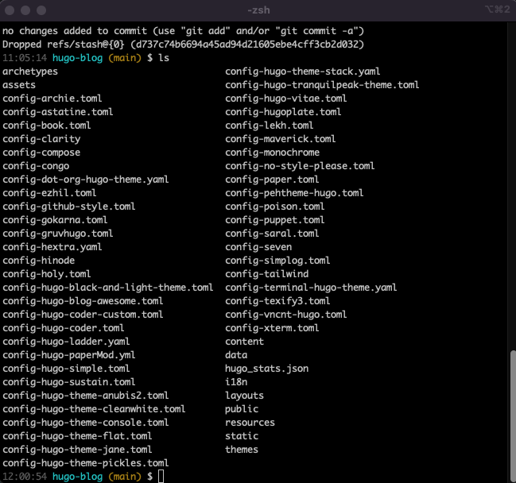
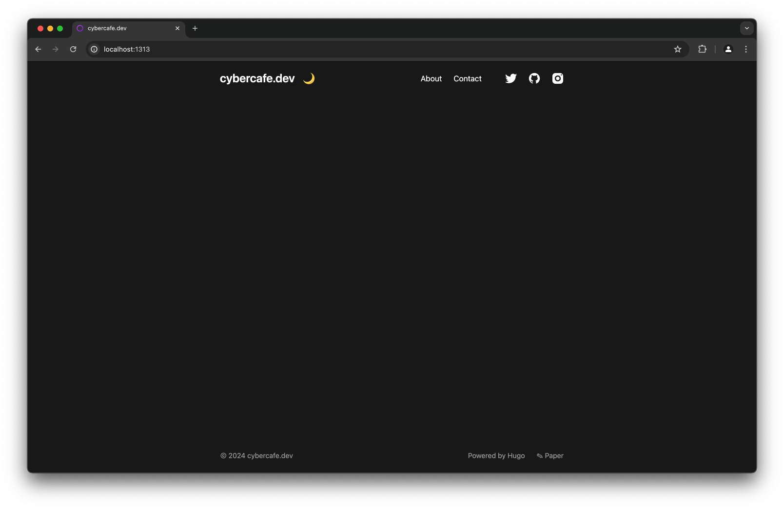
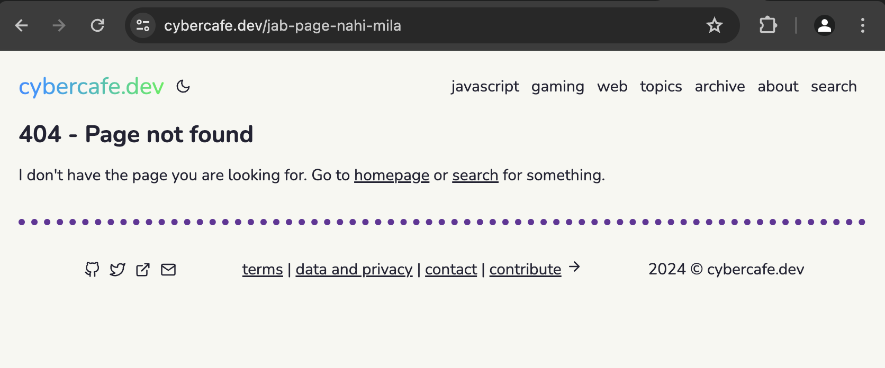

Before starting the setup process if you are interested, read [why I chose Hugo over GatsBy for my blog](/why-hugo-static-site-generator-for-blog/).

# Installation
Go through https://gohugo.io/installation/macos/.

There are two versions. The extended version provides support for webp images and other things. Better to install that.

On Mac you just need to install using brew

```bash
brew install hugo
```

Got one issue installing hugo while running terminal in rosetta.

```shell
Error: Cannot install under Rosetta 2 in ARM default prefix (/opt/homebrew)!
To rerun under ARM use:
    arch -arm64 brew install ...
To install under x86_64, install Homebrew into /usr/local.
```

Once installation is done, verify by checking hugo version

```shell
$ hugo version
hugo v0.125.6+extended darwin/arm64 BuildDate=2024-05-05T10:52:52Z VendorInfo=brew`
```

# Create new site

Use the hugo command to create a new site. It will set up the default directories.

```shell
$ hugo new site test-create
Congratulations! Your new Hugo site was created in /Users/amupadhyay/projects/learn-hugo/Exercise Files/test-create.

Just a few more steps...

1. Change the current directory to /Users/amt8u/projects/learn-hugo/Exercise Files/test-create.
2. Create or install a theme:
   - Create a new theme with the command "hugo new theme <THEMENAME>"
   - Or, install a theme from https://themes.gohugo.io/
3. Edit hugo.toml, setting the "theme" property to the theme name.
4. Create new content with the command "hugo new content <SECTIONNAME>/<FILENAME>.<FORMAT>".
5. Start the embedded web server with the command "hugo server --buildDrafts".

See documentation at https://gohugo.io/.
```

# Themes
There are many ways to add a theme to your site.

* Git submodule
* Hugo module
* Copy paste

Hugo module is the recommended approach, but I chose git submodule so that any change in the base theme can also be tracked. You can create forks of base theme and manage them independently.

You can also copy the templates to your root directory and that should also work.

Once you chose a theme, copy its link from the theme page by right clicking on the `Download` button or you can goto the github page and copy the repo url.
Add the theme as a submodule in your site. Do take care about the directories names, as removing the submodule is not as easy as adding.

```shell
$ git submodule add https://github.com/adityatelange/hugo-PaperMod themes/papermod
```

Your site root should already have a file `hugo.toml` or `config.toml`. `hugo.toml` is the latest naming convention. Both should work, but do note the difference. More details https://gohugo.io/getting-started/configuration/.

Generally every theme will have an `exampleSite` directory. It will contain an example(:-D) of site with some content as per the theme. There will be a config file. Copy it to your root directory or pick the items in the config file and paste them into your `hugo.toml`. You can actually use any file as a config file and start the server with custom files.

To test out multiple themes simultaneously, what I did was to create config files with theme names and got rid of the base `hugo.toml` just to avoid confusion.

My structure looks like this



# Server
There are two ways to start the server

* hugo server
* hugo

The first one starts a local dev server which watches all the files in your site. It reloads if there is a change detected. 

If you want to use a different theme, you just need to change the `theme` in hugo.toml. 

```
baseURL = "https://cybercafe.dev"
languageCode = "en-us"
title = "cybercafe.dev"
copyright = "© cybercafe.dev"
```

But since every theme had a different kind of configuration, I used below approach to start the server with custom theme

```shell
hugo server --config config-archie.toml
```

Occasionally, the live reload was not working. Maybe there is some caching that prevents it.

* On layout changes - On changing layout files, sometimes it won't reload the site. I have to close the server and restart
* On css change - You may need to clear browser cache, or just keep the dev tools open with `Disable cache` switched on
* On saving - Sometimes when I save and then make a change quickly and save again, it stops reloading. Maybe throttling the changes to prevent processing

There is an option `disableFastRender` which may work. Haven't tried it yet extensively.

You can mix and match configs, like `hugo --config a.toml, b.ymal, c.json`. And when your site becomes large enough, managing config in one file becomes complicated. You can divide the config into multiple files by creating a `config` directory and placing the files with same name as the top level config options.

Few common things that you would do after copying the config file from theme

* Edit title
* Edit social links like twitter, fb, insta etc.
* Remove some integrations like analytics, disqus etc. if not needed

Once the server starts up, you should see something like below

```shell
Watching for changes in /Users/amt8u/projects/learn-hugo/Exercise Files/test-create/{archetypes,assets,content,data,i18n,layouts,static,themes}
Watching for config changes in /Users/amt8u/projects/learn-hugo/Exercise Files/test-create/hugo.toml
Start building sites …
hugo v0.125.6+extended darwin/arm64 BuildDate=2024-05-05T10:52:52Z VendorInfo=brew


                   | EN
-------------------+-----
  Pages            |  8
  Paginator pages  |  0
  Non-page files   |  0
  Static files     | 14
  Processed images |  0
  Aliases          |  1
  Cleaned          |  0

Built in 36 ms
Environment: "development"
Serving pages from disk
Running in Fast Render Mode. For full rebuilds on change: hugo server --disableFastRender
Web Server is available at http://localhost:1313/ (bind address 127.0.0.1)
Press Ctrl+C to stop
```

And of course visiting `localhost:1313` on any browser should bring the site up.



If you have configured the theme correctly and created content in the required structure, you should see a perfectly working site including navigation etc.

In my case the content was in `posts` directory but that theme needed it to be inside `post` directly. Hence, no posts on the screen.

If you don't see anything or an empty page like this, checkout the `public` directory in your root. All the generated html go there, so in case your page is not there, it's a hugo issue and not a cache issue.

# Create pages

If you have existing markdown content, you may see that hugo is converting them to html pages automatically. And everytime you create/update a new `.md` file inside content directory, hugo converts it too. So its basically about creating or updating `.md` files.

But there is a small hugo utility which allows you to create new content using predefined templates which helps you create the `frontmatter`. Of course you can add frontmatter manually in the markdown, but with automatic way, its more convenient.

## Using archtypes

When you run this command, hugo creates a new file for you

```shell
hugo new post/hello-world.md
```

Archtypes are frontmatter templates. So instead of you writing frontmatter manually, you use templates. It makes it easy to add values. For e.g. you don't need to manually enter the full ISO string for date. It will do it for you. One more reason for the same is, if you have multiple people working on the same site, all will have consistent frontmatter.

By default, the page gets created as a draft. There is a flag in the frontmatter which specifies whether that page is ready to publish. So when you run your hugo server, it skips the pages which are draft. And in case you want to see the draft pages as well, you can use the flag `-D` while starting the server.

Visit https://gohugo.io/content-management/front-matter/ to see what all frontmatter can do. Do note that frontmatter is supported in yaml, toml and json.

| Format | symbol |
|--------|--------|
| yaml   | - - -  |
| toml   | +++    |
| json   | {}     |

## Frontmatter

This was something that I wasn't aware of up until I started learning Gatsby and Hugo. In the CMS world like ghostjs or WordPress, you embed the metadata to your article via their UI. This metadata gets stored in the DB with your article's content. But in Markdown where will you store that? Things like `tags`, `excerpt`, feature image, `slug`, date of publishing etc. All this info goes into Frontmatter. Not sure why its named as such. We can always call it markdown metadata.

This was one of the time taking task, but again it's a one time job and going forward I will always be adding it with new articles. For example the frontmatter for this post is below.

When I was writing my posts on GhostJs, I used to keep the excerpt as the first heading inside the markdown file. I was moving into the right direction but didn't think that there was an existing solution for this problem.

`Frontmatter` is not included in the generated content. I might have realized it late, but it is quite popular and almost all static site generators support it. So basically you are storing page's information like `author`, `tags`, `url`, `createdAt` etc. in the page itself.

```markdown
---
title: Creating a static site with hugo
slug: creating-a-static-site-with-hugo
date: 2024-05-17
summary: Why I chose hugo and what all I did to 
convert my ghostjs website to a static website
---
```


Since it's not a Database, you can always mess it up, so be sure to properly check the key and values. For e.g. missing a `created` date may result in page with a different date. It depends on how you are consuming the values in the templates.

A quick example of frontmatter from one of my posts

```markdown
---
title : Forward emails from custom domain to gmail
url : forward-emails-from-custom-domain-to-gmail
description : How to forward emails sent to your custom domain to your gmail
date : 2024-05-25
lastmod: 2024-05-25
draft : false
images: ['images/email-icon.jpg']
thumbnail: images/email-icon.jpg
tags : ['web', 'email']
---
```

## Static pages

Perhaps it should be called singular pages since we are using `static` for other type of content. [See below](#static-content) Use `hugo new about.md` to create a static page. Static pages are the ones that are not part of the blog articles. Generally **About**, **Company**, **Terms**, **Contact us** fall in this category.

## Static content

Static content and static pages are different. Static content means files such as images, pdfs, videos or anything that you don't want Hugo to process, but to make it available in the published version as it is. You can even create a html page in static content. 

Once you copy any required files to the static directory, those are available everywhere on the site. In the config you can use it where needed like

```toml
[params]
    site_author = "Batman"
    site_description = "The joker chronicles"
    avatar = "img/batman.png"
    header_background = "image/joker-max.jpg"
```

You can also use them in your markdown pages by referring them using the regular markdown links

```markdown

```


## 404 page

When user lands on a URL for which there is no page, users will see `404` Not found. Some themes may have a `404` page by default. You can update it if needed.

Else you can create your own custom page. In the `layouts` directory create a new template `404.html`. Add whatever content you would like. you can add the navigation header and footer so even 404 page will look good.

```html
<!DOCTYPE html>
<html>
	{{ partial "header.html" . }}
	<body>
		<div class="content">
			{{ partial "head.html" . }}
			<main>
                <h1>404 - Page not found</h1>
				<p>I don't have the page you are looking for. 
					Go to <a href="/">homepage</a> or 
					<a href="/search">search</a> for something.</p>
			</main>
			{{ partial "footer.html" . }}
		</div>

	</body>
</html>
```
So when someone lands up on a non-existing link, they will see the below page



# Deploy
So when you think your site is ready, you deploy right!

Well, in simple words, `deploy` means copying the generated html pages and putting it on a `server` accessible on the internet. Its upto you, where to deploy.

Of course with popular frameworks you get convenient ways to do that. There are several [platforms that hugo supports](https://gohugo.io/categories/hosting-and-deployment/).

Since I was already familiar with Netlify and have a few other sites deployed on it, it was the best option. Refer [hosting-on-netlify](https://gohugo.io/hosting-and-deployment/hosting-on-netlify/) for complete details. The crux is 

1. Create a netlify account
2. Create a netlify site
3. Add your github repo to your netlify site
4. Now push your changes, and see action!

The 4th step is what makes this process special. When you have a connected repository, you don't need to do anything to deploy. Github will notify netlify that repo has changed, build your site. Netlify will run the build and put the generated html to the publicly accessible place for you automatically.

That means once the setup is done, your workflow for content creation is

1. Create or Update a markdown file in your repo locally
2. Commit and push the change to repository

And that's it. No logging in to your site cPanel and start a deployment process.

Just to give more insight, the build process is actually happening on the Netlify's server. You don't have direct access to it, but internally Netlify allocates space, installs the required `hugo` version and any dependencies. Netlify also tries to [detect the framework automatically](https://docs.netlify.com/frameworks/hugo/#automatic-framework-detection) and set up a few basic commands like `hugo`. 

* Build command: `hugo`
* Publish directory: `public`

Do note that there is a small catch related to `themes`.

> Hugo themes work by default on Netlify. Like any continuous integration system, however, Netlify can’t use a theme installed by the git clone method. Instead, you should install a Hugo theme for your site as a git submodule.

# A few more steps

Since I already have all the content in markdown in one repository, just to be on the safer side, I thought to duplicate it first and then start the whole hugo process in that. To my surprise, duplicating a repo is not as easy as I thought.

## Copy repository

You need to follow https://docs.github.com/en/repositories/creating-and-managing-repositories/duplicating-a-repository to create a clone of your repo in your account.

* First clone the original one

```
git clone --bare https://github.com/amt8u/blog.git
```

* Then push to new repo
```
git push --mirror https://github.com/amt8u/hugo-blog.git
```

## Copy content

All my markdown posts were plain `.md` files directly in the repo. I had to move all of them to a new folder `content` which is fine, but I had to create a directory for each post as well. Somehow files present in the `posts` directory are not processed properly. Was getting issues in the URLs - All the post urls were generating as `localhost:1313/posts/some-article`. Had to rename the file to `index.md`. Once that is done, pages were generating with all proper urls - `localhost:1313/some-article`.

Since my blog was already indexed, I wanted to keep the URLs intact for each post. For achieving that you have couple of options

* Directory names - Keep the names of the directory exactly the same as the URL that you want
* `url` in frontmatter - Add a property in frontmatter. This overrides the default directory based url

## Copy images
Most of the themes were using images from `static` folder which was easy, but I didn't want my images to be separate from my content. I wanted to have a structure like below. And when you use an image inside your md file like ``, hugo will process it.

```yaml
root/
	content/
		posts/
			creating-html-using-css/
				index.md
				images/
```

For **Feature images** I had one issue though. I wanted to show a thumbnail for each post on the listing page. Tried to check but not many themes were doing this. Maybe it's not a good idea to load images for your list page. It will slow down the rendering and in case you are using images from outside, it may not work.

I will be keeping my images in the repo and will use those. Though there are image processing plugins available in hugo to create compressed versions, for now I am just manually creating small images to be used for thumbnails.

Images inside content are considered as resources. While compilation, the contents inside single post makes up a page bundle. For adding a thumbnail or even a feature image, you have to locate it in the page bundle and create an url for it.

See [More details on](/customizing-hugo-theme-for-blog/#feature--thumbnail-image) for more details.

## Theme related issues

Though it's quite easy to install a theme, but there are few things to keep in mind

All themes go inside `/themes` directory. Whenever you clone or add a git submodule, keep this in mind. I accidentally added the theme as submodule in the root of my site. Once the submodule is added, it is [not that easy to remove](https://stackoverflow.com/questions/1260748/how-do-i-remove-a-submodule/36593218#36593218). 

```shell
git submodule deinit -f hugo-paper
rm -rf .git/modules/hugo-paper
git rm -f hugo-paper
```

And then reinstall in the correct folder. Either `cd` into the folder or you can also pass the directory in the command directly

```shell
git submodule add https://github.com/nanxiaobei/hugo-paper themes/hugo-paper
```

This was all about the initial steps taken to create a hugo blog using my existing content. Next step [Customizations](/customizing-hugo-theme-for-blog/).

> End