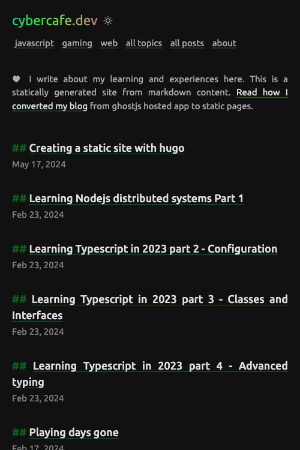

# Why?

[Ghostjs](https://ghostjs.org) is a good platform for bloggers. The advantage for me was that it uses handlebar templates to render pages as it was getting difficult for me to learn php just to host pages. Plus it provided a clean and secure option (unlike WordPress) and I can write content in Markdown. 

| cybercafe.dev                                                                              | New site                                                                                                 |
|--------------------------------------------------------------------------------------------|----------------------------------------------------------------------------------------------------------|
|                                                |                                           |
|  |  |

But anyway spending 5$ a month for a few static pages doesn't make much sense when you have better alternatives. One popular option was GitHub pages, but somehow I couldn't continue with Jekyll. Installing ruby is so much pain as described [here](https://www.moncefbelyamani.com/how-to-install-xcode-homebrew-git-rvm-ruby-on-mac/#step-1-install-homebrew-and-the-command-line-tools). There is even a [dedicated paid automation](https://www.rubyonmac.dev/?utm_campaign=install-ruby-guide) to get ruby installed.

## My requirements in order of priority
* **Write in markdown** - Ever since I started writing Markdown, no other format made sense to me. Even if you don't do markdown to html conversion, the raw text itself is readable. It frees you from platform dependent features. If you want to switch from `Ghostjs` to `WordPress`, you don't need to worry about losing embedded links etc. Just copy the text.
* **Platform-agnostic** - In some platforms, even if you are using Markdown, there may be cases where some flavour of it is not supported. If you are using features like image gallery in ghostjs, you won't be easily able to replicate it in other systems. I wanted to have my content completely `isolated` from the hosting and deployment perspective.
* **Auto deploy on push** - With Ghostjs, I had to go the admin UI, write the article, copy and paste images, update several meta details and then publish. For even a small change same process again. To my surprise their posts page doesn't even have "search". You have to manually scroll and find for your published post. Since my main source of articles is the GitHub repo, I had to do multiple things. Sometimes I forget to commit the article, sometimes the content is not in sync with the deployed site. But that is fixed with providers like `Netlify` and `Vercel`. Thanks to GitHub actions workflow, I have to just commit and push my changes. The site gets auto build(Markdown to html) and deployed.
* **Content to be stored in GitHub repo** - Again, didn't want myself tied to any system and also keep an easily accessible backup for all the content, best choice for now is `GitHub`.
* **Write anywhere** - With systems such as WordPress and GhostJS, you have to write in their respective `editors` which maybe fine for some people. My requirement was that I should be able to write anywhere on any system and should not be dependent on internet.
* **Minimum cost** - Self hosted ghostjs instance costs a minimum of 5$ a month and [Ghostjs cloud pricing](https://ghost.org/pricing/) is a little on the steeper side. Having a VPS for a few static pages doesn't make much sense. Yes, the platform has features that will be difficult to integrate with static sites, but I am not going to use them. With platforms like `Netlify` which provide unlimited static sites for `free`, it makes a very good deal. Of course, you will lose a few functions here and there.

## Best static site generator for `Markdown`.
So I started looking out for the best SSG which I can quickly use. I already have my posts in Markdown format. I should be able to plug in the generator and go.

It turns out that it's not that trivial. Of course generating html from content is straight forward, but I wanted to have it `organized` as I can so that it would be easier in future to `migrate` or to add posts and pages.

A popular place to find out all the generators is https://jamstack.org/generators/ But when you have 355 options, choice becomes more difficult.

Having React experience and good knowledge of Javascript, I put my bet on [GatsbyJS](http://gatsbyjs.org/). But after completing a quick crash course I realized its not really what I was looking for. You have to first learn `graphql` and then understand how to create optimized queries to be used in the pages. Plus every gatsby theme is different and expects content to be in different structure. I did not want my content to be based on framework so that in case tomorrow I want to switch, I should not be updating my markdown content.

Just to create a template I have to create a React application with properly structured components, created optimized graphql queries, understand various plugins like images, use a css system like css-modules etc. In the end I felt it was too much work, better lookout for alternative. And not to mention the terrible Gatsby [caching issues](https://stackoverflow.com/questions/61535548/need-to-gatsby-clean-with-essentially-every-code-change). I myself faced this multiple times while building simple components.

The next popular option was [Hugo](https://gohugo.io). Did a crash course for hugo as well from [LinkedIn](https://www.linkedin.com/learning/learning-static-site-building-with-hugo-2/), but it wasn't enough to understand the nitty gritties. It was more of a getting started kind of thing. 

# Why Hugo?

Here are a few things that made me like Hugo
* **Speed** - I never thought any dev application with live reload can be so much fast. You change your content, it reloads, you change your css, it reloads. But yes, sometimes you have to stop and restart the server, but once you have the setup running, it is quite fast. In fact right now I am using the dev server to see a live preview of my article. It actually shows how it will look in the browser.
* **Dependencies** - The only dependencies for hugo are git, go and Dart Sass. Refer https://gohugo.io/installation/macos/#prerequisites. You don't need to npm install, npm update, npm list, npm last, npm lost, npm aaaaahhhh. 
* **Themes** - Eventually I end up creating my own theme, but to start with, you need to refer existing code. Especially when you don't have experience in `Go`. With so many themes available, it becomes easier to refer existing code. https://themes.gohugo.io is a good place to get a feel of what Hugo can generate. I tried almost all the themes on my local setup to see which one is the best(best as in fills all my reqs). At last, I ended up with [Archie theme](https://themes.gohugo.io/themes/archie/) which was not perfect but had all the basic things I wanted
  * Simple layouts
  * Simple config
  * No complicated processing
  * No npm dependencies
  * Dark mode toggle(Although it wasn't mentioned in the theme docs, but I found it in the code)
  * No sass, just plain simple css
  * No integration bloatware
  * Responsive
  * Had a programmer feel to it
  * Syntax highlighting for code with support for multiple styles(More on that later)

I had to tweak many things to make it fit my needs.

# Inspiration
It is really difficult to find genuine content nowadays. Everyone wants to make their site a place to earn. Google search and even DuckDuckGo don't search for what you are looking for. They provide you content for what they are getting money for, which is fair enough as I am not paying for using them. But because of this the objective of every website owner turns towards pushing the page to be at the top of the search. And with all the [irritating Google Ads](https://cybercafe.dev/my-experience-with-google-ads/), the whole experience becomes messy. While learning Gatsby and Hugo, I tumbled upon https://512kb.club and went through many entries on this list. I found a lot of sites, mostly blogs with genuinely good content without any bloat. I also saw some cool designs. I discovered that there is a specific term `small web` for these sites where you get real content and not commercial oriented bloat.

* Coder theme  - https://qtrnn.io/2020/10/04/hello-world/
* Plain and simple - https://nih.ar
* Dark and simple - https://www.stchris.net
* Retro look - https://devcara.com
* Best ***ing website - https://bestmotherfucking.website/
* Terminal style - https://gaikanomer9.com
* Small web - https://erikjohannes.no/posts/20231122-places-to-discover-the-small-web/
* Another small web catalog - https://blogs.hn
* Interesting reads - https://nikhilism.com/post/
* Something what I also do - https://jasonthai.me/blog/2019/07/18/changes-i-made-for-my-blogs-theme/

# Enhancements done

## Toggle-able dark theme

Most of the available themes were either dark or based on `prefers-color-scheme` property. I wanted to have the functionality to let the user choose. Sometimes the user want to see the site with light colors and if we don't give that override, the only way is to change the system setting which is of course a tedious task. I believe the `prefers-color-scheme` should be taken as a hint that user desires for dark theme, but there should always be an option to override.

There are may ways to achieve this. A great starting point is https://css-tricks.com/a-complete-guide-to-dark-mode-on-the-web/ though ironically I did not see dark mode on csstricks.com :-D. Since the theme I was using(archie) already had this(though undocumented), I used that approach - "Load the dark theme stylesheet on demand". 

First load the dark theme if user has `prefers-color-scheme` set to dark. This can be done in `header.html`.
```html
{{- if or (eq .Site.Params.mode "auto") (eq .Site.Params.mode "dark") (eq .Site.Params.mode "toggle") -}}
    {{ $darkstyle := resources.Get "css/dark.css" | fingerprint }}
    <link id="darkModeStyle" rel="stylesheet" type="text/css" href="{{ $darkstyle.Permalink }}" {{ if eq .Site.Params.mode "auto" }}media="(prefers-color-scheme: dark)"{{ end }} {{ if eq .Site.Params.mode "toggle" }}disabled{{ end }} />
{{ end }}
```

And when user clicks on the toggle button, add or remove the dark theme stylesheet from DOM via js. Create a file in `static/js` directory. eg. `themetoggle.js`.
```js
if (mode === "dark") {
    document.getElementById("darkModeStyle").true = false;
}
```

Since it's a static site, there is no easy way to store the user setting on the server, you can use `localStorage` to remember the setting on the system
```js
localStorage.setItem("theme-storage", mode);
```

## Ultra wide mode

I know that there is an [optimum width for pages which contain text](https://ux.stackexchange.com/questions/108801/what-is-the-best-number-of-paragraph-width-for-readability). But still sometimes I feel it's a wastage of space when you can utilize the same. It becomes more apparent when there is some content which makes it difficult to read with a limited width. And one of such is `code blocks`. M blog is focused on technology and is code heavy. The issue is that code is not wrapped like regular text. Lines are rendered as it is. And when a line is too long to fit in, a horizontal `scroll bar` comes up which looks really terrible, and also you have to now manually scroll the code block to see the long lines.

Inspired from widgets in jira where you can quickly maximize a particular widget, so that it spans across the whole width of the viewport, I implemented a similar solution. Added a maximize button that you can see in the top right corner. On clicking of which the `max-width` changes to `95%`. Why 95? Because I wanted to keep that button always in view by making its position fixed. A little bit of space had to be reserved for it so that it doesn't overlap the main text.

And just like how I am using `localStorage` to store the theme preference, I am storing this ultra-wide setting as well. So even after page refresh you get the same view. One caveat with this was that on mobile it doesn't make sense as you will never have viewport with width greater than 600, so I hid the toggle button on smaller devices.

And since it's just a CSS change without any javascript, it is as fast as lightning. No reloading of content and no flashes of default style.

## Responsive
Responsive design is not easy to implement. You can say that you have to design your page for various devices. So to support 4 ranges for devices you will have to come up with 4 different designs which in turn means 4 different css files based on width of the viewport.

Though thats the hard truth, but with simple pages having just text and images, you actually do not have to manually think of responsive elements. Responsiveness is baked in browsers since decades. Just put some text and resize the window. You will realize that text automatically rearranges itself. For images you will have to set a `width` and it also resizes itself based on viewport size.

And for the cases where it is not sufficient, we have the flex layout. It a little complicated with so many properties but with the dev tools helper buttons, it has become really easy to work with.

With options like `flex-wrap` and `justify-content` you can easily achieve responsive layout. Open devtools in responsive layout mode and try resizing the window from maximum to minimum. You will see that this website is readable even with a width of `100px`. And with the `fullWidth` option, you will appreciate your ultrawide monitor too.

## Zoomable images
One common issue I face with many blogs and simple websites is the lack of image handling. Someone did a great job and put a screenshot of the full window on the page, but there is no way to zoom in the image. You have to manually right-click on it, open in new tab and then view it properly. I understand that I should not target my blog as an image hosting system. For images there are `flicker`, `Unsplash` and many more. You can always link to them. Even you can embed images using these services directly into your page. 

But there is a big problem with that approach. `Cross site content` is not reliable. Many companies restrict network traffic and popular sites like `Unsplash`, `YouTube` are blocked. Plus cross site embeds make your pages heavy. A simple example is `disqus` commenting system. Once you add it to your site, it starts [making requests to third party ad services](https://cybercafe.dev/ghost-casper-theme-customizations/#disqusalternative). And that's why I migrated towards Hyvortalk(which also is not currently working due to exceeding limits). Fortunately markdown handles images well. I can easily include the image in the markdown file. It shows up correctly in GitHub and also gets rendered into the generated html without url hacks. No more fidling with image storage. One downside though is my deployed size becomes large which is fine as I won't be adding thousands of images. Maybe around 4-5 per article.

Earlier I used a library https://github.com/francoischalifour/medium-zoom to enable users to click on any image and zoom in context. It has some great features like auto zoom out on scroll and use responsive images for zoomed items. But I wanted to keep my blog free from libraries. A quick workaround I found is to convert the images into links so that on clicking on it, the user can see a full size version of it. And if needed, you can use the browser's zoom feature to enlarge it. The downside being that you navigate out of the article. But then a simple back button takes you back to the exact place you were on. Moreover by giving the fullwidth toggle, you can always zoom in images on the spot and toggle back to narrow mode to view text.

## Box shadow on images
If you look closely, there is a small shadow on all the images which makes it feel like the images are on top of the page. It's just a visual gimmick but looks good. You can go [too much creative](https://getcssscan.com/css-box-shadow-examples) in that direction, but I just wanted a plain simple shadow just to avoid the flat look. And you can also apply a border to create a frame kind of look. But that was becoming too cheesy so I commented it out. As always do remember to use `box-sizing` to avoid alignment issues coming out of padding and margins. You can read more about it [here](https://developer.mozilla.org/en-US/docs/Web/CSS/box-sizing).

```css
article img {
    /* border: 2px ridge #151515; */
    width: 100%;
    box-sizing: border-box;
    box-shadow: rgba(0, 0, 0, 0.45) 0px 5px 15px;
}
```

## Table of contents
Sometimes I feel a quick index of the contents makes it really easy to find the relevant paragraph. I can see that hugo also renders a TOC and some themes do utilize it. There is no TOC with the current theme, but it can easily be achieved with hugo. It's a `TODO` item on the list. 

## Tags
Tags are very commonly used to group content and almost all CMS provide this capability. Hugo also has its in built. The theme already had the template, I just made a few visual changes so that it looks better.

## Frontmatter
This was something that I wasn't aware of up until I started learning Gatsby and Hugo. In the CMS world like ghostjs or WordPress, you embed the metadata to your article via their UI. This metadata gets stored in the DB with your article's content. But in Markdown where will you store that? Things like `tags`, `excerpt`, feature image, `slug`, date of publishing etc. All this info goes into Frontmatter. Not sure why its named as such. We can always call it markdown metadata.

This was one of the time taking task, but again it's a one time job and going forward I will always be adding it with new articles. For example the frontmatter for this post is below.

```markdown
---
title: Creating a static site with hugo
slug: creating-a-static-site-with-hugo
date: 2024-05-17
summary: Why I chose hugo and what all I did to convert my ghostjs website to a static website
---
```

## Blazing fast
And at last, I wanted the website to be not just superfast but blazing fast. I am not doing anything complicated. Everything is just plain simple text and images. I don't need to show rich content. I can just put up links and let the relevant platform render the content. Moreover, I myself hate inline content. I almost never play a YouTube video embedded inside another site. I open it up in a YouTube in a new window where I can use all the features that YouTube provides. Similarly for other content links are sufficient.


## Lighthouse score
Again, it is not necessary to have 100/100 in lighthouse score. But it certainly is a good tool to find out where all you can do the optimizations. Saving 200ms may not be a great deal here, but you get to see various techniques. I consider my blog a place to experiment and learn. Initial impressions looks good. But I see many areas of improvement. [Detailed snapshot ](/docs/amt8u-hugo-blog-netlify_initial_impressions.pdf) of lighthouse evaluation on 18 May 2024. Will implement the recommended changes as and when I get time.

 

> End