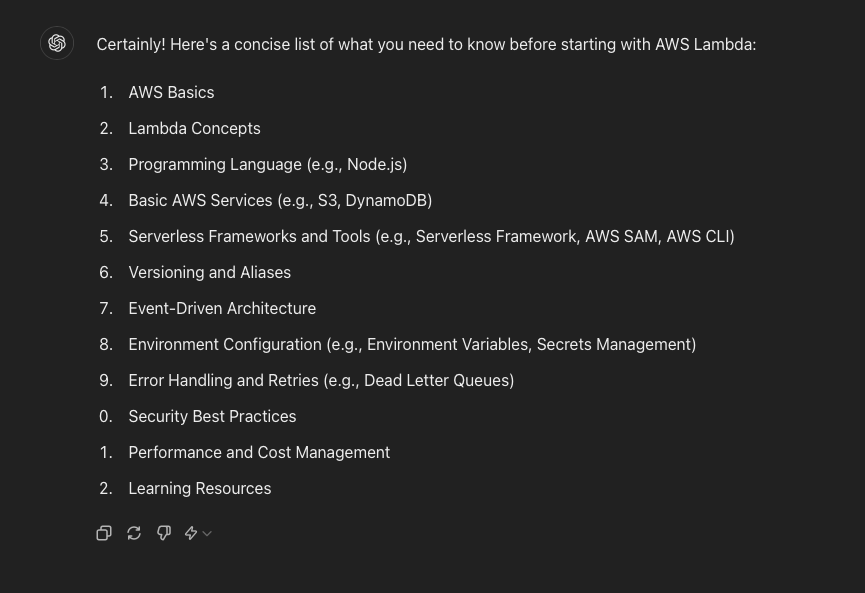
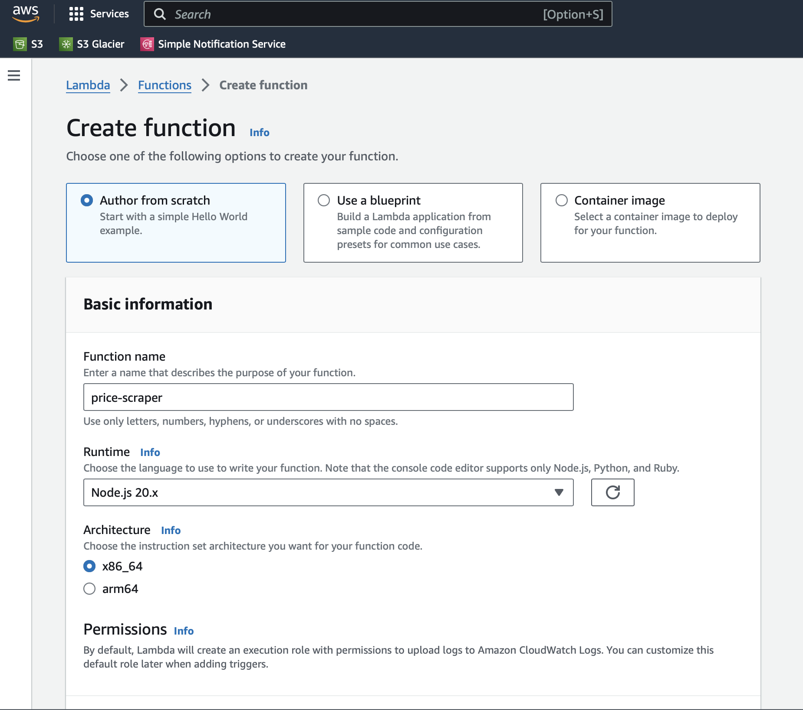
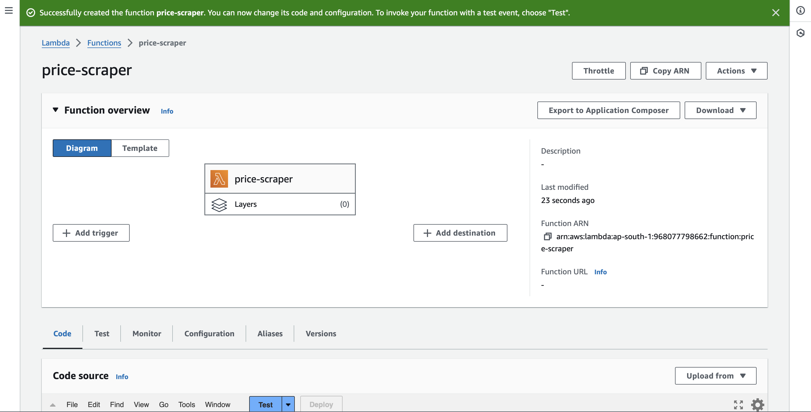
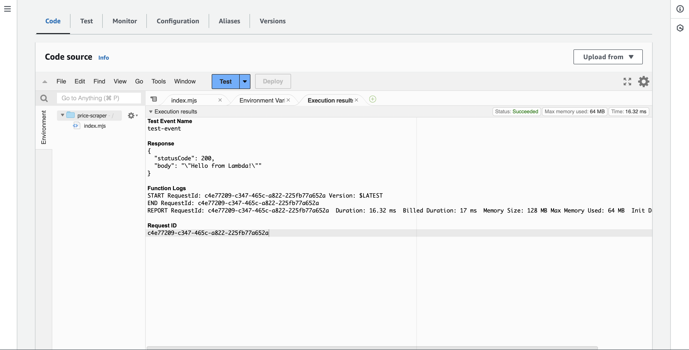
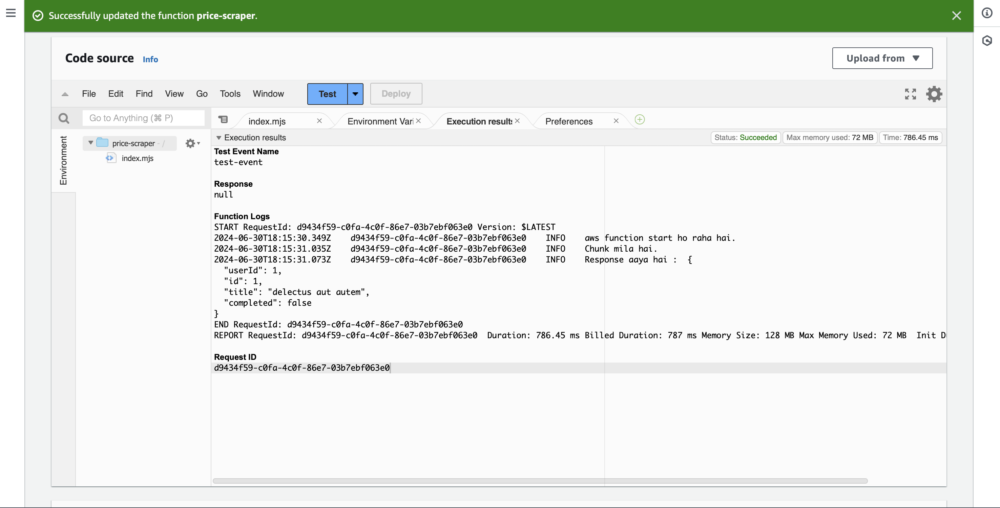
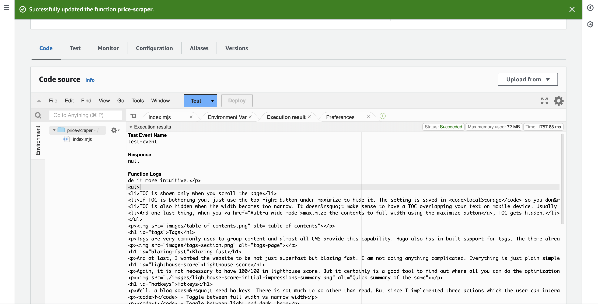
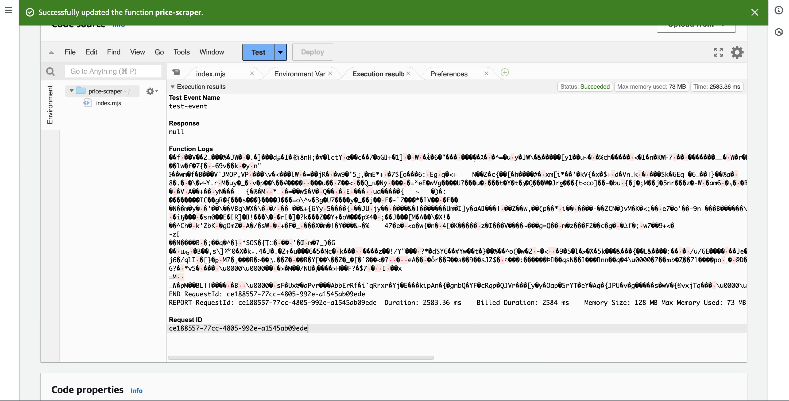
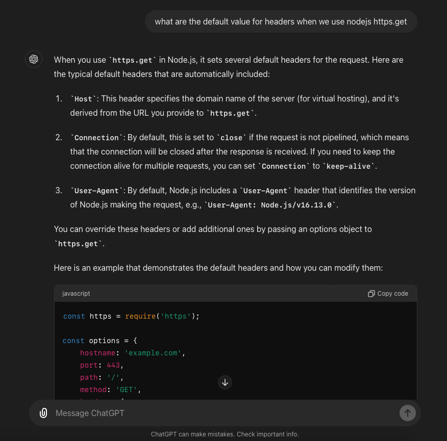

# Why another article on such a common thing?
There are numerous articles about creating lambda, why am I writing one again? All the ones are mostly about creating `hello world`. In a **real** world application no one does "hello"[or maybe they do](https://tls12.xargs.org/#client-hello) 😎. 

Let's create a very basic web **scraping** tool using lambda functions. 

# What you need to know before starting lambda?
As per ChatGpt, you just need to know about  😋.  



But I think you can start building lambdas if you

* Understand what actually a function is. Not the regular `function` in programming, but AWS concept of a function.
* Understand runtimes. 

That's it. Rest it will depend on your experience, how familiar you are with application development.

# What is AWS Lambda?

In a nutshell, AWS is the cloud and lambda is one of the drops of water in the cloud 😀.

AWS named this service "Lambda" with the idea of emphasizing its function as a small, single-purpose, serverless compute service. The term "Lambda" in computing and mathematics often refers to a small, single-entity function or operation. Keeping aside all the above jargon and AWS terminology away for some time. 

> **Lambda** is a service from **AWS** to run your custom code without creating a webserver. 

The whole idea of a web server was to have a computer where you can run your code on demand. The code could be using any technology like nodejs, php, java etc.  Traditionally, to run your custom code, you had to create a VPS or use a hosting service from various service providers. In case of complex requirements it was always a VM. And to connect with the VM, you create a web server running inside the VM which connects it to the outside world. So eventually your frontend will call the apis exposed by this server. 

Of course, you can just provision one VM with a large capacity and deploy thousands of servers on it. And you can still achieve scalability, then what's the point of AWS Lambda service?

The reason is **cost**. Yup that's it. It is always about cost. Whatever the internet says _Scalability_, _agility_, _fault tolerance_ etc. all these can be achieved with regular VMs too. It just becomes costly. Every service on AWS is about saving cost. Instead of provisioning multiple VMs, you provision only what you need and pay for the time the service is being used. Kind of a win-win situation for both AWS and us as customers of AWS. The downside is - you have to learn their services and how to optimize your application to utilize them as efficiently as you can. Just a thing to keep in mind - It may sound that using AWS will always be cheaper, but you have to be very careful, otherwise [you can endup with a heavy bill](https://www.reddit.com/r/aws/comments/lbqcos/my_forgotten_account_has_a_20000_bill_how_screwed/).

# Create function
## Create
Login to AWS, search for "Lambda". Lookout for **Create function** button. Click on it and you should see some options. Depending on when you are reading this, the options may differ. But basically its about creating from scratch or using a template.

* Function name - Give a description name. Please do not use names like `myFunctionName` or "myFunction". It becomes difficult to troubleshoot when you are debugging and also doesn't help when you have many functions. For our use case you can name "Scrape amazon products" or something like this.
* Runtime - At this point in time, the console UI only supports `nodejs`, `python` and `ruby`, but I suppose with time there will be more languages. With cli though you can use any of your favorite programming language. I chose `nodejs` since [I don't know JS](https://cybercafe.dev/book-review-you-dont-know-js-yet/) 😉.
* Architecture - You don't need to worry about this when starting with Lambda. Just be aware that while ARM64 is cheaper, if your code relies on specific processor features, you should choose the appropriate option accordingly.

* Execution role - Every service in AWS needs some kind of role. If you don't have a predefined role which you think will be suitable for lambda, you can just select "Create new role with basic lambda permissions".
* Advanced settings - There are a few things which you don't need to do, but once you are done with our sample application, you may come back here to set these too.




Wait for a few seconds and your function should be succesfully created. As you can see it says "you can invoke your function using Test feature". If you click on Test, then it will open a new window to configure an **Event** first.  Just give some name to the event and save.



## Code
By default, AWS autopopulates the code window with below code

```js
export const handler = async (event) => {
  // TODO implement
  const response = {
    statusCode: 200,
    body: JSON.stringify('Hello from Lambda!'),
  };
  return response;
};
```

Use the `Test` button to run this function. You will see that it will execute with the event that you saved earlier. As of now, we are not passing any data from the event and we are not doing anything in the function other than just logging a fake response to the console.



Few tips before starting the actual coding

* **.mjs** - If you want to use ES `import/export`, save the file as `mjs` which is a synonym for `ESM` which means Ecmascript Module. Nodejs supports `cjs` which is the older way using `require` to import code as well as `mjs` which is the latest way to create modules. 
* **Errors** - Since the default code is very basic and does nothing, you may not get errors, but as soon as you start writing actual code, you will start getting errors and somehow the console output only logs nodejs lines. So a quick advice is to first test your code locally and then run in the aws console.
* **Libraries** - At first I didn't give much thought to it, but when I tried to use a third party library from npm, I realized its not that easy. There are a couple of ways to do that, but both needs some effort to setup. We shall in a moment.
* **Maximize view** - There is a small maximize button which expands the code window including the tabs. Super useful when you are writing and testing code.
* **Save** - The code gets saved automatically and you don't need to hit that `Ctrl+S` every time you type a character. 
* **Deploy** - It took me half an hour to realize, you need to deploy to update your function in the background. It does auto save, but until you don't deploy, your function will run with previously deployed definition. It does say "Changes not deployed" but usually on other platforms you can test without deploying and that's what I thought ite meant.
* **Publish** - Use this to create versions for your function. 
* **Timeout** - If you are getting "Task timed out in 3 sec", just change the timeout setting under configuration

### Http request
Let's create a base function which performs a http call and returns the response. Obviously you would want to process and store the response. We shall see that later, but for now lets just call the url.

Update your handler code with below code. At this point you can use a placeholder api like https://jsonplaceholder.typicode.com to bring in some data from internet. 

```js
import * as https from 'node:https';
export const handler = (event, context, callback) => {
    console.log("aws function start ho raha hai.");

    const req = https.get("https://jsonplaceholder.typicode.com/todos/1", (res) => {
        let data = '';
        res.on('data', (chunk) => {
            console.log("Chunk mila hai.");
            data += chunk;
        });
        res.on("end", () => {
          console.log("Response aaya hai : ", data);
        });
    });
    req.end();
};
```



You can get whole html, just replace the url with a page URL and you will see it can easily get that too. Just a caution, that the function logs screen does not display the whole logs. So the output may be truncated.



### node_modules

Before we go into html parsing, lets cover quickly how we can use third party libraries in our lambda.

Obviously, in any real world application you will need some or the other library. Trivial ones like jquery etc. you can directly copy and paste the library file and use it in your code, but for everything else, you need your friend([or enemy](https://www.reddit.com/r/programming/comments/a89y3r/the_node_modules_problem/)) `node_modules`. Another reference why JS is bad - https://janvitek.org/pubs/oopsla17b.pdf.

Remember AWS is giving you just the `runtime` i.e. NodeJs with its standard builtin functions, For everything else, you need to setup layers;

Layers is just a package of libraries. For our use case, we shall need a html parser as NodeJs does not have any inbuilt one; which makes sense. A quick search led me to https://www.npmjs.com/package/node-html-parser. It fits our requirement of being lightweight which can parse large html files.

#### Prepare your layer package. 
1. Create any directory. make sure to create a sub-directory with name `nodejs`.
	
	```shell
	mkdir lambda-layer
	cd lambda-layer
	mkdir nodejs
	```
2. Install the npm packages in the nodejs directory inside your layer directory
	
    ```shell
    cd nodejs
    npm init -y
    npm install node-html-parser  # or any other dependencies you need
    cd ..
    ```
3. Zip the layer directory
	```shell
 	zip -r lambda-layer.zip nodejs
	```

#### Upload the Layer to AWS Lambda
1. Login to AWS console(As if you can do something without loggin in 😂)
2. Goto Lambda service page. You should be able to figure out how to do that by now.
3. Create a new Layer
4. Configure the layer. Provide some meaningful name like `nodejs_html_parsers`. Upload the zip file created above and select the runtime as per your need.
5. Now goto your lambda function and attach the layer using the UI by choosing add layer and custom layer option.

#### import from layer
Once this is done, your code can now import from packages present inside the layer. Now update the code to utilize the parser and read text out of the dom. Open the page in browser and find the dom node that has the price in it. Obviously there will be many places where the price would be mentioned. And these nodes can change depending on various factors. We will always have to keep it updated. You can use `querySelector()` to catch that node. Once you have the dom node, just extract the price out of it.

```js
import * as https from "node:https";
// below lib is being imported from layer
import { parse } from "node-html-parser";

export const handler = (event) => {
    const req = https.get('https://www.amazon.in/OnePlus-Nord-Lite-128GB-Storage/dp/B0D5YFZ946/?_encoding=UTF8&pd_rd_w=oHILg&content-id=amzn1.sym.df161508-a995-4764-931a-cf21efe429b8%3Aamzn1.symc.ecead27c-800a-401e-a631-4760610d717a&pf_rd_p=df161508-a995-4764-931a-cf21efe429b8&pf_rd_r=X7YMNARS5QYKJ5PVCVT7&pd_rd_wg=H8ryH&pd_rd_r=922aafad-1699-4374-8c28-bb4953e8504d&ref_=pd_hp_d_atf_ci_mcx_mr_hp_atf_m', (res) => {
        let data = '';

        res.on('data', (chunk) => {
            data += chunk;
        });
        res.on("end", () => {
            console.log(data);
            let root = parse(data);
            // Read the DOM node that has the price in it. This may fail so add a null check to prevent errors
            const price = root.querySelector('#corePriceDisplay_desktop_feature_div span.a-price-whole').text.trim();
            console.log("Price is", price);
        });
    });
    req.end();
}
```

Sometimes this script failed to parse html. It took me around an hour to troubleshoot that. Somehow I was not getting plaintext all the time. Sometimes it was plain html and sometimes it was encoded version. ChatGpt lead me to check out the headers which in turn lead me to response headers, where I found `Content-Encoding` header was set as `gzip`. Strangely enough the response is not always **encoded**. I suspect this could be due to amazon caching its content on a CDN. In case of a cache miss, the plaintext is served from original source. Nevertheless, we have to code to process both conditions.




#### Content-Encoding
Let's unzip the response and see if we can print the price from the page data using the inbuilt `zlib` module.

```js
import * as https from 'node:https';
import { parse } from "node-html-parser";
import zlib from 'zlib';
export const handler = (event, context, callback) => {
    let url = event.options.url;
    console.log("start ho raha hai for url : ", url);
    const req = https.get(url, (res) => {

        let chunks = [];
        const encoding = res.headers['content-encoding'];
        if (encoding && encoding.includes('gzip')) {
            const gunzip = zlib.createGunzip();
            res.pipe(gunzip);

            gunzip.on('data', chunk => {
                chunks.push(chunk);
            });

            gunzip.on('end', () => {
                const data = Buffer.concat(chunks).toString('utf-8');
                console.log("Gunzip data parsing done");
                let root = parse(data);
                console.log("HTML Parsing done");
                console.log("Reading price from parsed DOM");
                const priceDiv = root.querySelector('#corePriceDisplay_desktop_feature_div span.a-price-whole');
                console.log("price div ", priceDiv && "found");
                const price = priceDiv?.text?.trim();
                const productTitle = root.querySelector("#productTitle");
                console.log("Product : " , productTitle?.text?.trim());
                console.log("Price : ", price);
            });

            gunzip.on('error', (err) => {
                console.log(err);
            });
        }
    });
    req.end();
};


```

Now we can see that content is properly getting parsed, and we can read the price of the product. Of course this is very crude, and we will have to handle many cases. Sometimes the price comes up as combo and thus the dom node is a different one.


#### Execute
And if you add handling for encoded as well as plain html, you should endup with something like below.

```js
import * as https from 'node:https';
import {parse} from "node-html-parser";
import zlib from "zlib";

export const handler = (event, context, callback) => {
    let url = event.options.url;
    console.log("Start ho raha hai for url : ", url);

    const req = https.get(url, (res) => {
        let data = '';

        let chunks = [];
        const encoding = res.headers['content-encoding'];
        // console.log("Response headers", res.headers);

        console.log("Content encoding is ", encoding);

        if (encoding && encoding.includes('gzip')) {
            // When you get encoded response
            const gunzip = zlib.createGunzip();
            res.pipe(gunzip);

            gunzip.on('data', chunk => {
                chunks.push(chunk);
            });

            gunzip.on('end', () => {
                const data = Buffer.concat(chunks).toString('utf-8');
                console.log("gunzip data parsing done");
                readPrice(chunks);
            });

            gunzip.on('error', (err) => {
                console.log(err);
            });
        } else {
			// When its plain text
            res.on('data', (chunk) => {
                data += chunk;
            });
            res.on("end", () => {
                readPrice(data);
            });
        }
    });
    req.end();
};

// common function to read price from the dom
function readPrice(htmlstring) {
    let root = parse(htmlstring);
    console.log("First text node is ", root.childNodes[0].text);
    console.log("HTML Parsed");
    console.log("Reading price from parsed DOM");
    // console.log(root);
    let priceDiv = root.querySelector('#corePriceDisplay_desktop_feature_div');
    if (!priceDiv) {
        priceDiv = root.querySelector("#corePrice_feature_div > div > span.a-price.a-text-price.a-size-medium > span.a-offscreen");
    }
    console.log("price div is ", priceDiv && "found");
    const price = priceDiv.text.trim();
    const productTitle = root.querySelector("#productTitle");
    console.log("Product : ", productTitle.text.trim());
    console.log("Price : ", price);
}

// Remove below in lambda. AWS calls handler directly

handler({options: {url: "https://www.amazon.in/Canon-Mirrorless-Digital-Rf-S18-150Mm-Sandisk/dp/B0BXK8FX7D/?_encoding=UTF8&pd_rd_w=DPUBO&content-id=amzn1.sym.b5a625fa-e3eb-4301-a9e2-f9c8b3e7badf%3Aamzn1.symc.36bd837a-d66d-47d1-8457-ffe9a9f3ddab&pf_rd_p=b5a625fa-e3eb-4301-a9e2-f9c8b3e7badf&pf_rd_r=65X7K8FSQHS9FXXZD1A8&pd_rd_wg=EOAyi&pd_rd_r=5382ce4b-6f15-44dc-bb44-18fea2948c3a&ref_=pd_hp_d_btf_ci_mcx_mr_hp_atf_m"}});

```

## Ready for Production
Now let's make the project production ready. To really enjoy the benefits of this scraping, we would need to
* Store the price history
* Compare regularly with history
* Notify on lowest price
* Do this activity based on a predefined schedule

Let's pause here. I will publish follow-up articles for storing, comparison and scheduling of our lambda functions.

> End


