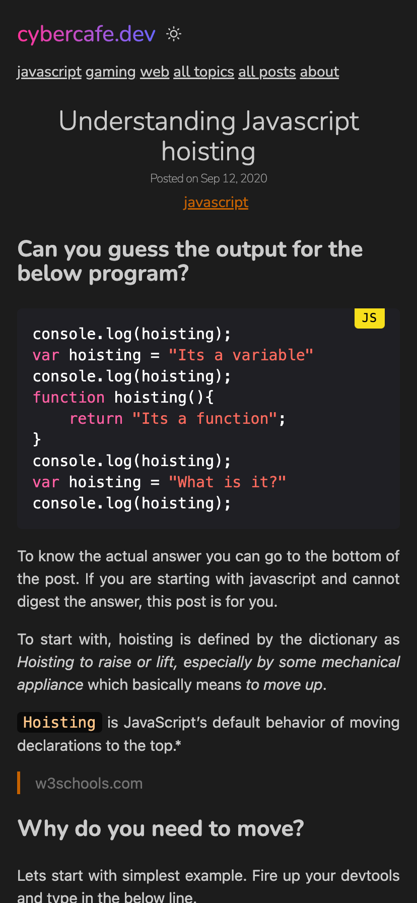
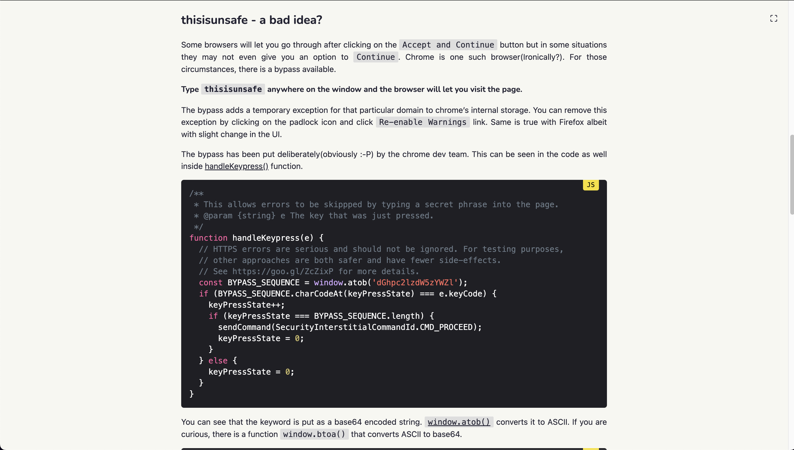
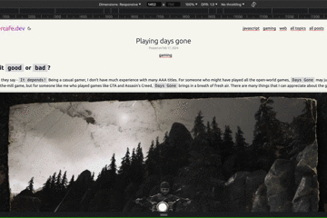
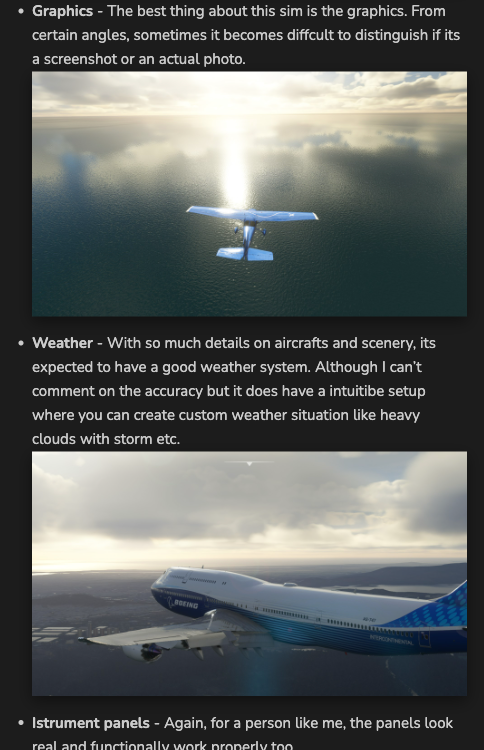
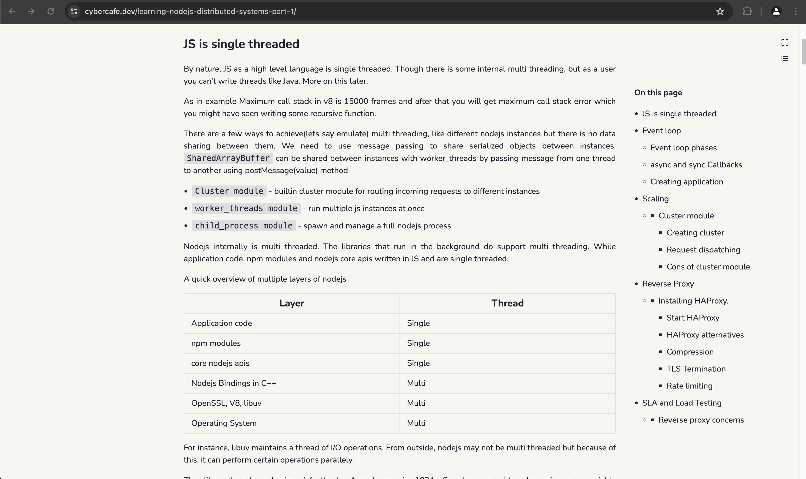
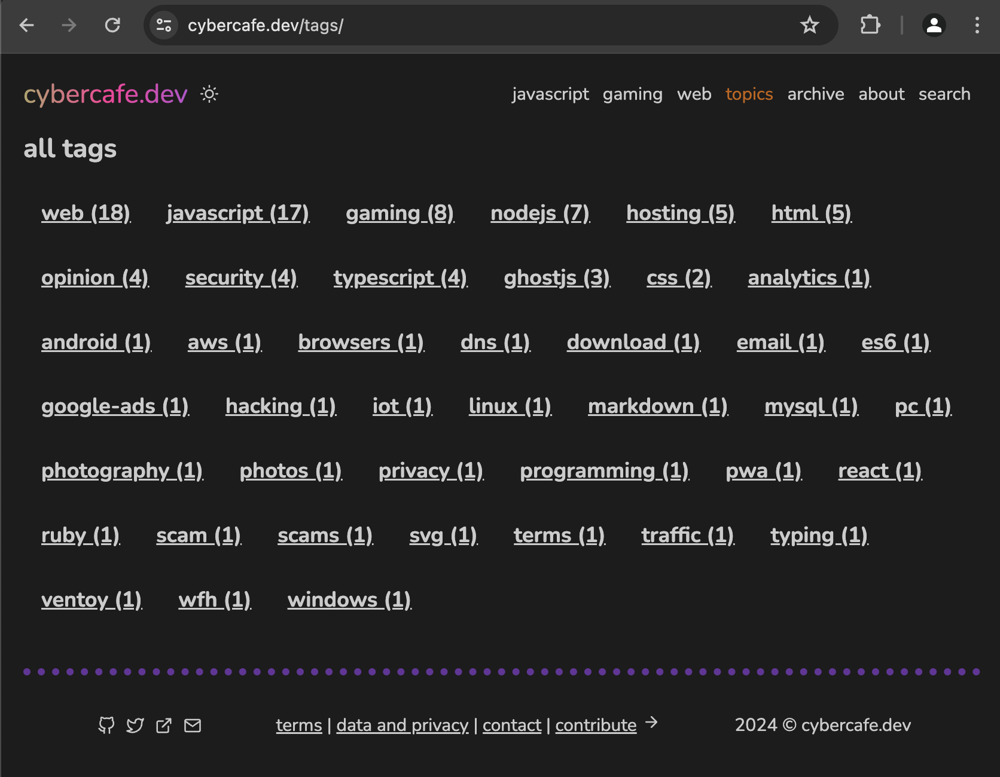
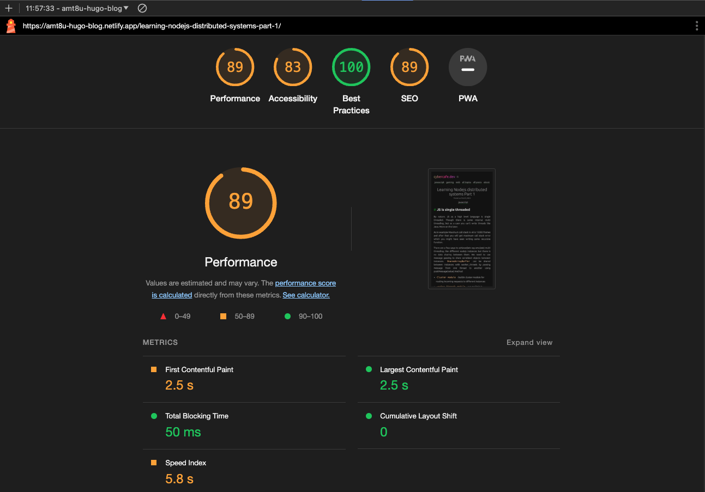

If you are interested, read about how [I created my blog using hugo from scratch](/creating-a-static-site-with-hugo/).

# Why
I almost tried all the themes listed on [hugo themes section](https://themes.gohugo.io/). I couldn't find one which satisfies all my needs. So I had to resort to customization. It wasn't as easy as it was with [handlebars in GhostJs](/how-to-add-custom-static-pages-to-ghost-blog/). There are some basic rules and principles which you need to understand before even attempting to modify a template.

Start learning about templates on hugo docs https://gohugo.io/templates/lookup-order/. These docs are good but at some places it is unable to explain properly. For e.g. while explaining the `Kind` rule for template selection the doc throws in many sentences which are difficult to comprehend at first. Nevertheless, when you have a fast live reload, you can always hit and try.

> The page Kind (the home page is one). See the example tables below per kind. This also determines if it is a single page (i.e. a regular content page. We then look for a template in _default/single.html for HTML) or a list page (section listings, home page, taxonomy lists, taxonomy terms. We then look for a template in _default/list.html for HTML).

Let's start with what all **customizations** I went for and how I achieved those in Hugo.

# Toggle-able dark theme

Most of the available themes were either dark or based on `prefers-color-scheme` property. I wanted to have the functionality to let the user choose. Sometimes the user want to see the site with light colors and if we don't give that override, the only way is to change the system setting which is of course a tedious task. I believe the `prefers-color-scheme` should be taken as a hint that user desires for dark theme, but there should always be an option to override.

There are may ways to achieve this. A great starting point is https://css-tricks.com/a-complete-guide-to-dark-mode-on-the-web/ though ironically I did not see dark mode on csstricks.com :-D. Since the theme I was using(archie) already had this(though undocumented), I used that approach - "Load the dark theme stylesheet on demand". 

First load the dark theme if user has `prefers-color-scheme` set to dark. This can be done in `header.html`.
```html
{{- if or (eq .Site.Params.mode "auto") 
    (eq .Site.Params.mode "dark") 
    (eq .Site.Params.mode "toggle") -}}
    {{ $darkstyle := resources.Get "css/dark.css" | fingerprint }}
    <link 
            id="darkModeStyle" 
            rel="stylesheet" 
            type="text/css" 
            href="{{ $darkstyle.Permalink }}" 
            {{ if eq .Site.Params.mode "auto" }}
                media="(prefers-color-scheme: dark)"
            {{ end }} 
            {{ if eq .Site.Params.mode "toggle" }}disabled{{ end }} 
    />
{{ end }}
```

| Dark theme                                  | Light theme                                   |
|---------------------------------------------|-----------------------------------------------|
|  |  |


And when user clicks on the toggle button, add or remove the dark theme stylesheet from DOM via js. Create a file in `static/js` directory. eg. `themetoggle.js`.
```js
if (mode === "dark") {
    document.getElementById("darkModeStyle").true = false;
}
```

Since it's a static site, there is no easy way to store the user setting on the server, you can use `localStorage` to remember the setting on the system
```js
localStorage.setItem("theme-storage", mode);
```

# Ultra wide mode

I know that there is an [optimum width for pages which contain text](https://ux.stackexchange.com/questions/108801/what-is-the-best-number-of-paragraph-width-for-readability). But still sometimes I feel it's a wastage of space when you can utilize the same. It becomes more apparent when there is some content which makes it difficult to read with a limited width. And one of such is `code blocks`. M blog is focused on technology and is code heavy. The issue is that code is not wrapped like regular text. Lines are rendered as it is. And when a line is too long to fit in, a horizontal `scroll bar` comes up which looks really terrible, and also you have to now manually scroll the code block to see the long lines.

| Fixed width                                          | Fluid width layout                                  |
|------------------------------------------------------|-----------------------------------------------------|
|  |  |


Inspired from widgets in jira where you can quickly maximize a particular widget, so that it spans across the whole width of the viewport, I implemented a similar solution. Added a maximize button that you can see in the top right corner. On clicking of which the `max-width` changes to `95%`. Why 95? Because I wanted to keep that button always in view by making its position fixed. A little bit of space had to be reserved for it so that it doesn't overlap the main text.

```js
document.getElementsByClassName("content")[0].classList.add("fullwidth");
```

And just like how I am using `localStorage` to store the theme preference, I am storing this ultra-wide setting as well. So even after page refresh you get the same view. One caveat with this was that on mobile it doesn't make sense as you will never have viewport with width greater than 600, so I hid the toggle button on smaller devices.

```js
localStorage.setItem("view", mode);
```

Added a quick shortcut for this. On pressing "f" you can quickly toggle between the views.

```js
// Also attach a listener for quick action using "f" for fullscreen
window.addEventListener("keypress", (e) => {
    if (e.code === "KeyF") {
        toggleView();
    }
})
```

And since it's just a CSS change without any javascript, it is as fast as lightning. No reloading of content and no flashes of default style.

# Responsive
Responsive design is not easy to implement. To support 4 ranges for devices you will have to come up with 4 different designs which in turn means 4 different css files based on width of the viewport.

Though that's the hard truth, but with simple pages having just text and images, you actually do not have to manually think of responsive elements. Responsiveness is baked-in into the browsers since decades. Just put some text and resize the window. You will realize that text automatically rearranges itself. For images, you will have to set a `width` and it also resizes itself based on viewport size. That should be sufficient for my simple blog.



And for the cases where it is not enough, we have the flex layout. It is a little complicated with so many properties but with the dev tools helper buttons, it has become really easy to work with.


With options like `flex-wrap` and `justify-content` you can easily achieve responsive layout. Open devtools in responsive layout mode and try resizing the window from maximum to minimum. You will see that this website is readable even with a width of `100px`. And with the `fullWidth` option, you will appreciate your ultrawide monitor too.

# Highlight active page
Again something which is very easy in bootstrap world, it gave me some pain in hugo. To mark the menu as active when you are on respective page you can use below construct. 

```html
{{ $currentPage := . }}
{{ range .Site.Menus.main }}
    <a 
      class="{{ if eq $currentPage.RelPermalink .URL }}active{{ end }}" 
      href="{{ .URL }}">{{ .Name }}
    </a>
{{ end }}
```
It took me around one hour with chatgpt and internet to realize that `.RelPermalink` returns the page's URL with a leading `/` irrespective of whatever value you have set in the `Menu` section of config. I had the url as `/amt8u` while the `.RelPermalink` returned `/amt8u/` and thus my comparisons were not working. There is helper function [isMenuCurrent](https://gohugo.io/methods/page/ismenucurrent/) available for the same, but I guess that also didn't work due to same reason. 
```toml
[[menu.main]]
identifier = "amt8u"
name = "about"
url = "/amt8u"
```

# Feature & Thumbnail image
It's true that images are heavy and slow down your website. Maybe that's the reason many of the hugo themes I saw do not have images for the listing page. I like to have a small thumbnail to represnt the content. It is just better visually. Well it is not that easy in hugo. Somehow it is not a popular thing I assume. It was difficult to find an article or source to add thumbnail images to hugo list pages. I had to find a theme where they are doing this. Tried to replicate the same. Here is my understanding.

In the `index.html` where I am iterating over the posts, get the `image` type of resources which can be done by using `Resources.ByType` function. It returns all the page's resources. Use `.GetMatch` to find the particular image with an optional default "thumbnail" value. 

```html
{{- $images := .Resources.ByType "image" }}
{{- $thumbnail := $images.GetMatch (.Params.thumbnail | default "*thumbnail*")}}
{{ if $thumbnail }}
    
{{ else }}
    
{{ end }}
```
Add a little bit of css to `img` so that images don't stretch. Mainly the magic is by `object-fit` set to `cover`.

```css
section.list-item img {
  width: var(--thumbLarge);
  height: var(--thumbLarge);
  object-fit: cover;
  border-radius: 4px;
  margin-top: 2px;
  margin-right: 2rem;
}
```
There is one improvement pending though for this. Images are not yet processed and are downloaded as it is. So even if it is used as a thumbnail, the original full size image gets downloaded to the browser. There are various methods to circumvent this. 

* Use responsive images using `srcset`
* Have different set of images for different use case. Like a thumbnail version of each image.
* Restrict images on mobile devices

I will take this improvement later on after getting accustomed to how images are processed in hugo. For now, it works as I would be loading only around 5-10 images in the list page.


And in case thumbnail image is not preset, show a placeholder image from the static directory. Will write a separate post about how to handle resources in hugo sometime later as I feel I still don't understand it fully.

# Zoomable images
One common issue I face with many blogs and simple websites is the lack of image handling. Someone did a great job and put a screenshot of the full window on the page, but there is no way to zoom in the image. You have to manually right-click on it, open in new tab and then view it properly. I understand that I should not target my blog as an image hosting system. For images there are `flicker`, `Unsplash` and many more. You can always link to them. Even you can embed images using these services directly into your page. 

But there is a big problem with that approach. `Cross site content` is not reliable. Many companies restrict network traffic and popular sites like `Unsplash`, `YouTube` are blocked. Plus cross site embeds make your pages heavy. A simple example is `disqus` commenting system. Once you add it to your site, it starts [making requests to third party ad services](https://cybercafe.dev/ghost-casper-theme-customizations/#disqusalternative). And that's why I migrated towards Hyvortalk(which also is not currently working due to exceeding limits). Fortunately markdown handles images well. I can easily include the image in the markdown file. It shows up correctly in GitHub and also gets rendered into the generated html without url hacks. No more fidling with image storage. One downside though is my deployed size becomes large which is fine as I won't be adding thousands of images. Maybe around 4-5 per article.

Earlier I used a library https://github.com/francoischalifour/medium-zoom to enable users to click on any image and zoom in context. It has some great features like auto zoom out on scroll and use responsive images for zoomed items. But I wanted to keep my blog free from libraries. A quick workaround I found is to convert the images into links so that on clicking on it, the user can see a full size version of it. And if needed, you can use the browser's zoom feature to enlarge it. The downside being that you navigate out of the article. But then a simple back button takes you back to the exact place you were on. Moreover by giving the fullwidth toggle, you can always zoom in images on the spot and toggle back to narrow mode to view text.

# Box shadow on images
If you look closely, there is a small shadow on all the images which makes it feel like the images are on top of the page. It's just a visual gimmick but looks good. You can go [too much creative](https://getcssscan.com/css-box-shadow-examples) in that direction, but I just wanted a plain simple shadow just to avoid the flat look. And you can also apply a border to create a frame kind of look. But that was becoming too cheesy so I commented it out. As always do remember to use `box-sizing` to avoid alignment issues coming out of padding and margins. You can read more about it [here](https://developer.mozilla.org/en-US/docs/Web/CSS/box-sizing).

```css
article img {
    /* border: 2px ridge #151515; */
    width: 100%;
    box-sizing: border-box;
    box-shadow: rgba(0, 0, 0, 0.45) 0px 5px 15px;
}
```
The result is very minute but looks visually good.

| Without box-shadow                                 | With box-shadow                              |
|----------------------------------------------------|----------------------------------------------|
|  |  |


# Table of contents
Sometimes I feel a quick index of the contents makes it really easy to find the relevant paragraph. I can see that hugo also renders a TOC and some themes do utilize it. There is no TOC with the current theme, but it can easily be achieved with hugo. ~It's a `TODO` item on the list~. 

I have successfully added a TOC and also using some effects made it more intuitive.

* TOC is shown only when you scroll the page
* If TOC is bothering you, just use the top right button under maximize to hide it. The setting is saved in `localStorage` so you don't have to do it everytime.
* TOC is also hidden when the width becomes too narrow. It doesn't make sense to have a TOC overlapping your text on mobile device. Usually for mobile devices, TOCs are moved to top with a collapsed section. I will do that later.
* And one last thing, when you [maximize the contents to full width using the maximize button](#ultra-wide-mode), TOC gets hidden.



# Tags
Tags are very commonly used to group content and almost all CMS provide this capability. Hugo also has in built support for tags. The theme already had the template, I just made a few visual changes. Instead of a list, show tags spread out evenly on the page in descending order of articles created.



# Blazing fast
And at last, I wanted the website to be not just superfast but blazing fast. I am not doing anything complicated. Everything is just plain simple text and images. I don't need to show rich content. I can just put up links and let the relevant platform render the content. Moreover, I myself hate inline content. I almost never play a YouTube video embedded inside another site. I open it up in a YouTube in a new window where I can use all the features that YouTube provides. Similarly for other content links are sufficient.


# Lighthouse score
Again, it is not necessary to have 100/100 in lighthouse score. But it certainly is a good tool to find out where all you can do the optimizations. Saving 200ms may not be a great deal here, but you get to see various techniques. I consider my blog a place to experiment and learn. Initial impressions looks good. But I see many areas of improvement. [Detailed snapshot ](/docs/amt8u-hugo-blog-netlify_initial_impressions.pdf) of lighthouse evaluation on 18 May 2024. Will implement the recommended changes as and when I get time.

 

# Hotkeys
Well, a blog doesn't need hotkeys. There is not much to do other than read. But since I implemented three actions which the user can interact with, I added hotkeys for those as well. Just to support my blazing fast blog :-D.

`f` - Toggle between full width vs narrow width

`t` - Toggle between light and dark theme

`c` - Toggle the table of contents. 

> End
