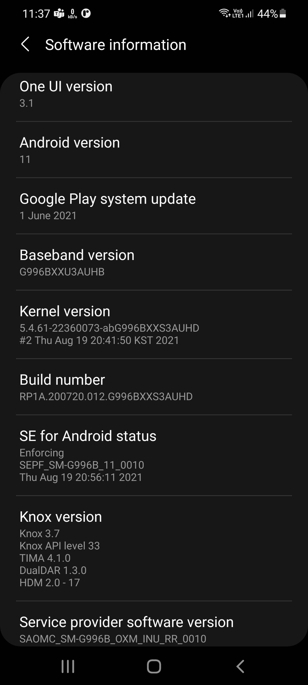
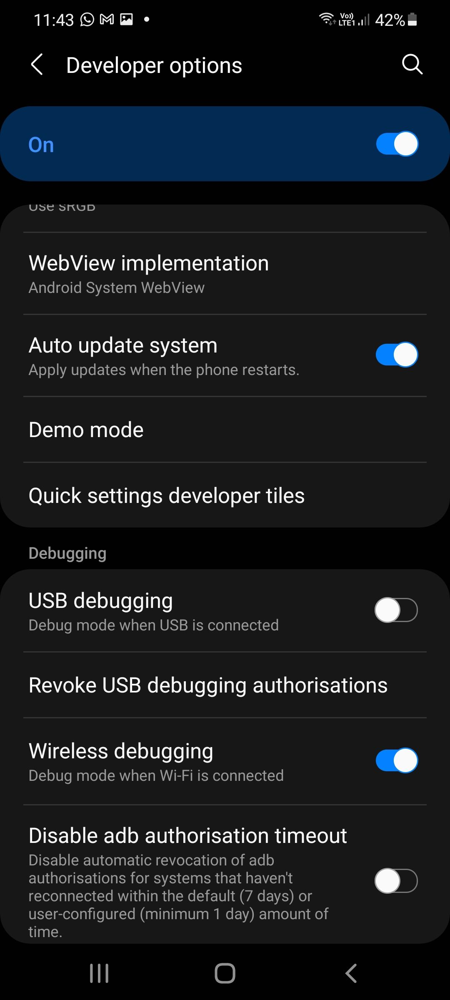
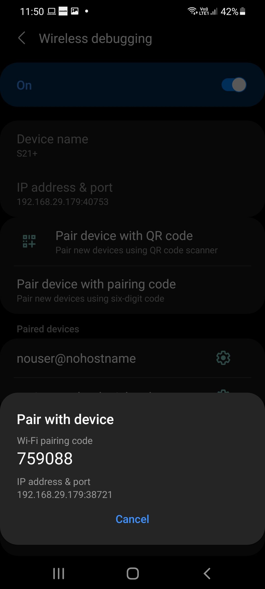
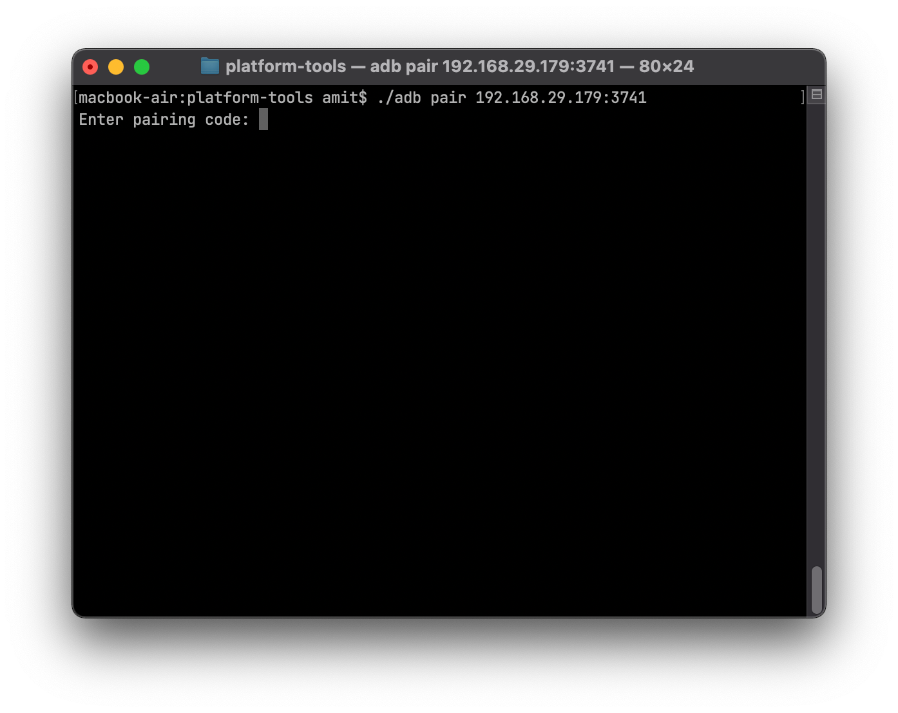
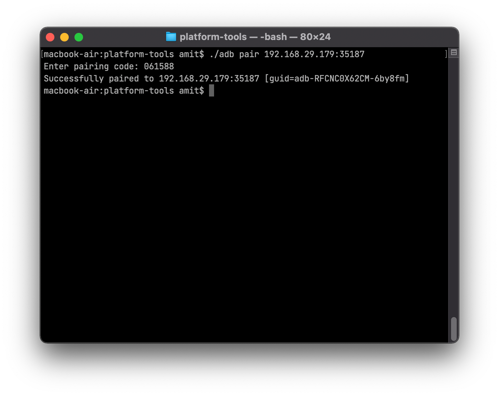
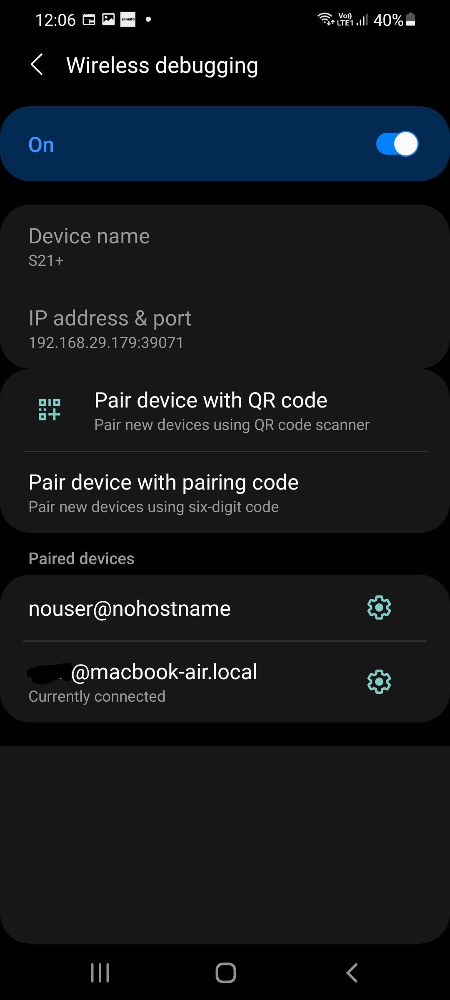
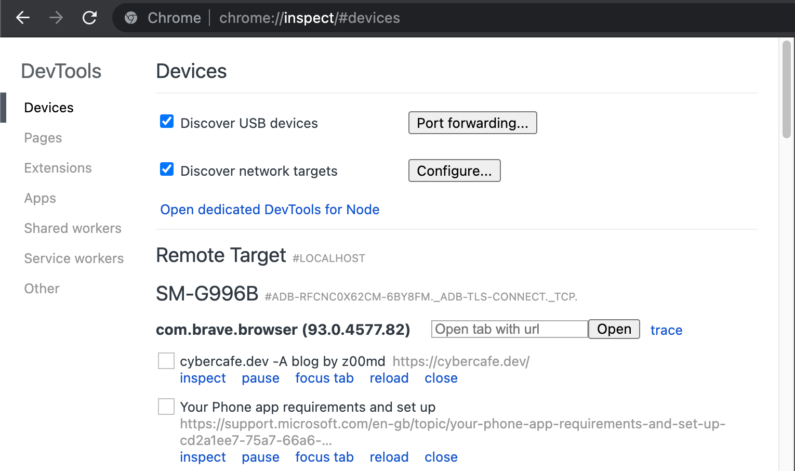
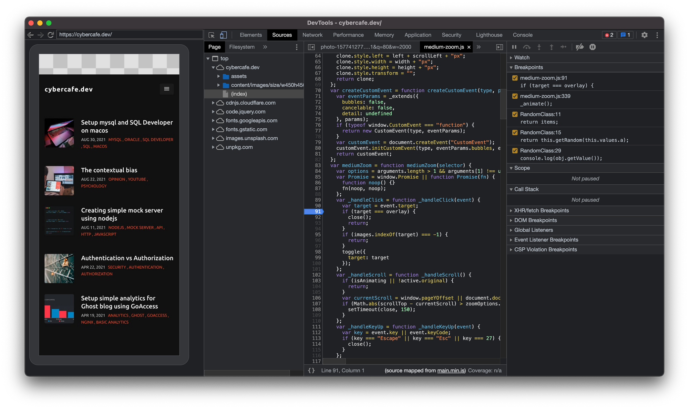

# Need
I do not deal with any mobile development, but just to troubleshoot one or two issues, I need to know why my site fails on mobile browser while works on desktop browser.

Untill now I was using the USB method of connecting the android device to the computer and inspect the site remotely. 

I don't know when the wireless option was added, but seems to work for me. 

## Enable debugging
First you need to enable debugging on the phone. For that you need to goto your phone settings and enable Developer mode by clicking on build number 7 times.

# Enable wireless debugging
Goto developer options in settings and enable `Wireless debugging`

| Debugging                                                                                                      | Wireless                                                                                               |
|----------------------------------------------------------------------------------------------------------------|--------------------------------------------------------------------------------------------------------|
|  |  |


# Install platform-tools
Since we only need to debug web apps, we don't need the full android sdk, just the `platform-tools`. Get it from [Android dev](https://developer.android.com/studio/releases/platform-tools) as per your platform. For mac you will get a `*darwin.zip` file. Just unzip it and place it anywhere you like.

# Pair phone with system
Goto the phone wireless debugging settings again and chose *pair device with pairing code* option.

Goto the platform-tools directory and run below command. Enter the ip address and port as you see in the above screen.

```bash
./adb pair 192.168.29.179:37417
```

If all is good, you should get a prompt to enter pairing code.

| Pair with system                                                           | Pairing prompt                                                                   |
|----------------------------------------------------------------------------|----------------------------------------------------------------------------------|
|  |  |

<br/>

Enter the code. If the code is right and there is no [interference from cosmic particles](https://www.youtube.com/watch?v=AaZ_RSt0KP8&t=1154s), you should see a `success` message.



And in the wireless debugging section, you should also see a new entry for your computer.

| Connected                           | Empty                               |
|-------------------------------------|-------------------------------------|
|  |  |

# Enjoy
Once this is done, the last step is similar to what you used to do. Goto chrome and open the devices panel. Check `Discover network targets` and click configure.

Add the `ipaddress` and `port` as you see in the settings section of the phone.

All your tabs should now be visible under Remote target section. You should be able to see all chromium based tabs eg. Chrome, Brave etc.



# Start debugging
From now its straight forward, click on inspect and you will see a separate new dev tools window. Your clicks on desktop will be translated to touch events on the phone and vice versa. Scrolling and other actions are also simulated.



Some observations

* You need to have your phone unlocked to see the sessions available.
* The wireless connection breaks at times, you may need to reconnect. Sometimes I had to remove the pairing and do the process all over again.
* You also need the browser to be in focus to debug.

> End
