# Why?

There are millions of online resources for aircraft startup and flight. But either they were too verbose like YouTube videos or too brief with no context at all.

I wanted to create a practical reference that walks through the full startup process of the aircraft from a cold and dark state. My goal was to keep it concise but informative, with just enough context to understand why each step is necessary—not just what to do.

This guide is based on the reference video: https://www.youtube.com/watch?v=3tafQelqEmM

# Flight Parameters

* Flight Sim - **MSFS 2020**
* Aircraft - **Salty Simulations Boeing 747**
* Weather - **Normal**
* Time - **Night** (Just to make it more adventurous)
* Departure - **Mumbai** (VABB)
* Arrival - **Delhi** (VIDP)

In the World map selection screen, just select the aircraft and departure airport with a Gate/Parking slot. That way the plane will be in shutdown mode.

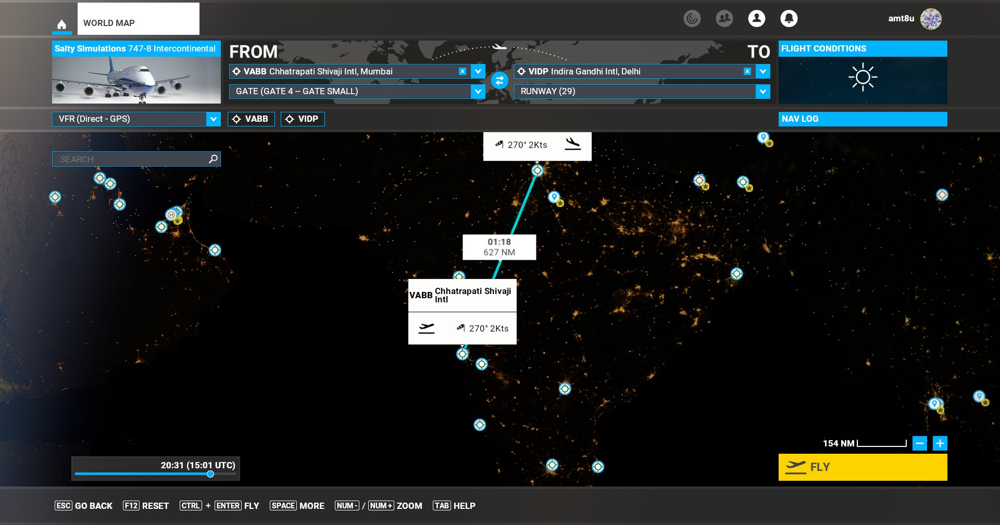

# Preflight

## Parking brake 
* Right side of left pilot cup shaped button
 
## Battery
* Pull battery cover (Top left)
* Press `BATT` switch
* Turn Standby Power to Auto (just on left of batt switch)
* Press external power 1 `EXT PWR 1` and `EXT PWR 2` (just below standby power knob)
* Close battery cover

|  |  |
| - | - |
| 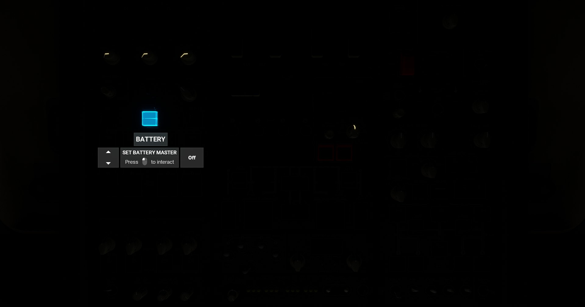 |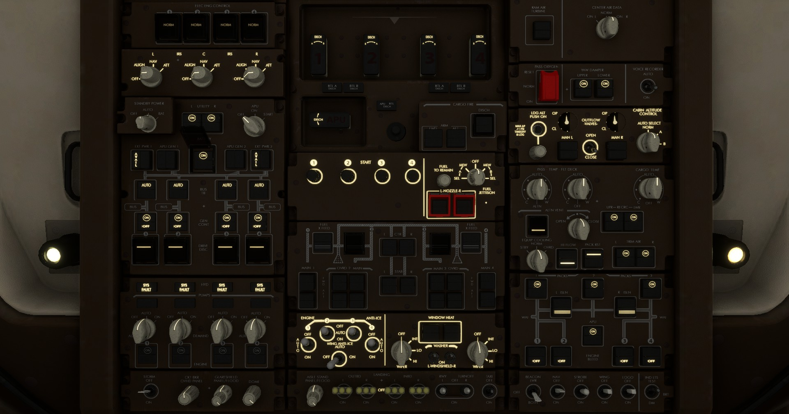|

## Align IRS
`Inertial Reference System` - This positions the aircraft and starts the heading

* Turn all knobs `L`, `C` and `R` to `NAV` (just above battery panel)
* It takes around 6-8 minutes to align depending on where you are in the world
* Check the time in navigation display in Top left section - **TIME TO ALIGN**. Time will be displayed for `L`, `C` and `R`

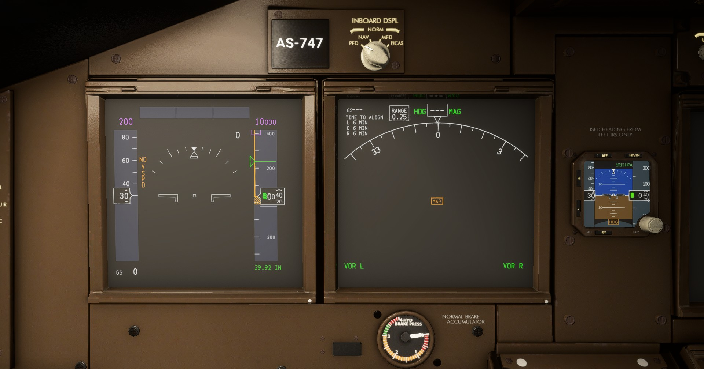

## Lights
* Turn on `NAV`, `WING` and `LOGO` lights switch in overhead panel bottom right. These lights are used for night, so you won't need them for day

# MCDU

## Salty options for simulation help
Salty has given some extra options in MCDU to peform certain operations quickly and help setup sim properly

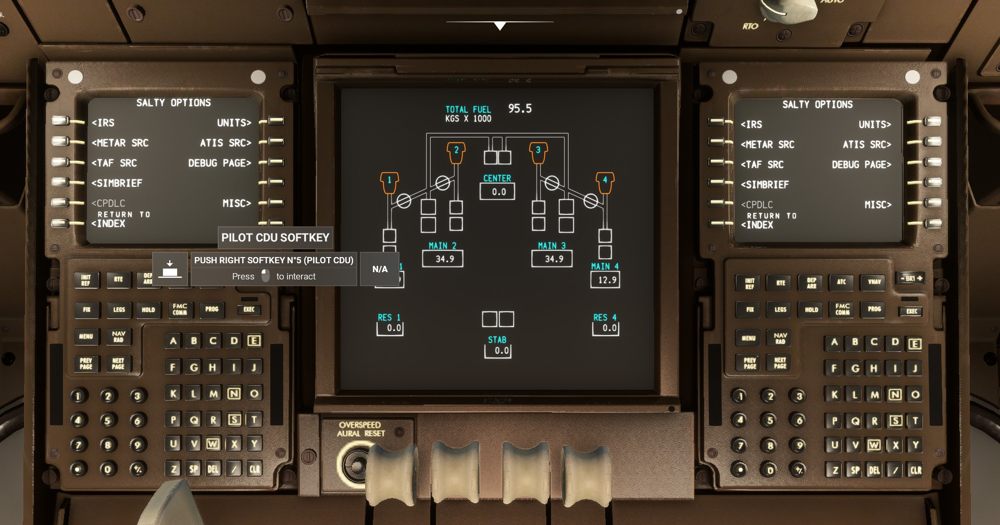

You can hide yoke and pull speed brake a little back so that they don't obstruct the MCDU buttons

* Press `SALTY`. Options should show `IRS`, `UNITS`, `METAR` `SRC` etc. 
* Click `IRS`
* You should see `IRS STATUS` as `ALIGNING`. Option to `UPDATE IRS STATUS` and `INSTANT ALIGN`
* Click on `INSTANT ALIGN` and then `UPDATE IRS STATUS`. You should see the heading director and the IRS time to align values gone from the display
* If you take time to reach here, the IRS will align as per the default time

Click any of the options `METAR SRC`, `ATIS SRC` and `TAF SRC`. It leads to same screen where we can select from where we will get the information
`PILOTEDGE` was selected in the video, but for me `METEOBLUE` was auto selected

### Simbrief
Click `OPTIONS` and come back to previous screen
You can use `SIMBRIEF` integration. Type in userid and you are ready to go. Create flight plan in SIMBRIEF and load automatically here. But we are gonna do it manually in the `MCDU`.

### Units
* Press `UNITS` the top right CDU button
* Toggle between pounds and kg by pressing `CDU button L1`
* Keep the unit same as you have in Simbrief if you are using it


### Misc
Some misc options also present like Show Pilot bodies. For me there were two more options `FP SYNC` and `PAUSE at T/D`

Nothing to change here. If needed, you can enabled pilot bodies
Return to `OPTIONS`

### Simbrief flight plan setup

Video [reference](https://youtu.be/3tafQelqEmM?si=yEu3EHcfwAz1WieG&t=372)

Login to Simbrief and goto https://dispatch.simbrief.com/options/new. Create **new Flight**

**Basic flight info**

* Airline - `BR`
* Flight Number - `1304`
* Depart - `VABB`
* Arrive - `VIDP`
* Alternate - `Auto`
* Departure Time - Set as per need. If you chose night time, it would be greate as you won't be able to see anything in the cockpit which makes it more realistic. 

**Aircraft info**

Select `B478 - B474-8` from the dropdown
Keep the default values as it is.
`CI` Cost index (cost to fuel burn ratio)is about how efficient the aircraft should be in consuming fuel. If going to a cheaper fuel destination, you can spend more fuel and reach fast. 

Keep unit as `KG` or whatever you selected in the MCDU.
You can change reserve fuel to 45 minutes.

In the optional entries select a runway that has ILS. I selected `11L`. Hope it has got ILS. Once you change the runway it will automatically update the route.

You can set Cargo weight to AUTO

Now generate flight plan and download the `pdf` file

The pdf should look like this - [Flight plan](./VABBVIDP_PDF_1744519837.pdf)

### Weights and Fuels

Come back to the MSFS. From the top bar, chose fuels and balances. Change the fuel to around 42%.
If you want, you can change the payload as well.

## FMS

Video [reference](https://youtu.be/3tafQelqEmM?si=kfuqXerBMYuxQGgV&t=716)

Now we are going to program the FMS

Click `FMC` (Flight management Console)

The `IDENT` page is just some identification data.
Model of the aircraft, nav data source, Engine type, Company Data, The AIRAC data expiry etc.
For me the date is MAR20APR17/25

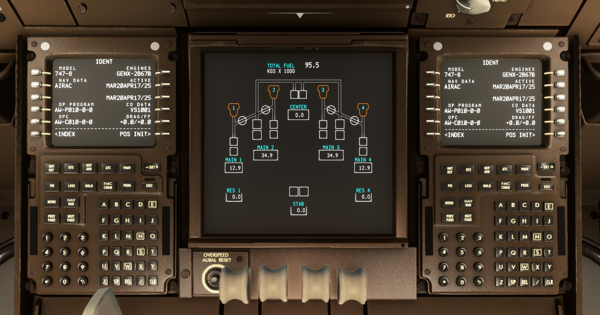

Click `POS INIT` Position Intialization

Enter departure airport code - `VABB`. Press `CDU L2` so that the text enters the `REF AIRPORT`

Copy the GPS position to scratch pad and use to set the IRS position

Click on `GPS POS`
The position should come on the scratchpad
Click on `SET IRS POS` to set the value


### `Route`

Click on `ROUTE` to goto route page
Enter origin and destination airports

`VABB` Mumbai and `VIDP` Delhi for us

Enter flight number

`BR1304` for us

Click on `DEP ARR` button on the MCDU to directly goto departures and arrivals

The departures list shows all the possible `SIDs` (Standard Instrument Departure). Check your flight plan and select thje matching one.

You can go through all the SIDS by clicking on `NEXT PAGE` and `PREVIOUS PAGE`.

For me it seems the correct one is `ALBA2B`

On selecting it, it shows Transitions `TRANS` and runway on right side. In the flight plan I can see `ISRIS` and I know we selected runway `09`. So I will select the same. Lets see.

Execute the plan by pressing `EXEC`. The button will have a green light on top of it. On clicking it should go off.

Click on `ROUTE` to back to route page

Click `NEXT PAGE`

`VIA` is the list of airways, sids and stars which is like freeways on roads
`TO` is the list of SIDs which is like exit ramps on roads

Read the flight plan and enter the airway number. 

Tried with chatgpt to understand the route. Here is a output of that

```
VABB/09 – Departure airport and runway (Mumbai, runway 09)

ALBAP2B – SID (Standard Instrument Departure) from VABB

ISRIS – Waypoint

G208 – AIRWAY ✅

DOSTO – Waypoint

Q1 – AIRWAY ✅

BUBNU – Waypoint

A347 – AIRWAY ✅

UKASO – Waypoint

UKASO6G – STAR (Standard Terminal Arrival Route) into VIDP

VIDP/11L – Destination airport and runway (Delhi, runway 11L)

And in the "TO" section beside each airway, you'd enter the waypoint it's leading to, like:
VIA	        TO
G208        DOSTO
Q1	        BUBNU
A347	    UKASO
```

Enter the first airway `G208` and select the CDU button `L2`. The system will read and take some time to process that.

You should see `DISCONTINUITY` and a green light on the `EXEC` button. This is because we don't have a waypoint in the `TO` section

Enter `DOSTO` and click CDU `R2`. If there are multiple waypoints with same name, you may get a select desired wpt screen. You would need the exact coordinates to select the right one. Search in the flight plan the exact one which needs to be selected.

For me `DOSTO` was unique.

The pattern generally is WAYPOINT1 AIRWAY WAYPOINT2 (e.g., ISRIS G208 DOSTO).

Airways start with alphabet followed by number
Waypoint are generally longer without numbers unless its part of SID or STAR

```shell
ALBAP2B ISRIS G208 DOSTO Q1 BUBNU A347 UKASO UKASO6G
```

```
ALBAP2B → SID (departure procedure)

ISRIS → Waypoint

G208 → Airway

DOSTO → Waypoint

Q1 → Airway

BUBNU → Waypoint

A347 → Airway

UKASO → Waypoint

UKASO6G → STAR (arrival procedure)
```

Enter the remaining airways and corresponding waypoint

`Q1` - `BUBNU`
`A347` - `UKASO`

Now enter any direct waypoints. The direct points are waypoints that you want to go directly.

Not srue, but for me I entered `UKASO6G` and selected the next `TO` button. On the left side it should automatically show `DIRECT`.

Click `ACTIVATE` 
Click `EXECUTE`

Configure STAR Standard Terminal Arrival Routes

Press `DEP ARR`
Press `INDEX`
Select arrival airport `VIDP`

A list of STARs will come up on the display with their approaches like ILS, LOC etc.

I can't see `UKASO6G` in the list of stars. UKAS6A shows `ILS 27` so I will try with that.

Select the runway ILS27. Slightly different from our original flight plan but should work.

There should be `<SEL>` beside the option that you selected.

Press `EXECUTE`
The green light should go away.

**Verify the waypoints**

Goto the Flight display in front. Goto the panel just over the PFD.

Turn the Nav display controller `CTR` to `PLN`
Rotate `RANGE` to somewhere around 20-40 so that the route is visible in the PFD

Click on `LEGS` in the MCDU and then `STEP` through the route.

If you see `DISCONTINUITY`, there is something wrong. In my case there was one empty entry shown as `THEN`

For me there are two discontinuties. Not sure how to correct those.

If you see `VECT` that means the atc will give you headings at this point and will move you to the correct waypoint


Nevermind, will continue


### `INIT/REF` Intial Reference

Goto INIT/REF and you can go page by page

We have already done `IDENT` and  `POS`

If go page by page, Click `ROUTE` and then you have the option to goto `PERF INIT`, or you can goto PERF from INIT REF screen as well

### `PERF INIT` Perform Initialization

Set `CRZ ALT` cruise altitude to `FL380`. The right one you need to check.

Set `COST INDEX` to `40`

Set `RESERVES` as `6.53KG`

Press `THRUST LIM` to move to Thrust Limitations

Thrust limitation is to derate the engine to use it at less power. 

To improve engine life 
To have less sound generation as some areas are nearby airports

Set `<TO` to `10%`. You should see `<SEL> CLB 1>`

The TO N1 should show a percentage around `85.0%` which means the engine will not go beyond 85 percentage. This also depends on outside weather and temperature you set.

### `TAKEOFF REF`
Press `TAKEOFF` to goto next page
Set `FLAPS` to `10`. If you are on a short runway, you can set to 15 or 20

Press `V1`, `VR` and `V2`. It will automatically calculate speeds. 
`V1` - Once aircraft exceeds this, its not safe to stop. No matter what happens, you need to takeoff. Thats why when V1 is called, the Pilot takes his handoff from the engine so that they don't instinctively reduce the throtte.
`VR` - Point at which pull the noise back
`V2` - V2 is the speed at which aircraft suffers engine loss
It depends on company preference and other factors. 

Other dtails should be fine not to touch. Gross weight etc.

Click `NEXT PAGE` to goto page 2 of Takeoff page

There you have `EO ACCEL HT` Engine Out Acceleration Height. If on takeoff you lose an engine, the aircraft will slow the climb. At 1000FT the aircraft will point nose down, reduce climb rate and accelerate. Ideally it should be editable, but its not a feature here.

`THR REDUCTION`
`CLB-1` Once we reach `1500FT` engine will engage climb performance
At `3000FT` the aircraft will slow down and accelerate again.

# Pre Start Engine

Video [reference](https://youtu.be/3tafQelqEmM?si=hDW3QAv3r3NQAUj5&t=2074)

Move to the front panel where heading and altitude controls are

Turn on `F/D` Flight Director switch. You should see `TO/GA` in green at the top of PFD. And also see `FD` in green in the PFD

Turn on the `A/T ARM` swithc just above 

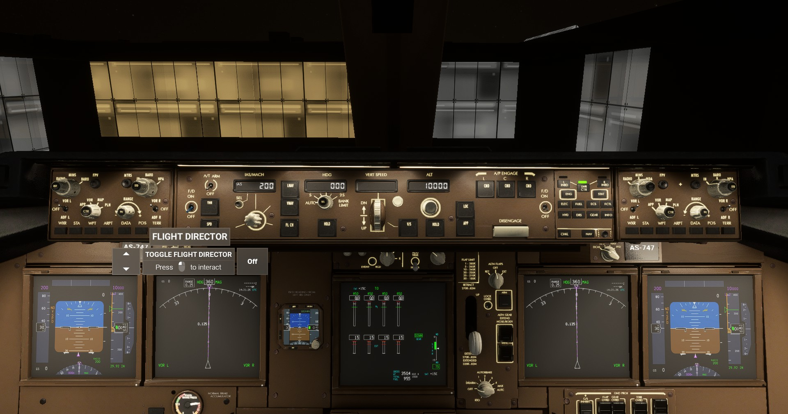

Turn the `IAS/MACH` knob to `175` 165+10. In the video he set it to 182.

Make sure `VOR L` and `VOR R` are in on position. They should be on by default.

Set departure heading. Since our runway is 09L, set `HDG` to `090`

Set `ALT` to `4000`. Check what altitude you are restricted as per your SID


Now lets set the pressure controls

Goto Leftmost side of the front panel

Multiple options

* Call ATC
* Press `B` on the keyboard to set it to 29.9
* You can also switch between `IN` and `HPA` using the knob.

You will see the altitude change on changing the baro values.

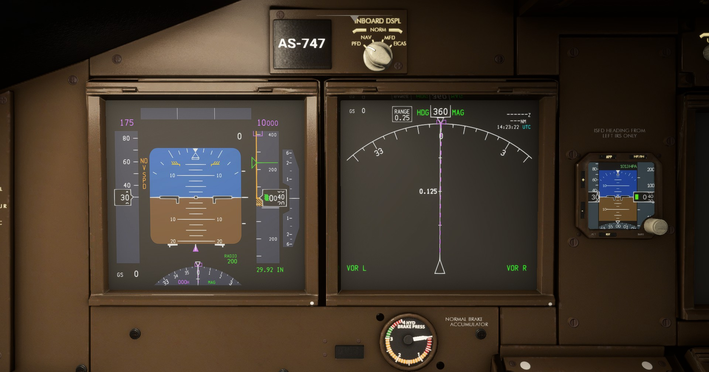

## Minimums

Adjust the minimums.

Whatever we set for `EO ACCEL` in the MCDU, should be set here.

By default the value is `200` which can be seen in green near the bottom left of the altitude in PFD under text `BARO` or `RADIO`. `200` is the minimum for landing. If you don't visually see the runway below `200`, you need to go around.

You have to reach `1000FT` before you can pitch down and accelerate.

Change the `MINS` by rotating the knob to `1000FT` 
Change the switch to `BARO` from `RADIO`

# Pushback & Engine Start

Make sure parking brake is set

Switch Beacon light on in overhead panel. This will let everyone know that we are starting the engine.

Switch Fuel pumps on
Goto overhead panel and switch on below pumps

`MAIN1`, `OVRD 2 MAIN`, `MAIN 3 OVRD` and `MAIN 4`

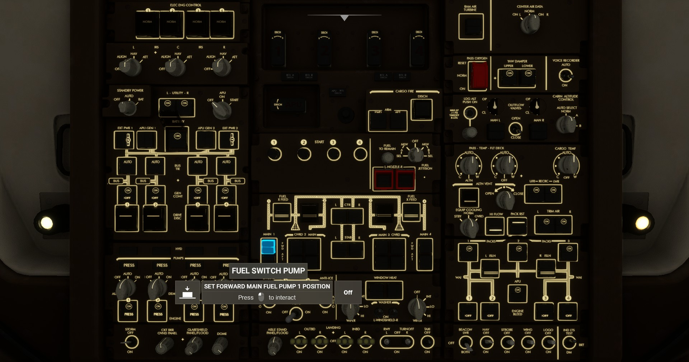

Now if you see the ECAS display or the fuel display near the MCDU, you should see the pumps as Green or Blue. Amber would mean that fuel is not there, but you have switched the pump on.

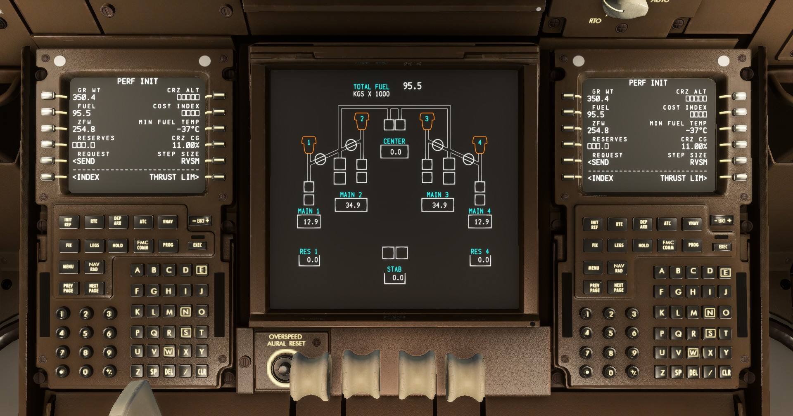

If you switch on the center pumps, you will see that it shows as amber. `FUEL LOW CTR L` in the ECAS display. You can switch it back off.

Turn on the `APU`

Turn first to `APU ON` and then turn it more towards `START`. The knob will come automatically back to center.

Click on `STAT` button on the front right panel. This will show some stats on the ECAM display near MCDU. But for me it was disabled.

But I can see the `APU RUNNING` in white color in the Engine display just above the FUEL display panel. Same he mentioned in the video as well.

In the overhead Panel Switch on `APU GEN 1` and `APU GEN 2`
Switch `EXT PWR 1` and `EXT PWR 2` to off.

At this point, we need to shut the packs off in the top right panel. But thats not modeled, so its okay.

There are many Pushback systems available. You can use any of the services.

Click on the ATC icon top toolbar.
If not tuned, tune into ground and make a request for pushback.
For me somehow atc options wwere not coming, Had to save and reload from that point.

Start Engine

Switch `3` and `4` engine bleed on in the overhead panel bottom right just above the lights switch.

Then pull Engine starters `3` and `4` in the overhead center panel

In the MCDU side display, the numbers should start to go up.

As soon as it reaches more than 10, switch Engine fuel cutoff for `3` and `4` to `ON`. The control is just behind the throttle

The numbers should go up and should stop at around `60%` idle.

Meanwhile, Change the transponder to some number `1234`. 
Switch the knob to `XPNDR`

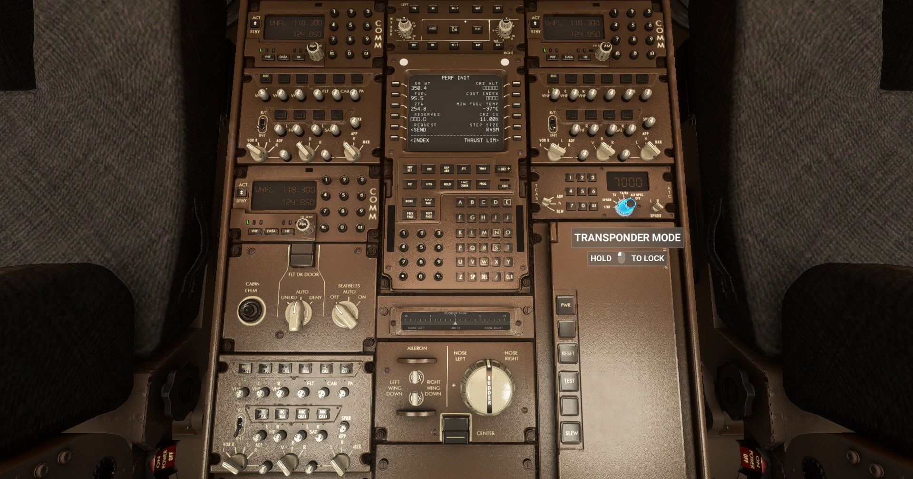

Repeat same for Engine 1 and 2

Switch `1` and `2` engine bleed on
Pull engine startes `1` and `2` in the overhead panel

Again, once it reaches `10%`, switch ebngine fuel cutoff for `1` and `2` to 'ON'.

The numbers should start rising for `1` and `2`.

Set `ANTI-ICE` to `AUTO` for 1, 2, 3 and 4 in the overhead panel

Turn on `TAXI` light

Toggle `RWY` `TURNOFF` lights if required. No need for us.

Switch `APU GEN1` and `APU GEN2` off

Switch `APU BLEED` off

Turn `APU` to `OFF`

Set `AUTOBRAKE` to `RTO` which means rejected takeoff

Set `FLAPS` to `10`. Same would be visible in ECAM display as well

Change `NAV` display to `MAP`. Thats your preference if you want something else

Multiple `WXR`, `STA`, `WPT`, `ARPT`, `DATA` `POS`, `TERR` options there, but not sure if they are modeled correctly. No need for now.

## Taxi
Monitor ground speed from PFD left bottom or heading display top left

Taxi speed guidelines
Straight 20-25 knots
Turn around 7-8 knots

Disable parking brake

Throttle a little, the aircraft should start moving

Use the joystick to rudder direction

Some controls that you should map to keys to make it easy, so that you don't need mouse

Auto pilot disconnect - `DISENGAGE`
Two little flaps in front of the throttle - `TOGA`
Auto throttle arm switch `ARM`


Taxi to the takeoff position

Contact ATC for clearance to takeoff 
Select - "Request taxi to active, departure to the west"
Acknowledge tranmission

Once reach the runway, request for takeoff. Wait for clearance.

Turn `LNAV` and `VNAV` armed

Acknowledge clearance and move towards the runway

Check `50%` rpm on engine

Release parking brake and push throttle to full

## Ready for takeoff
As per ATC line yourself up to the desired runway and wait for clearance. Once received, you can proceed for takeoff. Will create a separate guide for takeoff.

> End


