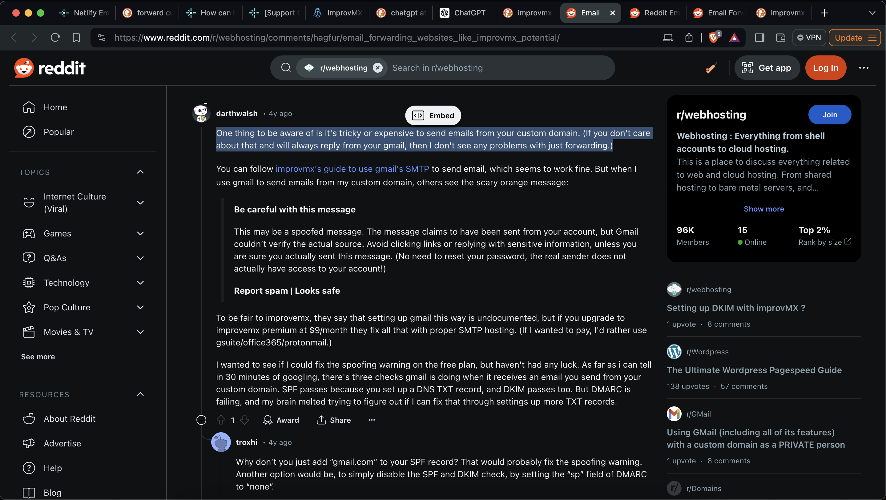
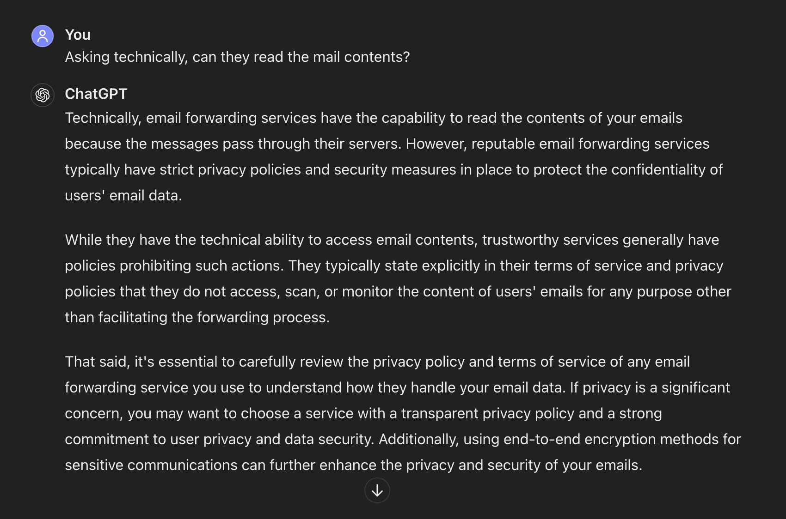
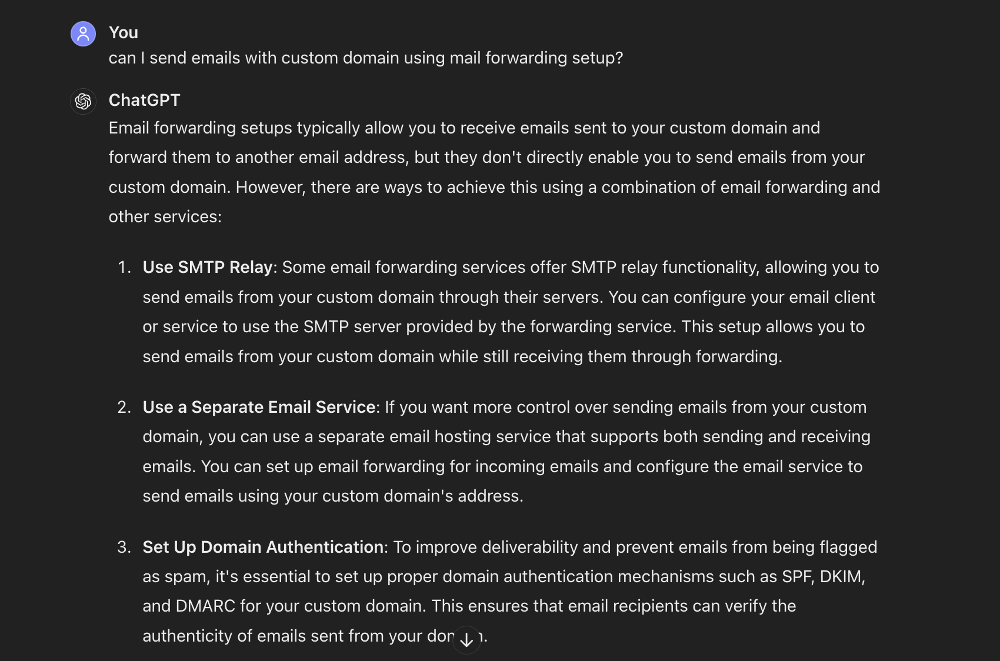
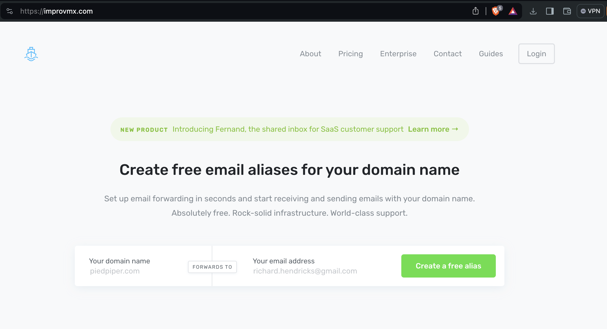
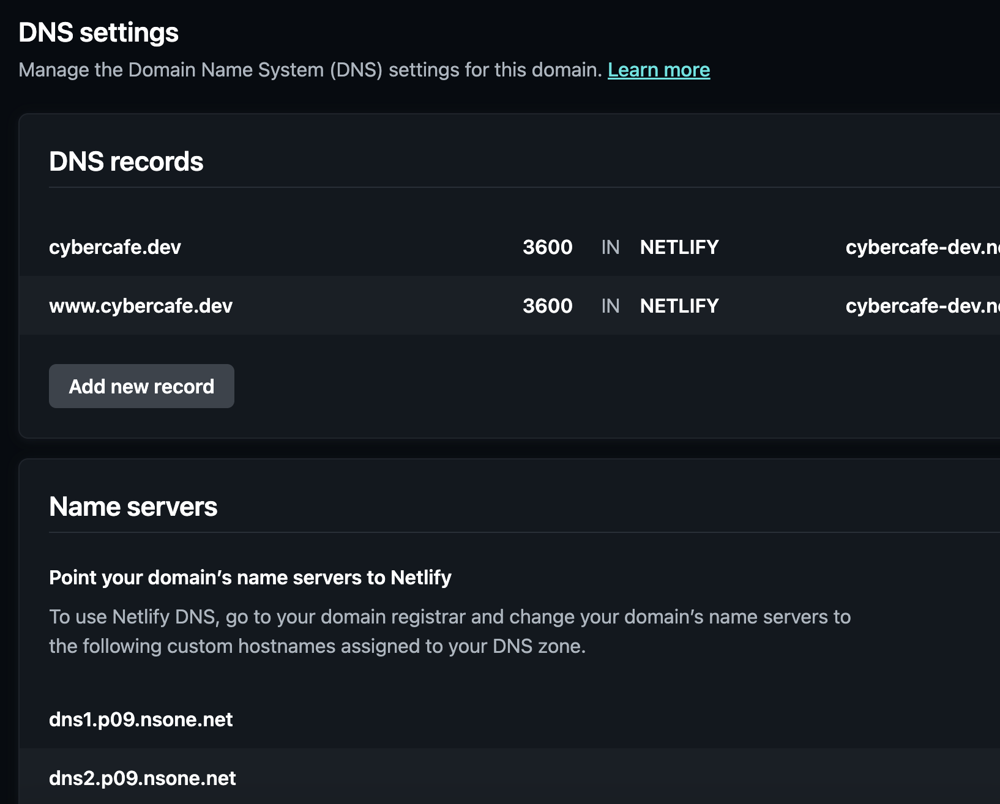
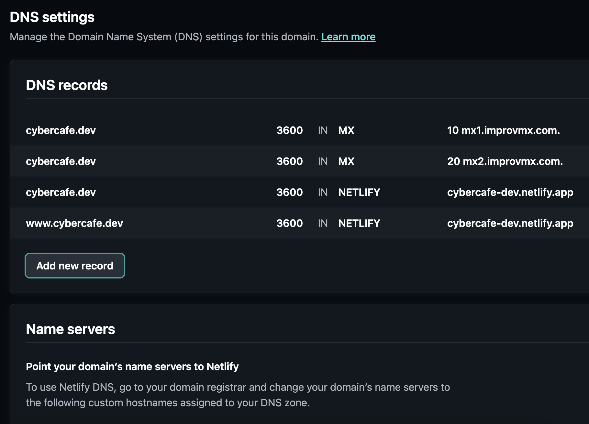
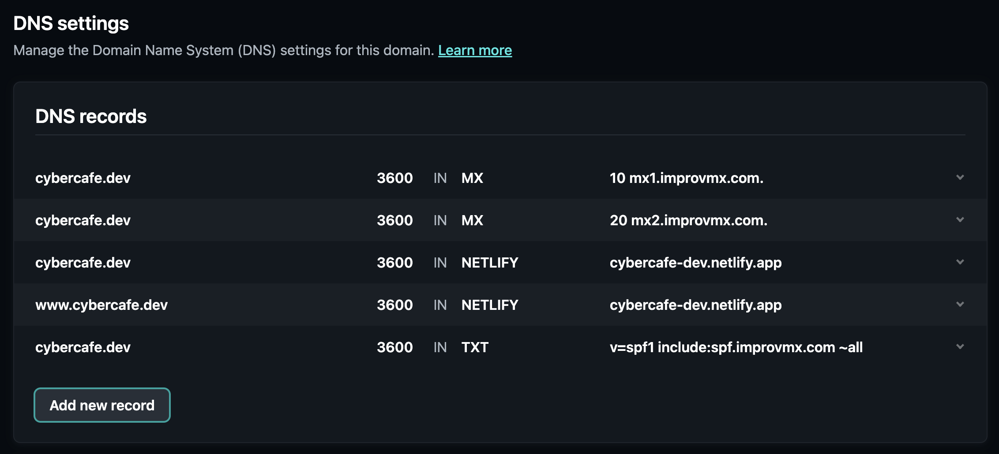
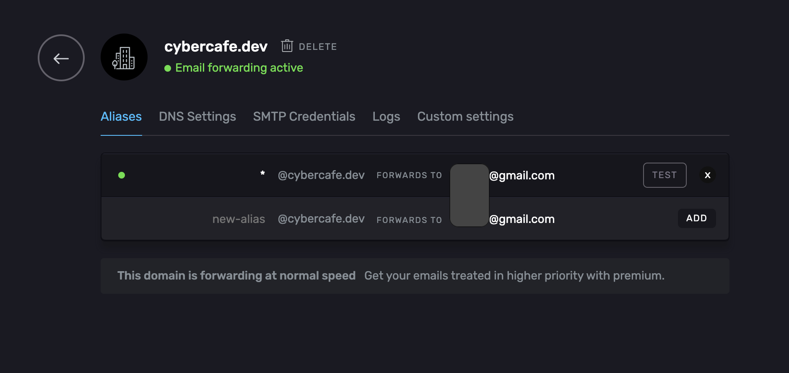
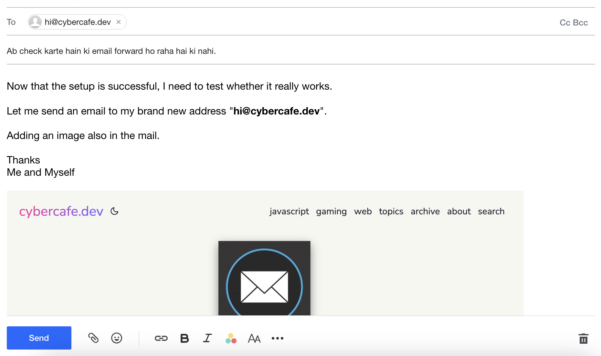

# Why?
When you have a perfectly running gmail address, what's the point of doing all this? Well, the only intention behind this setup is to prevent spam.

Once your email address goes into the wild, you tend to get more spam. Sometimes even gmail is unable to identify and it lands up into your primary section.

On sites like this, its not easy to implement a 2 way communication system. At least not without spending hundreds of dollars. I am not expecting thousands of people coming to me. My requirement is to have a way for the readers to connect with me if needed. Likely it would be around 1-2 per month.

With this in mind, I don't think setting up a commenting system will be a good idea. Disqus overloads your site with too many third party calls. Mentioned this in one of my previous articles about [theme-customizations].(https://cybercafe.dev/ghost-casper-theme-customizations/). Hyvortalk got expensive. 

Plus I wanted to keep my blog as clean as possible. No garbage.

Of course, you can purchase an email server and configure it on your mobile for sync and all, but then again, I didn't want to spend anything on it.

So finally, I figured, there is one way only - `Emails`

# Using personal email
The easiest approach is to put your personal email address in the contact section of your website. The downside is that you are making it public so be ready to receive garbage emails.

Moreover, it makes sense to putup an email address with your domain name like `mail@cybercafe.dev`. Looks cool right :-D

# Email options
There are two options to achieve this

* **Use an email service** - Free or paid, there are multitude of services where you can create your email account. The problem here is that it will be a separate account and you will have to configure it on your mobile device just to be in sync. For my use case it doesn't make much sense in doing that.
* **Email forwarding** - The other option is to forward emails received to your custom domain to your gmail account. This is good for getting the emails, but can have issues while sending replies. See darthwalsh response on this [reddit post](https://www.reddit.com/r/webhosting/comments/hagfur/email_forwarding_websites_like_improvmx_potential/).




# How forwarding works
In simple terms; emails are just `messages` sent from one server to another. Once received, the server can forward it to another address. So when you are using a custom domain, you have to tell the receiving server that forward all my emails to this another server. 

So easy peasy right? Not so when you are doing it for free. Some of the cons are

* **Privacy** The first server can read your emails. You can argue that there is encryption, how can they read the contents. You have to realize that the encryption is between each communication. The system can read the contents in between this transit. Gmail, of course can read your mails as those are stored on the server unlike whatsapp where messages are stored on your device. So do not directly jump into creating aliases for your personal account. In case you want a secure privacy-oriented service, you better get a new email address from a reliable provider.



* **Outgoing mails** Another problem with this forwarding setup is that you may not be able to send the emails with the custom domain email.



# Forwarding options

On searching for free forwarding services one popular option that pops up is https://improvmx.com/.

As per guide https://app.improvmx.com/domains/cybercafe.dev/guides we would need to follow below steps



Provide some basic details to start


Now goto Netlify DNS panel and remove any MX records if you have added



Add the MX records 




Give it some time. Maybe an hour and you should see green in the status



# Time to send

Draft a new email from a different account just to be sure that others can reach me via this new email address. 



And at last I got the mail in my gmail inbox. It took around 10 seconds but I guess my fans won't curse me if I respond 10 second late. 


Looking in the headers it seems everything is working fine.

```
from:	*******@yahoo.in <********@yahoo.in>
to:	"hi@cybercafe.dev" <hi@cybercafe.dev>
date:	May 25, 2024, 1:58 PM
subject:	Ab check karte hain ki email forward ho raha hai ki nahi.
mailed-by:	cybercafe.dev
signed-by:	yahoo.in
security:	 Standard encryption (TLS) Learn more
:	Important according to Google magic.
```

Now its the time to update my new email address on the website.

> End


