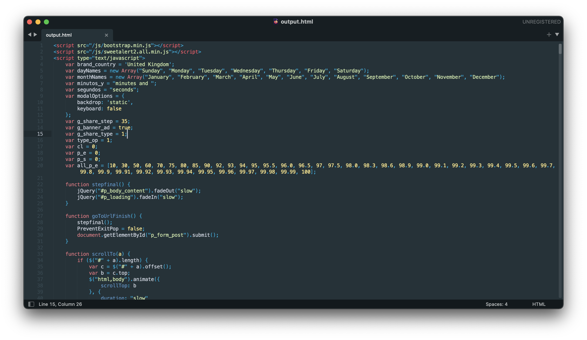
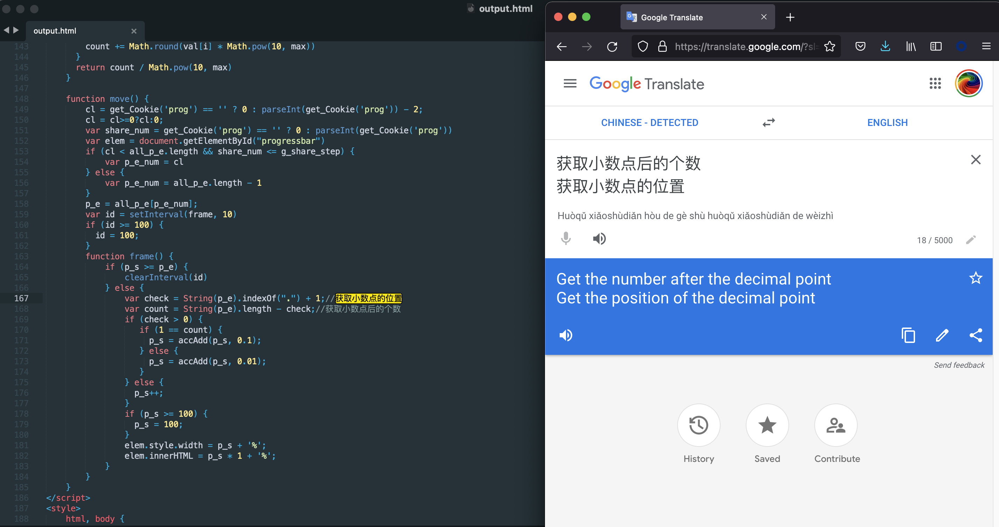

# Bumper prize
You might have seen sometimes people sharing apps and websites which claim to offer you a car if you answer a few questions correctly. You don't want to leave this opportunity and grab the gift before anyone else could. But eventually you endup just sharing the site to your 10 whatsapp friends.

# But all my answers were right?
Generally these kind of scam sites are nothing but static pages with  `javascript` code to show some modal dialogs asking users a few non-sense trivial questions. Once you finish the questions, a fake timer is used using `setTimeout` and its presented as if your answers are getting validated in the backend.

In reality there is no such backend connection. Its only a simple html alteration on the browser. Sort of how the Single page apps work. No magic there.

So it doesn't matter if you answered with all of your honesty. Your inputs were never taken.

There is good amount of information on the internet as how to avoid these kind of sites but again, to the non-tech person its not that easy.

# Whats the point then?
Most of the times the last actions are
* Share the site with 10 friends
* Install following apps to claim prize
* Click on the below ads to claim your car

Well, I am not certainly sure what exactly the scammers want to achieve from this. Mostly all scams ultimately want you to make a payment in the end. But in these kind of scams, there is no payment involved.

I beleive the objective here could be **advertisement**. Through these sites the scammers could get users to install various apps, It could be a malicious app or maybe a genuine one but the app installs gets increased ultimately making it popular on play store which indirectly means more installs.

Sharing with 10 friends means propagate the fake offer to as many as possible. Again, not sure why the number is always 10 but looks like its [how humans behave](https://www.goodtherapy.org/blog/psychology-facts/how-many-friends-does-average-person-have-0208197) to get your site shared as much as possible.

# What's new
These kind of scams have been going on since ages. The only change is the targetted set of people and the methods employed to create those sites. And also the prize, earlier it could be a Ford Fiesta, now its a Tata Nexon **EV**(Coz we care about the environment).

But recently I stumbled upon such a site with a slightly different technique. Maybe its also a common one, just that I am late to the party, nevertheless sharing my analysis and perspective on it.

# Where is the code?
If you look at the code using dev tools, generally you will find all the source code written in plain javascript and you can figure out easily why this is a scam. 

But in this case I was intrigued as I didn't find any relevant js code. Neither a separate js file nor an embedded script in source html. Nothing much other than the google analytics scripts. Where are the questions and the whole text which says you have won the prize?


At first I thought that that maybe now they really added a backend which would fetch the questions and validate the answers just like how real sites do.

Just to check how it connects to the backend, I observed a unique request whose response was long list of characters that don't make any sense. Its not unusual to see these type of calls. Many regular sites do send and receive special keys like session ids, uuids, jwt tokens etc. But somehow it didn't feel right as why such a phony site will implement such kind of tech.


Then I checked the origin of the request and where this response is getting consumed. I observed that the respones is being processed withtin the small script and it turns out that the response is actually `html` code encoded in `base64`. They are decoding the response and attaching it to the DOM as html.


Insert dynamic html content to DOM
```js
if (this.readyState == 4 && this.status == 200) {
    $('#contentMain').html(b64DecodeUnicode(this.responseText))
}
```

And they have also created a function which converts the base64 response into proper html. Not sure why the extra characters appended, that needs more debugging.
```js
function b64DecodeUnicode(str) {
        return decodeURIComponent(atob(str).split('').map(function(c) {
            return '%' + ('00' + c.charCodeAt(0).toString(16)).slice(-2);
        }).join(''));
    }
```

To understand the code I created a small script which converts the whole encoded string into proper html.

```js
const fs = require("fs");

let data = fs.readFileSync("response.txt", "utf8");
let html;

html = atob(data);

fs.writeFile("output.html", html, err => {
    if (err) console.log(err);
    console.log("File written succesfully");
});
// atob polyfill since node does not have window.atob()
function atob(str) {
    let bufferObj = Buffer.from(str, "base64");
    return bufferObj.toString("utf8");
}
// Original function from scam site
function b64DecodeUnicode(str) {
    return decodeURIComponent(atob(str).split('').map(function(c) {
        return '%' + ('00' + c.charCodeAt(0).toString(16)).slice(-2);
    }).join(''));
}
```

By just doing this I was able to recreate the whole html properly. The whole html is quite big, but you can see how it looks in below snapshot.



On looking into the code, I found some chinese comments which indirectly says the origin of these scam sites. Even if the site is from some other region, at least the function written are of chinese origin which not necessarily means malicious activity. Its quite possible that the coder of the site have copied the functions from github or some other site.



And finally I can see the fake questions.


Although this is a fake site, yet they are persisting my **fake** progress so that I can refresh the page safely and would not lose the count:-D


# Why this obfuscation?
Majority of the times, the obfuscation is done so that the js code is not readable right away and make it difficult for the users to understand what is happening. Plus it also saves the transfer data since the code will be compressed and minified.

But here, it feels the whole purpose of all this mess is to prevent the site from getting blocked as a scam. I believe various site crawlers now have the capacity to understand if a website is not something what it is saying. But the crawlers mostly rely on actual html and js present in the page.

With this technique the crawlers may not be able to determine the contents of the page.

Obviously, the crawlers and fraud detection will improve in future and maybe this technique would also go useless at that time.

Btw the domain is under some chinese cloud company and the site is still active. Probably scamming thousands of users as I am typing this.


> End

