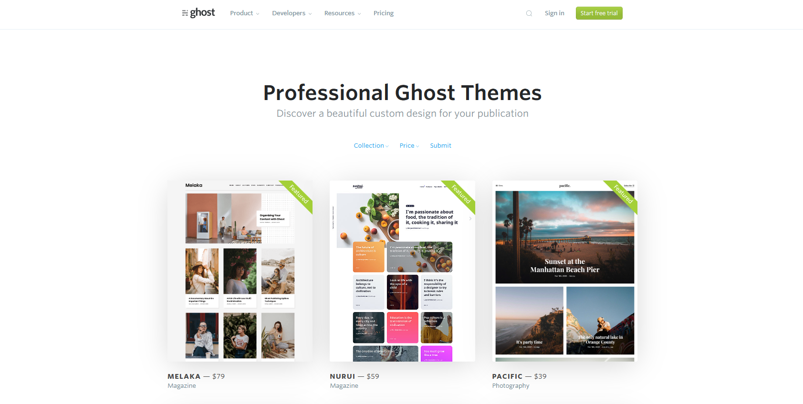

## Do you need customizations?
Unlike wordpress there are not many free themes available for ghost. Maybe a silent reason for this could be ghost's node based architecture. While `PHP` has been there for more than a decade, node is still maturing. One more reason could be that you don't get nodejs hosting for free; In fact nowhere near to php based cheap hosting services.

There are only a handful of free themes available on ghost marketplace. Though they are good enough but the options are very limited. And `paid themes` can go anywhere from 30$ to 100$. Also one point to note is that in wordpress the theme can give you thousands of customizations but in ghost there is almost no UI based changes that you can do.


On trying out every free theme I realized that I like some features from one theme and some from other. For example Liebling has a cool feature to show gallery with zoomable images but sadly Casper does not. To get everything to my liking I need to start udpating the theme myself. Moreover being a developer I always want to be in control of the website. 

## Change theme name
Though its not compulsory, but just to avoid collisions and keep changes separate from the default theme and to make it easy to troubleshoot you can rename your theme. Just update the `name` property in the `package.json`. Once you do this, `yarn zip` will create the zip file with this name.

```json
{
    "name": "casper-custom",
    "description": "A clean, minimal default theme for the Ghost publishing platform",
    "demo": "https://demo.ghost.io",
    "version": "3.0.12",
    "engines": {
      "ghost": ">=3.0.0",
      "ghost-api": "v3"
    }	
}
```

```bash
$ yarn zip
yarn run v1.19.1
warning casper-custom@3.0.12: The engine "ghost" appears to be invalid.
warning casper-custom@3.0.12: The engine "ghost-api" appears to be invalid.
$ gulp zip
[12:15:44] Using gulpfile C:\projects\ghost-local\content\themes\casper-custom\gulpfile.js
[12:15:44] Starting 'zip'...
[12:15:44] Starting 'css'...
[12:15:45] Finished 'css' after 1.57 s
[12:15:45] Starting 'js'...
[12:15:46] Finished 'js' after 367 ms
[12:15:46] Starting 'zipper'...
[12:15:46] Finished 'zipper' after 87 ms
[12:15:46] Finished 'zip' after 2.03 s
Done in 3.92s.
```

## Zoomable gallery

| Image                                        | Image                                    |
|----------------------------------------------|------------------------------------------|
|  |  |


If you click on any photo in above gallery you should zoom into the image to full screen. I believe this is an important feature and if not with the zoom feature, at least a link to the image so that the user can see a maximized version of the image as per need. Right now there is no way for the user to view the image properly.

[liebling](https://liebling.eduardogomez.io/) theme uses a library [medium-zoom](https://github.com/francoischalifour/medium-zoom) to achieve this.

So I tried to incorporate the same for the `casper` theme too. To implement that you need to add `medium-zoom` to your theme. You can either include the medium-zoom script directly in html

```html
<script src="node_modules/medium-zoom/dist/medium-zoom.min.js"></script>
```

Or you can also add the medium-zoom minified file in the theme folder. Since casper uses gulp to build the dist version of the theme. Just make sure that you add the file inside the directory listed in the src of gulp function. Otherwise those js files will not be picked up while creating the dist version.

```js
function js(done) {
    pump([
        src([
            // pull in lib files first so our own code can depend on it
            'assets/js/lib/*.js',
            'assets/js/*.js'
        ], {sourcemaps: true}),
        concat('casper.js'),
        uglify(),
        dest('assets/built/', {sourcemaps: '.'}),
        livereload()
    ], handleError(done));
}
```

Now you need to call the global medium-zoom function to apply the zoom effect to your images.

You can use any existing js file or can create a new js file. Look out for the path in the gulpfile and create a new file probably under assets/ folder. You can give any name to the file `medium-zoom-loader.js`. Add below line to the file and run `yarn zip` to refresh the theme bundle.

```js
// Call medium zoom library on all gallery and post imgs within post-content
mediumZoom('.post-content .kg-image-card img', { background: '#111' });
mediumZoom('.post-content .kg-gallery-card img', { background: '#111' });
```

After doing this, I faced one issue. Maybe because of other css properties of casper theme, the image was not getting visible. To circumvent that I had to use a hack for now. Add this to the screen.css file anywhere.

```css
.medium-zoom-overlay,
.medium-zoom-image {
  z-index: 100;
}
```

Medium zoom gives you some configuration options like background, setting offset etc. Check out those options on its [github](https://github.com/francoischalifour/medium-zoom) page.

## Case change
Somehow I don't like that the author name is shown as all caps everywhere. Especially when you have a username like `amt8u`. To remove this uppercase transform I had to remove the `text-transform` from the screen.css at two places.

```css
.post-card-byline-content {
    flex: 1 1 50%;
    display: flex;
    flex-direction: column;
    margin: 2px 0 0 6px;
    color: color(var(--midgrey) l(+10%));
    font-size: 1.2rem;
    line-height: 1.4em;
    font-weight: 400;
    letter-spacing: 0.2px;
    /* text-transform: uppercase; */
}
```

```css
.post-full-byline-meta {
    margin: 2px 0 0;
    color: color(var(--midgrey) l(+10%));
    font-size: 1.2rem;
    line-height: 1.2em;
    letter-spacing: 0.2px;
    /* text-transform: uppercase;; */
}
```

## Add commenting system
Wordpress comes with its own commenting system with all necessary actions. But ghost does not have any in built system for comments as of now. But integrating a third party comment system is quite easy.

I used [disqus](https://disqus.com/admin/create/) to add comments to my site. For this you need to create a disqus account and add a site to it. Once you are done, you just need to add below code snippet to your `post.hbs` file. Just change the `insert-shortname-here` to your website shortname found in the Edit settings window in disqus. And thats it.

```html
<div id="disqus_thread"></div>
<script>
    var disqus_config = function () {
        this.page.url = "{{url absolute="true"}}";  
        this.page.identifier = "ghost-{{comment_id}}"
    };
    (function() {
        var d = document, s = d.createElement('script');
        s.src = 'https:/<insert-website-shortname>/embed.js';
        s.setAttribute('data-timestamp', +new Date());
        (d.head || d.body).appendChild(s);
    })();
</script>
```

## Syntax highlighting
In wordpress syntax highlighting was possible using external plugins. Looking at other websites it feels that it should be a basic feature and browsers should support it by default. But its not that easy and many people like different kind of color schemes. And of course there are hundreds of languages. The best and easiest way I could figure out is using a third party library [primjs](https://prismjs.com/).

You dont need to change anything in the theme code to achieve this. You can directly use the code injection feature of ghost to add the required files to each page. 

```html
<link rel="stylesheet" href="https://cdnjs.cloudflare.com/ajax/libs/prism/1.15.0/themes/prism-okaidia.min.css"/>
```

If you want to get rid of the render blocking CSS you can use this method to defer the css load and improve your site performance.

```html
<link rel="preload" href="https://cdnjs.cloudflare.com/ajax/libs/prism/1.15.0/themes/prism-okaidia.min.css" as="style" onload="this.onload=null;this.rel='stylesheet'">
<noscript><link rel="stylesheet" href="https://cdnjs.cloudflare.com/ajax/libs/prism/1.15.0/themes/prism-okaidia.min.css"></noscript>
```

```html
<script type="text/javascript" src="https://cdnjs.cloudflare.com/ajax/libs/prism/1.14.0/prism.min.js"></script>
```

```html
<script type="text/javascript" src="https://cdnjs.cloudflare.com/ajax/libs/prism/1.14.0/components/prism-css.min.js"></script>
<script type="text/javascript" src="https://cdnjs.cloudflare.com/ajax/libs/prism/1.14.0/components/prism-javascript.min.js"></script>
<script type="text/javascript" src="https://cdnjs.cloudflare.com/ajax/libs/prism/1.14.0/components/prism-sass.min.js"></script>
<script type="text/javascript" src="https://cdnjs.cloudflare.com/ajax/libs/prism/1.14.0/components/prism-bash.min.js"></script>
<script type="text/javascript" src="https://cdnjs.cloudflare.com/ajax/libs/prism/1.14.0/components/prism-markdown.min.js"></script>
```

An alternative way is to download all required files to your theme's folder and use relative paths as explained in below posts.

https://blog.checkyo.tech/2018/06/26/easy-code-highlighting-in-ghost-with-prism/

To get the highlighting to work you just need to create code blocks and specify a language for that block. To create a code block just add new block in ghost editor. Type three continuous tilde ` ``` ` and press `enter`. You can specify the language on top right of the block. You won't see the colors in the editor though. You can use the preview action or publish and checkout the results.

There are other modifications that I am working on right now. Once done, I will update this post.

##  ** Update 07 July 2020 **

### Remove unwanted links
While looking at some ghost related blog posts I encountered one post with some more suggestions. I agree with the author and added one to my site.

Another helpful post for customizing casper theme - https://hooshmand.net/the-first-five-things-you-should-modify-in-ghost-2-0s-default-theme-casper/

As mentioned by the author, leaving default links looks a little unprofessional and is something I used to do with wordpress all the time. Just find the link wherever it is in the .hbs files and either comment out or delete.

```handlebars
{{!-- <a href="https://ghost.org" target="_blank" rel="noopener">Ghost</a> --}}
```

### Disqus alternative
Just out of curiosity I checked my sites performance and to evaluate it I was looking for all the requests that were going through the site. Strangely I saw a few requests which were not part of my the Blog. On checking them out I noticed those were requests to third party ad aggregator services. And on further investigation I found that they were all originating from Disqus comments. I looked up the disqus settings and it was mentioned that the platform will be used to identify potential customers. I quickly turned off the feature and started looking for a potential alternative. 

Upon searching over the net about ghost themes and related articles I found one site using a different kind of commenting system. It looks promising with a simple interface and without any ad services enabled by default.

Another blog using hyvor for comments - https://grantwinney.com/5-quick-hacks-for-your-ghost-theme/

The installation is simple and similar to disqus. You just need to add a code snippet given by the hyvor installation guide page to your `post.hbs` file which has a unique site id.

```html
<div id="hyvor-talk-view"></div>
<script type="text/javascript">
    var HYVOR_TALK_WEBSITE = <YOUR_WEBSITE_ID>; 
    var HYVOR_TALK_CONFIG = {
        url: "{{url absolute="true"}}",
        id: "ghost-{{comment_id}}"
    };
</script>
<script async type="text/javascript" src="//talk.hyvor.com/web-api/embed"></script>
```

> End


