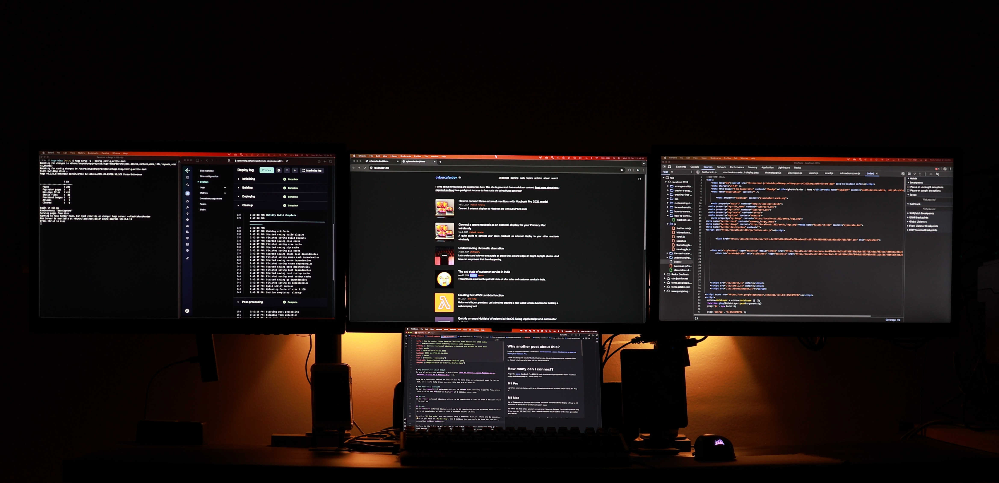

# Why another post about this?
In one of my previous article, I wrote about [how to connect a space Macbook as an external display to a Macbook Pro](https://cybercafe.dev/how-to-connect-spare-macbook-as-external-display-wireless/). 

This is a subsequent result of that but had to make this an independent post for better SEO, so it could help those who need this but are'nt aware of. 

# How many can I connect?
As per the [specs](https://support.apple.com/en-in/111901) **Macbook Pro 2021 16 inch** simultaneously supports full native resolution on the **built-in display** at 1 billion colors and:

## M1 Pro 
Up to **two** external displays with up to 6K resolution at 60Hz at over a billion colors (M1 Pro) or

## M1 Max 
Up to **three** external displays with up to 6K resolution and one external display with up to 4K resolution at 60Hz at over a billion colors (M1 Max)

So with a `M1 Pro chip` you can connect only 2 external displays. Third one is possible only if you have an `M1 Max chip`. And I believe the same would be true for the next generation **M2**, **M3** etc.

Now here is the trick to add one more to the setup. They haven't mentioned this in the spec though. I believe because airplay based connection is not comparable to native video outputs.

> To get an additional display over and above the two already connected, you can use the magic of **Airplay**
> 
> That means in total you can have 4 independent displays simultaneously running on a Macbook Pro M1 Pro chip

# Why it works?

Apparently **Airplay is not handled by the GPU**. The GPU can handle only 2 external displays, but somehow internally airplay connected device is not part of that list. And thus allows you to connect an airplay supported device to the Macbook as an external monitor.

## Monitor with Airplay
Generally monitors are not equipped with Airplay unless you are buying a smart monitor or a smart TV. If you have one then you just need to enable the mirroring option and let the Macbook discover it automatically.

## Monitor without Airplay
For those like me, who don't have the budget to buy airplay supported monitors, and have spare regular monitors(HDMI/VGA), you have some alternatives

### Airplay Dongles

There are [dongles](https://www.amazon.in/BLACKPOOL®-Wireless-Miracast-Receiver-Compatible/dp/B0BRSVNPWP/ref=sr_1_16?crid=VRXGHL0W3HJ8&dib=eyJ2IjoiMSJ9.7zKZ5S0hrBGWsIPdNBJlLz4ffUA8UKEM06lxdcA1804cnWKzDj_PsSDFlMBubJv1iuDcn4Adxlty2OgvcIu-9zv_P1kNXoJXODffdMCrL8YjNHCeqK8wenniddI_CDVsopisUSCFUEPTHDSUEd1Hlj2cDjn8-KvoN-jQBrsvdM45wAiJB68ZwKoOmiPg-LHYB5LvOzamM34t4O8vqIRP6FFL6BI68W_JnSqYkpIbZCPwZTCRdVbqnYAyueHJ3ATwz_UVxqfFe5_luKs6jW2ldf_QoSvM5WTQI_ZK61tV5t8.Iol9Jhv80pSDHMnP-_ORjR8R87XPSzhdD0vq_3JPwVk&dib_tag=se&keywords=airplay+adapter&qid=1732774742&sprefix=airplay+%2Caps%2C207&sr=8-16) available which plugin to the monitor using HDMI and receive airplay signals. These devices will show up on your Macbook as Airplay enabled mirroring device. If you search on Amazon there are thousands of options. Mostly they all feel like same product coming from China branded by indian companies. I tried a couple of them, but they didn't reach my expectations.

* [Anycast Wireless WiFi 1080P HDMI Display TV Dongle](https://www.amazon.in/dp/B07SG3ZT9L?ref=ppx_yo2ov_dt_b_fed_asin_title) - Find my review of this item on [Amazon](https://www.amazon.in/gp/customer-reviews/R15NFV5EQVTX5K/ref=cm_cr_getr_d_rvw_ttl?ie=UTF8&ASIN=B07SG3ZT9L)
* [V88R® HDMI Wireless Display Adapter WiFi 4K & 1080P Mobile Screen Mirroring](https://www.amazon.in/dp/B0BRSVZHVP?ref=ppx_yo2ov_dt_b_fed_asin_title) - Similar to the above one, [REeview here]([Amazon](https://www.amazon.in/gp/customer-reviews/R1JVVB3IPST2DX/ref=cm_cr_dp_d_rvw_ttl?ie=UTF8&ASIN=B0BRSVZHVP).)

After reading the other reviews and also with my experience, these dongles are not capable of running 1920p resolution.

They have two modes `Game` and `Video`. With game mode, you only get upto `1280p` and with Video mode, you do get `1920p`, but the quality is not good. Text becomes quite fuzzy and it starts lagging a lot. What I feel is that they might be just extrapolating 1280p just to touch the spec of 1080 Full HD.

In fact the same product is available from a different seller(at the same price) with `4K` in their name. Checkout [this](https://www.amazon.in/BLACKPOOL®-Wireless-Miracast-Receiver-Compatible/dp/B0BRSVNPWP/ref=sr_1_1_sspa?crid=2T1QAKI4EDXB6&dib=eyJ2IjoiMSJ9.0xrksU_lTseojVc-wMOFbWcpbG48_QDl5J63GdFA0XOuGOrCoww2zRTaKHdbN1-Mn-CbdcdAwygFH_v8sqVBfHoG2cfoguamLw5gm-WHMvEamXeI0HfZ9LCQKrMH0-tD-GSyAma84ljQrkyQwHo8ujDXMd-twwBsYU7Y7qSyDgf8mGaIa4iHQdVu6QxCFhDlS3j5m5Nw05tyEfD_N8ilVuIZ6-x4AXRHMLt8xQcrmP0.79gMY2eB1PuTPottGvdA58b5ML7_yH1EqVcsg0v8Fb0&dib_tag=se&keywords=airplay+receiver&qid=1734959801&sprefix=airplay+receiv%2Caps%2C204&sr=8-1-spons&sp_csd=d2lkZ2V0TmFtZT1zcF9hdGY&psc=1). You can try `4K`🤓 on this.

There is one that looks promising - [Tobo HDMI Wireless Dongle](https://www.amazon.in/Wireless-Tobo-Miracast-Mirroring-Projector/dp/B08VR8XNZD/ref=sr_1_6?crid=2T1QAKI4EDXB6&dib=eyJ2IjoiMSJ9.0xrksU_lTseojVc-wMOFbWcpbG48_QDl5J63GdFA0XOuGOrCoww2zRTaKHdbN1-Mn-CbdcdAwygFH_v8sqVBfHoG2cfoguamLw5gm-WHMvEamXeI0HfZ9LCQKrMH0-tD-GSyAma84ljQrkyQwHo8ujDXMd-twwBsYU7Y7qSyDgf8mGaIa4iHQdVu6QxCFhDlS3j5m5Nw05tyEfD_N8ilVuIZ6-x4AXRHMLt8xQcrmP0.bcFfIpIocgLAq3AD6DWCp1VXgb0fwwtln3jURvhYen4&dib_tag=se&keywords=airplay+receiver&qid=1734959801&sprefix=airplay+receiv%2Caps%2C204&sr=8-6), but I have lost trust so I won't be trying that.

There are certain limitations with these because of DRM copyright controls, so apps like Netflix, Primevideo may not work. Will talk more about them in the later section

### FireTV
Fortunately, I had one spare `FireTV stick` 2nd generation which was lying unused. Though Firetv doesn't support airplay natively but with a quick search, I got to know that there are some apps that can be installed on the firetv-stick which would enable airplay connectivity. On searching the app store there are many such kind of apps.

* Airscreen - Only 5 min free, you need subscription. Airscreen worked better but many options were behind the paid subscription, but I didn't need those
* Firemirror - https://www.amazon.com/FireMirror-AirPlay-Mirroring-Supports-Spotify/dp/B0BZDC5MJZ. Again 5 min limitaiton after using first set of free minutes.
* Dualscreen - No nonsense app. For configuration features you need to pay. It says that please purchase access to remove ads, but I haven't seen any ad while mirroring.
* Airplay Cast and many others. - You can hit and try but I didn't have time. For me Dual screen is working for now. Will update if I find a better one.

# End result
And here is a snapshot of how the setup looks like. The leftmost one is airplay driven. You can see the hanging **firetv-stick** in the black silhouette😏. I moved the netlify and server logs terminals to that window which does not need much interaction but needs constant viewing.

# Cons of this approach

## Performance
Since this is a network solution, **there will always be a certain lag** and of course you will not get the same performance as a `DP`, or `HDMI` connected hardware. You can't use it for purposes like gaming, but it could be used where fast response is not needed. Eg. for productivity you can use it to view logs, dashboards. Basically for those windows where minimal interaction is needed but needs to be in constant view.

> Depending on the network, Wi-Fi strength, location of your devices and various other ffactors, the performance could be from slightly laggy to utterly useless.

## Cost
As it turns out, all the apps I tried, work for a few minutes and then ask for subscription to continue using them. Some of them even mention free in their logo, but aren't. Apps should move all the configuration behind a payment, but at least the basic usage should be provided for free. But then that is upto the developers.

If you find a good free alternative, then good, else be ready to pay for using this method.

## Quality
The quality of the display won't be equivalent to HDMI connected monitor. Though the resolution is same like `1920x1080` but the overall quality is not good. Text doesn't look that crisp. Maybe good for watching videos from a distance.

In some apps, I was able to switch to a 1440p even when the monitor itself can only hanlde 1920. But the performance drop was too high thus making it useless.

## Copyright protection
For apps like **Netflix** and **Primevideo**, there is **DRM copyright protection which prevents them from being cast on displays using mirroring**. If you try to play a video, it will show a black screen. That's more of a con of using airplay/cast technology.

The strange thing is that when you have an active airplay connection, and you want to play something on your regular HDMI connected monitor, they show black screen. It was really frustrating when I first encountered this. There was no indication that it is happening because of DRM protection while doing screen mirroring. Maybe they should write somewhere - "Cannot play while airplay/cast is active".

> End