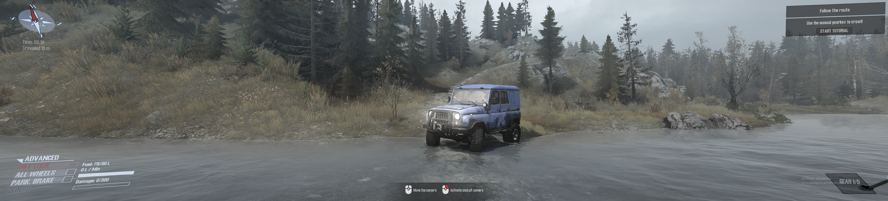
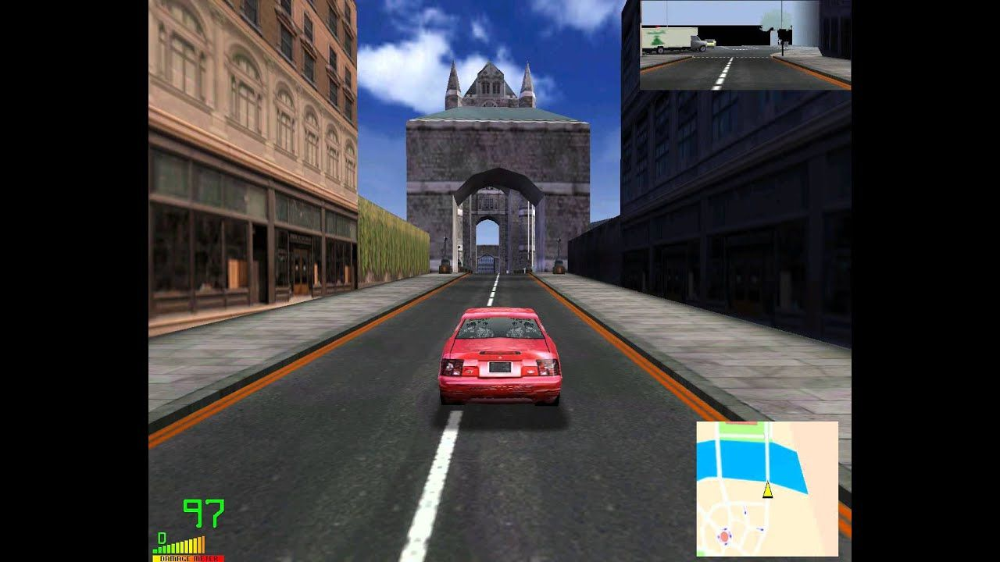
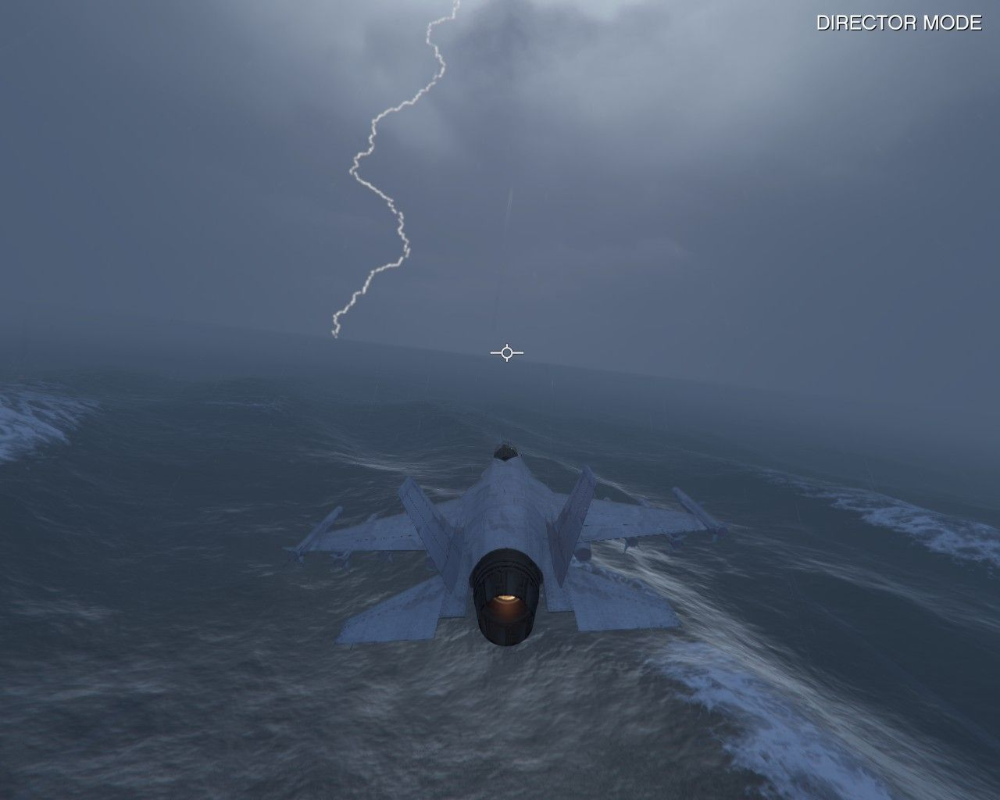

## Mudrunner - Not a review

### Intro
Well this is not a review per se as I don't have much experience on the game yet. Take this as more of a beginner's experience which might help people understand the game(**Simulator**).

You can checkout the game on [Steam](https://store.steampowered.com/app/675010/MudRunner/).

> MudRunner is the ultimate off-road experience putting the players in the driver seat and dares them to take charge of incredible all-terrain vehicles, venturing across extreme Siberian landscapes with only a map and compass as guides!

[Amazing graphics](images/2020.07.02-15.07-1.png)
[You can even see water marks](images/2020.07.02-15.07_02.png)

### Games in Indian market

Games are super expensive in India. Some of the titles with DLC worth more than the average desktop's hardware people own. I know most of the games you can find on torrent and for a lot of them that is the only source. But with Steam sales, I guess the market is slowly opening up. Just for eg. `Battlefield` costs around `Rs 4000($53)` which is a very high value as per Indian standards. `Rs 4000($53)` is the monthly rent of a 1bhk house in small city. That said, I always watch out for ongoing sale and purchase game at **discounted** rates. Maybe pricing needs to be kept region wise. That would help in publishers selling copies in large number and in turn getting more revenue instead of selling limited copies with high costs.

### Always a n00b
Coming back to my gaming profile. I am a casual player and have played only a few of popular titles like **NFS, GTA, COD, CS** etc. Although I was interested in games since childhood but expensive hardware and software didn't let me play much. Nevertheless I did enjoy whatever I played.

###Open world virtual freedom

(Image copied from https://i.ytimg.com/vi/KRDBnucwdxw/maxresdefault.jpg)

I was always a fan of **open world** games. If I can remember correctly **Midtown Madness** was the first open world game that I played. I could drive anywhere in any direction. That was an exciting time for me. Before that I played NFS 2 Second Edition in which finding a shortcut in the race was the most exciting part. At that time I thought, maybe they can make the boundaries go away and I can drive anywhere on the map. Soon with **GTA** that became a reality. I started with GTA Vice City and it had what I asked for. It had all the elements. You can go anywhere, drive any vehicle that you see, kill any character that is moving. And hell yeah, you can fly too. Yes only helicopter but at least you could.

With every new release physics got better and it all started looking real. Being an arcade game GTA is still far from simulation but I enjoy the artwork and the realism it gives us. I haven't tried other open worlds games like Watchdogs etc but I hear that those are also good. When I had time, I didn't had money, now I have money, I don't have time. But I will surely try at least all the open world games just to get the feel of it.

### Arcade vs Simulation
Though in most games you might find an option to switch between arcade style or simulation. But I still  feel simulation is totally a different genre. In an arcade game your requirements are different, you need
* A good story
* A complete set of soundtrack that fits the storyline as well as is entertaining
* Character development
* Unreal stunts even if the mechanics and physics naturally won't allow it
* Graphics - Not just as real as it gets but vibrant colors and scenic beauty

But in a simulation, requirements are different
* **Physics, Physics and Physics** - Thats why its called simulation. The speed of a vehicle should depend on the load it is carrying, how much is the damage, on turning the vehicle should bank depending on what load it has etc. I think you get my point.
* **Match with real world** - Ofcourse since it will always be a virtual thing, there cannot be a 100% match. At least not soon. Maybe in next 50 to 100 years? But even now I think we are going at a fast pace. 
* **Actions which feel real** - Manual gearbox, real life attachments, attachments which can be operated and with each action it might change the dynamics of the vehicle. So basically do it how you would do that activity in real life.
* **Environment** - Everywhere its mud and water. You can get stuck in mud if you don't take care. You might need to rescue your vehicle using another vehicle to tow out.

## Verdict
I generally don't believe in ratings as ratings are driven through various factors. Sometimes they are not even justified. It all depends on personal choice. Having set the expectations here are few pointers about Mudrunner. Whether its a pro or a con is totally upto you. 

1. Mudrunner is not an arcade game. 
2. For a simulator it has good graphics and on top of that it loads instantaneously. In 5 seconds you can go from game menu to ready to play.
3. Hardcore mode is hard and gives you the best simulation. You need to do lot many things in order to complete an activity.
4. Remember that completing a mission/objective is not the aim. The value is in the process. You will appreciate the game more if your focus is on the physics and realism it gives
5. Many people who have never driven a vehicle would find this very boring and frustrating. There is no sort of story. Its just simple activity based simulator.
6. I have heard it plays well with a driving setup including steering wheel, pedals and shifter(We call it gear in India). I have not yet tried but maybe soon.
7. Each vehicle is different and behaves differently in different situations. If your truck gets stuck in mud and you don't have a place to pull it up with a winch, you would have to rescue it with another vehicle
8. It is never about speed. Maybe in challenges or some other map there can be speed based scenarios. I am yet to discover a lot. But in the single player mode its all about the activity. You have unlimited supply of fuel from the fuel stations. You have to bring your vehicle to a station to refuel or bring a fuel tanker to the vehicle if you are out of fuel. It took me 5 hours of gameplay just to understand what I need to do. Of course I could have taken help from internet but I wanted to checkout what I can do until I get stuck.
9. Since I started directly with hard core mode, It was really difficult to understand what I am supposed to do. The mission objective was simple - Deliver logs to mill. But I had to figure out how to achive that myself. Which vehicle should I take, what attachments I need and so on. Maybe for people who already played Spintires or instead of hardcore played on casual mode first, the experience might differ. 
10. I have never driven offroad and that's where I like simulations. I get to try out how machines work in real environment. I can't compare if the vehicles behave exactly same as how 4x4 vehicles work in real world but looking at the gameplay it looks like it does.
11. You have Automatic/Manual gear boxes. On a keyboard I feel automatic makes more sense but if you get a wheel and shifter, manual will really push boundaries. 
12. The environment is mostly lonely. In the whole map there is no activity other than what you are doing. Just the water flowing and birds chirping. Infact there is only one character which is you and it always remains in the driving seat of the vehicle. I am yet to realize whether the character has a face or not:-P. 
13. If you are new to this game and do not take the tutorial, you will not understand anything.

### The Dispute
After reading about the game for a couple of days I have learned that originally it was Spintires and because of a dispute between the publisher and developer, this new game was forked out based on same engine and dynamics. Some people say that its the dev who stole the game and started his new venture, while some say its the publisher who didn't pay the dev as per the contract. 

I don't know It would have been better if this didn't happen. Instead of having three separate titles it could have been a series just like GTA with a lot of improvements overtime. But things ought to happen. Whatever the history is, for me as a customer Mudrunner is a product for which I paid for and it feels justified.

> End