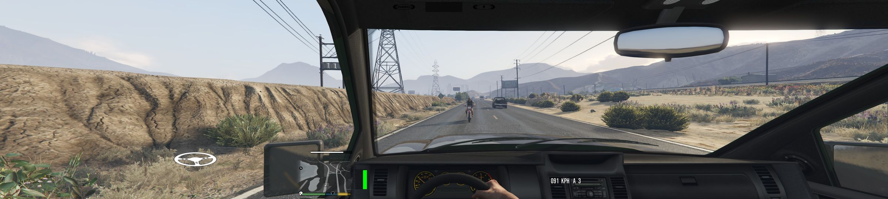

If you like to play fast-paced racing games and want to experience realistic handling and controls, the answer is a racing wheel. I will talk about my first hand experience of using a Logitech G29 wheel.

# The need

Video games are considered a way to relax and enjoy. You can do things what you cannot do in reality. Some games are just meant for that while there are a few games which will fit in the **simulation** genre and give you a wholesome true experience. There is a long list but some popular ones are Grid, Dirt, Forza, Project Cars, Asseto Corsa etc.

While we have the regular hand held controllers which are a great fit with consoles like PS4 and XBox, an imitation wheel gives you a better experience and is mostly supported on consoles too with varying degrees.

For serious gamers or enthusiasts, a wheel and pedal setup can make you feel like you are in a car. This will take you one step further into virtual reality. With a VR headset and a computer controlled seat, you can fully immerse yourself in the game. Just like matrix:-P.

While there is no limit to spend on these products, you are mostly always bound by the budget. For around Rs 30k(500$) you can get a decent wheel with shifter. I just bought myself [Logitech G29 Driving Force Racing wheel](https://www.logitechg.com/en-us/products/driving/driving-force-racing-wheel.html)

https://www.logitechg.com/en-us/products/driving/driving-force-racing-wheel.html

# A good wheel

There are two versions of this product
* G29 is for PS4, PS3 and PC
* G920 for Xbox One and PC

Be sure to get the right one.

One good alternative is Thrustmaster's T150. For around the same price you can get that too. Since I didn't have any reference to compare, my choice was based on reviews on various forums.

https://www.thrustmaster.com/en_US/products/t150-pro-forcefeedback

# Features

You can always read about the features on the product page so I will not repeat the same. Mostly at this range you shall get a force feedback wheel with non-linear pedals with clutch and an optional shifter. There are many buttons on the wheel itself which you can program for various inputs depending on the game.

The G29's wheel can be mounted to a desk or table, with a pedal setup to go on the floor

# First time experience

This is the first time I have ever used a wheel and as its said - *first time is the best time*. For people who are upgrading from an existing wheel might very well know in advance what kind of experience they will get.

Just after plugging in all the wires and finally connecting the wheel to system, it rotated clockwise and counter clockwise with RPM lights glowing. With the sound of the rotation I can feel the sturdiness of the wheel. The motor in the wheel really felt strong.

There are 16 buttons with a D-Pad and a roller wheel on the steering. Initially it becomes a little overwhelming. I am yet to figure out the use case for the red roller wheel.

I had already purchased a few racing simulation games some time back. Thanks to Steam sales. But a new game would take some time to download and install. I used the already installed game to test it out. I fired up Mudrunner and in a few seconds I was in the game. But the steering was not working. Nothing was happening on moving the wheel or pressing the pedals. 

How can I forget that you need to install the drivers first. You need to install the Logitech G HUB program which surprisingly wasn't there in the box. As soon as I got the drivers installed, the wheel got its soul back.

I straight away went to the settings and saw that there is a wheel section in the controllers area. I configured all the controls. You need to press the pedal or click on a button to let the game know which control is assigned to which action. Apparently other modern games it was mostly automatic.

# Go Go Go

With a wheel there are mostly three variations of transmissions
1. Manual H Shifter(With clutch/Without Clutch)
2. Semi Automatic
3. Automatic

Automatic is like using a keyboard only. Instead of pressing **W** you would press the pedal to move forward. And brake to move backward. In semi-automatic you would use the paddle shifter present on the wheel or you can configure your optional shifter to set the Drive, Parking, Reverse gears.

My favorite is the Manual H Shifter with clutch which means its not just a game anymore.

# Manual H Shifter

I suppose that H stands for the pattern that gears make when you move them. With the clutch configured properly you will have to use the whole setup as if you are sitting in a real vehicle. If you do not use the clutch, your engine will stall just like real world. I can safely say that these simulator games can be used to train people too.

Depending on the game, there can be numerous settings available. You might need to drill through the menus and understand how you can make it suitable for your need. For example I had to switch the Force Feedback off initially. It was giving me hard time to control the steering. I wasn't sure whether it was an effect or a malfunctioned motor.

Before I forget, you would also need a sturdy table and a non-moving chair so that you don't move backwards when you use brake. The brake pedal is slightly stiffer than the clutch and accelerator. There is no feedback on the pedals. Its only the resistance that the pedals offer. You won't feel when the clutch is enganged. You have to go by the engine sound in the game.

# Simulators vs Casual games

On searching best simulators for PC, you would see a lot of people recommending Euro Truck Simulator. It is a very popular game even with the truck drivers community. After installing it, I can say exactly why. At first looking at the game's menu you might get a cheap feeling but once you start the simulator, you will surely enjoy the realism it gives. Just one point to note - "Trucks have 12 gears to shift not 6".

https://eurotrucksimulator2.com/

Though wheels are not officially supported by GTA, you can get it to work using a mod. Not sure about consoles but on a PC, Mods alter the original game and once installed, you might not be able to join GTA online.

I got the wheel to work using a popular mod. The Mod also needs a script injection tool located [here.](http://www.dev-c.com/gtav/scripthookv/)

https://www.gta5-mods.com/scripts/manual-transmission-ikt

This mod pushes your GTA5 experience to a new level altogether. Once installed, you can configure almost any setting including the auto reverse Camera view and map any button to your choice. For the first time I had to bind the controls manually and then it was a breeze. You can even bind indicators to buttons and become a responsible citizen in Los Santos.

# What is still missing?

**Motion**
With all this simulation setups there is always one thing which is absent completely.
Whatever speed you accelerate to, you still don't feel the motion that you would feel in a real car. Though there are simulators for that too, but way expensive and mostly suitable for a commercial arena. 

**Handbrake**
With this basic setup there is one drawback. You don't get the handbrake. It won't be much of a problem though as you can map a button on the steering but while gaming it becomes a little awkard to use that button. There are separate handbrakes also available which you can buy but not sure about the compatibility.

**Fine**
One more thing that you won't get with this setup is a ticket. You can drive as crazy as you want. You can even practice drink and drive:-D. 

# Final thoughts

If you like to play racing games and even if you are not a professional gamer, but you have some budget to spare after building your PC, I would highly recommend you to buy a wheel for yourself. Do remember to checkout the supported games list on the product page before buying. 

### Update 07 Sep 2020

Gameplay video available on youtube - https://www.youtube.com/watch?v=ru_qMTz9788

> End

