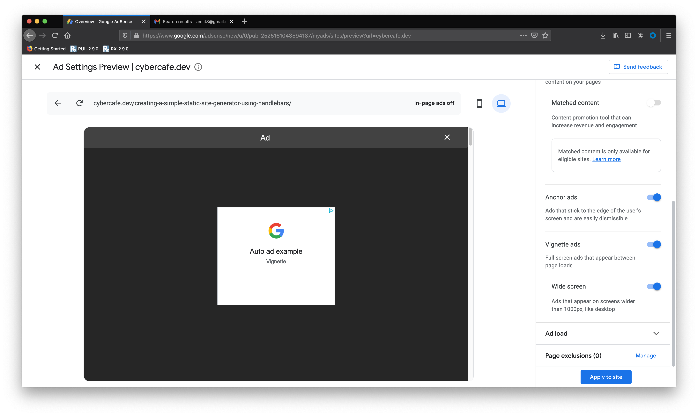

# The need
I already have a full time job and any side income would always be appreciated but I want my blog to be clean and elegant.

But just out of curiosity I wanted to try out how google adsense works. Here I will summarize my experience using the service for the first time.

# Open adsense account
Of course you need to register for google adsense just like you do for any other service even if you have a google account.

The registration is quick after which you need to add your site where you would like google to place ads.

At first I chose one of my [experimental site](https://cybr.cafe). The site submission was successful and it asked me to wait for a couple of days to complete the review of the site. My first thought was - why would google care if the site is not well structured, but it turns out the whole review process determines whether the site can carry ads or not.

So, that site was rejected maybe because it didn't have much content and was not properly structured. The message from google adsense team was - 

> **You need to fix some things before your account can be approved**

> *To see the reasons why we did not approve your application, visit google.com/adsense and sign in using the email address and password you submitted with your application.*

> *Valuable Inventory: No Content*

So eventually, I have to use my blog to experience the whole adsense service.

# Submitting blog

You don't need to create a new google adsense account for another site. You can directly goto the edit site setting and enter the new site address.

Again, they will review the site for a few days and you shall receive an email stating the obvious

> Your site is now ready to serve AdSense ads

# Marketting terms
From the email it looked like you don't need to do anything. Just goto adsense and enable auto-ads and done!

> If Auto ads are enabled for your site, you'll begin to see relevant ads within a few hours and can start earning money from http://cybercafe.dev. Otherwise, follow the steps below to turn on the ads you want to show. 

The way they say - *You can start earning money...* makes it so apalling. But the reality would be far away I suppose. Only future will tell.

## Auto ads
Auto ads are good to start with. You just need to enable a switch and put a small script in you head section on every page where you would like to show ads. If you are using a CMS like wordpress or ghost, you can just use the code injection tool to automatically update the `<head>` section for each page.

Since I am using **Ghostjs**, it was a breeze for me. 

## Ad formats
* In-page ads - Ads will appear in the body of the content. 
* Anchor ads - Ads will appear at the edges of the screen with `position static` so it will not be relative to content. User will have the option to hide them.
* Vignette ads - Full screen ads when you switch pages.

In the ad-editor screesn, google allows you to preview your site on the left side. On changing the options, the preview will load. Remember that the preview might differ for different pages like homepage and posts page and also it takes sometime to render. So please be patient.

After trying out all of them for a short while, I found *anchor* ads too obtrusive. Anchor ads spill out of the screen. Even if you hide them with the arrow button, the small anchor will still be protuding out and looked really awful. It was a design compromise for the whole site for every page and it will be there always whether the user is at the start of the page or end.

On a similar note **vignette ads** were destroying the whole site experience. On clicking a page, you will get an ad and then you need to manually close the dreadful fullscreen ad to goto the page content.

Now I understand why some sites like `timesofindia.com` used to have a landing page before going to the homepage. The landing page was just a placeholder for these type of ads.

Coming the **In-page** ads. They are two things that you can do

# Ad positions
You can modify the position of the ads. On the preview screen, just click the remove button and that area will be excluded for advertisment. The removed area will be added to a *Removed Section* which you can edit later on.

## Page exclusion
You can add pages where you would not like to display ads. Just enter the URL of the page. I disabled ads for the homeplage for now. It was little annoying and was destryoing the look of the site completely.

## Manual ads
If you are not satisfied with auto-ads, you can always goto the Ad unit creation page and create some customized ad units.

You can choose the size, background, fonts, styles etc to match with your site. You can create various kind of ad units

# Final thoughts
For now I have just enabled ads at the bottom of a post. Lets see how the experience goes and how many million dollars I would earn :-P.

> End
