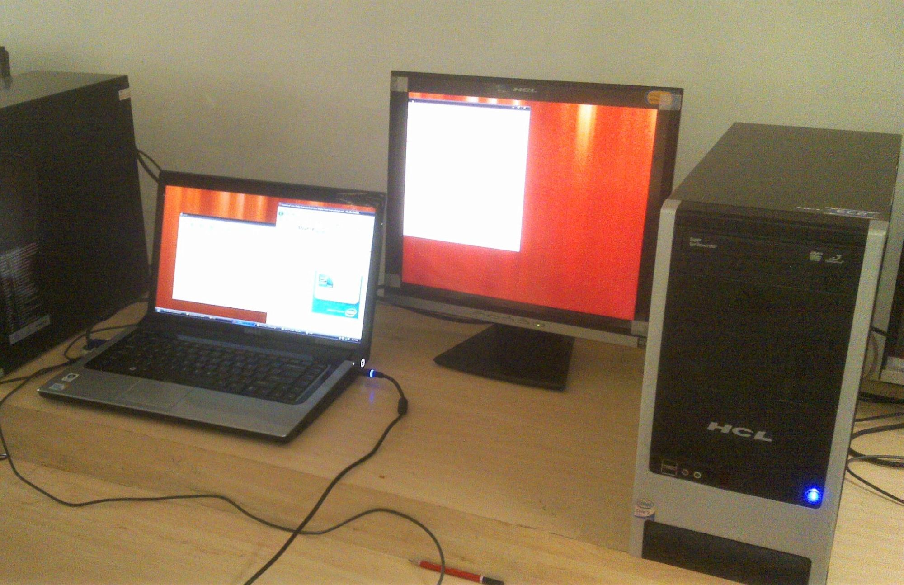
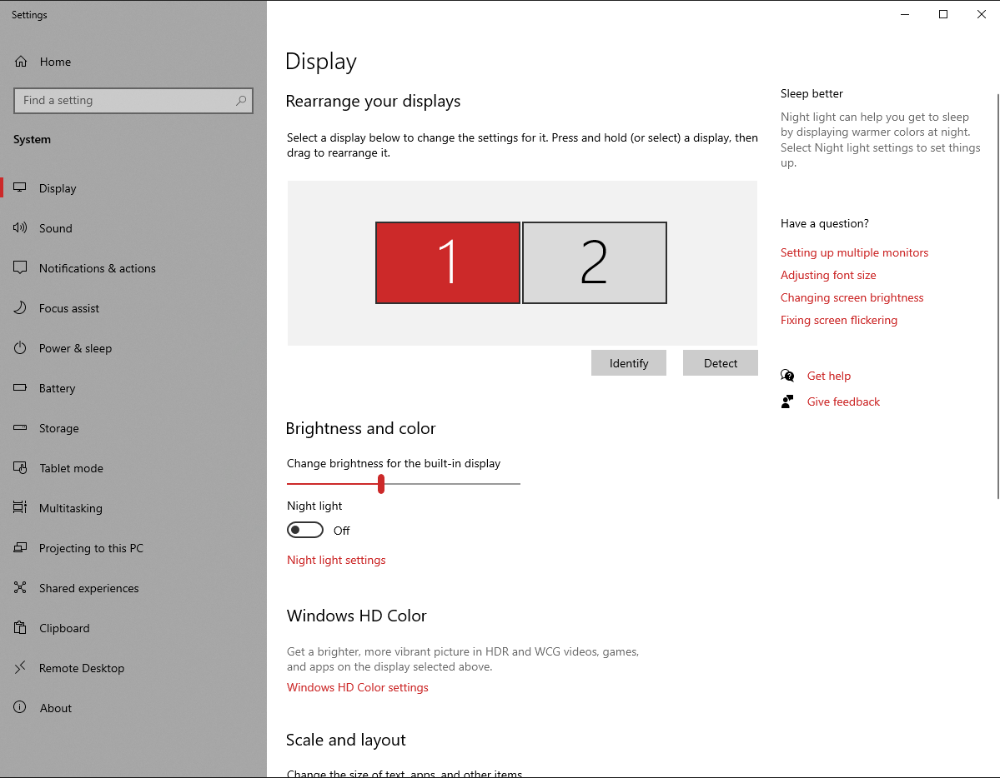
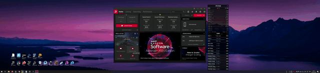
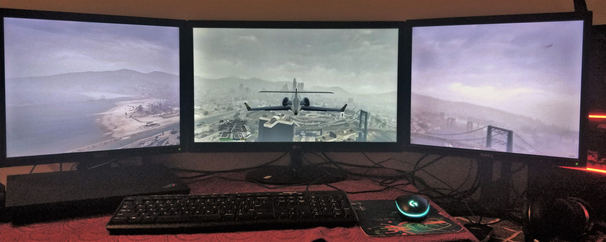
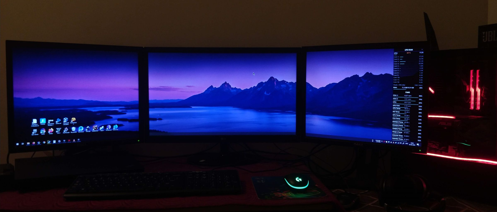
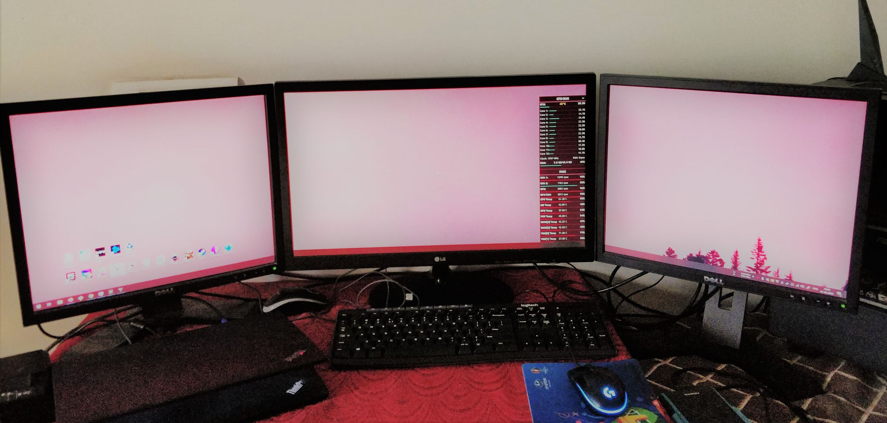

# My experience with multi monitor  setup

Now a days connecting multiple displays to a system is common and has evolved a lot over the years. For example if you are connected to a projector, you can set your audience view to show presentation while your laptop screen can show you a different presenter view where you can control slides.

## A brief history

I remember when I connected my Laptop - Studio 1555 to external monitor back in 2009 with a VGA cable and was amazed to see that I could get more working area altogether with a separate window and not just duplicated one. Since then I was always looking to hookup my laptop to any other screen I get a chance to work on. Soon I became the nerd in the college who codes on 2 screens. It was a thing those days.

## How many at a time?
Experimenting with different screens time to time I slowly learned that it is not about the ports that are available to connect, it is more about the graphics card which determines the resolution as well as the number of screens you can connect.

Those days we were used to VGA and HDMI was just getting popular. We didn't even hear about Display port, DVI etc as they were mostly not available on consumer laptops. Over time I learned that its not that easy. There are like multiple technologies with multiple versions with different types of cables and adapters. Soon it became difficult to answer what all you can connect to your laptop to.

### Seriously how many at a time?
Being an engineering student and a programming enthusiast I always see people using multiple monitors to code at one monitor, and run various commands in the other one while keeping a third one for reference material. 
After some research I found that laptops are generally fitted with graphics card which allow only 1 extra screen while some high end laptops can connect to two different screens.

I always wanted to have a system which can give me at least 3 monitors. Few years ago when I could afford one, I started researching about my options. I realized its difficult to get an answer directly, especially in laptops. Laptops have customized cards and are always targetted to save battery life. I could not find any general purpose laptop within my range. Plus upgrading a laptop is a nightmare and basically you endup in buying a new one.

So I started to look around for desktop options. Searching over internet to see which all cards can give me 4 or more monitors. My initial requirement was basic window management and not gaming but soon I realized that even simple 4 monitor setup requires a high-end card. Whenever I searched, I got results for PNY Quadro cards which are typically made for designers and not gamers. And they are also expensive.

After a lot of research I realized that 4 monitor setup would be very expensive even if I just want simple window management. I had to drop that idea and I started looking for 3 monitor setup.

Since my requirement wasn't gaming I did't give much importance to AMD Eyefinity and Nvidia's surround. But with time my budget increased and I could now look up for cards around 200$-250$(Rs 15k to Rs 20k).

I purchased AMD's **RX580**(Asus RX580 8GB) and assembled the system a few months back. I connected my two old Dell monitors which could not fully utilize the card's power. Recently I got hold to another cheap monitor but now I could connect all three and finally have a three monitor setup which looks great.

But there are some things which you need to keep in mind. Mostly these are just my experiences.

## Maximum monitors
First you need to check the specification page for the card you aspire to get. For my card the info is [here](https://www.asus.com/Graphics-Cards/DUAL-RX580-O8G/specifications/). There should be a column stating the number of maximum monitors.
There is one more important column which says maximum resolution. Do keep in mind it also depends on the port and refresh rate. For different values you get different maximum monitor support.

## Ports?
Cards come in various combinations. Check which all ports are there. The best choice as of now would be a combination of Display ports and HDMI ports with probably 1 DVI port. VGA is outdated and cannot carry high resolutions. DPs have the most flexibility. You can even connect multiple monitors in a daisy chain using DP.
Well there are adapters for every combination but with restrictions. For eg if you are connecting HDMI to VGA, you won't be able to transmit audio.
There are multiple versions for HDMI and DP. HDMI 2.0 and DP 1.4 are the latest ones.

## Resolution?
Every monitor can be different with different support. For eg you can connect your 1024x768 to VGA but your HD monitor with Freesync support to HDMI or DP. Depending on the individual resolution your total resolution will be evaluated. 4K monitors are limited to 30Hz with HDMI 1.4, so you are left with only DP connection for those if you want more than 30Hz.

## Eyefinity or Surround
AMD calls it eyefinity while Nvidia calls it Surround. Basically the concept is to combine the monitors into 1 single monitor. Somewhat you must have seen in markets and malls where 4 displays act as 1 big display. This required some setup and thorough understanding of below terms
Total resolution - The total effective resolution that you can achieve.
Bezel correction - Required if you plan to play games. Those one inch bezels of your monitor will be considered into rendering and you will have more natural looking view just like how you view out of a window with hinges.
Vertical and Horizontal offsets - Since all your monitors won't be of exact size. One can be of 24 inch while other can be 27, you might need to correct the offset so that the diplay matches seamlessly. Alternatively you can adjust your monitors too but that would be cumbersome if you don't have a good mount.

## Eyefinity problems
Your desktop gets converted into a big ultra wide setup. On maximizing any app, it would expand from left most to right most monitor. And since apps are not designed to support such ultra wide displays, mostly you will find empty space left or right if content is centered. 

With an earlier version of radeon software there were many options to configure your eyefinity settings. But with 2020 version there is only 1 option - Enable/Disable. I was not able to find where can I set the bezel corrections and other parameters. It turns out that they do support it but not via the main UI. Its hidden in program files where there is a separate program EyefinityPro.exe which allows you to configure all parameters. Looks like that is also in development as You can not edit configuration. You can remove and then create new.

Also not every game supports ultra wide resolutions. But the ones which support really looks good. I could fly a plane in GTA with an amazing view.

| ---                                        | ---                                        |
|--------------------------------------------|--------------------------------------------|
|  |  |
|  |    |

### Operating System
And ofcourse eyefinity is only supported in Windows.

#### Controls
Another issue that I have is brightness control. Radeon gives you the control but for individual monitor. If its too dark and I just want to decrease the brightness of all the monitors together, I simply can't. I have to goto the radeon control panel and select each display, drag the scale towards left to fit a level and repeat with all other monitors. 

#### Colors
If you have different panels, you will have different colors and brightness levels. It would be really difficult to get all the panels to same brightness and colors. So if you are seriously considering multi monitor setup and would be buying new monitors, you should get exactly the same model.

#### Toggling on/off
Although Radeon has an option which says launch with eyefinity. It allows you to use your system in normal separate monitor mode but just for the game, it enables the eyefinity automatically when you launch it through Radeon UI. But for some reason its not working for me. I have to manually enable eyefinity before starting the game. And ofcourse disable it after exiting as its terrible to use manage windows in eyefinity mode.

#### Documentation
Seriously! Radeon 2020 is a pretty revampled version and has a completely different experience so I expect that its still in active development. But I find even the older versions do not have in depth documentation for eyefinity. Even the supported cards page is broken. AMD needs to work on that.

Its not just AMD. For Nvidia too, its difficult to find any official help. In fact right now I can't even find the page on nvidia site where I could see the various cards and their maximum supported displays.

## Conclusion
It really adds value to your setup if you have multiple displays. You don't need to switch between windows every time you make a change. If your work revolves around anything similar to this, I would recommend you to get this setup.

> End

