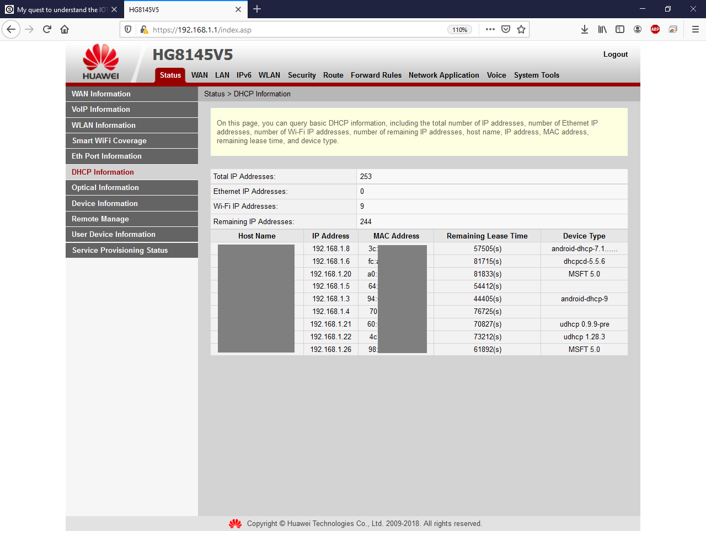
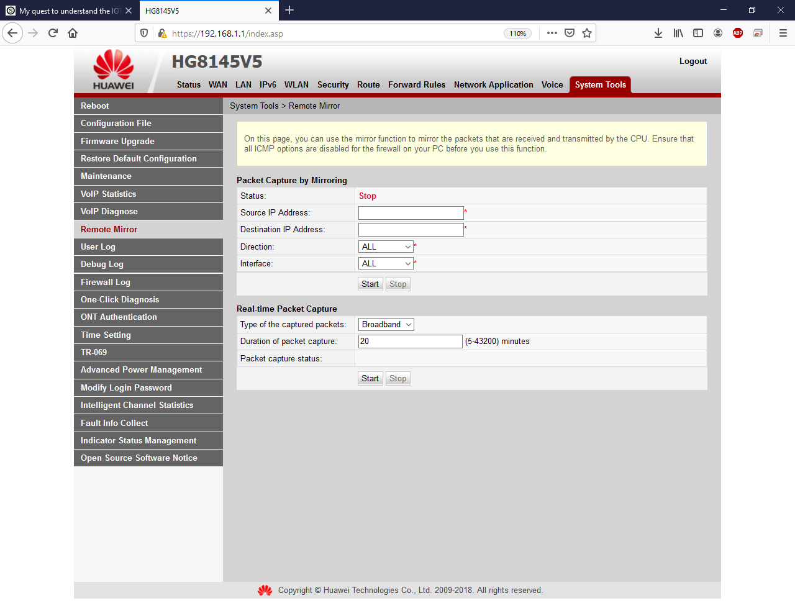
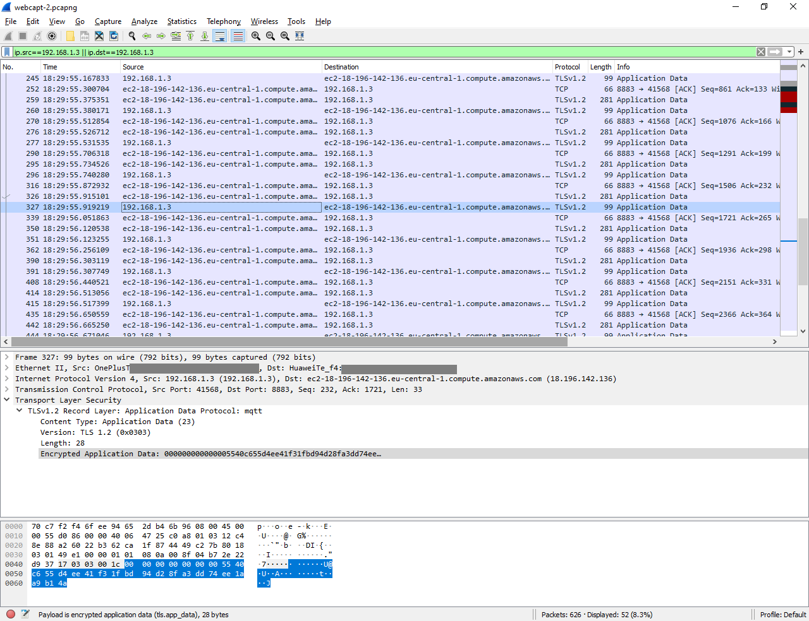
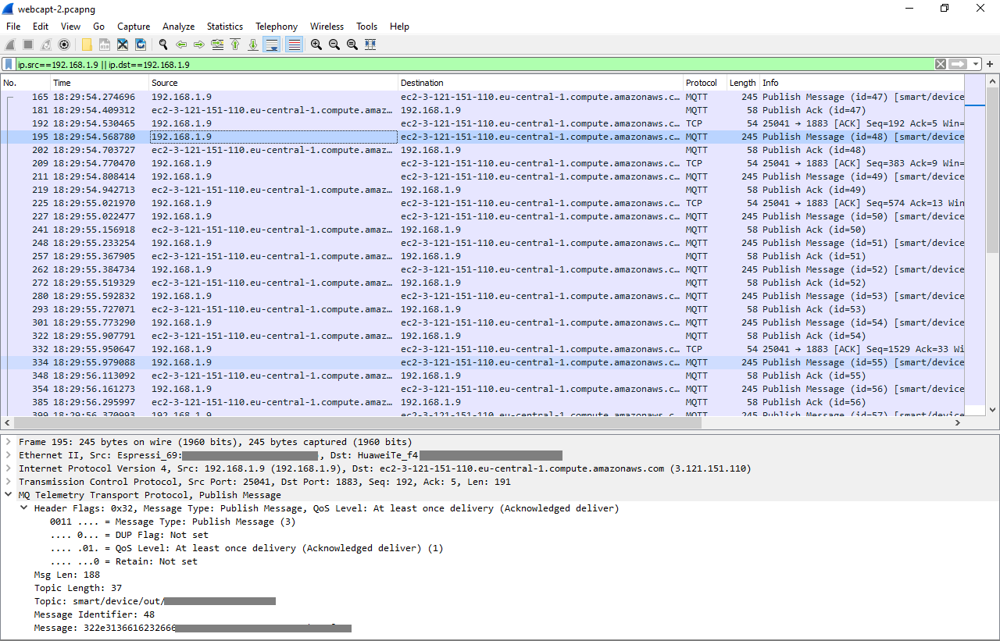

# My quest to understand how IOT works?

## Why
A few months back I purchased a smart LED light from Amazon. I was required to install an app and configure the light via that. The setup took 10 minutes to integrate the light with the app on my phone.

After the setup I cound control all the features of the light

```js
"Switch on/off"
"Change color"
"Change brightness"
```

I even connected it to my alexa and I could now control some actions by just saying

```js
"Alexa... Switch on the bedroom light"
```

For many days I used alexa and the phone app to control the light. But one day I observed that I can use the mobile app to control the light even when I am connected to my mobile data and *not* wifi. 

Until this time I was thinking all the devices are connected together because all of them are on the same *wifi* network. 

This observation comes from the fact that I can control my FireTV using fireTV remote app on the phone if both of them are on the same wifi network. Also I can use the screen cast option if my home theatre and phone are on the same wifi.

I realized that the smart light is connected to the outside world so that it can receive commands over the internet. The command can come from anywhere - Alexa, Smartlight software app on phone etc.

Having some basic understanding of networks I questioned myself : ==How is the light connected to internet?== There were several followup questions

```js
"Does the light maintain a persistent connection to the outside world?"
"Does the light receive commands from the outside world periodically?"
"Who initiates the request? The light or the server somewhere outside?"
```

Being a **front-end developer** I do not have the expertise in network protocols and my work mostly revolves around just one protocol http/https(If you leave the ftp etc). But I do understand the Client/Server architecture - How communication is done from device to device. I can position the devices on the OSI layer if asked to. With this limited knowledge I had one question in my mind.

## The question
All your wifi/LAN based devices are connected to the router in an internal network generally having a class C IP Address `192.168.*.*`.


The router is the device that connects to the outside world. The internet(or you can say your ISP) knows only about your router(Ofcourse it knows a lot of other things. Privacy is a myth now:-P). Whenever you request something from your internal device like laptop/mobile, from a very high level, below steps are performed.

*You can skip reading the below steps if you are already aware of NAT(Network Address Translation)*

```bash
1. The packets have source IP of the laptop and destination IP of the router
2. The packet reaches the router which now dissassembles the packet and modifies
the source IP as the router IP and destination IP as the resolved server's IP
3. The packet flows through the internet via several hops
4. The server prepares its response
5. The server sends the response with packets having source IP as the server IP
and destination IP as the router IP
6. The response packets travel all over the internet and finally reach the router
7. The router receives the packet and transfers them to the right internal device
by modifying the source IP and destination IP again
8. The internal device gets the information requested on its interface on the
appropriate port
9. The application reads the data and shows you the response on the app/browser or
whatever software you used to create that request
```

In networking terms the above procedure is commonly known as **NAT** - [Network Address Translation](https://en.wikipedia.org/wiki/Network_address_translation). The router is basically connecting two different networks together. As an user you won't find the difference but without this it would practically be a nightmare to manage IPs all over the world.

This brings us to new question(s)

The outside server is basically an always running program which looks out for any request coming to it on a specified port. If the request originates from the internal device the router knows where to send the response when it receives it. But in our smart-light case *how would the server find it?* Does it have the internal IP address of the light? And even if it has; is there a server running on the light which accepts the requests from the outside server?

## Search begins
With the above questions I started looking out for answers on the internet using the most difficult trick - search engine!

I tried my best but I wasn't able to find out any reliable information which would help me understand how the connection works. Maybe I wasn't looking for the right keyword. 


Mostly all articles just hovered around home automation(with ads ofcourse) and explained how it works with an overview of connectivity without going into depth. For eg [this](https://www.leverege.com/blogpost/iot-explained-how-does-an-iot-system-actually-work) gives an overview and it says that for in-depth details checkout [this](https://www.leverege.com/blogpost/iot-explained-how-does-an-iot-system-actually-work-part-2) which again is not in-depth. Barely touches the surface. So my search went on with no results. 

## 1st Clue - Capture everything
I approached a few of my colleagues discussing about the situation that I cannot get information on the subject. They suggested me to investigate it myself. They asked me to install a packet sniffer which would capture everything flowing through the network. It suddenly hit me and I remembered using `wireshark` years ago for the same purpose.

I could just remember that it was a tool which captures all packets flowing through your internet.

I installed [wireshark](https://www.wireshark.org/). During the installation it asked me a few things which I ignored. Assumed that default would fit me. Next it asked me the network interface card. For me it was the wifi adapter on the PC.

## 2nd Clue - Identify what/who to capture
I started wireshark and the moment it started I could see lots of logs captured. I could see hundreds of requests. Hundreds of different IP addresses. In just a moment there were a million entries. I couldn't understand which one is for what. Well it took some time to understand the interface and how packets are grouped to form complete request. How frames are linked together.

I figured that I should only concentrate on the communication done by the smart light. I opened up the `DHCP` config of my router and identified the IP Address of the light. It wasn't clear at first but with a few `MAC vendor` searches and hit and trial I figured out the IP address.

I opened up the smart light app on mobile and started paket capturing on wireshark. I performed two on/off operations on the app which worked as I could see the light go on and off. I stopped the packet capturing and added an IP address filter on top in wireshark. 

To my surprise I didn't see any entry related to the light's IP address. I thought that I might have read the IP address incorreclty. After a few minutes and I guess a couple of searches revealed that *wireshark captures eveything on the interface card of the system on which it is running*. I realized my mistake and started searching how to capture all packets running over a wifi signal using wireshark

## 3rd Clue - Identify how Capture
After spending some time, I got to know or you can say realized that wireshark works at the network level and not at MAC(Data layer). And even if I get a tool to capture everything that is flowing through the wifi signals, I won't be able to decrypt and convert them to understandable messages. At least not me.

I stumbled upon an article which mentioned that its not possible to capture everything always. This is a router dependent feature which may or may not allow capturing everything flowing through its interface and that feature is called ***Remote mirroring***.

I looked at my router configuration page and luckily my router had that feature. There were a few parameters that you had to enter to filter out the results. Once you click on start button, router captures everything and on clicking of stop button or completion of timer, router would generate a pcap file which would contain the full log of all packets. The file gets downloaded automatically. 



I tried the same process again but this time used the app to control the light and recorded all packets.

Since I already had wireshark installed and file associations in place, I could open the log file in wireshark directly and voila! I could see everything. Quickly I added the IP address of the light as filter and I did saw a few entries. 

## The Last clue - Finally something that I was looking for
Though my eyes always try to look for http calls(Being a frontend dev), I could see that there is something new in the protocol column. I searched for ==mqtt== and got to know that it is indeed a light weight protocol which is generally used by smart devices to communicate.

`MQTT` works on a Pub-Sub mechanism and any device can subscribe on a topic. On receiving a message on the topic the server would send across that message to all the subscribers listening.

For reference :
```
"192.168.1.3" : "Mobile App"
"192.168.1.9" : "Smart Light"
"ec2-18-196..." "Smart Light's server"
```



These are the packets to and fro from the Mobile App which basically communicated with the manufacturer's server. You can see that the information went through TLS and thus is encrypted. So we cannot decipher what message is exactly sent to the server(which is good).


In this screen you can see the packets for the smart light. There does not seems to be any encryption involved and I read the contents of the request body. But I am yet to understand the structure of the message. Wireshark painlessly groups and formats the requests for you as you can see in the middle window.

Currently I am reading further about the protocol and how its Pub-Sub mechanism works. Will write another post if I get something meaningful. 

IOT is sure a leap over how our devices are all connected but have also brought with them a lot of concerns. Surely companies are investing in creating every kind of connected device, but any un-protected system could be a potential target for hackers. Meanwhile request you to be vigilant and use devices manufactured by reputed brands.

> End
