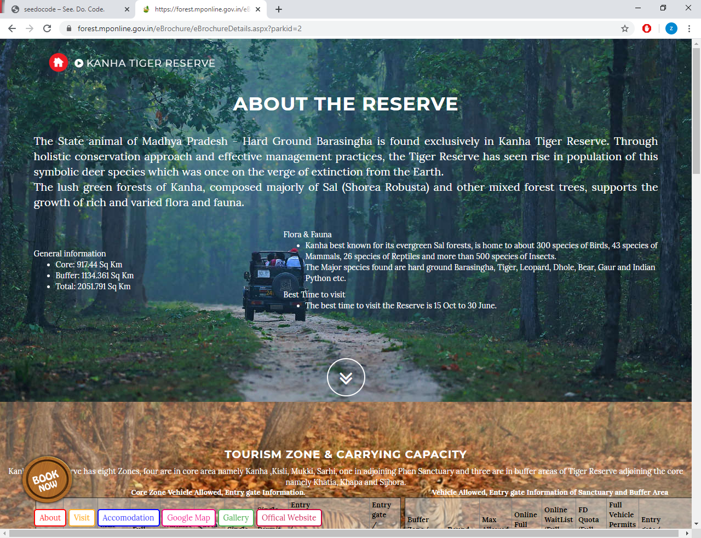
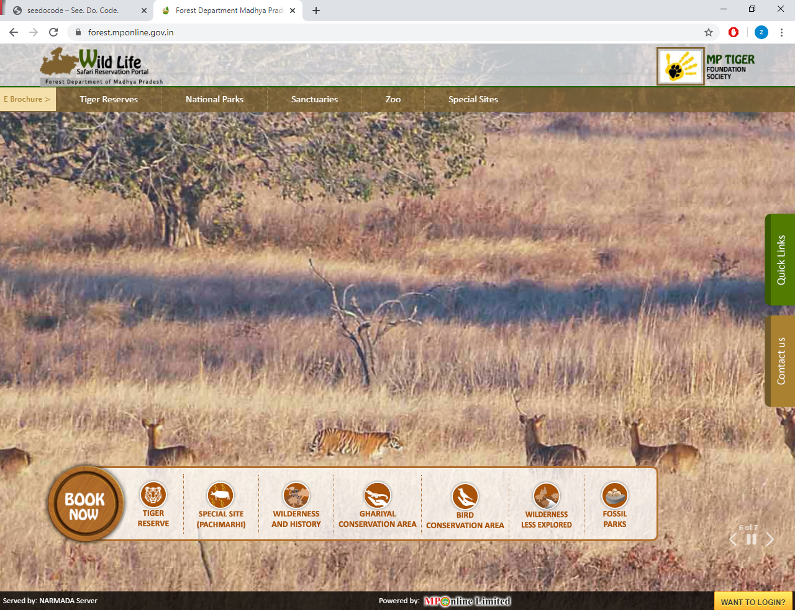
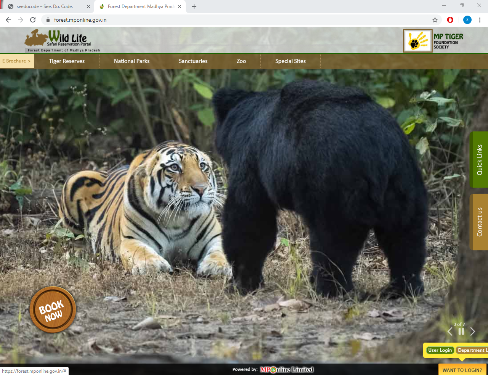
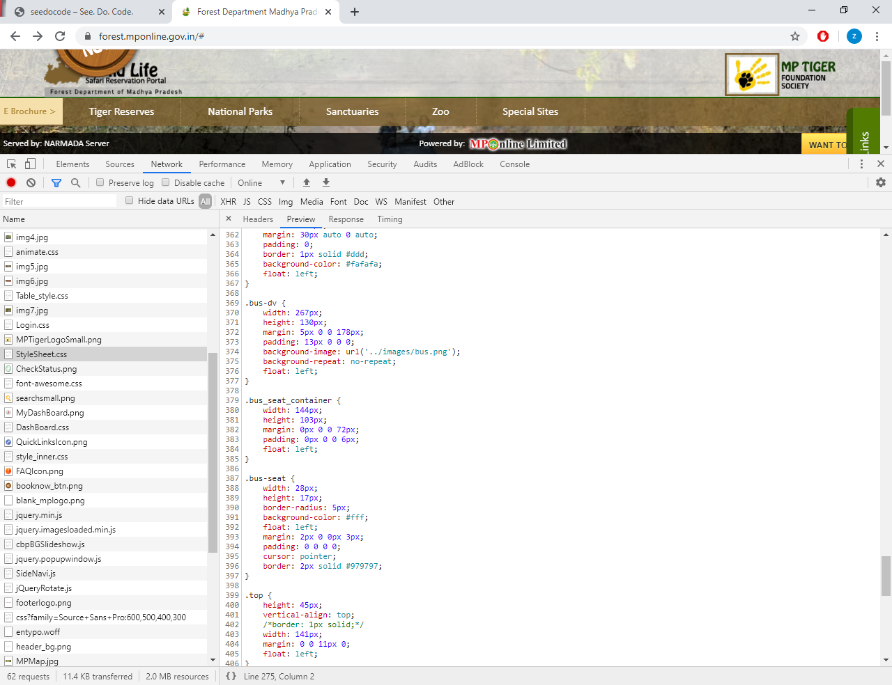
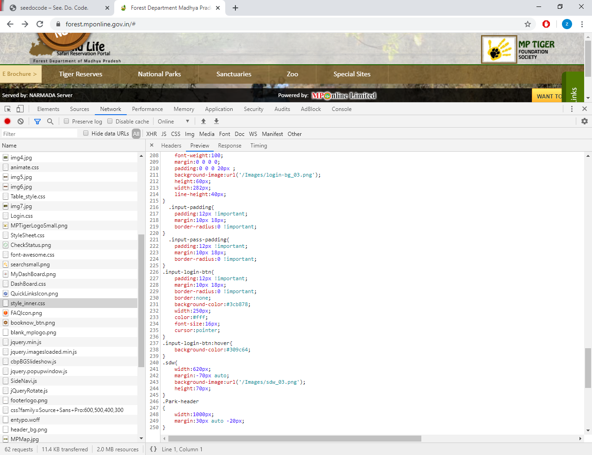
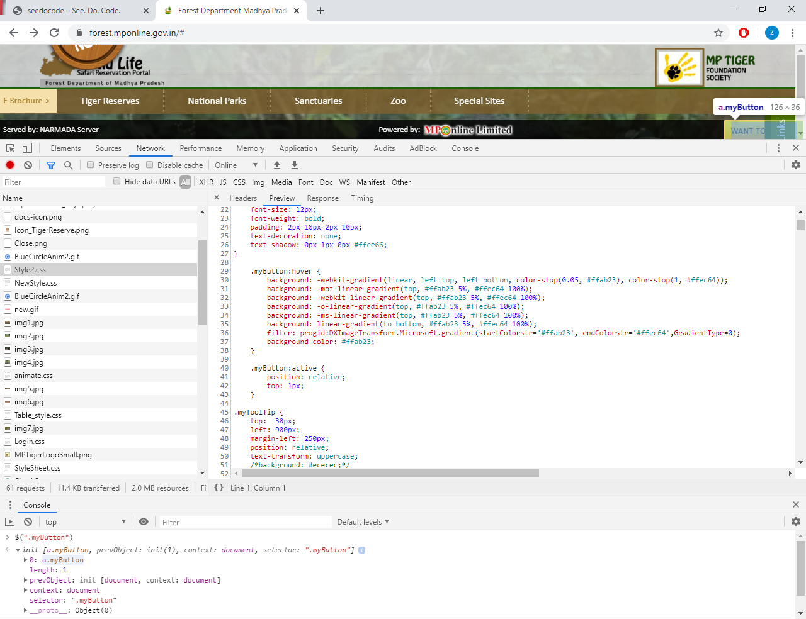
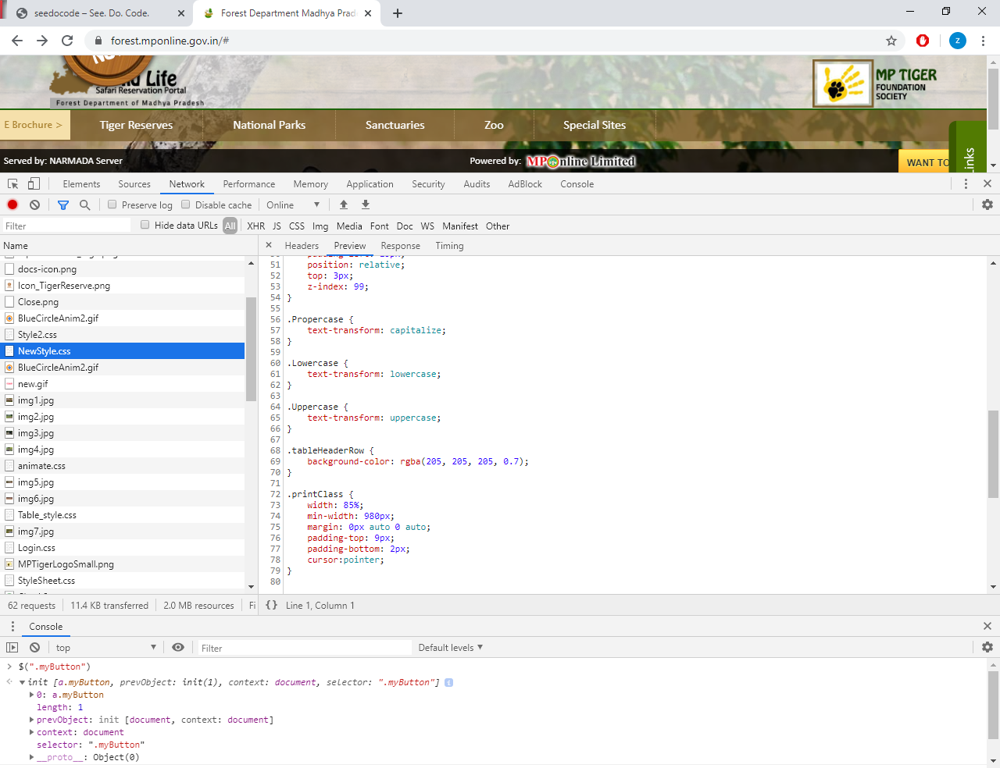
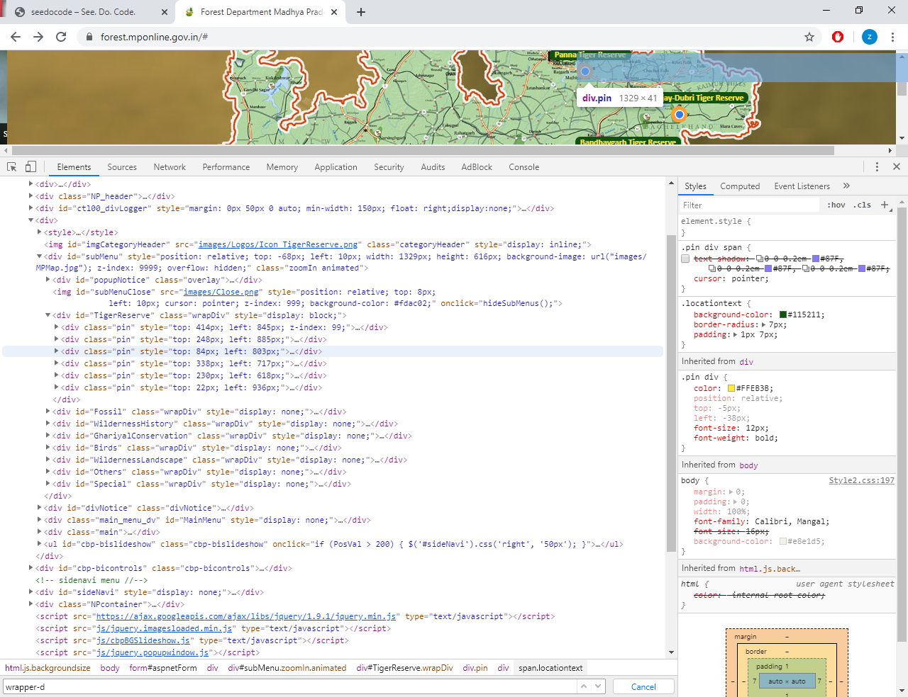
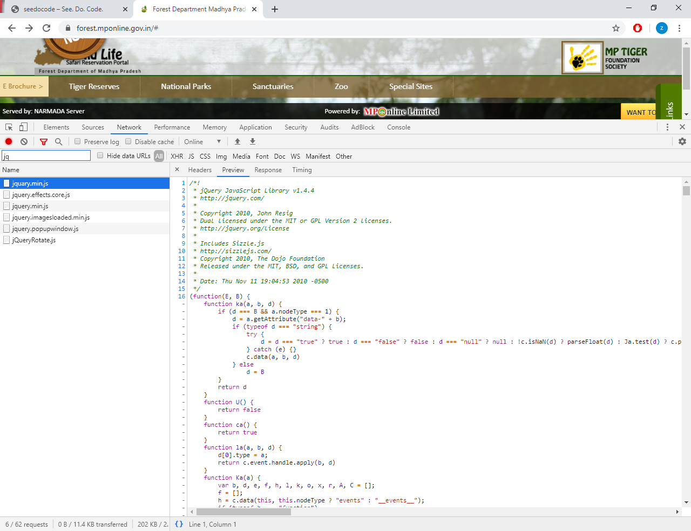
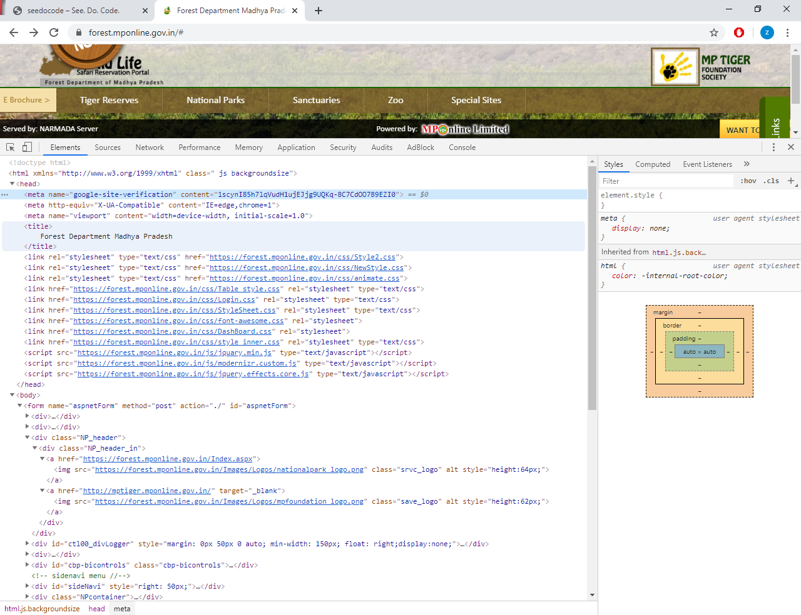

Recently we visited the Kanha tiger reserve which is located within Kanha region in Madhya Pradesh, India. The bookings can be done via government website. Though the booking experience was fine but there are some issues which I want to highlight. Looking at the files and static content I noticed more issues. 

The site resides at https://forest.mponline.gov.in/. I do not have any intentions to malign the official site and all the pointers should be taken as a form of review. All snapshots are taken directly from the site and put here without any editing.

### Background Image

The background images do not align with the window borders. Looks like they were just added in and no thought was put in to select the appropriate photos. Font with white color is put on image with light colors. All the photos are stunning by themselves but the text overlay just diminishes their value. The move button is also placed oddly in between which doesn't serve much purpose. 

### Book Now button

The most prominent thing on the page is the Book Now button. There are a couple of issues with that button. On the homepage the button doesn't do anything on click, instead on hover it slides a list of menu which is fine but if you are on the reserve page then the button takes you to the booking page on click.

* https://forest.mponline.gov.in/index.aspx# - Just hovers and no click action
* https://forest.mponline.gov.in/eBrochure/eBrochureDetails.aspx?parkid=2 - Takes you to the booking page on click and does nothing on hover except turning slightly.

The button should always have one function if its apperance is same and its hover action is also same. That doesn't confuse the user and saves a lot of time in the long run.

## Mobile un-friendly

Although its not as such a big requirement but still in today's world where websites are being built as mobile first its always good to have some responsiveness in your site if not full. As you can see on reducing the width all the elements try to fit in the space but the usability is lost. This is because they have been absolutely positioned which means the elements will position themselves depending on the browser's border and do not reposition according to their related content. In mobile the site is totally un-usable. 

## Buttons going out of screen

Login button is at bottom right which is still fine but on hover the User login and Department login buttons go out of the browser window. Maybe having them as stacked top and bottom would be a better choice instead of displaying them inline. Still I am a little curious as why the login button is at bottom right. Never seen any major site doing that.

## Issues with classes and styles
On inspecting the styles I found out several issues with classnames and properties.

#### Fixed styling 
Absolute sizes and not using any relative styles like rem, % etc. All width and heights are using fix px values. Never a good thing if you want to scale your site.

#### Excessive use of !important. 
This shows that someone was in a hurry to solve a bug probably.

#### Poor naming convention. 
What if there is a new button? myButton2?

#### Classname casing
Though its not a specification per se but it has become a defacto standard to have classnames with hyphen separated strings like ".print-class" instead of ".printClass". And of course you should never write class in a classname.

#### Excessive usage of id attribute. 
Though you may find id being used frequently in frameworks like React and Backbone but generally those are random generated uids so the framework can track the DOM easily but when you give your own manual Ids it becomes a mess in a short span of time.

#### Is it Jquery or Jquary. 
Not sure if they intentionally wanted to have another version and so renamed it to jQuary?

#### Improper stylesheet names. 
What Style2.css is for? And then you have NewStyle.css. What will be the name of another new style added? RecentlyAddedNewStyle?

There were some of the issues I can observe with a quick look. I know that a lot of effort goes into building a site which should cater to every individual. I also admire the fact that our governments are going online and letting us book tickets which previously required you to be in person and was always a frustrating part of journey.

But I just wanted to record some observations which maybe useful for those who are trying to build general public applications. For a limited audience I guess it might not be fruitful to spend extra effort in designing the site but for public facing websites we need to give in a lot of thinking. 

Lets hope in future we might see an improvement over all the things I mentioned.

> End