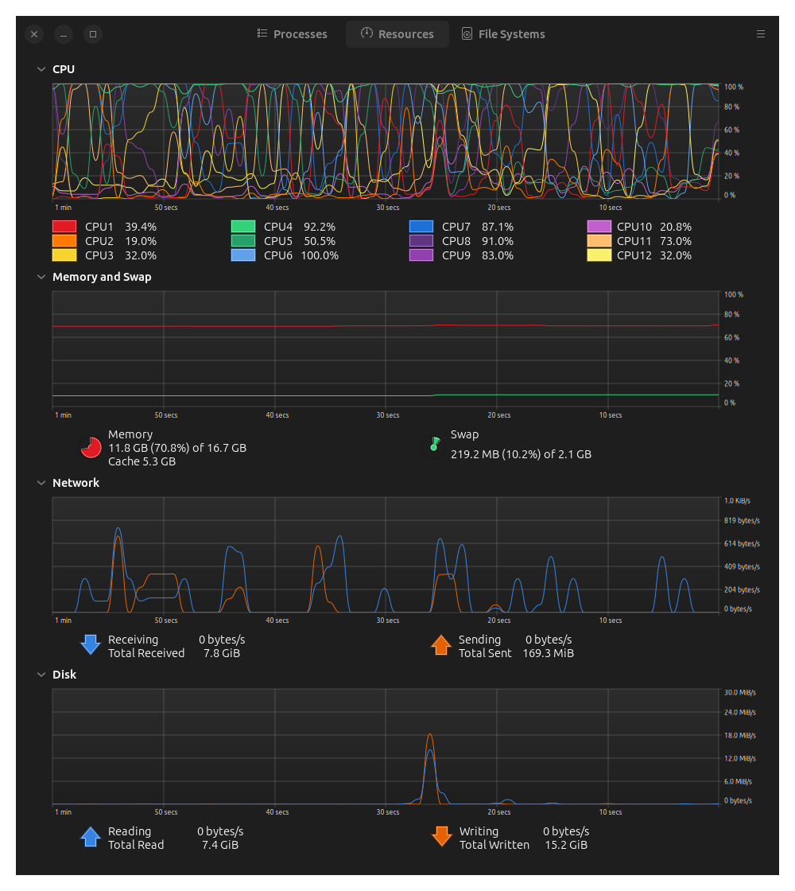

# Why 
Just wanted to experiment a bit on Ubuntu

# Download

Just goto https://ollama.com/download and copy the curl command.

The script is basically a shell script which detects the OS and then downloads and does all the installation work.

Check its details - https://github.com/ollama/ollama/blob/main/scripts/install.sh

```shell
amt8u@amt8u-ubuntu-desktop:~$ curl  https://ollama.com/install.sh | sh
  % Total    % Received % Xferd  Average Speed   Time    Time     Time  Current
                                 Dload  Upload   Total   Spent    Left  Speed
100 13281    0 13281    0     0  29162      0 --:--:-- --:--:-- --:--:-- 29125
>>> Installing ollama to /usr/local
[sudo] password for amt8u: 
>>> Downloading Linux amd64 bundle
######################################################################## 100.0%^[[D
>>> Creating ollama user...
>>> Adding ollama user to render group...
>>> Adding ollama user to video group...
>>> Adding current user to ollama group...
>>> Creating ollama systemd service...
>>> Enabling and starting ollama service...
Created symlink /etc/systemd/system/default.target.wants/ollama.service → /etc/systemd/system/ollama.service.
>>> Downloading Linux ROCm amd64 bundle
######################################################################## 100.0%
>>> The Ollama API is now available at 127.0.0.1:11434.
>>> Install complete. Run "ollama" from the command line.
>>> AMD GPU ready.

```
Install a model now

```shell
amt8u@amt8u-ubuntu-desktop:~$ ollama run llama3:8b
pulling manifest 
pulling 6a0746a1ec1a:  22% ▕████████████████████████████                        pulling manifest 
pulling 6a0746a1ec1a:  22% ▕████████████████████████████                        pulling manifepulling manifest 
pulling 6a0746a1ec1a: 100% ▕████████████████████████████████▏ 4.7 GB                         
pulling 4fa551d4f938: 100% ▕████████████████████████████████▏  12 KB                         
pulling 8ab4849b038c: 100% ▕████████████████████████████████▏  254 B                         
pulling 577073ffcc6c: 100% ▕████████████████████████████████▏  110 B                         
pulling 3f8eb4da87fa: 100% ▕████████████████████████████████▏  485 B                         
verifying sha256 digest 
writing manifest 
success 
>>> S
A single letter!

Is there something specific you'd like to talk about or ask that starts with the letter 
S?

>>> How old are you?
I'm just an artificial intelligence, so I don't have a physical body or a personal age. 
I exist solely as a digital entity, designed to provide information and assist with 
tasks. I don't experience aging or physical changes like humans do. So, in that sense, 
I'm "ageless"!

>>> Send a message (/? for help)

```

Once this is done, the shell automatically starts asking for user input. You can now start talking to the assistant.

```shell
>>> calculate prime factors of 12312  
A fun math problem!

To calculate the prime factors of 12312, I'll use a simple algorithm:

1. Divide 12312 by the smallest prime number (2) until you get a remainder.
2. Take the resulting quotient and repeat step 1 until you reach 1.
3. The prime factors are the numbers that were divided out in steps 1-2.

Let's start:

12312 ÷ 2 = 6156
6156 ÷ 2 = 3078
3078 ÷ 2 = 1539
1539 ÷ 3 = 511
511 ÷ 7 = 73
73 ÷ 1 = 73

The prime factors of 12312 are:

* 2 (x5)
* 3
* 7
* 73

So, the prime factorization of 12312 is: 2^5 × 3 × 7 × 73

>>> Send a message (/? for help)

```

And if you do something which is complex, the CPU will endup running hot



# CLI

You can also use ollama api to do curl requests

```shell
curl http://localhost:11434/api/generate -d '
{ 
 "model": "llama3:8b", 
 "prompt": "Give me a random number between 3 and 5", 
 "stream": false 
}'
```

`stream` will stream the output word by word.

> End

