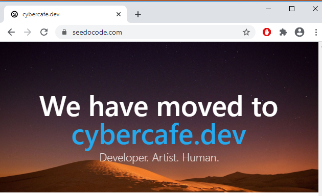

Migrating a site to another domain is always challenging. There are many places where you can mess up. 

I was searching for a more easy to remember domain since long. Finally my search ended and I got it from [Namecheap.com](https:/namecheap.com/). The `.dev` is a secured namespace and only works with https://. It also shows that this is a developer's blog and not a commercial site.

Now its time to configure my blog to use the new domain name. You can find millions of tutorials to complete this migration for wordpress but for ghost I was not able to find a good comprehensive article anywhere. Maybe everybody is using Ghost's own platform([Ghost's prices](https://ghost.org/pricing/)) instead of self hosted. 

I used this [article](https://ghost.org/faq/change-configured-site-url/) for reference and it worked for me. Below is the step by step procedure.

## Steps to update URL on ghost instance

Ssh to your server using user/password combination or ssh key whichever is setup for you

```bash
ssh user@cybercafe.dev
```

Find your ghost installation folder using above command

```bash
ghost ls 
```

Navigate to the folder
```bash
cd /var/www/ghost
```
Update the URL for your ghost installation using below command
```bash
ghost config url https://cybercafe.dev
```

## SSL setup
Since I got a .dev domain which requires SSL to work, I have to setup it anyway. You might need to provide your email now as letsencrypt requires email and free certificate limit is set to 3 per user. 

Starts letsencrypt ssl installation
```bash
ghost setup nginx ssl
```
Restart ghost. Important!
```bash
ghost restart
```

If required you might need to restart nginx
```bash
sudo systemctl restart nginx
```

This should work for most of the users. For me there was one issue though. Since I was using cloudflare for this domain. Instead of changing nameservers I thought of updating A record in the cloudflare configuration. But some how that didn't work. I ended up in TOO_MANY_REDIRECTS. Http request goes to the secure one and then the secure request goes to itself in the location header returned to the browser.

```js
"http://cybercafe.dev" => "https://cybercafe.dev"
"https://cybercafe.dev" => "https://cybercafe.dev"
```

So for now I configured my site to use Digital Ocean name servers directly without going through cloudflare which solved the issue. 

Will check in future if I can get the cloudflare working again.

## Thing to remember
Do note that your site is now working for the new domain. But if you haven't removed the old url from your hosting, then your site will still work on the old domain. 

That depends on you if you would like to keep it that way. The site would open with navigatino URLs with new domain while all posts with old domain which is not a good sight. I would urge you to remove your old domain from the ghost installation and maybe show a message that your site is now hosted on a different URL.



> End