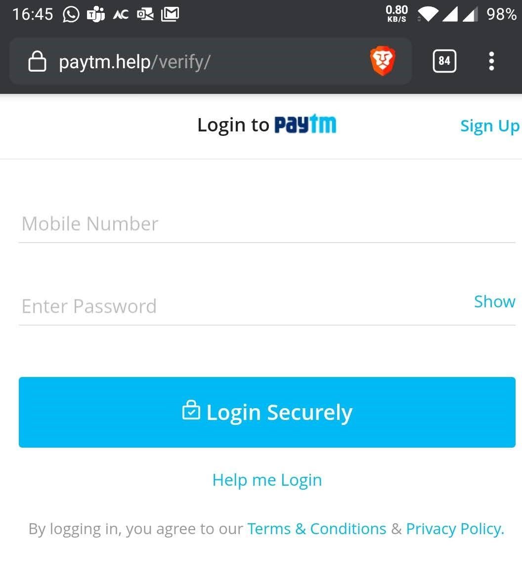
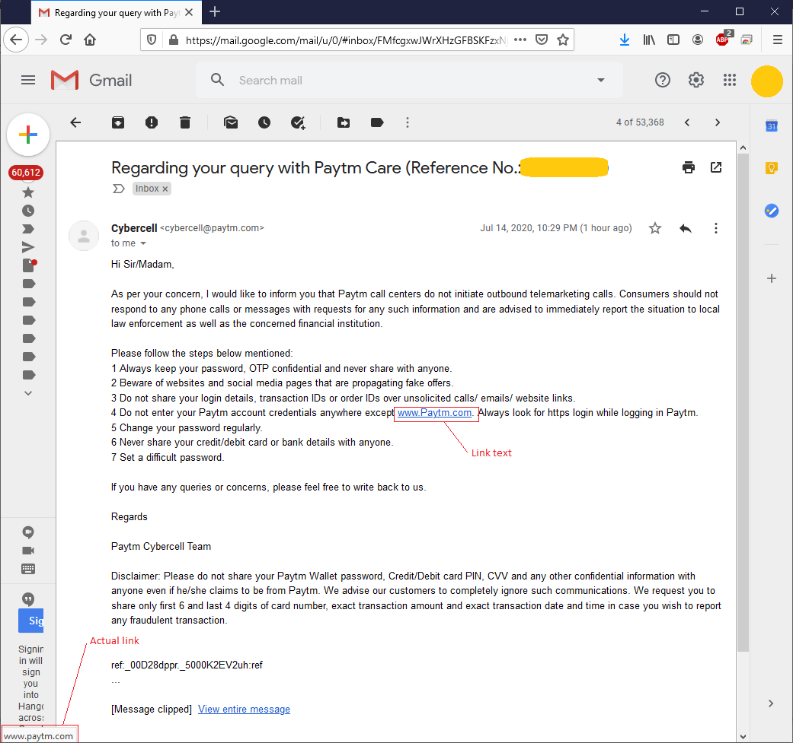

# Brief intro to Phishing

In simple language its an attempt to trick a person into revealing private information. It could be online banking credentials, facebook password, username/password combination of any other popular site etc. Phishing attacks have grown exponentially with the popularity of online banking and social networking. 

There is huge information available to read about Phishing. I will not repeat that here. It would be better to get the latest info directly. Some recommendations are - 

* https://www.cisco.com/c/en/us/products/security/email-security/what-is-phishing.html

* https://www.inc.com/will-yakowicz/biggest-email-phishing-scams-2018.html

* https://www.phishprotection.com/content/phishing-prevention/

# Current phishing attack

### Brand background

Paytm is a big ecommerce based company in India. It started operations many years ago with just a wallet concept and now it has gone into ecommerce, banking retail eveywhere. With the demonetization of 2016, paytm grew exponentially where users could make small transactions easily without cash. The original site resides at below URL.

https://paytm.com/

Today I received a message to revalidate my KYC for paytm. Soon I realized that this is a phishing attack put together with a lof of efforts from attackers. There are many things which they have done to make this possible. Just for future reference, I have attached a lot of screenshots and code.


1. The sender is not a personal mobile number. In fact it looks like a commercial number designated for notifications like these. We generally receive alerts from these kind of numbers. The attackers must have purchased some marketing contacts probably.
2. The message warns the user to take action as quickly as possible using sentences like "*To avoid suspension*".
3. The message is well formatted without spelling mistakes. Even punctuations are correct; which is often not the case with phishing attempts.
4. The most important point is the website link given in the message.
5. The website link starts with **https://** and uses a TLD **.com**.
6. The website name feels proper and on a first look its not at all suspicious.


Even a person having tech experience might not feel anything fishy. The only thing that made me skeptical here is that my KYC was done long back and since then there has been no change in government orders. I was not expecting a KYC update at this time. To infer this, you have to be aware of a lot of things, plus you also have to understand how kyc works, what is the purpose of it and why its needed by only a subset of companies. 

Nevertheless, being a software engineer I didn't stop there and just out of curiosity wanted to check out how sophisticated(promising) this one is.

To my surprise, this attack has been one of the carefully crafted public attacks. Most of the time you can tell its a phishing attack by just looking at the website/message. But this one is different. Thereby giving me a motivation to write about it. Just to spread awareness about how a simple message can lead to financial loss.

Its always advised not to click on suspicious links coming from messages like these. So if you are not sure, do ==NOT== open the link. Instead an alternative safe way is to open your app and then from there navigate to the required section. In this case `KYC`.

Since I am familiar with these attacks, I can safely move forward in my investigation.


# Fake website with real names

Once you click on the link, you will see below page in the browser.



There are a lot of things which we can talk about. Lets start

### URL
The URL shown in the address bar has changed. Instead of `paytm-kyc.com` it is `paytm.help` now. But most of the genuine websites also use this technique to **re-direct** users to other pages of their site. For example, in the message, you will see a shorterned version of URLs like `bit.ly/Bvgd1`. And thats why this is an acceptable behaviour now a days.

### https://
As you can see that this site is using an `https://` connection. The attackers made sure that the users believe this is the official site. If you want to know about https, checkout my previous post - https://cybercafe.dev/http-vs-https-for-beginners/

### URL ending with .help
If you notice carefully, the URL has `.help` top level domain. This not necessarily means that something is wrong but raises some questions. This is a common trick the attackers have been using. Creating websites with popular brands using new extensions. As a non-technical user, you can easily assume this is the official site.

`.help` is a different kind of TLD. You can easily get a new domain name with `.help` extention with just around Rs 4k($60). Even for popular brands like SBI bank etc. There is a cost associated with renewals as well but if you are planning an attack at a very high level, this is like pennies for attackers.


`sbi.help` available for purchase as on 14 July 2020

### Verification

Now since everything looks fine and as user, your next step would be to enter mobile number and password. The whole page is basically a copy of actual paytm website. This can be easily done in a few minutes. Even the icons and layout is proper. Also the links are original paytm links like `Terms and Conditions`/`Privacy Policy`. This forces the user to believe its a genuine site.

### OTP

Once the user enters his information and clicks on the button `Login Securely`, the mobile number with password is sent to the attacker's server. 

Fake OTP request page


There is a form which submits to below link.
```bash
https://www.paytm.help/verify/onetime.php
```

On successful submission, you will be shown an OTP page. Since I put in a wrong number and password, I didn't receive the OTP, but if you would have entered valid info, its quite possible that they might have triggered a fake transaction in the background. And if you enter the OTP and click `OK`, they would receive it and just use it to complete the transaction in the backgound.

Secondly the user is also re-directed to original paytm website. This happens so fast that you don't even realize that you have entered your password on a fake site.

### Attack concealment

As you are aware browsers keep your login `session` for days. And since most of the users might already be logged in on their browser, when the `re-direct` happens, the user gets to the actual paytm page and thinks that the action was successful. This prevents him from reporting the incident as a fraud site. He would never know that his details have been taken.

And if you are one of those who have same password on all sites, just think that now the attacker can login to other portals with this password and even create more elaborate attacks using your identity like facebook profile to hack into your contacts.

### Recovery

Because the user is not even aware of the hack and can only judge if he loses money or sees any suspicious activity on his other profiles. If you do realize that your account has been compromised, the actions should be in below order - 

1. **Change your password**
2. **Logout from all devices**
3. **Change password on all applications which are using the same password**


# Lets go technical

Upon understanding this could be a phishing attack you can lookout for information as mentioned below to analyze if this is indeed an attack or its just that you are being paranoid.

### Domain name verification

Whenever in doubt, just quickly look out `whois` information for the domain. As can be seen in the below snapshots, there are a few pointers which can indicate a fraud site. 
1. The domains were registered recently. In fact one of them was registered today.
2. There is no contact information. Not always necessary but can have brand's support email.
3. The Ip Address has only 1 more site. 
4. IP Location is in Canada. Official paytm is hosted in Signapore.
5. Registrant Name should be *One97 Communications Limited* 

## Fake websites
| paytm-kyc                                | paytm.help                          | real paytm official                          |
|------------------------------------------|-------------------------------------|----------------------------------------------|
|  |  |  |

### HTML inspection

Html code for the page is as simple as a `Hello World` program. Of course there are a lot of things. But just looking at the DOM, you can sense that this is not an official website. Meta tag says it all. Just to compare if you look at the DOM for original paytm site, the \<head\> itself is like 200 lines long.

HTML Dom for fake website https://paytm.help/verify/


### Javascript

Since the attackers wanted to make the login page as real as they can. They even placed minor validations like the mobile number should be a 10 digit number. The password and mobile number cannot be empty. And on entering valid input, the error goes away. Giving you a feeling that your number is indeed getting verified.

Client side validations on fake website


# Reporting

After I captured all screenshots, I communicated about the attack to paytm through their Contact us page. Lets hope they can take action as soon as possible.

Phising report


## Latest news

As per recent news, I can see that paytm and telecom companies are fighting over to blame each other for this situation. In fact paytm has filed a petition with a 100 Crore loss in damages against telecom companies. Sadly its the customers that are at loss. 

https://economictimes.indiatimes.com/industry/telecom/telecom-news/paytm-trying-to-shift-blame-for-its-own-lapses-on-telcos-jio/articleshow/76473143.cms

https://inc42.com/buzz/after-jio-vodafone-idea-blames-paytm-for-phishing-frauds/


## Update on phishing report

Well, as expected the reply from Paytm cybercell is lethargic and hysterical. Given that phishing has increased on paytm platform in recent months, this attitude shall not help.

Paytm's response


Instead of acknowledging the inputs and forwarding it to their support/security team to confirm the attack and potentially draft a notice or alert customers to be safe, they came up with their inessential *Do not share* list.

I understand that for every incident they have the same email response template (carefully crafted by product managers:-D) and its difficult to respond with custom message on a short notice. But still be true to yourself at least. I am sure replying them with another mail highlighting the below issues won't make much of an impact but still I will try. 

### Improper links

The link text says `www.Paytm.com` while the actual link is `www.paytm.com`. For people like me, who know how links work, its fine. But for general public, this is confusing. You would ask why? Recently some someone was trying to impersonate a popular coding website `github.com` as `glthub.com`. Did you notice the minute difference? The second character is small case `L` in the illicit URL. That's why these things matter. 

You would also say that the link is correct and it doesn't matter what the text says. That is also technically true. But this is an html feature which allows you to show arbitray text/image while keeping the link in the background. This helps reducing the clutter and makes it easier to read. But in that case, the text should not contain `www` and `.com`. It should simply say `Paytm` to avoid any confusion.

### Irony at its best
Another important point to note is that the link that they have given is `http://` while apparently on the same line they recommended to use `https://`.

### Not that helpful for this type of incident
Except point no. 4, the rest of the advice is not helpful in this particular kind of incident. The user is tricked into believing that he is logging in official paytm site. Phishing has a lot of varieties and this is one of them. Its also a pretty common one too, still not much importance given to it. Maybe providing with a link to a support article where user can learn more about this can help.

By reporting a fresh phishing site, I am trying to save thousands of customers getting robbed of their money, while paytm is easily ignoring threats.

> End

