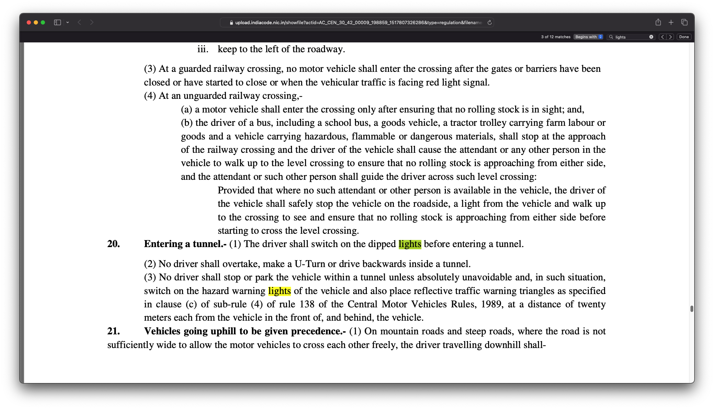
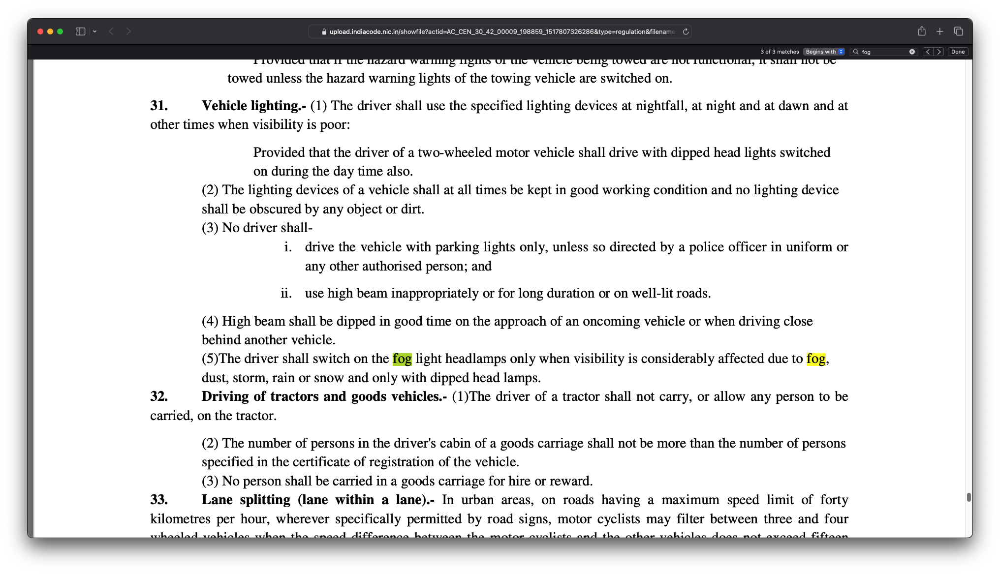

# The confusion
I have seen very often people using Hazard lights(both turn indicators flashing simultaneously) to indicate multiple scenarios while driving. A quick search gives many articles and questions related to this.

https://www.reddit.com/r/CarsIndia/comments/15g4xth/using_hazard_lights_while_driving_in_rain/
https://www.reddit.com/r/CarsIndia/comments/10qn5mz/using_your_hazard_lights_to_indicate_youll_go/
https://www.reddit.com/r/mumbai/comments/vglmhr/hazard_lights_on_cars/

People tend to use HL in many circumstances where it's use seems to be ambiguous like **Parking** on road, going **straight**, going into **tunnel**, low **visibility** etc.

I have read numerous articles and have seen many Insta/YouTube videos about the same. People recommending to change the hazard light usage and then everyone else fighting in the comments section with their own experience and logic. And almost no one citing the actual rules from motor vehicle act.

Here is my opinion on some of the common scenarios where we use Hazard Light. After this I will also talk about the rules from Motor Vehicle Act.

## Tunnels
I have seen many people (including cab drivers) switching their hazard lights on as soon as they enter a tunnel. It doesn't matter if the tunnel is properly lit or is dark, they just do it. And just so everyone know, tunnels are not that risky. On the Mumbai pune expressway, they are very broad with good light and clearance. And in case of lane closures inside the tunnels, the management makes serious effort to indicate that before the start of the tunnel. Though the prescribed speed limit inside tunnel is on the lower side, but people zoom in and out quite fast. On an average I can say, people drive inside tunnels at around 40-80 kmph. 

Now the question arises, at that speed, **if everyone uses HL inside tunnel while moving, but your vehicle breaks down, how will you indicate that you are stopped?** Some counterarguments suggest that you could place a reflector some distance away for the vehicle. But then reflectors are not reliable enough and can easily fall. Some people use leaves and plants as a replacement of reflectors 😎. Moreover, it takes time to set up. You just don't jump and start putting reflectors when your car doesn't start the first time. You try for 5-10 mins and then once you realize that you cannot move it, then its time for putting reflectors, calling the towing service and optionally calling the emergency services to let them know you are stuck in tunnel. So for that 5-10 mins, you only have the HL to indicate that you are a hazard to the traffic flow. 

One more point around tunnels. If you are using it for the full length of the tunnel, how are you going to indicate **lane changes**. And please don't say that you are not supposed to change lane inside tunnels.

## Low visibility
For low visibility scenarios, some vehicles have dedicated fog lamps. If fog lamps are not present, you are supposed to use your tail lights. Still, some people advise using HL in dense fog stating that tail lights are not visible. But again, applying the same logic, **if you are using HL while moving, then you don't have an option to represent when your vehicle is actually stopped while it's still dense**. What I believe is, if the fog is dense enough that tail light is not visible from a distance, then probably you should drive at like snail's speed maintaining a safe distance which enables you to see the tail light of the front vehicle. And in case that is also not possible, you need to pull over and wait.

## Indicate straight movement
There are instances when I see people recommending to use HL to show that they will be moving straight and do not have intention to turn. While we can see that it could be a good gesture, but feels redundant. You don't need to indicate that you are going straight. Whether it's a multi-lane highway or single lane city road, by default, **its assumed that in case of no turn indicators, the vehicle is going straight**. Mathematically speaking, with two indicator lights, you get 4 possible combinations. And logically that should be sufficient.

* `01` = Taking right turn
* `10` = Taking left turn
* `11` = Hazard

And thus `00` means going straight.

## As reverse indicator
Yup, that's also common. Many vehicles have white reverse indicators, but the problem generally is with commercial vehicles. Either they don't have reversing lights or those are broken, and thus they fall back to HL to indicate that they are reversing. **Based on the location, the lane, co-driver's position on road, you have to judge whether it's a breakdown or they are reversing**.

## Parking
Of course, it's known to everyone that you are not supposed to park on the road and thus, using an indicator for that makes it incorrect too. But then almost every road in every market there is no space for car parking. For a quick 2 min shopping, you might have to spend half an hour parking and come back which is very inconvenient. The whole objective of having a car is to have convenience right? So to avoid this, people generously use HL **to indicate that they are temporarily blocking the road, but you are free to go around**. I have seen that it's acceptable by public unless you are becoming a bottleneck.

## Towing
I also see that people switch HL on when the vehicle is being towed. Not sure about this, **maybe because the towed vehicle obstructs the towing vehicle's light?** But then again, how will you indicate that your vehicle is stopped if you are using it while moving. Well, ideally the towing vehicle should have their own emergency lights. 

## Very slow approach
Sometimes people use HL to indicate that they are going very slow. Maybe their **vehicle is not working properly or maybe the road in front is damaged**(which is quite frequent in India). In fact, I myself has saved a couple of times when I instantly had to switch on HL on encountering a sudden ditch which made the speed go from 40 to 10. I have also use HL when I am suddenly in a lane where the traffic is slow in front of me, while the other lanes are moving fast. 

# Motor vehicle act

I tried to search for rules around it and here are my findings

As per the [Motor Vehicles (Driving) Regulations, 2017.](https://upload.indiacode.nic.in/showfile?actid=AC_CEN_30_42_00009_198859_1517807326286&type=regulation&filename=G.S.R.634(E)%2023.06.2017%20rules%20of%20road%20regulation%202017.pdf) you need to follow below guidelines

As you can see in the highlighted sections, HL is not supposed to be used when you are moving.

**Section #20** clearly states that HL to be used when you are stopped inside tunnel. When you are moving, you need to use dipped headlights.

**Section #28** mentions that HL needs to be switched on immediately in case of breakdown and reflectors are to be placed as a secondary step.

**Section #31 (5)** tells us about fog. The fog lights needs to be used with dipped headlights in case of dense fog/storm/rain etc.

If you are curious(which you should be if are reading this article), you can check out all the rules on official India repository.

https://www.indiacode.nic.in/handle/123456789/1798?sam_handle=123456789/1362

Well there were some ammendments too, but I wasn't able to find anything especially related to lights in those. Will be happy to read if someone can point out.

# That means majority is wrong?
It's clear from the above points that you don't need to use HL when moving. Whether it's a tunnel or fog, there are other ways to indicate that your vehicle is there on the road. In the tunnel, you need to use parking lights. In case of fog, you need to use fog lamps and parking lights.

But then we should also give some thought on the **real world challenges**. Let's discuss the practicality of **Indian conditions**. I have seen that majority of commercial vehicles do not have appropriate lights. Sometimes the lights are **covered with dirt**, sometimes they are just **broken**. In fact, on some big buses, the tail lights are as small as toys have. I don't know who approves these kind of design. On one hand, even the smallest of cars have 1 foot long light with almost every car having a third center brake light, while on the other hand, big buses and trucks have 4cm round lights which are hardly visible from distance. And sometimes the **lights are just dead and driver is unaware of this**. Actually nobody cares enough about tail lights in India. If you go and complain about tail light not working, probably the driver will say - *Toh samne dekhke chala na...*(Then look ahead and drive...).

But somehow we do give **importance** to hazard lights. Maybe because they are used in **unusual** situations like making a **random U turn**, **parking** on a curve, **reversing** on highway to goto the service road 😎 etc. 

> And thus people do tend to keep the hazard lights in working condition. They also make sure that dirt is not covering these lights.

And that's why hazard lights have become more reliable and people try to use(you can say abuse 😝) them in every other situation where they feel that they are doing something unusual. Whether its legal or illegal, is a different aspect. It's jsut become another way to say - **Be cautious near me! I am doing something which is not expected**.

# Root Cause Analysis
While we are getting better day by day, but I think these sort of issues come primarily because of **mass acceptance of such kind of behaviour**. If everyone follows, it kind of becomes a de facto rule. Most of us learn from our acquaintances(including me 🫣) with practically zero training in terms of rules and laws. We know how the Driving License system works in India. So it becomes more challenging for those who went through proper training. 

Another reason could be lack of features in affordable and budget oriented vehicles. I saw that in one of the base models of Hyundai Eon, **they don't even provide left side ORVM**. How can a company deliver a car without the ORVM and mark it as an accessory. But that's how the situation is in India, There is a huge percentage of vehicles which do not have proper lights installed. Maybe it is because of the **market conditions**? A bulb for the headlight costs around 500-1000 which is a huge amount for the driver so they just don't want to fix it.

# Conclusion (निष्कर्ष)
With the prevalent road conditions, lack of infra, poorly maintained vehicles(because of various reasons), I believe the best way is to **find a balance between the intended purpose and the real world usage**.

For e.g., in theory, while driving you have to always maintain a sufficient distance from the vehicle in the front, but is not possible practically. There is no space to keep the distance and in case you try that, the auto and 2 wheelers crawl into that in seconds. So you leave the rules aside, and tailgate the vehicle as close as possible so that not even air can come in between 😜. Similarly we need to **adapt to the situation**. We need to mix and match depending on the circumstance.

Obviously, it would be better if everyone follows the common rules, but that would come only when we have trainings in place and properly maintained vehicles. So what we can do currently is to educate more and more people(Not by arguing with them in the comments, but citing the official rules). This will take some time. Have some patience 🙂.

# References
Here are a few links to some quick references

* [Rules/Acts on Morth](https://morth.nic.in/motor-vehicles-act-1988) - Official rules
* [India code Motor Vehicle act](https://www.indiacode.nic.in/handle/123456789/1798?sam_handle=123456789/1362) - India code repository
* [Road safety guidelines](https://morth.nic.in/sites/default/files/road_safety_books.pdf) - Morth Guidelines
* [HL usage article](https://auto.hindustantimes.com/auto/cars/should-you-drive-with-your-hazard-lights-on-in-the-rain-41721737161968.html#:~:text=Hazard%20lights%20are%20NOT%20to,thing%20you%20should%20be%20doing) - Mentions not to be used while moving.
* [Zeenews article](https://zeenews.india.com/mobility/for-the-first-time-in-india-misusing-hazard-lamps-could-get-you-traffic-challan-2425337.html) - Misusing HL can lead to fines
* [Cartoq artcile](https://www.cartoq.com/hazard-lights-fine-india/) - Fine for abusing HL
* [Shillong police advisory](https://www.facebook.com/TrafficPoliceShillong/posts/3969789929703354?ref=embed_post)
* [Gomechanic article](https://gomechanic.in/blog/how-to-use-your-car-hazard-lights/) - Some more heplful tips

# Article Updates
**Update on 13 dec 2024**
* Improved grammar and corrected spelling mistakes
* Added contextual smileys 😎
* Added links to related articles from popular sites
* Changed a few paragraphs to better convey my thoughts

