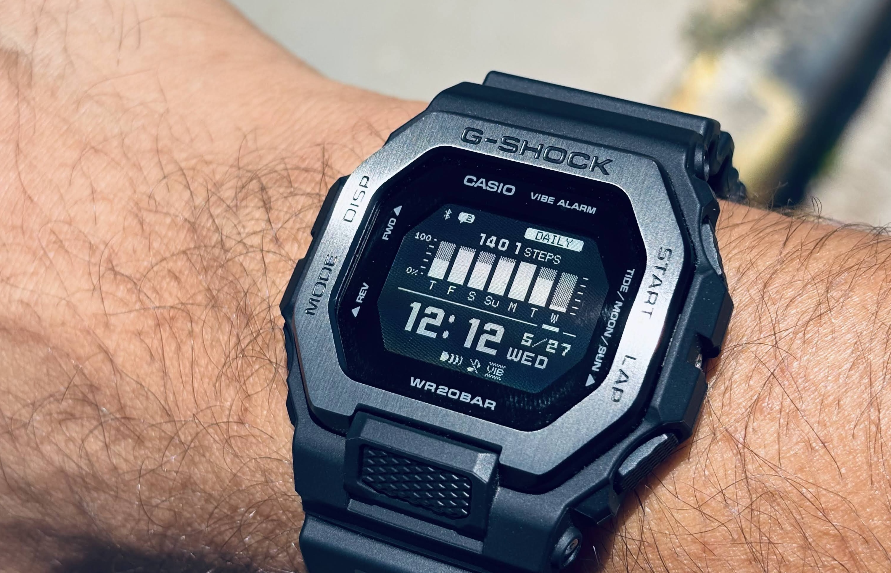

# The requirement

There were two kinds of watches up until now

* Smart watch - One day battery life, at max 7 days based on features etc.
* Dumb watch - Years of battery but lack of features that I need

My simple requirement was a `step tracker` with at least `30 days` of battery. Heart rate etc. can be bonus. Also it should be `cheaper`. Less than `20k Rs` (approx $250). And it should have a readable `display`.

After looking around here and there for sometime, a friend of mine suggested a casio model with step tracker. I understand that its popular and classic but somehow I did't like the design of it.

And major concern was the display. I already have a protrek and its negative display is not that great. Digits are difficult to read.

So, while checking out that model, I came across this another model on their website. `GBD-200` which actually fits all my requirements.

# The order (Fake first)
Having good experience with Amazon, I ordered it, but to my surprise they delivered a fake copy of it. Of course, it took me 5 seconds to determine its fake, but for someone else it would be difficult to judge as it was a very well made fake copy with the design and back plate etc.

| 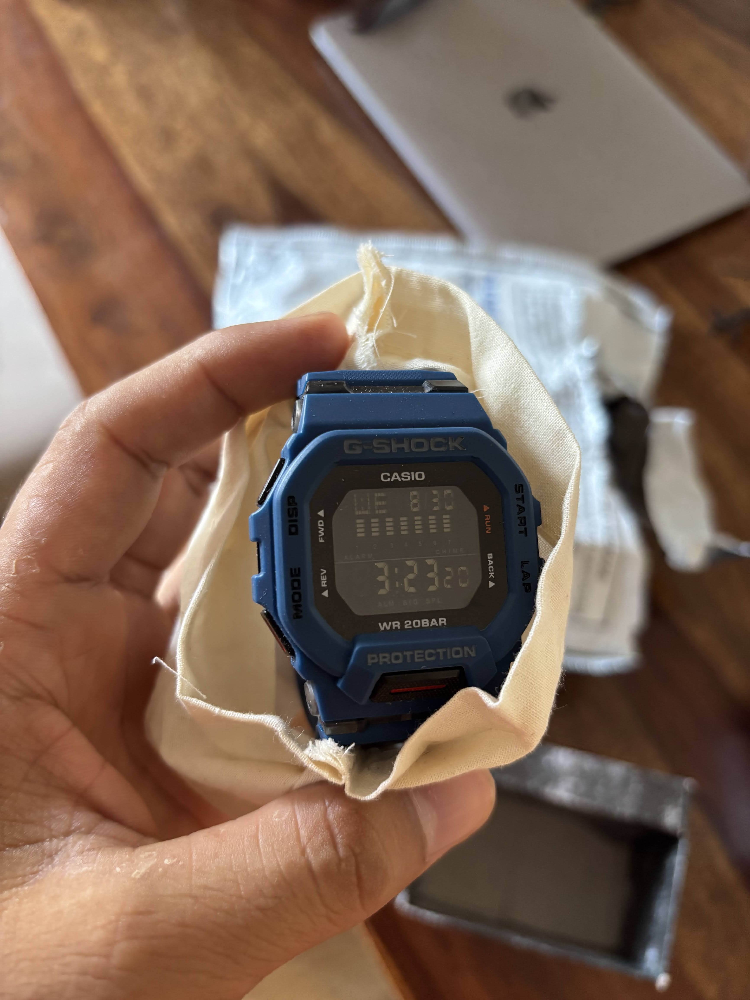 | 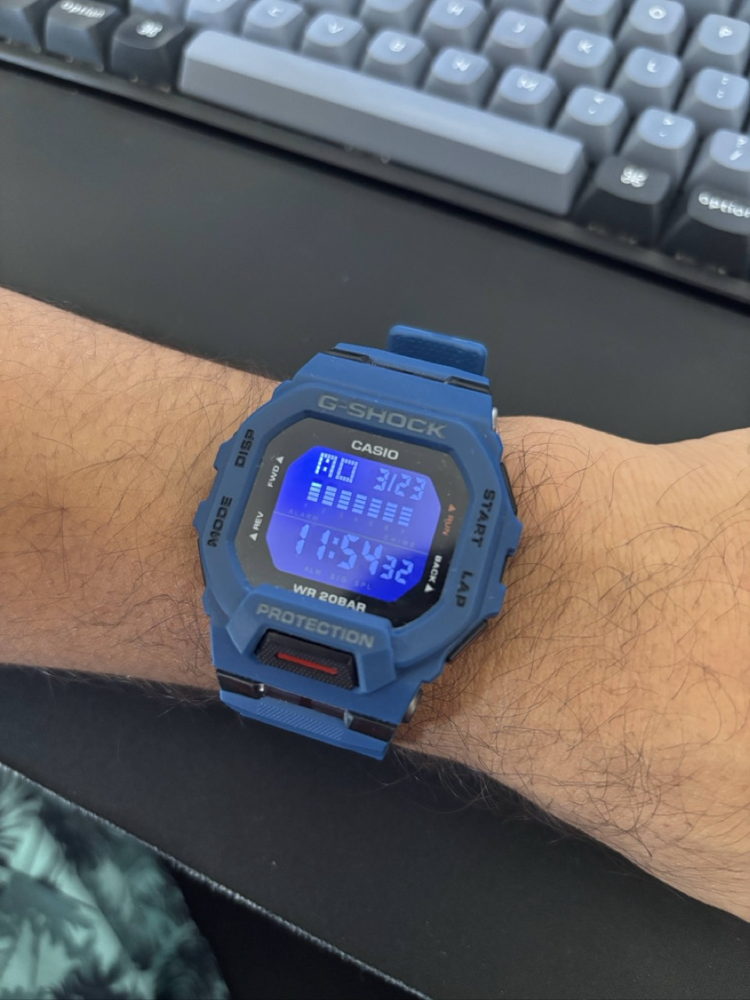 | 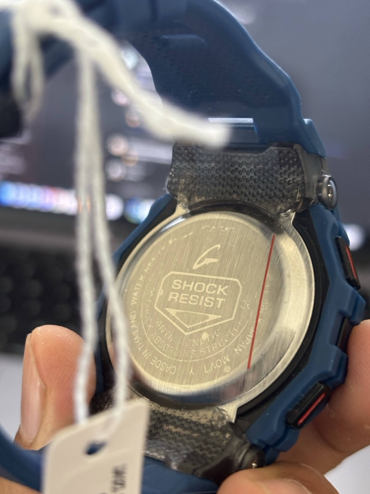 |
|:---:|:---:|:---:|

I immediately contacted Amazon and it was retured with amount refunded to my account.

# The fallback order
So instead of ordering from Amazon and dealing with fake and used products, I decided to goto the official store and buy it from there.

I initially wanted to buy `GBD-200` but in the store I liked the `GBX-100` more. With its metal dial it looked better.

# First impressions

| 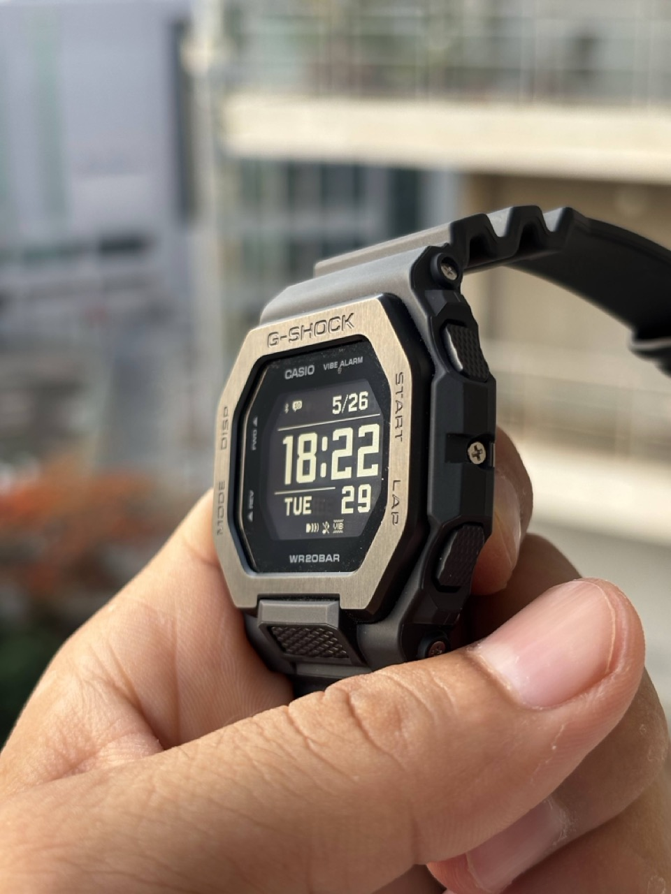 | 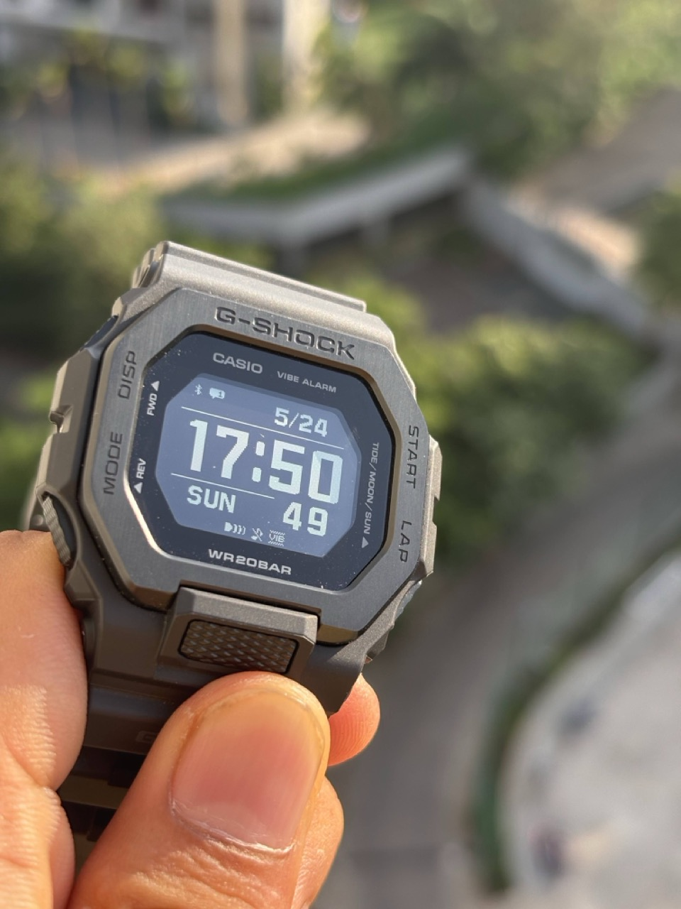 | 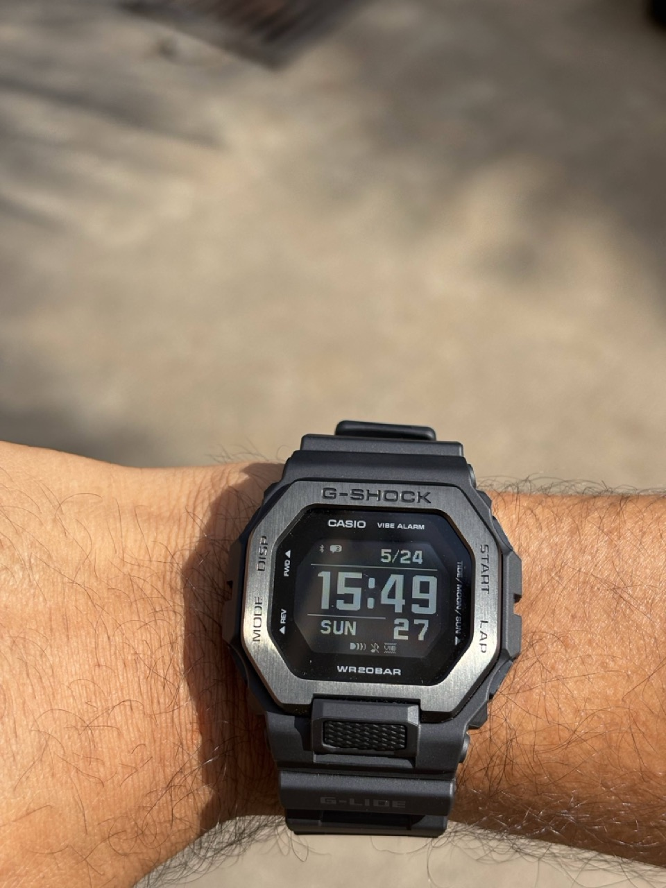 |
|:---:|:---:|:---:|

# Major features

## The Display
If you have ever used a negative display LCD watch, you will realize that this new display is a game changer. Thouugh I would have been more happy if it could have been an e-ink display. Somehow being battery efficient, those are not used by any company for watches. Nevertheless, this MIP display is pretty great. Readable from almost all angles and with the LED light, it really feels as if you are viewing a small display.

Next question you would ask, then why not put this in all the watches? Well, the answer that I found online is it has a very **low refresh rate** and thats why casio has intentionally removed the milliseconds([watchuseek.com](https://www.watchuseek.com/threads/for-gbx-100-gbd-100-and-gbd-h1000-users-post-here-your-suggestions-for-the-next-firmware-updates.5215047/)) from the timer and stopwatch(which is actually a major drawback if you are into sports!)

## The Notifications
There is support to show notifications from your phone(of course after pairing the watch). Though it works, but its not like how you use it in other smart watches. There are several flaws here

* You can't view the notification content directly, though there is a way to go into menu
* No support for images etc. So just text is visible which I believe is okay for me
* Very limited memory. Only last 10 notifications are stored on watch
* Slight delay - It takes around 1-2 seconds before the notirfication comes to the watch
* No way to reply or ack. 

| 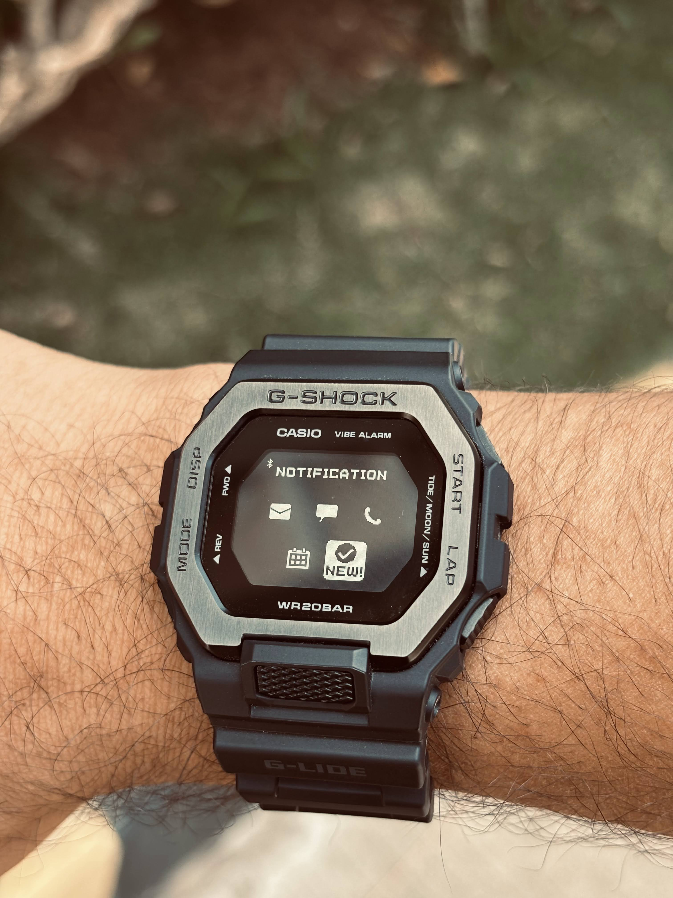 | 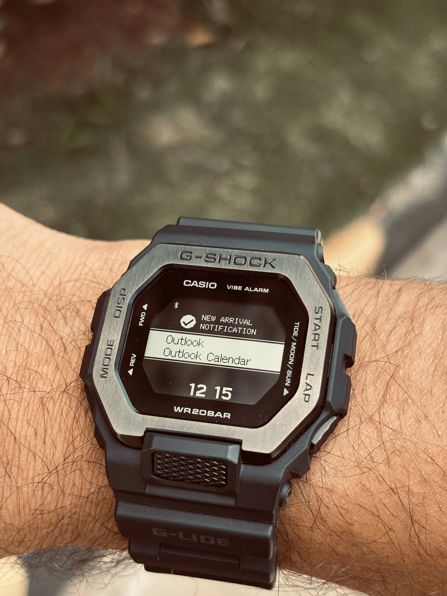 | 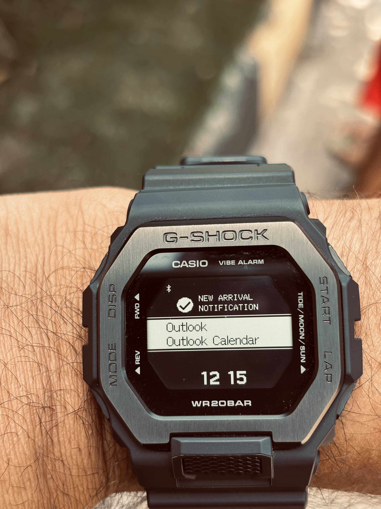 |
|:---:|:---:|:---:|

Now that I have listed donw the problems, let me convert them all to pros. Actually in a way, just able to see the notification title and sender is actually a great help. With hundreds of notifications daily, it becomes really a taxing activity to move the mobile from your pocket, unlock it and then check out the notification just to see that it was **Dominos giving your Rs 50 off** :-D. 

In hindsight, this is actually a very good thing. You can quickly glance at the watch and know if its important or not, without having to unlock your phone.

Think of it as a `notification screening` feature and not a full notification system.

## The Beep and the Vibration

As its with any other casio watch, you get a beep sound. On pressing of buttons and on major events like alarm, timer etc. the beep is there for you.

But with this watch, there is a an alternative to the beep - vibration. You can toggle between them or even have them both enabled at the same time. 

For me, I disabled the beep for all button presses, and kept it enabled only for incoming calls(just to differentiate between other notifications).

Vibration is really a good alternative. You won't disturb anyone (unintentionally) and still be aware of the notifications.

## The Settings
As with any other watch, you have hundreds of settings here and there. But having the bluetooth connectivity opens up a new world where you don't need to go into the watch by pressing 10 buttons. 

Just open the app on your phone and change the setting. Once you are done, click on `Send to watch` to save the setting on the watch.

Super easy as people who are new to these watches will find it very helpful. 

There are a few settings which can only be changed via app like Timer names etc. which I think is okay.

## The Step Counter

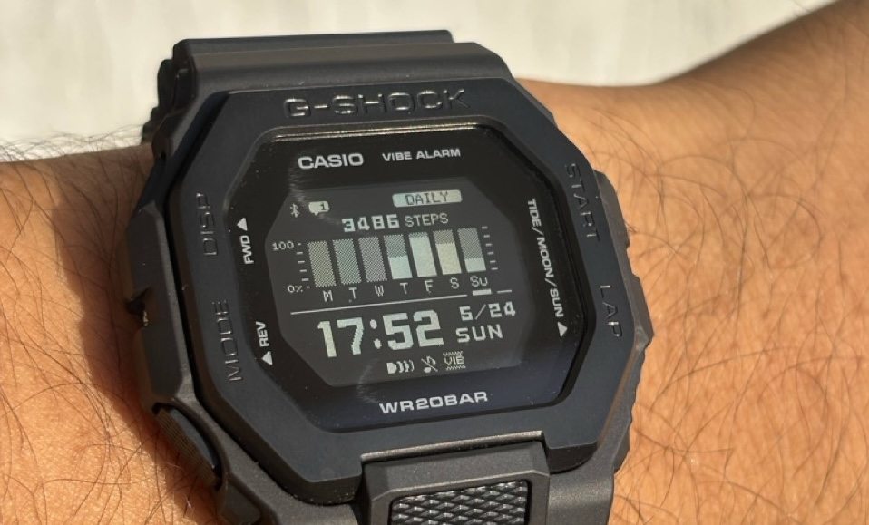

The major reason of buying as I mentioned was the step counter. After using it for 2 weeks, I am not in a position to say that its accurate. But it does appear to work and as of now seems correct. Of course to verify the accuracy I would need to measure same activity from multiple source and then verify which I will do later.

The refresh rate of the counter is slow. It updates I guess after 20 seconds of activity. But again good enough for daily usage.

There is activity module as well, where you can start running/walking and it will record the pace, distance etc. All activity gets synced to the app and you can view all history in the app.

There is provision to sync with Strava etc. but haven't tried that yet.

In the end, I would say don't compare it with apple watch or garmin watch. All the cons that you see are actually to save power and give you the battery life that no one can.

With 12k price tag, I don't think there is any other watch that matches the display and feature set with the same battery life.

As per Casio, the battery life is 1 year with all features enabled and if you switch the notifications off, it can go up to 2 years.

## Other features

### Activity Tracking
### Moon and Tide phases

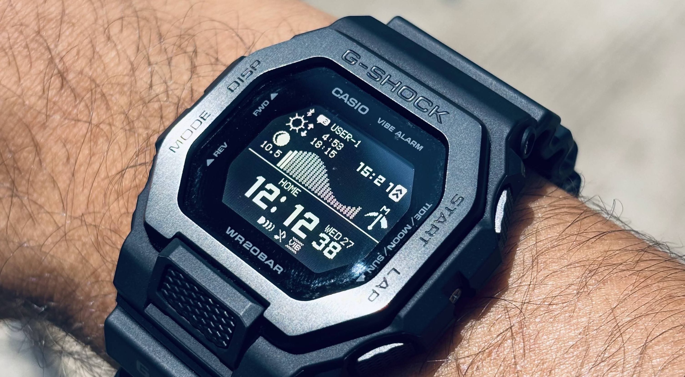

Not for me, but it came in complementary so I am not complaining.

### 200m Water Resistance
### Phone finder 
You can ring your phone from the watch if you in bluetooth range. Quite a useful thing if you tend to forget where you have put your phone
### World time
As it is with any other watch, you can set dual time display

# Important links

* **Product Page**: [https://www.casio.com/in/watches/gshock/product.GBX-100NS-1/](https://www.casio.com/in/watches/gshock/product.GBX-100NS-1/)
* **Product Page on official online store**: [https://casiostore.bhawar.com/products/casio-g-shock-gbx-100ns-1dr-mens-watch](https://casiostore.bhawar.com/products/casio-g-shock-gbx-100ns-1dr-mens-watch)
* **Manual**: [https://www.casio.com/content/dam/casio/global/support/manuals/watches/pdf/34/3482/qw3482_EN.pdf](https://www.casio.com/content/dam/casio/global/support/manuals/watches/pdf/34/3482/qw3482_EN.pdf)
* **Online Manual**: [https://support.casio.com/global/en/wat/manual/3482_en/VPCVSYbkozufdv.html#VPCVMLbejymabl](https://support.casio.com/global/en/wat/manual/3482_en/VPCVSYbkozufdv.html#VPCVMLbejymabl)

> End