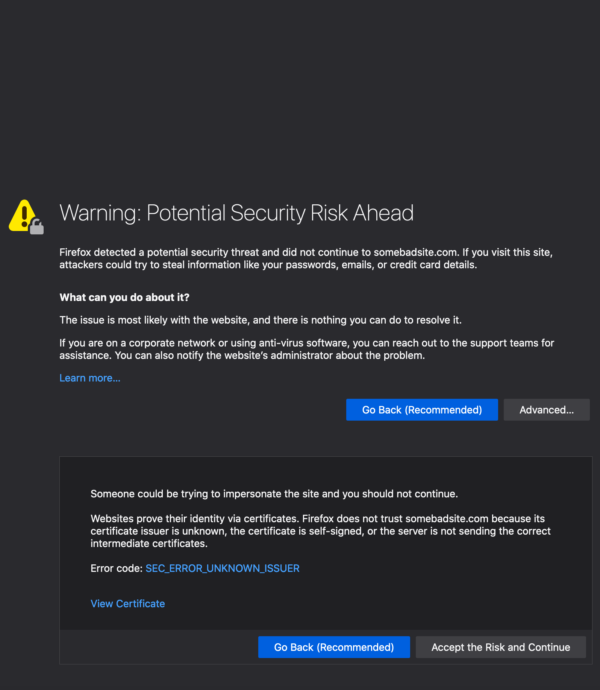
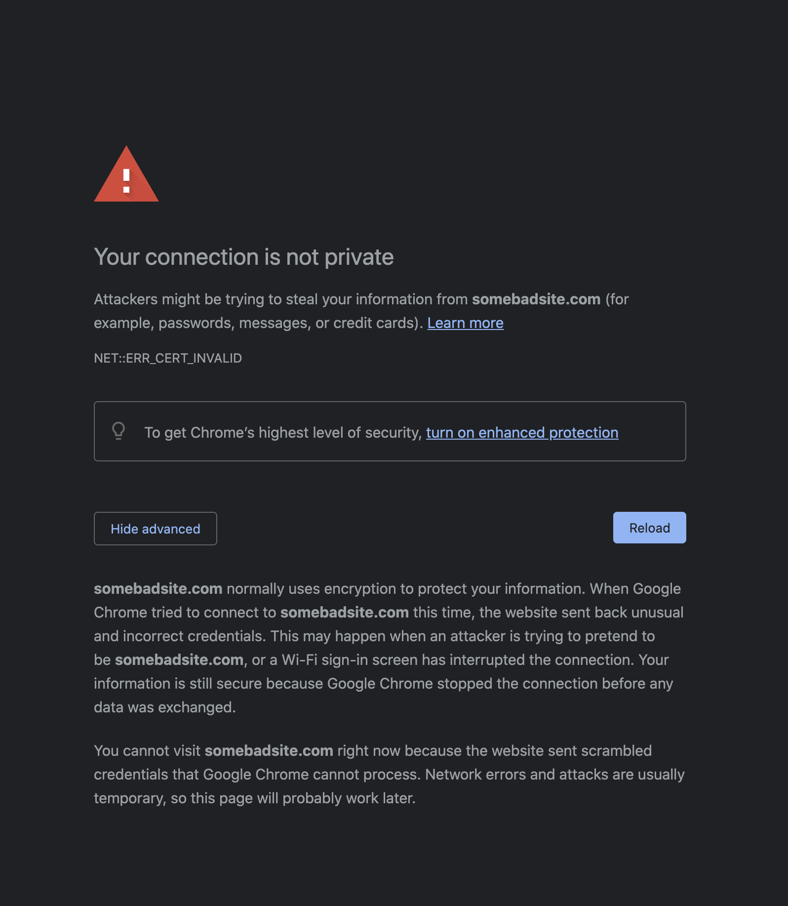
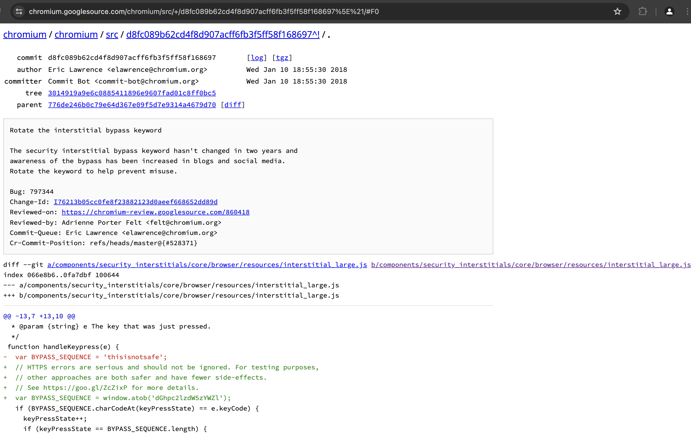

# Caution!  Caution!  Caution!
Since this article is getting popular and I see many people referring to it as a quick solution to this specific `SSL` error. Before we go into the details, I must warn you that **use this bypass ONLY when you know why it exists**. At least go through this article and understand the implications. Using it on every other site can risk your personal data(including passwords) being stolen. And you know [what happens when your password gets compromised](https://www.thewindowsclub.com/i-know-your-password-email).

# SSL Warnings
Some browsers may complain about invalid certificate and block you when you try to visit a regular page even when the site has an `SSL` certificate installed. Apparently the security of any website depends on whether the certificate is from one of the trusted authorities. We shall see later what a trusted authority means.

| Firefox                                        | Chrome                                       |
|------------------------------------------------|----------------------------------------------|
|  |  |

This could be because of many reasons. Some of the common ones are
* **Certificate expired** - Generally all SSL certificates have an expiry date even if you have purchased them from known CAs. In most paid systems, they auto-renew while in free services, you may need to manually renew them. Until then your visitors will receive a warning that your site is not secure.
* **Insecure links** - Even if you have a properly working certificate for your site, some links on the page(images etc.) may not be using the `https://` scheme which in turn will make your site insecure.
* **Unknown Certificate Authority** - Certificate Authorities are known(known to the browser) organisations which have already setup their network. Browsers ship with information about these known authorities by default. Its possible that your browser may not have information about the specific CA which issued the certificate for the page you are visiting.
* **Self hosted CA** - As always you can create your own Certificate Authority for your local network. This generally is done inside a corporate network to issue certificates to internal sites. This way you can install unlimited certificates and save yourself from spending thousands of dollars. But obviously the browsers do not know about your own CA, unless you tell the browser explicitly. We shall see how to do that later on.


# `thisisunsafe` - a bad idea?
Some browsers will let you go through after clicking on the `Accept and Continue` button but in some situations they may not even give you an option to `Continue`. Chrome is one such browser(Ironically?). For those circumstances, there is a bypass available. 

## Where to type?
Type the below text exactly as it is shown(without spaces) anywhere on the window and the browser will let you visit the page. You don't need to focus on any field. Just click anywhere on the window and start typing.

```html
thisisunsafe
```

Sometimes it's not apparent instantly as there is no feedback that you have entered the bypass. If you have typed in correctly, chrome should reload the window automatically.

## Type again everytime?
The bypass adds a temporary exception for that particular domain to chrome's internal storage. You can remove this exception by clicking on the padlock icon and click `Re-enable Warnings` link. Same is true with Firefox albeit with slight change in the UI.

## Why it exists?
The bypass has been put deliberately(obviously :-P) by the chrome dev team. This can be seen in the code as well inside [handleKeypress()](https://chromium.googlesource.com/chromium/src/+/master/components/security_interstitials/core/browser/resources/interstitial_large.js) function.

```js
/**
 * This allows errors to be skippped by typing a secret phrase into the page.
 * @param {string} e The key that was just pressed.
 */
function handleKeypress(e) {
  // HTTPS errors are serious and should not be ignored. For testing purposes,
  // other approaches are both safer and have fewer side-effects.
  // See https://goo.gl/ZcZixP for more details.
  const BYPASS_SEQUENCE = window.atob('dGhpc2lzdW5zYWZl');
  if (BYPASS_SEQUENCE.charCodeAt(keyPressState) === e.keyCode) {
    keyPressState++;
    if (keyPressState === BYPASS_SEQUENCE.length) {
      sendCommand(SecurityInterstitialCommandId.CMD_PROCEED);
      keyPressState = 0;
    }
  } else {
    keyPressState = 0;
  }
}
```

You can see that the keyword is put as a base64 encoded string. [`window.atob()`](https://developer.mozilla.org/en-US/docs/Web/API/WindowOrWorkerGlobalScope/atob) converts it to ASCII. If you are curious, there is a function `window.btoa()` that converts ASCII to base64.

```js
window.atob('dGhpc2lzdW5zYWZl')
"thisisunsafe"
```
## `badidea` - previous bypass term

Earlier this bypass keyword was used to be `badidea`, (probably for some time it was "thisisnotsafe") but they updated it as it's been taken as a method of abuse. This is noted in the commit on chromium source code here - 

[https://chromium.googlesource.com/chromium/src/+/d8fc089b62cd4f8d907acff6fb3f5ff58f168697](https://chromium.googlesource.com/chromium/src/+/d8fc089b62cd4f8d907acff6fb3f5ff58f168697).



Here is the [stackoverflow answer](https://stackoverflow.com/questions/35274659/when-you-use-badidea-or-thisisunsafe-to-bypass-a-chrome-certificate-hsts-err/35275060#35275060) by [Barry](https://stackoverflow.com/users/2144578/barry-pollard) from where I picked up the above info.

The author also suggested to set up certificates properly instead of using the bypass everytime. He also mentioned a bug where caching does not work properly with SSL errors. While caching issues may not pose a serious threat, but SSL errors needs to be taken seriously.

## Is it safe to use?

Of course not, that's the whole point of naming it as `thisisunsafe`. The bypass is meant to be used for situations like
* You are testing your own sites. 
* You are inside a corporate network and accessing internal sites.
* You are browsing some static site which does not take any inputs like passwords etc.

Now you can tell when it's a `good idea` or a `bad idea` :-D

I hope they will rotate the bypass keyword again soon as this one is gaining popularity and people have started abusing it. I don't know if somebody from chrome team will read this, but here is my suggestion - `dangerous`. 

# Testing local sites
Chromium project has a page which suggests [alternatives to test features which require secure origins](https://www.chromium.org/Home/chromium-security/deprecating-powerful-features-on-insecure-origins#TOC-Testing-Powerful-Features).

Here is a snapshot from the page for testing secure origins witthout a commercial CA.

1. Secure the server with a publicly-trusted certificate. If the server is reachable from the Internet, several public CAs offer free, automatically-renewed server certificates.

2. http://localhost is treated as a secure origin, so if you're able to run your server from localhost, you should be able to test the feature on that server.

3. You can use chrome://flags/#unsafely-treat-insecure-origin-as-secure to run Chrome, or use the --unsafely-treat-insecure-origin-as-secure="http://example.com" flag (replacing "example.com" with the origin you actually want to test), which will treat that origin as secure for this session. Note that on Android and ChromeOS the command-line flag requires having a device with root access/dev mode. 

4. Create a self-signed certificate for temporary testing. Direct use of such a certificate requires clicking through an invalid certificate interstitial, which is otherwise not recommended. Note that because of this interstitial click-through (which also prevents HTTPS-response caching), we recommend options (1) and (2) instead, but they are difficult to do on mobile. See this post on setting up a self-signed certificate for a server for more information on how to do this.

5. An alternative approach is to generate a self-signed root certificate which you place into the trust store of the developer PC/devices, and then issue one or more certificates for the test servers. Trusting the root certificate means that Chrome will treat the site as secure and load it without interstitials or impacting caching. One easy way of setting up and using a custom root certificate is to use the open source mkcert tool.

On a local network, you can test on your Android device using port forwarding to access a remote host as localhost.

# Install custom certificates
In situations where you need to use this bypass almost now and then. For examle inside your organization's network, you may be accessing some site which has the certificate issued by internal CA. It totally makes sense to bypass everytime but it becomes inconvenient after some time. For situations like these, you can permanently add the certificate to your operating system so that all the browsers are aware of it. For this to work, you need to install the certificate, the intermediary certificate and the root certificate.

[A very detailed article about adding certificates to trust stores](https://learnings.bolmaster2.com/posts/add-certificates-to-trust-stores.html)

<hr />

# Additional information
## Chromium interstitial

As a side note, the warning screens that block you from visiting the pages are called `interstitials`. And the template for this is present in chromium [code](https://chromium.googlesource.com/chromium/src/+/master/components/security_interstitials/core/browser/resources/interstitial_large.html).

**Update on 26 feb 2021**

There is a small procedure which can be performed to remediate the certificate issue for self signed certificates on local system. You can import the certificate into your CA keychain which will make the certificate valid across browsers.

Follow the [instructions here](https://www.nullalo.com/en/chrome-how-to-install-self-signed-ssl-certificates/).

Once done, the browser will accept the connection as secure and you will no longer get SSL warning interstitials. Do note that you might need to do this for every domain.

**Update on 29 Nov 2022**
* Updated some consfusing sentences
* Added `CAUTION` warning for people who may not understand the impact of using the bypass
* Improved the section where I am listing the common reasons for SSL errors
* Added section linking to pages which describe how to install custom root Certificate
* Updated feature image to one of my own clicks - https://unsplash.com/photos/VodtXdFNjqA

**Update on 13 Jun 2024**
* Improved grammar(using chatgpt :-P)
* Replaced chromium commit text with actual snapshot
* Altered some headings to improve TOC
* Added more details on where to type

> End


