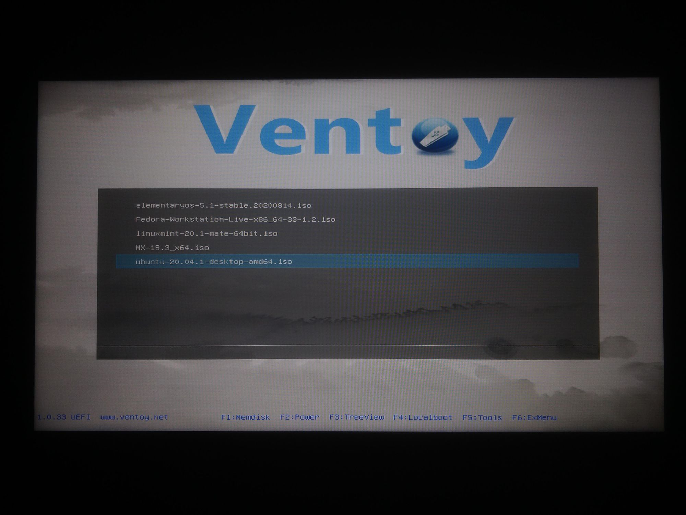
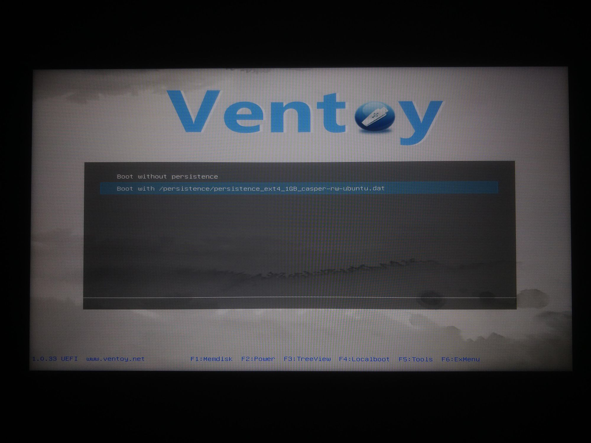
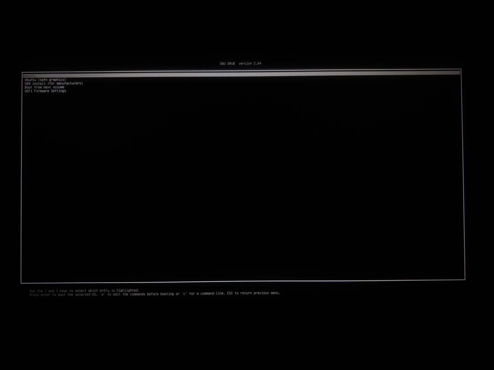
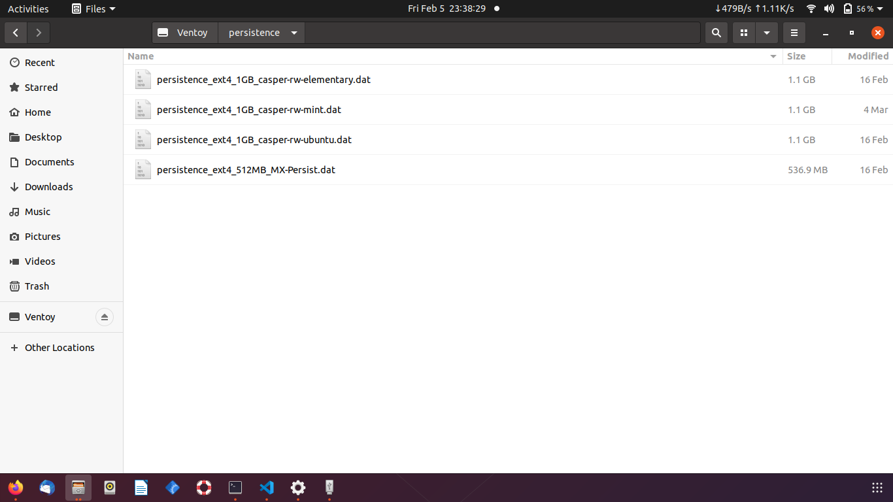

# Multi boot system
I am always interested in trying out new Linux Distros just to see whats new. Till now I have been doing it by creating single Live-USB drives. Now that we have cheaper high capacity USB sticks available, I thought to checkout a multi boot system. One multi boot project has been there for sometime but it seems that it is [no longer maintained](https://github.com/mbusb/multibootusb/issues/536).

# Ventoy
From one of the comments I got to know that there is a new project called [ventoy](https://www.ventoy.net/en/index.html) for the same use case. Ventoy on [github](https://github.com/ventoy/Ventoy). Looking at the homepage of the project, it feels quite promising. But as you know managing linux distros is not that simple. 

# Is it easy?
As per the [documentation](https://www.ventoy.net/en/doc_start.html), getting ventoy to run is quite simple. Of course, in case of issues, you have the forum and online help.

For me it worked like a charm. Its just a two step process.

1. **Install ventoy** - Use the given script to install ventoy on the USB drive. Just make sure that you are using the correct drive identifier. There is an option `Ventoy2Disk.exe -U` to list all drives too while starting ventoy from CMD for windows. I installed ventoy via Ubuntu using `.sh` file.
```
sh Ventoy2Disk.sh -i /dev/sdb1
```

2. **Copy ISO files** - While it says that you can put *iso/wim/img/vhd(x)* files, I only tried it with ISO files. Once ventoy is installed, you just need to copy the `ISO` images on the stick and boot from the USB.

# Boot
Once you boot in to the Ventoy menu, you will see the list of all the distros that you copied.


On selecting any of the OS, you go into the persistence options menu if you have the persistence files setup. More on that later. 



After this you will land on the boot menu of the particular distro. 



From there you can choose the relevant option(Live/Install) etc.

In a few moments you would be ready with the system. As always you can try out the interface and apps or you can go ahead and install it on your drive.


Don't forget to checkout the [compatibility list](https://www.ventoy.net/en/isolist.html) before trying out.

# Persistence
Persistence is one of the amazing features that linux gives you. Basically in a live environment, you lose eveything once you `restart/shutdown` the system. Nothing is stored on the disk even if you are booting from a writable USB drive. With the power of persistence you can continue where you left. 

You will get your settings back after a restart. You can even install programs and they will be there across sessions. A fully featured operating system that can run anywhere with your installed programs is nothing more than magic.

Quoting the ventoy docs directly

> Now Ventoy brings a new feature here. You have no need to create any partition, no need to add persistent boot parameter. Just put a persistence data file in the 1st partition and tell Ventoy by the json configuration, and that's all.

At first it would feel like a lot of work to achieve persistence. But once you get a hang of it, its not that difficult. The idea is that instead of a partition, you will have a persistence file that will be used as a file system on boot. Checkout the supported OS list [here](https://www.ventoy.net/en/plugin_persistence.html) before diving into the steps.

Follow the steps below
* **persistence directory** - You can place the persistence file anywhere and just put the correct path in the json config, but I kept all persistence files in a directory just to have a clean drive structure.

* **Create images** - Persistence images are not just plain files. These are special files with fixed size and format. You have two options to create them - `Create using script` or `Download` from [here](https://github.com/ventoy/backend/releases). Just a point to note that the `images.zip` directory will have compressed `7z` images of various formats and sizes. You would need to extract individual image as required. Also note that, the compressed images are in Kilobytes while after extraction, the file size will be the actual size of the image as given in the filename. So the file `persistence_ext4_4GB_casper-rw.dat.7z` will occupy 4GB after extraction. You need to copy the 4GB file to the USB drive.
* **Create json config** - Being a front-end developer, I was happy to see config in json format. Just makes it easy to understand. This config file is nothing but a map of the ISO files to the persistence images. It tells ventoy which persistence file is associated with which ISO. According to ventoy, even one persistence file can be shared across different OS(if supported by both). I am yet to try that out.

Not just that, it goes on to become more flexible. You can have multiple persistence files for single distro. Ventoy will ask you to chose from when you select `Boot with persistence` option in the ventoy boot menu. You can also choose not to use persistence even with the file present by chosing `Boot without persistence` option.

Create a new directory `ventoy` and under that you need to create a new json file `ventoy.json`. The contents of the file are below.

```json
{
    "persistence": [
        {
            "image": "/ISO/ubuntu-20.04.1-desktop-amd64.iso",
            "backend": [
                "/persistence/persistence_ext4_1GB_casper-rw-ubuntu.dat"
            ]
        },
        {
            "image": "/ISO/linuxmint-20.1-mate-64bit.iso",
            "backend": [
                "/persistence/persistence_ext4_1GB_casper-rw-mint.dat"
            ]
        },
        {
            "image": "/ISO/elementaryos-5.1-stable.20200814.iso",
            "backend": [
                "/persistence/persistence_ext4_1GB_casper-rw-elementary.dat"
            ]
        },
        {
            "image": "/ISO/MX-19.3_x64.iso",
            "backend": [
                "/persistence/persistence_ext4_512MB_MX-Persist.dat"
            ]
        }
    ]
}
```

Ventoy tells you gracefully if you have messed up the json config. I accidentally left a trailing comma and it gave an error - `Invalid json config` on boot. You can name the persistence files as you want. Just remember to use the correct version for particular distro. For example, Mint will need `casper-rw` while MX-Linux will require `MX-Persist` label.

# Power of live OS
You might not realize this at first but having a full fledged Operating System with a permanent storage is indeed powerful. Even if you are installing the OS on a USB drive, that particular installation is bound by that specific set of hardware in the system at the time of installiation. You can carry the bootable drive anywhere, but that installation will work only with the same set of hardware. While what we are talking here is an OS capable of booting into a *different set of hardware* with your *settings, sessions and programs*.


# Recommended size of USB stick
This totally depends on how many distros you want to have simultaneously and how much space you want to reserve for the persistence file. Persistence file images are available from 356MB to 4GB on the github page. I didn't find any restriction specfic to the size. Probably you can create arbitrary file depending on the space you have on the drive. My use case was to have around 4-5 distros with at least 1gb of persistence for each. That gives me around 15GB. So for me, a 32GB drive would be the best choice.

# Drive temperature
This is just an observation. I am not sure if its really an issue. Since there is continuous read/write to the USB drive, it becomes quite hot sometimes. Maybe not a good thing for a USB drive, but nevertheless I am gonna play with it.

# Results
For me persistence worked flawlessly. I didn't had any issues while booting too. Will try out more distros as and when I get time.

**Update on 28 feb 2021**

A few issues that I encountered while using Ventoy. 

* **Adding ISO** - You need a different working system to add/update ventoy config. You cannot add new ISOs when you are booted in from Ventoy.

* **using exFAT** - While using an exFAT partition seems to be a good idea as of now. You get the best compatibility across Linux and windows but somehow many distros yet not support exFAT repairing. Somehow I had a bad sector in the *ISO* directory where all the images are placed. Because of this the directory was not accessible and I was getting "Unknown file IO error" on entering the directory. Reading about the error, it seems that the only way to fix a broken exFAT partition is to repair it using Windows. `fscsk` just reports errors but couldn't fix them.

Puppy linux couldn't read the directory
Linux mint could but was not able to fix the errors

Finally, I had to install Ubuntu on a different drive and then deleted the corrupt file. I also noticed that there is a `Trash` directory which keeps the deleted files. It was taking huge space because I deleted many persistence files earlier.

> End
