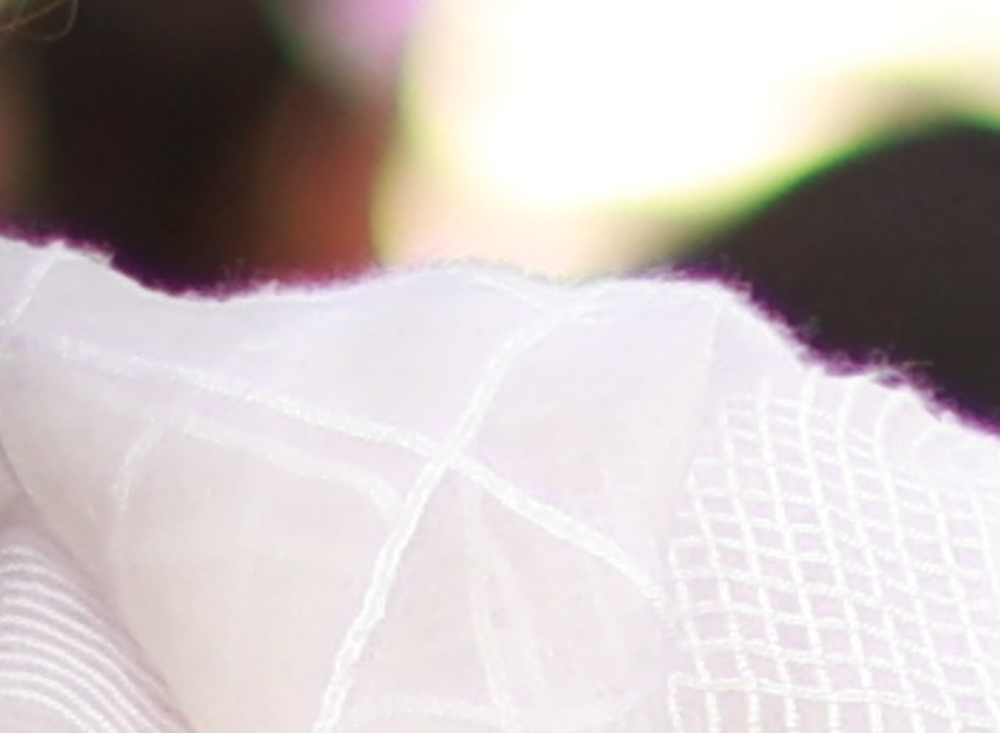

# Definition
As per wikipedia https://en.wikipedia.org/wiki/Chromatic_aberration

> In optics, chromatic aberration (CA), also called chromatic distortion, color aberration, color fringing, or purple fringing, is a failure of a lens to focus all colors to the same point.

In simpler terms, its a defect in photos that becomes significant in certain lighting conditions. Here is a photo in which its clearly visible. The purple border that you see.

# Why it happens?
Obviously someone is trying to connect with you from your future :-P. As per some articles https://photographylife.com/what-is-chromatic-aberration, its mostly because of how optics work.

So basically, you use a convex lens to focus light on one point, but in certain situations the lens is not able to focus all the colors at the same point, thus resulting in a clearly visible distortion.

# So what are those situations?
When I was checking my photos on the PC, I observed that this purple line is only present in a few of them. My first thought was that I might have taken the pic at a lower shutter speed resulting in blurred image. But on checking out the parmeters of that shot I was surprised as not only the shutter, but almost all parameters were fine. As you can see the details below, there was nothing suspicious.

And then I also observed that these lines were not there in other photos taken at the same time. So I started wondering what went wrong. My second thought was that I might have applied some filter accidently which was doing this. But soon I realized that it wasn't the case. The defect was only coming in Manual mode. In Full auto mode all the pics taken were quite sharp and without any defects.

See below details of a photo shot at around same time with Auto mode. There is no purple haze or any such kind distortion. 

So the next question is What is the special treatment that Auto mode is getting?

# Auto mode - Is it Auto correct?
After fidding around with the settings, I get to know that the camera has certain features to auto-fix these kind of defects. So I tried around playing with those settings, but somehow even after enabling I was still getting these sort of lines.

# And the culprit is...
Finally I realized that its not the auto processing that is doing the magic. Its the `F-STOP`. Reducing the aperture to around 3.2 and below I was not getting those lines. If you compare the above details, you will see that the one with aperture of f/3.2 has no lines. 

On reading about aberration I found that there are other ways too to reduce aberration but the most effective one is to lower the aperture. How that works is simple to understand. You lower the surface area thus most of the light passes through the middle of the lens. The aberration generally happens because of the light which gets distorted from the edges. OF course it won't get eliminated completely, but it will not be visible instantly.

Here are two shots side by side. You can clearly see the difference.

f/1.8 1/2000 ISO100 | f/3.2 1/640 ISO100
--- | ---
 | 

# What about post processing?
As per my reading, it looks like there are many ways to get rid of aberration while editing the photos. I tried out one or two of them on Canan's Digital Photo Professional, but didn't work for me. On a side note, that tool needs a serious UX revamp. Its just plain confusing to use.

# Then when to use f/1.8
Next question would be then if we get this distortion with the highest aperture, then we won't be able to fully utilize the lens value. There are a couple of things here. This defect comes up only when there is bright light and high contrast between subject and background. So in daytime you can lower your aperture to reduce this. In night time you won't observe this.

The other thing is to use lenses which are made to correct this in built. Means even before reaching the sensor the light is fixed and you don't need to do any special setting. But ofcourse this will cost you a ton.

So for now, I guess I will use a higher f stop in bright daylight conditions.

> End