# Why not google photos, dropbox, flicker, unsplash etc?
Because those are not backups; even though they call it as "backup". **Backup** means that you already have something available at hand but want to store another copy of it in case your primary layer fails. Plus they are not cost effective when it comes to store large files like `.raw`, `.crw` etc. 

Apps like google photos, flicker, unsplash etc. are all primary layers and not secondary. I know they internally have replication and fault tolerance but from user's perspective they are just one layer.

If you are one from 90s, you know that backups were done using some low cost storage like [CD/DVD](https://techterms.com/definition/dvd-r). But now a days 4.5GB is considered a small size. Single video recorded from your mobile can go to 5GB easily in minutes. That's why we need a solution which is scalable enought to store anywhere from 1GB to 10TB.

Another problem with popular apps is their exponential cost. The whole idea of cloud storage is scalability on demand but its not linear with them. 

If you look at [google photos pricing](https://one.google.com/about/plans), they charge for 15GB, 100GB, 200GB and then straight away to 1TB. And if you buy 1 TB plan, you actually reserve space and pay for it even when you are not utilizing it which somehow feels counter intuitive to how cloud storage solutions should work. I know that size calculations and pricing in realtime could be very complex, but still paying for reserving space is same as paying for a hard disk and not utilizing it completely.

# Factors for chosing storage
* **Indexing and searching** - One of the most important features of commercial apps is their quick searches and high availability which I could still achieve by uploading low resolution photos. Didn't want to sacrifice storage space for this feature.
* **Extremely low cost storage** - I don't want to pay 5$ a month which translates to 60$(₹4800) a year. I could buy a 2TB hard disk with same amount of money.
* **Storing RAW files** - Having a DSLR means creating huge `.raw` files which obviously doesn't make sense to upload on photos app. 
* **Retrieval** - Since I already have the photos handy on a HDD or photos app(with low res), I don't need to fetch the backups right away. Its ok even if it takes a day or two to get them. Hence archival storage solution would be a perfect fit for my use case.
* **Reliability** - What happens if after 5 years you want to retrieve a copy of your son's first birthday pics but you realize that the company no longer exists. I know this is far too much, and mostly you will have some notifications before the company or the product shuts down but even then it would be a hassle to switch TBs of data to another product. 
* **Security** - While everybody uses [https](https://cybercafe.dev/http-vs-https-for-beginners/), it doesn't mean that the system is completely secure. A small vulnerability could mean that attackers can gain access to your data without a trace which may harm you in the long term. Cloud systems provides you complete control over your data with permissions, policies, IAM etc. You can control public or private access for each object.
* **Easy to use interface** - The interface may not be the best, but should be easy enough to configure and upload/download big files.
* **Sync** - Not needed for backups.

# Why AWS?
There are multipl cloud solutions available to chose from. The pricing is almost same and you may find one or the other as appropriate for your use case. But putting effort in finding the best feels too much work. 

So the straight away answer would be - **Go for the one on which you have experience**. I Didn't have experience on any cloud storage solution but created an AWS account long back and have working knowledge of buckets so I chose s3.

# Setting it up

* **Create AWS account** - Create a new account if you don't have one. Do note that first 12 months could be free, but since we are looking for a long term solution(10-20 yrs), I would recommend to ignore the free tier bait.

* **Setup MFA for root account** - Although not compulsory, but to avoid future loss, its highly recommended. You can use your mobile device to setup an auth app like [Google Authenticator](https://googleauthenticator.net/). 
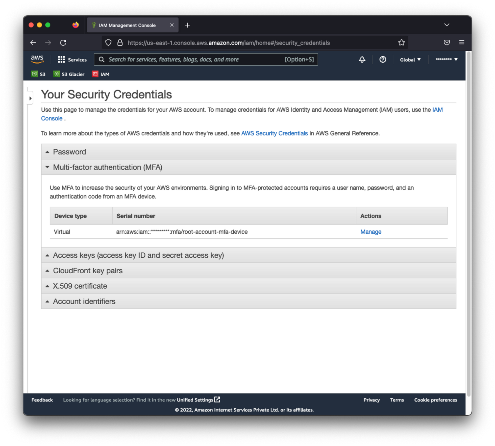
This will prevent your account to be accessed with just the email/password combination. If you lost access to MFA device, you can use the automated flow to reset or you can connect with Amazon support to disable MFA one time.

* **Create IAM user** - Create a new user through which you will be doing all the activities.
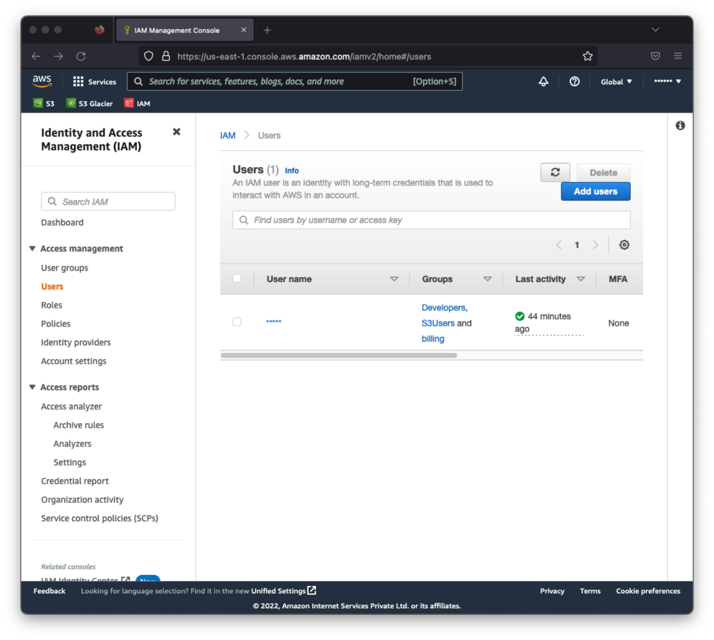

* **Add permissions** - If you want your newly created user to view cost and usage, you would need to enable that for the user. This is done by doing below two steps
    1. Activate billing and cost management for IAM users - Unless you do this, billing information will not be visible to IAM users even if you apply the permission explicitly. Follow the [userguide](https://docs.aws.amazon.com/IAM/latest/UserGuide/tutorial_billing.html?icmpid=docs_iam_console#tutorial-billing-step1) to do this.
    2. Add Billing permissions - You can create a new group with the desired permissions or you can assign the policy directly to the user.

* **Login with IAM user** - Now that your IAM user is setup, its time to logout from root account and log in with it. With IAM users, you can enter the account id or account alias in the login page. You also have the option to use a direct link for IAM users where they can login by entering username/password combination.

* **Create bucket** - Follow the [guide](https://docs.aws.amazon.com/AmazonS3/latest/userguide/create-bucket-overview.html) to create a new bucket. Though creating a bucket is simple, there are many items that you can configure while creating a new bucket. You can do that now, or you can always edit the bucket later on. But do note that do everything before creatinng objects in bucket, otherwise you may end up in paying for unnecessary operations.
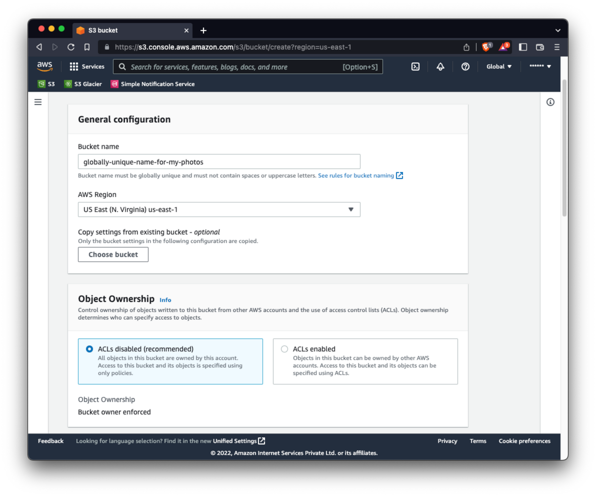
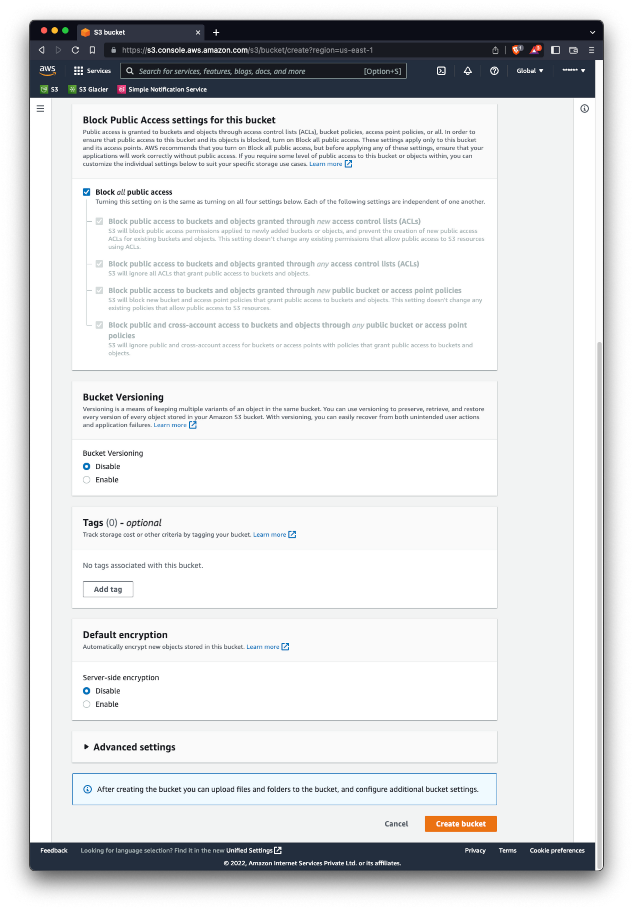

* **Create Lifecycle rule** - This is **important!**. You will find that you can edit the objects inside a bucket directly. Move them from one storage class to another but those operations incur charges and also modifies the objects by creating copies. The best way to move your data from one storage class to another is using a [lifecycle management rule](https://docs.aws.amazon.com/AmazonS3/latest/userguide/lifecycle-transition-general-considerations.html).
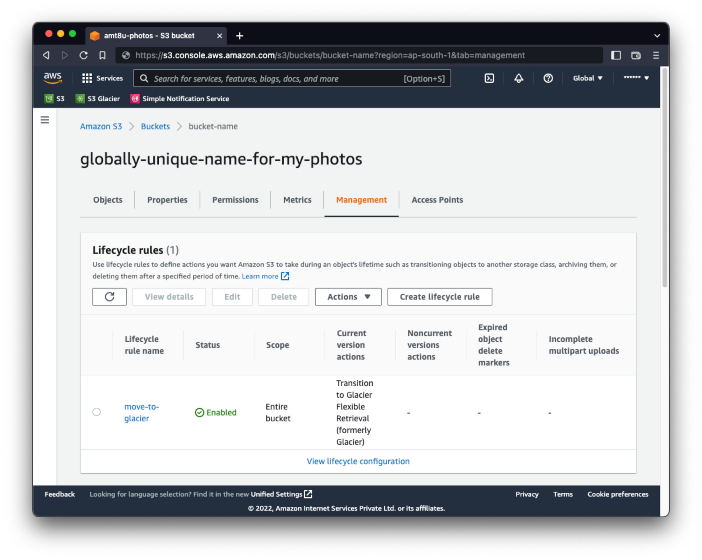

* **Create notifications** - If you want to be notified of any events on your bucket, you can use the notification system. For me, I would want to be informed when my data goes through transition from s3 standard storage to glacier storage. For this, you need to setup a [notification system](https://docs.aws.amazon.com/AmazonS3/latest/userguide/enable-event-notifications.html). Refer this [article](https://docs.aws.amazon.com/AmazonS3/latest/userguide/lifecycle-configure-notification.html) for configuring notifications.
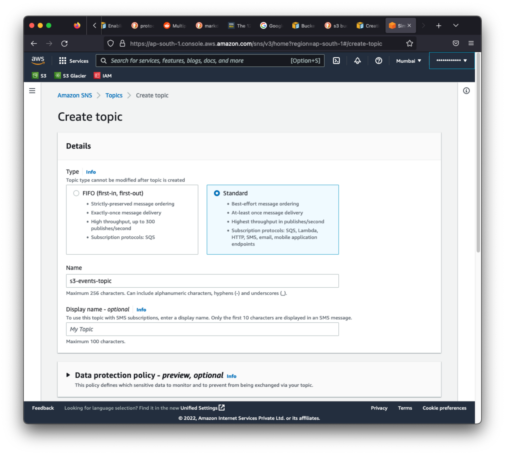
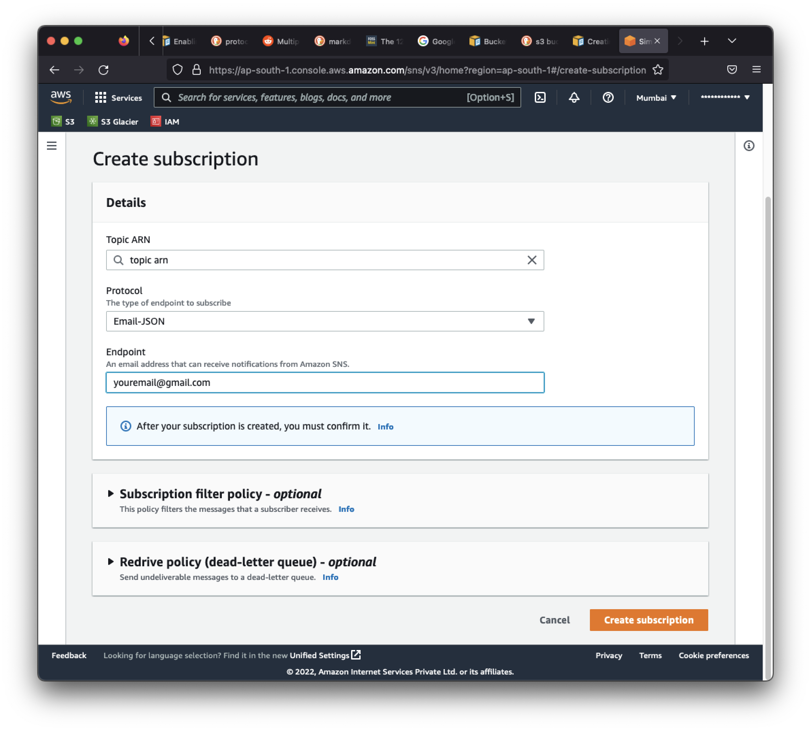

* **Create topics for SNS** - You can use the SNS feature to publish messages and then subscribe to them to get the notifications. Create a topic from the console. Probably name it something like "s3-events". Just make a note of the ARN for that topic. It will be used to create the policy for granting permission to the bucket to publish message on that topic.

* **Create subscription** - You can use one of the methods available for subscribing. I used the email one. Just enter the email on which you want the message to be received. Do note that you will need to confirm the email by clicking on the subscribe URL in the verification mail. Once done, you will start receiving messages from aws if someone pushes one.

* **Test subscription** - Although not necessary, you can publish a message from the UI and see if you receive the mail.

* **Grant permissions** - You need to grant permissions to the bucket for publishing on the topic when s3 events occur. Refer the [guide](https://docs.aws.amazon.com/AmazonS3/latest/userguide/grant-destinations-permissions-to-s3.html#grant-sns-sqs-permission-for-s3). Copy the policy from [this page](https://docs.aws.amazon.com/AmazonS3/latest/userguide/ways-to-add-notification-config-to-bucket.html#step2-enable-notification) exactly. Just update the ARN, bucket name and account id.
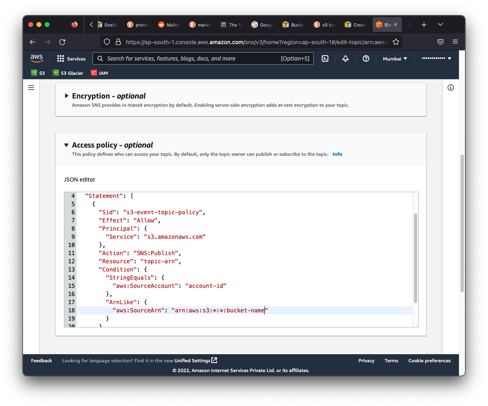

* **Upload files** - Once you are done with all the above steps, its time to start uploading. Remember that you are targetting archival storage which is meant for saving big files over a long period of time. Small files can incur extra charges as it will be in efficient for the system. 
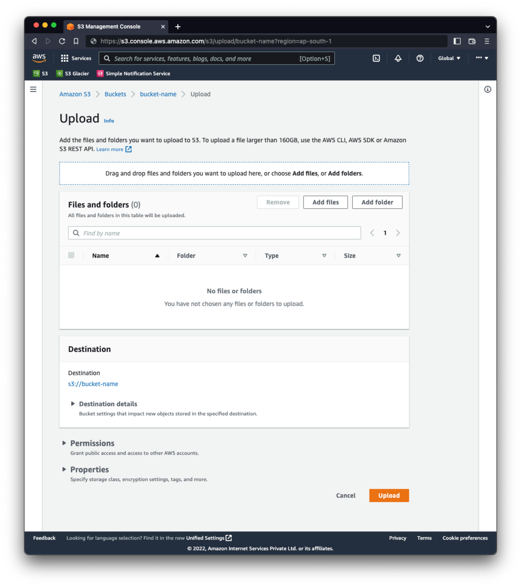
I would recommend creating a big zip file having photos and videos from multiple directories. Although you can upload a file sizing anywhere from 128kb to 5TB, you need to decide your own chunk. As per my calculation, 50GB seems to be a good fit for now. Depending on the speed of your connection, the upload will finish in sometime. There is provision to enter tags with the objects created, but I didn't find a place to enter some descriptive information such as which all directories were included in that `zip` file. So I gave the zip file a unique id and kept that reference somewhere else where I store the relevant information like which all directories were included in the compressed file.
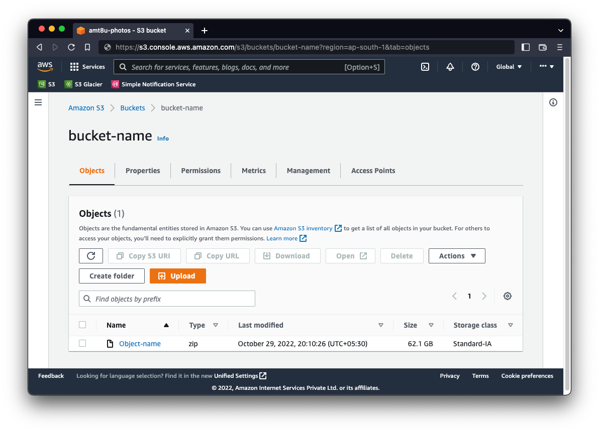

* **Monitor** - Use storage lens for monitoring your capacity
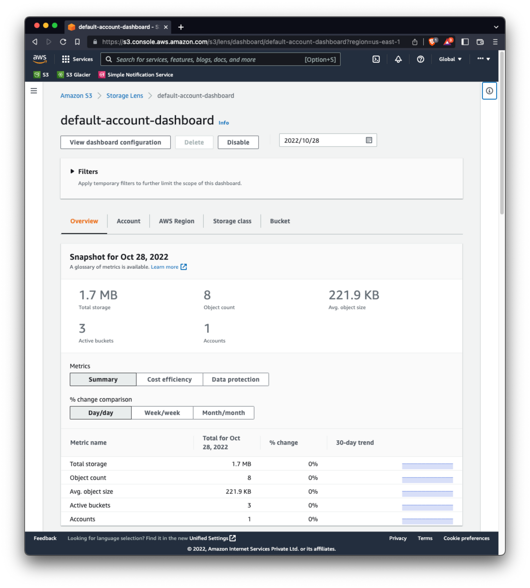

From [aws faqs](https://aws.amazon.com/s3/faqs/#dataretrievals) -> Q: Is there a minimum object size charge for Amazon S3 Glacier Instant Retrieval?

> S3 Glacier Instant Retrieval is designed for larger objects and has a minimum object storage charge of 128KB. Objects smaller than 128KB in size will incur storage charges as if the object were 128KB. For example, a 6KB object in S3 Glacier Instant Retrieval will incur S3 Glacier Instant Retrieval storage charges for 6KB and an additional minimum object size charge equivalent to 122KB at the S3 Glacier Instant Retrieval storage price. View the Amazon S3 pricing page for information about Amazon S3 Glacier Instant Retrieval pricing.

# Any disadvantages?
Obviously setting up such a system is not easy. Here are a few pointers to help you out if it makes sense for you.

* **Not simple** - No matter how much they call it [simple](https://docs.aws.amazon.com/AmazonS3/latest/userguide/Welcome.html), its not. You have to understand how the service works. Specially about object storage and its lifecycle management, otherwise you may endup incurring high charges using the standard storage.
* **Postpaid** - Since this is a postpaid service and your credit card is already attached to the account, you may get a high bill and not realize soon. To circumvent this, you would need to [keep a watch](https://docs.aws.amazon.com/cost-management/latest/userguide/what-is-costmanagement.html) on everything at everytime which brings in more complexity.
* **Retrieval** - As already mentioned, the retrieval from glacier storage is slow and also chargeable. Since our use case is for backup which means I won't be retrieving any data unless my primary storage fails.
* **Complex pricing** - The costing is not straight forward and requires you to understand various aspects before you can actually estimate your total cost. You can try using the [AWS pricing calculator](https://calculator.aws/#/) but configuring it also needs some expertise.
* **IAM** - Identity and Access management is required when you have an organisation and multiple people/services would be accessing the same account. For single user system, you don't need to setup IAM. But with such type of cloud providers, IAM is always recommended; Not just for convenience, but to better secure your account. A misconfigured root account can result in potential loss of your data and unwanted charges. Never use your root account for everyday access unless you are just playing and testing.

> End
