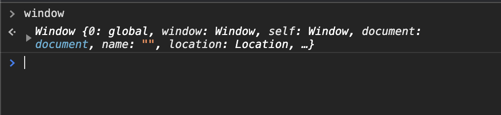

# The behaviour

Copy the code below and run it in a fresh browser window.

```js
var obj = {a:22};
var p1 = new Promise((res, rej) => {
    res(55);
}).then((val) => {
    obj.a = val;
});

console.log("obj object", obj);
console.log("obj.a", obj.a);
```

The above snippet would output something like below


Since the assignment `obj.a` is within the `then` block, seeing value `22` in the logged output is perfectly fine. And of course once the promise is run, after that if you log the object you will see the updated value `55`. But Now try expanding the same object using the arrow and see the magic.


In case you didnlt notice:-D, I have marked it with red outline.

If you do the same exercise with a complex object like `window`, you will get similar result with a small difference.

```js
var p1 = new Promise((res, rej) => {
    res(55);
}).then((val) => {
    window.aNewValue = val;
});

console.log("window object", window);
console.log("window.aNewValue", window.aNewValue);
```

<br>
As expected, `window.aNewValue` prints `undefined`.


Expand the object and see if the `window` object has `aNewValue` property. To your surprise the field would be there with the value `55`.


Now you would ask the question if the value is there in the object on line#7 then it should be there on line#8 too. Why did the second log statement print `undefined`?

# The reason
As per my understanding, the reason seems to be the implementation of `console.log`.

Whenever you log an object on the console, you see a small preview of the object



<br>

But if you want to see all the properties, you expand the object.


<br>

Notice that the order of the values in the preview is different than the order in the expanded object. I am not sure how this order is determined.

The preview seems to be constructed while logging the object syncronously while rest of the values are read only when you click on the expand icon. And thats why accessing the property value at that point of time gave `22` and not `55`. Do note that the expression `obj.a` results in a primitive value which is passed to the console.log function as a value and not reference.

Alternatively if you want the exact copy of your object in any point in time, you can use `JSON.stringify()` to serialize the object and then `JSON.parse()` to convert the string back to an object which you can expand and close but with the correct values.

With a simple object like `obj`, its easy to identify while with complex objects like `window`, you won't be able to see the issue since your random properties are not included in the preview.

Now, you must got the answer to the question - why the second log statement `console.log(obj.a)` printed `undefined`. At that time the value of `a` was undefined and the `console.log` function is called with a string as a parameter. If the property `a` itself would have been an object, it would also face the same issue. Objects are passed by reference while primitives are passed by values.

# Some other helpful links

* https://stackoverflow.com/questions/23429203/weird-behavior-with-objects-console-log

* https://stackoverflow.com/questions/4057440/is-chromes-javascript-console-lazy-about-evaluating-arrays

