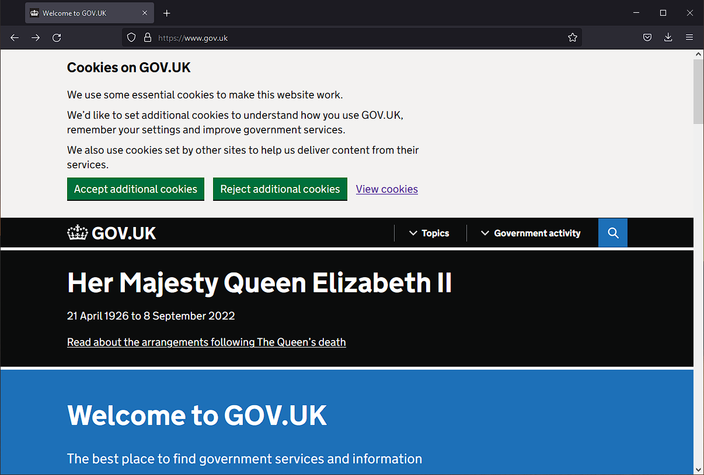

# Excerpt
What is a cookie? How it works and should you accept cookies when asked to?

# Accept cookies?
I am sure you must have seen a dialog or a section asking for permission to save cookies when you visit a site for first time.




# Accept all cookies?

And I am also sure that most of the time you just click `Accept all` and continue. We do have the option to select some and sometimes even reject everything. In this post I will try to put forth my views on whether that selection really makes sense or is just for decoration.

# What are cookies exactly?

As per the first search result - an article from [kaspersky.com](https://www.kaspersky.com/resource-center/definitions/cookies) says

```
HTTP cookies are essential to the modern Internet but a vulnerability to your privacy. As a necessary part of web browsing, HTTP cookies help web developers give you more personal, convenient website visits. Cookies let websites remember you, your website logins, shopping carts and more. But they can also be a treasure trove of private info for criminals to spy on.
```

Although technically the above statement is completely correct but a little misleading. We shall soon cover why I feel that the above definition is not helpful.

Cookies are always presented as if they are `evil`

Types of cookies
    First Party
    Third Party
    Session
    Persistent
    Necessary
    Non-necessaary

All these categories are just for the sake of being there. For the browser a cookie is a cookie. It all depends on how the website owners use those cookies.

In simple words, cookie is just a stored value associated with a domain and always sent with every request/url to the same domain.

Whether its essential or not depends on how the site is structured. Plus as a user you cannot decide if a cookie is an essential one or not.

Developers came up with a way to make eveybody happy by letting the users think that they are in control of their data.

# Can users check cookies stored?

Next question you would ask is - How will a user determine if their choice of cookies is really respected and is there a way to double check if the site is really just storing the essential cookies? The answer to this question is - `It depends!`

Yes, there are dev tools that you can quickly open(Press F12) and goto the `Application` tab and click the section `cookies`. On the right side you will see all the cookies associated with the current domain. But what exactly do you see?

If you do this activity for any of the popular sites, you will see values like below

SessId: as;dfbnhjb23`2nasvk0
tid: asdfgbnasdbhjhn123
pi: 122396msjsdkfjdsfhsdhf

Do they mean anything to you? Can you identify if the third cookie is a non-essential marketting one? Maybe on a few sites you can, but not always.

In simple terms cookie is just a value stored on the browser which the site can read in subsequent requests.

Saying cookies are bad is like saying browsers are bad. Yes browsers can do harm if you open up a malicious site, similarly cookies can do harm if the sites are designed intentionally to cause malicious actions.


A point is given that everytime you go to another page of the same site, cookies

# Privacy for cookies
Cookies are just a medium to save data across requests. There is no inherent property of a cookie which makes it a privacy concern. Its the way sites have started using the cookies to track users which in turn results in privacy concerns. if you see, in a way any storage medium which identifies you across http calls can be used for tracking you as well and could potentially be a privacy problem.

The nature of the problem lies in how sites process your data and not what tech they use. Remember its all about the `intentions`. Even if you opt out of all non-essential cookies, the sites can easily track you with there essential(as what they may say) cookies. They just need to save the data with a different value.

Some pointers from [norton](https://us.norton.com/internetsecurity-privacy-should-i-accept-cookies.html#) on when to reject cookies. Lets consider them one by one if they are really helpful

1. Unencrypted websites - This is an inherent issue in the http protocol and not related to cookies. Yes, having a value not stored is better than having a value stored and being at risk of theft - but then its not just cookies - you should never enter your usernames/passwords and other confidential data like credit cards etc on unencrypted sites.

2. Third party cookies - Sites can track you if they want. They can create a system which works on their domain and thus no point in blocking third party cookies. But again in today's world, the way third party systems are integrated, this one is the most convenient way to stop sites to track you

3. 
4.
5. 

By design HTTP is a [stateless protocol](https://www.rfc-editor.org/rfc/rfc2616#:~:text=is%20a%20generic%2C-,stateless,-%2C%20protocol%20which%20can) which means that every request is an independent request with everything that the server needs to know know about the client and the request parameters.

But almost every site consists of multiple http calls. It could be a call to a totally different page on the same site or an ajax call for the data, or may be an image resource call for images etc. Server receives thousands of calls from thousands of clients and it needs to correctly map each call to the respective client. Being stateless, the server do not maintain any state and thus cannot identify which http call is coming from which client.

To overcome this, the web developers came up with a small mechanism by which the server can match each request to its respective client.

The server shall generate a unique number on the first call which the server will keep a copy of(probably in a DB). And then pass the same number in the response of the first request to the client.

The client then stores that number somewhere(will cover in detail later) and attaches it with each subsequent request for the same domain(website). 

The server will now check for that unique number and would assume the request is from the same client. The unique number in the request determines who is the client irrespective of the source(IP address).


