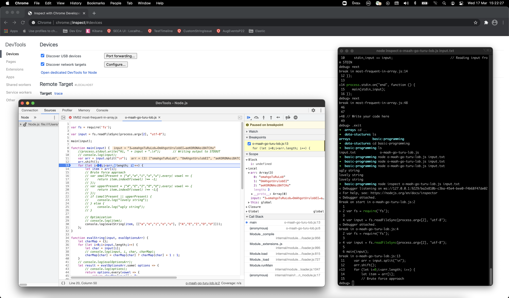

# Excerpt
Setting up local environment to debug Hackerearth problems.

# Intro
Hackerearth is a cool place to practice various programming challenges across levels. You can use any language to write code to solve the challenges. Since I am more proficient in Javascript, I use Javascript(Nodejs).

# All good but cannot debug!
It provides a good interface and the online IDE also seems to do the job, but it lacks on one aspect. At least for practicing if not for competetive exams. There is no option of debugging and going by their [docs](https://support.hackerrank.com/hc/en-us/articles/360014793674-Debugging-a-complete-program) it seems, the only option is to use output stream to troubleshoot your program. While thats fine for exams but when you are practicing, you need to debug to find where you are going wrong.

# Options
Setup your local environement to easily debug hacker earth problems.

* **html** : One option you have is to copy the whole program in a `js` file and place it as a script in an `html` page. Then load this page in any browser and you could use the browser's devtools to debug. This is a little cumbersome if you are dealing with multiple challenges. Either you create one html page per problem or continuously update the `script` tag in the page.

* **nodejs** : The other preferable option is to use nodejs. Instead of running the code within a browser, you can run it in a nodejs process. You don't have to deal with html and script tags. Plus it becomes easier to provide input to the program using command line than creating variables in a js file.

# Steps to run on nodejs
1. **Create program file** - You can obviously run nodejs interpreter directly and run arbitary program. But to enable debugging its better to create a js file. For the sake of convenience you can name it according to the problem you are solving `checkInputOutput.js`.
```js
process.stdin.resume();
process.stdin.setEncoding("utf-8");
var stdin_input = "";

process.stdin.on("data", function (input) {
    stdin_input += input; 
});

process.stdin.on("end", function () {
   main(stdin_input);
});

function main(input) {
    console.log("Go Korona Go")
}
```

2. **Using stdin** - By default hackerearth gives you sample code to use stdin wihtin your app. When you are running your nodejs program, you can give input via command line. On pressing enter the `data` event gets fired. To complete the input use `Ctrl+D` which would fire the `end` event. Thus you see the `main()` function being called in the `end` event handler with the input as string. In the main function you need to convert the whole input in whatever format you would like. For many problems its easier to just get the second line using `input.split("\n")`.
```js
process.stdin.resume();
process.stdin.setEncoding("utf-8");
var stdin_input = "";

process.stdin.on("data", function (input) {
    stdin_input += input;
});

process.stdin.on("end", function () {
   main(stdin_input);
});
```

3. **Using file as input** - For simple inputs, you can always work with stdin, but when you are dealing with large inputs like the ones present in the test cases while submitting your code, its better to have those as files. To enable this, instead of reading from `stdin` you need to read it from a file. Use nodejs `fs` api.
```js
var fs = require('fs');
var input = fs.readFileSync(process.argv[2], "utf-8");
```
The first argument is nothing but the filename that you provide while running the nodejs program from command line. The second argument is just the encoding.
Now you can call your `main()` function with this input and it should work exactly how it was with stdin input. Jut remember to run your program with the filename otherwise you will get an error.
`node findMaximumFrequency.js input.txt`

4. **Debugging** - Now that we can run directly from node, we are in a position to enable debugging. There are several options as listed [here](https://nodejs.org/en/docs/guides/debugging-getting-started/#inspector-clients).
To enable debugging in chrome, just open chrome and navigate to `chrome://inspect`. Click on the link that says "Open dedicated DevTools for Node". This will enable a fresh devtools window with only a few tabs - Connection, Sources, Profiler, Memory, Console. As usual, you can put debug points anywhere in the code and start debugging. Do note that any action you take will also reflect in the command window where your nodejs program is running. Basically you are just triggering actions from chrome devtools remotely on the nodejs app instance. You can even throw commands in the window and the devtools will follow.

Similarly you can attach debugger from other tools like VSCode. Read their respective docs.



> End


